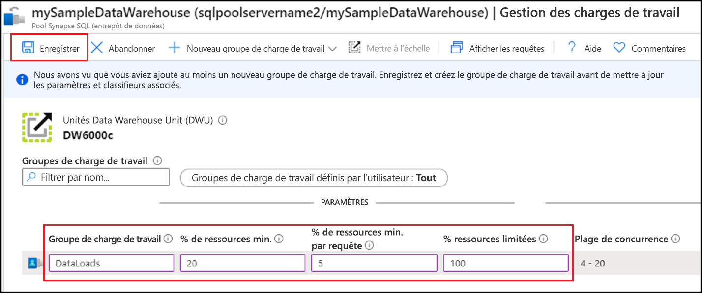
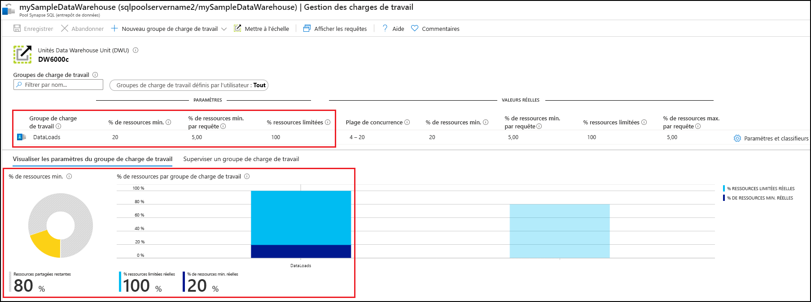
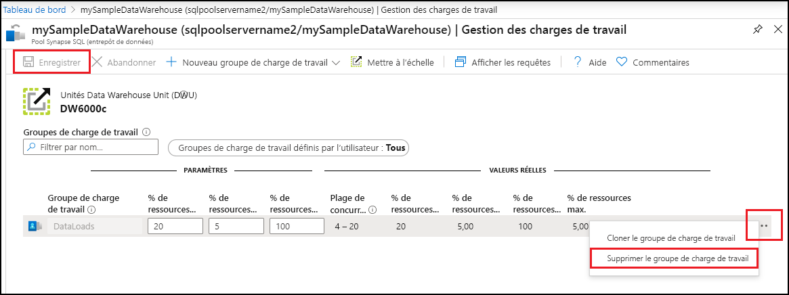

# Démarrage rapide : Configurer l’isolation de la charge de travail du pool SQL dédié à l’aide d’un groupe de charge de travail dans le portail Azure

Dans ce guide de démarrage rapide, vous allez configurer l’[isolation de la charge de travail](sql-data-warehouse-workload-isolation.md) en créant un groupe de charge de travail pour réserver des ressources.  Dans le cadre de ce tutoriel, nous allons créer le groupe de charge de travail pour le chargement de données appelé `DataLoads`. Le groupe de charge de travail réserve 20 % des ressources système.  Avec une isolation de 20 % pour les chargements de données, ce sont des ressources garanties à même de répondre aux contrats SLA.  Après avoir créé le groupe de charge de travail, [créez un classifieur de charge de travail](quickstart-create-a-workload-classifier-portal.md) pour attribuer des requêtes à ce groupe de charge de travail.

Si vous n’avez pas d’abonnement Azure, créez un compte [gratuit](https://azure.microsoft.com/free/) avant de commencer.

## Connectez-vous au portail Azure.

Connectez-vous au [portail Azure](https://portal.azure.com/).

> [!NOTE]
> La création d’une instance de pool SQL dédié dans Azure Synapse Analytics peut donner lieu à un nouveau service facturable.  Pour plus d’informations, consultez [Tarification Azure Synapse Analytics](https://azure.microsoft.com/pricing/details/sql-data-warehouse/).

## Prérequis

Ce guide de démarrage rapide suppose que vous avez déjà une instance de pool SQL dédié dans Synapse SQL, et que vous disposez d’autorisations CONTROL DATABASE. Si vous devez en créer une, consultez [Démarrage rapide : Créer un pool SQL dédié – Portail](../quickstart-create-sql-pool-portal.md) pour créer un entrepôt de données nommé **mySampleDataWarehouse**.

>[!IMPORTANT] 
>Votre pool SQL dédié doit être en ligne pour que vous puissiez configurer la gestion de charge de travail. 

## Configurer l’isolation de la charge de travail

Vous pouvez isoler des ressources de pool SQL dédié et les réserver pour des charges de travail spécifiques en créant des groupes de charges de travail.  Pour plus d’informations sur la façon dont les groupes de charges de travail vous aident à gérer votre charge de travail, consultez la documentation conceptuelle [Isolation des charges de travail](sql-data-warehouse-workload-isolation.md).  Le guide de démarrage rapide [Créer et connecter – Portail](create-data-warehouse-portal.md) a permis de créer **mySampleDataWarehouse** et de l’initialiser au niveau DW100c. Les étapes suivantes créent un groupe de charge de travail dans **mySampleDataWarehouse**.

Pour créer un groupe de charge de travail avec une isolation de 20 % :
1.  Accédez à la page de votre pool SQL dédié **mySampleDataWarehouse**.
1.  Sélectionnez **Gestion des charges de travail**.
1.  Sélectionnez **Nouveau groupe de charge de travail**.
1.  Sélectionnez **Personnalisé**.

    

6.  Entrez `DataLoads` pour le **Groupe de charge de travail**.
7.  Entrez `20` pour **% de ressources min.** .
8.  Entrez `5` pour **% de ressources min. par demande**.
9.  Entrez `100` pour **% de ressources limitées**.
10. Entrez **Enregistrer**.

   

Une notification du portail s’affiche quand le groupe de charge de travail est créé.  Les ressources du groupe de charge de travail s’affichent dans les graphiques sous les valeurs configurées.

   

## Nettoyer les ressources

Pour supprimer le groupe de charge de travail `DataLoads` créé dans ce tutoriel :
1. Cliquez sur **`...`** à droite du groupe de charge de travail `DataLoads`.
2. Cliquez sur **Supprimer le groupe de charge de travail**.
3. Cliquez sur **Oui** quand vous êtes invité à confirmer la suppression du groupe de charge de travail.
4. Cliquez sur **Save**(Enregistrer).

   

Vous êtes facturé pour les unités d’entrepôt de données et les données stockées dans votre entrepôt de données. Ces ressources de calcul et de stockage sont facturées séparément.

- Si vous voulez conserver les données dans le stockage, vous pouvez suspendre le calcul quand vous n’utilisez pas l’entrepôt de données. Quand vous suspendez le calcul, vous êtes facturé uniquement pour le stockage des données. Quand vous êtes prêt à utiliser les données, reprenez le calcul.
- Si vous voulez éviter des frais futurs, vous pouvez supprimer l’entrepôt de données.

Suivez ces étapes pour nettoyer les ressources.

1. Connectez-vous au [portail Azure](https://portal.azure.com), puis sélectionnez votre pool SQL dédié.

    

2. Pour suspendre le calcul, sélectionnez le bouton **Suspendre**. Quand l’entrepôt de données est suspendu, un bouton **Démarrer** est visible.  Pour reprendre le calcul, sélectionnez **Démarrer**.

3. Pour supprimer l’entrepôt de données afin de ne pas être facturé pour le calcul ou le stockage, sélectionnez **Supprimer**.

## Étapes suivantes

Pour utiliser le groupe de charges de travail `DataLoads`, vous devez créer un [classifieur de charge de travail](/sql/t-sql/statements/create-workload-classifier-transact-sql?toc=/azure/synapse-analytics/sql-data-warehouse/toc.json&bc=/azure/synapse-analytics/sql-data-warehouse/breadcrumb/toc.json&view=azure-sqldw-latest&preserve-view=true) afin d’acheminer les demandes vers le groupe de charge de travail.  Passez au tutoriel [Créer un classifieur de charge de travail](quickstart-create-a-workload-classifier-portal.md) afin de créer un classifieur de charge de travail pour `DataLoads`.

## Voir aussi
Pour plus d’informations sur la supervision des charges de travail dans le cadre de la gestion des charges de travail, consultez l’article de guide pratique [Gérer et superviser la gestion des charges de travail](sql-data-warehouse-how-to-manage-and-monitor-workload-importance.md).
