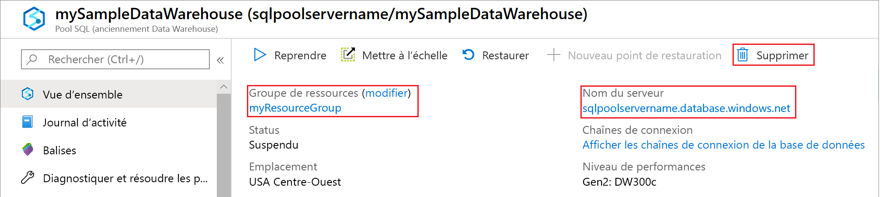

# <a name="quickstart-configure-workload-isolation-using-t-sql"></a>Démarrage rapide : Configurer l’isolation de la charge de travail à l’aide de T-SQL

Dans ce guide de démarrage rapide, vous allez créer rapidement un groupe de charge de travail et un classifieur pour réserver des ressources pour les chargements de données. Le groupe de charge de travail alloue 20 % des ressources système aux chargements de données.  Le classifieur de charge de travail affecte les demandes au groupe de charge de travail des chargements de données.  Avec une isolation de 20 % pour les chargements de données, les ressources garanties pour répondre aux contrats SLA sont réservées.

Si vous n’avez pas d’abonnement Azure, créez un compte [gratuit](https://azure.microsoft.com/free/) avant de commencer.

> [!NOTE]
> La création d’une instance SQL Analytics dans Azure Synapse Analytics peut donner lieu à un nouveau service facturable.  Pour plus d’informations, consultez [Tarification Azure Synapse Analytics](https://azure.microsoft.com/pricing/details/sql-data-warehouse/).
>
>

## <a name="prerequisites"></a>Prérequis
 
Ce guide de démarrage rapide suppose que vous avez déjà une instance SQL Analytics dans Azure Synapse et que vous disposez d’autorisations CONTROL DATABASE. Si vous devez en créer un, utilisez la section [Créer et connecter - Portail](create-data-warehouse-portal.md) pour créer un entrepôt de données nommé **mySampleDataWarehouse**.

## <a name="sign-in-to-the-azure-portal"></a>Connectez-vous au portail Azure.

Connectez-vous au [portail Azure](https://portal.azure.com/).

## <a name="create-login-for-dataloads"></a>Créer une connexion pour DataLoads

Créez une connexion d’authentification SQL Server dans la base de données `master` à l’aide de [CREATE LOGIN](/sql/t-sql/statements/create-login-transact-sql) pour « ELTLogin ».

```sql
IF NOT EXISTS (SELECT * FROM sys.sql_logins WHERE name = 'ELTLogin')
BEGIN
CREATE LOGIN [ELTLogin] WITH PASSWORD='<strongpassword>'
END
;
```

## <a name="create-user"></a>Créer un utilisateur

[Créez l’utilisateur](/sql/t-sql/statements/create-user-transact-sql?view=azure-sqldw-latest), « ELTLogin », dans mySampleDataWarehouse

```sql
IF NOT EXISTS (SELECT * FROM sys.database_principals WHERE name = 'ELTLogin')
BEGIN
CREATE USER [ELTLogin] FOR LOGIN [ELTLogin]
END
;
```

## <a name="create-a-workload-group"></a>Créer un groupe de charge de travail
Créez un [groupe de charge de travail](/sql/t-sql/statements/create-workload-group-transact-sql?view=azure-sqldw-latest) pour DataLoads avec un isolement de 20 %.
```sql
CREATE WORKLOAD GROUP DataLoads
WITH ( MIN_PERCENTAGE_RESOURCE = 20   
      ,CAP_PERCENTAGE_RESOURCE = 100
      ,REQUEST_MIN_RESOURCE_GRANT_PERCENT = 5) 
;
```

## <a name="create-a-workload-classifier"></a>Créer un classifieur de charge de travail

Créez un [classifieur de charge de travail](/sql/t-sql/statements/create-workload-classifier-transact-sql?view=azure-sqldw-latest) pour mapper ELTLogin au groupe de charge de travail DataLoads.

```sql
CREATE WORKLOAD CLASSIFIER [wgcELTLogin]
WITH (WORKLOAD_GROUP = 'DataLoads'
      ,MEMBERNAME = 'ELTLogin')
;
```

## <a name="view-existing-workload-groups-and-classifiers-and-run-time-values"></a>Afficher les groupes de charge de travail et les classifieurs existants, et les valeurs à l’exécution

```sql
--Workload groups
SELECT * FROM 
sys.workload_management_workload_groups

--Workload classifiers
SELECT * FROM 
sys.workload_management_workload_classifiers

--Run-time values
SELECT * FROM 
sys.dm_workload_management_workload_groups_stats
```

## <a name="clean-up-resources"></a>Nettoyer les ressources

```sql
DROP WORKLOAD CLASSIFIER [wgcELTLogin]
DROP WORKLOAD GROUP [DataLoads]
DROP USER [ELTLogin]
;
```

Vous êtes facturé pour les unités d’entrepôt de données et les données stockées dans votre entrepôt de données. Ces ressources de calcul et de stockage sont facturées séparément.

- Si vous voulez conserver les données dans le stockage, vous pouvez suspendre le calcul quand vous n’utilisez pas le pool SQL. Quand vous suspendez le calcul, vous êtes facturé uniquement pour le stockage des données. Quand vous êtes prêt à utiliser les données, reprenez le calcul.
- Si vous voulez éviter des frais futurs, vous pouvez supprimer l’entrepôt de données.

Suivez ces étapes pour nettoyer les ressources.

1. Connectez-vous au [portail Azure](https://portal.azure.com) et sélectionnez votre entrepôt de données.

    

2. Pour suspendre le calcul, sélectionnez le bouton **Suspendre**. Quand l’entrepôt de données est suspendu, un bouton **Démarrer** est visible.  Pour reprendre le calcul, sélectionnez **Démarrer**.

3. Pour supprimer l’entrepôt de données afin de ne pas être facturé pour le calcul ou le stockage, sélectionnez **Supprimer**.

4. Pour supprimer le serveur SQL que vous avez créé, sélectionnez **mynewserver-20180430.database.windows.net** dans l’image précédente, puis **Supprimer**.  N’oubliez pas que la suppression du serveur supprime également toutes les bases de données qui lui sont attribuées.

5. Pour supprimer le groupe de ressources, sélectionnez **myResourceGroup**, puis **Supprimer le groupe de ressources**.

## <a name="next-steps"></a>Étapes suivantes

- Vous avez créé un groupe de charge de travail. Exécutez quelques requêtes avec l’identité ELTLogin pour voir comment elles fonctionnent. Consultez [sys.dm_pdw_exec_requests](/sql/relational-databases/system-dynamic-management-views/sys-dm-pdw-exec-requests-transact-sql) pour voir les requêtes et le groupe de charge de travail attribué.
- Pour plus d’informations sur la gestion de charge de travail SQL Analytics, consultez [Gestion des charges de travail](sql-data-warehouse-workload-management.md) et [Isolation des charges de travail](sql-data-warehouse-workload-isolation.md).
