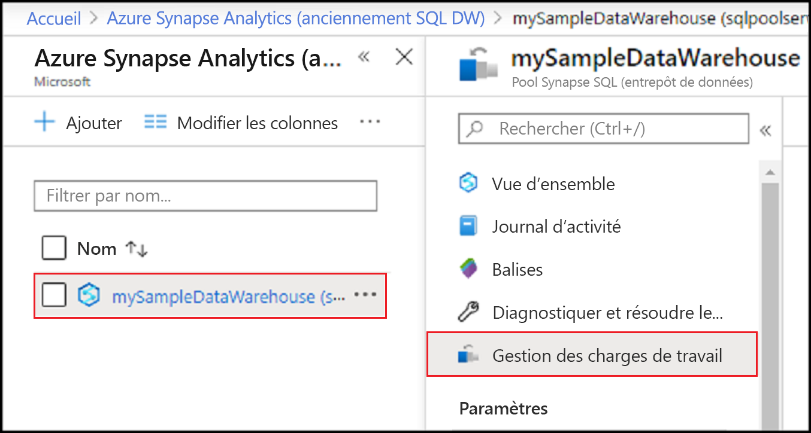
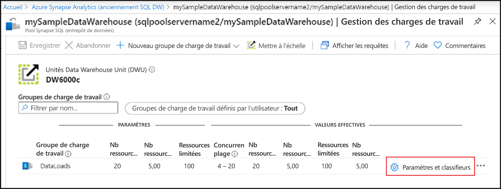
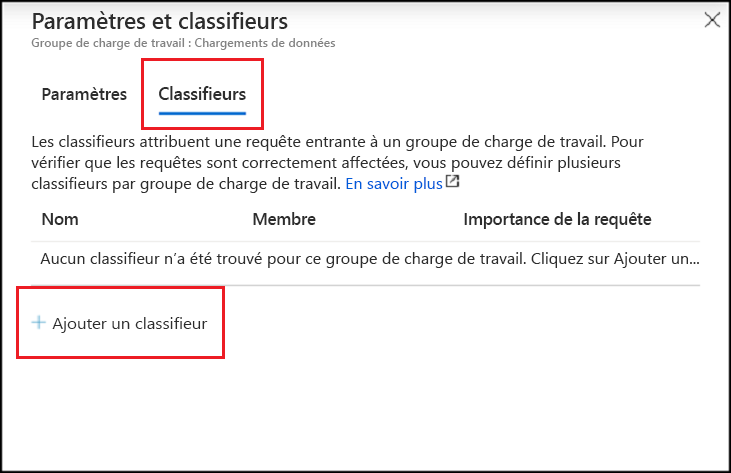
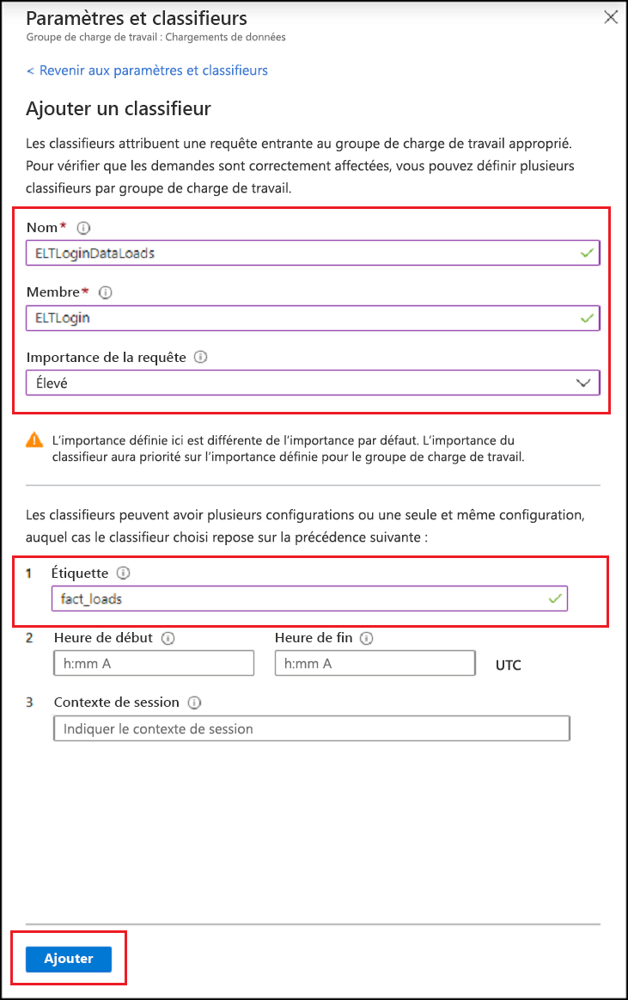
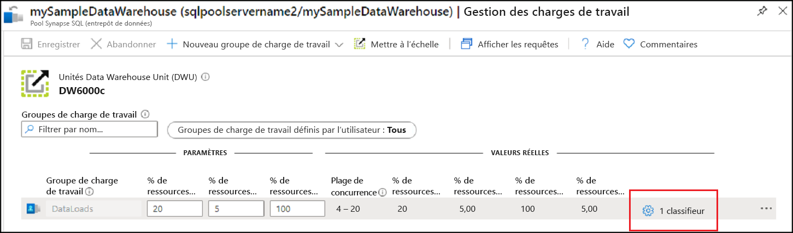
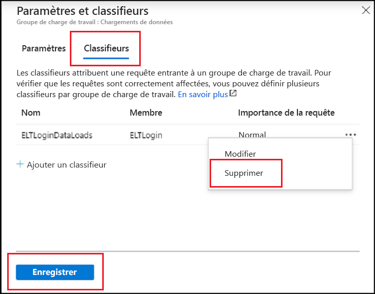

# <a name="quickstart-create-a-dedicated-sql-pool-workload-classifier-using-the-azure-portal"></a>Démarrage rapide : Créer un classifieur de charge de travail de pool SQL dédié avec le portail Azure

Dans ce guide de démarrage rapide, vous allez créer un [classifieur de charge de travail](sql-data-warehouse-workload-classification.md) pour attribuer des requêtes à un groupe de charge de travail.  Le classifieur attribue les demandes de l’utilisateur SQL `ELTLogin` au groupe de charge de travail `DataLoads`.   Suivez le tutoriel [Démarrage rapide : Configurer l’isolation de la charge de travail](quickstart-configure-workload-isolation-portal.md) pour créer le groupe de charge de travail `DataLoads`.  Ce tutoriel crée un classifieur de charge de travail avec l’option WLM_LABEL pour faciliter la bonne classification des demandes.  Le classifieur attribue également une [importance de charge de travail](sql-data-warehouse-workload-importance.md) `HIGH` à ces demandes.


Si vous n’avez pas d’abonnement Azure, créez un compte [gratuit](https://azure.microsoft.com/free/) avant de commencer.


## <a name="sign-in-to-the-azure-portal"></a>Connectez-vous au portail Azure.

Connectez-vous au [portail Azure](https://portal.azure.com/).

> [!NOTE]
> La création d’une instance de pool SQL dédié dans Azure Synapse Analytics peut donner lieu à un nouveau service facturable.  Pour plus d’informations, consultez [Tarification Azure Synapse Analytics](https://azure.microsoft.com/pricing/details/sql-data-warehouse/).

## <a name="prerequisites"></a>Prérequis

Ce guide de démarrage rapide suppose que vous avez déjà une instance de pool SQL dédié, et que vous disposez d’autorisations CONTROL DATABASE. Si vous devez en créer une, utilisez [Créer et connecter – Portail](create-data-warehouse-portal.md) pour créer un pool SQL dédié nommé **mySampleDataWarehouse**.
<br><br>
Un groupe de charge de travail `DataLoads` existe.  Consultez le tutoriel [Démarrage rapide : Configurer l’isolation de la charge de travail](quickstart-configure-workload-isolation-portal.md) pour créer le groupe de charge de travail.
<br><br>
>[!IMPORTANT] 
>Votre pool SQL dédié doit être en ligne pour que vous puissiez configurer la gestion de charge de travail. 


## <a name="create-a-login-for-eltlogin"></a>Créer une connexion pour ELTLogin

Créez une connexion d’authentification SQL Server dans la base de données `master` à l’aide de [CREATE LOGIN](/sql/t-sql/statements/create-login-transact-sql?toc=/azure/synapse-analytics/sql-data-warehouse/toc.json&bc=/azure/synapse-analytics/sql-data-warehouse/breadcrumb/toc.json&view=azure-sqldw-latest&preserve-view=true) pour `ELTLogin`.

```sql
IF NOT EXISTS (SELECT * FROM sys.sql_logins WHERE name = 'ELTLogin')
BEGIN
CREATE LOGIN [ELTLogin] WITH PASSWORD='<strongpassword>'
END
;
```

## <a name="create-user-and-grant-permissions"></a>Créer un utilisateur et accorder des autorisations

Une fois la connexion créée, un utilisateur doit être créé dans la base de données.  Utilisez [CREATE USER](/sql/t-sql/statements/create-user-transact-sql?toc=/azure/synapse-analytics/sql-data-warehouse/toc.json&bc=/azure/synapse-analytics/sql-data-warehouse/breadcrumb/toc.json&view=azure-sqldw-latest&preserve-view=true) pour créer l’utilisateur SQL `ELTRole` dans la base de données **mySampleDataWarehouse**.  Étant donné que nous allons tester la classification au cours de ce tutoriel, accordez à `ELTLogin` des autorisations sur **mySampleDataWarehouse**. 

```sql
IF NOT EXISTS (SELECT * FROM sys.database_principals WHERE name = 'ELTLogin')
BEGIN
CREATE USER [ELTLogin] FOR LOGIN [ELTLogin]
GRANT CONTROL ON DATABASE::mySampleDataWarehouse TO ELTLogin 
END
;
```

## <a name="configure-workload-classification"></a>Configurer la classification de la charge de travail
La classification vous permet de router les demandes, en fonction d’un ensemble de règles, vers un groupe de charge de travail.  Dans le tutoriel [Démarrage rapide : Configurer l’isolation de la charge de travail](quickstart-configure-workload-isolation-portal.md), nous avons créé le groupe de charge de travail `DataLoads`.  Vous allez maintenant créer un classifieur de charge de travail pour router les requêtes vers le groupe de charges de travail `DataLoads`.


1.  Accédez à la page de votre pool SQL dédié **mySampleDataWarehouse**.
3.  Sélectionnez **Gestion des charges de travail**.

    

4.  Sélectionnez **Paramètres & classifieurs** sur le côté droit du groupe de charge de travail `DataLoads`.

    

5. Sélectionnez **Non configuré** sous la colonne Classifieurs.
6. Sélectionnez **+ Ajouter un classifieur**.

    

7.  Entrez `ELTLoginDataLoads` pour **Nom**.
8.  Entrez `ELTLogin` pour **Membre**.
9.  Choisissez `High` pour **Importance de la demande**.  (*Facultatif*) Par défaut, le niveau d’importance est normal.
10. Entrez `fact_loads` pour **Étiquette**.
11. Sélectionnez **Ajouter**.
12. Sélectionnez **Enregistrer**.

    

## <a name="verify-and-test-classification"></a>Vérifier et tester la classification
Consultez la vue de catalogue [sys.workload_management_workload_classifiers](/sql/relational-databases/system-catalog-views/sys-workload-management-workload-classifiers-transact-sql?view=azure-sqldw-latest&preserve-view=true) pour vérifier l’existence du classifieur `ELTLoginDataLoads`.

```sql
SELECT * FROM sys.workload_management_workload_classifiers WHERE name = 'ELTLoginDataLoads'
```

Consultez la vue de catalogue [sys.workload_management_workload_classifier_details](/sql/relational-databases/system-catalog-views/sys-workload-management-workload-classifier-details-transact-sql?view=azure-sqldw-latest&preserve-view=true) pour vérifier les détails du classifieur.

```sql
SELECT c.[name], c.group_name, c.importance, cd.classifier_type, cd.classifier_value
  FROM sys.workload_management_workload_classifiers c
  JOIN sys.workload_management_workload_classifier_details cd
    ON cd.classifier_id = c.classifier_id
  WHERE c.name = 'ELTLoginDataLoads'
```

Exécutez les instructions suivantes pour tester la classification.  Assurez-vous que vous êtes connecté en tant qu’``ELTLogin`` et que ``Label`` est utilisé dans la requête.
```sql
CREATE TABLE factstaging (ColA int)
INSERT INTO factstaging VALUES(0)
INSERT INTO factstaging VALUES(1)
INSERT INTO factstaging VALUES(2)
GO

CREATE TABLE testclassifierfact WITH (DISTRIBUTION = ROUND_ROBIN)
AS
SELECT * FROM factstaging
OPTION (LABEL='fact_loads')
```

Vérifiez que l’instruction `CREATE TABLE` a effectué une classification dans le groupe de charge de travail `DataLoads` à l’aide du classifieur de charge de travail `ELTLoginDataLoads`.
```sql 
SELECT TOP 1 request_id, classifier_name, group_name, resource_allocation_percentage, submit_time, [status], [label], command 
FROM sys.dm_pdw_exec_requests 
WHERE [label] = 'fact_loads'
ORDER BY submit_time DESC
```

## <a name="clean-up-resources"></a>Nettoyer les ressources

Pour supprimer le classifieur de charge de travail `ELTLoginDataLoads` créé dans ce tutoriel :

1. Cliquez sur **1 classifieur** sur le côté droit du groupe de charge de travail `DataLoads`.

    

2. Cliquez sur **Classifieurs**.
3. Cliquez sur **`...`** à droite du classifieur de charge de travail `ELTLoginDataLoads`.
4. Cliquez sur **Supprimer**.
5. Cliquez sur **Save**(Enregistrer).

    

Vous êtes facturé pour les unités d’entrepôt de données et les données stockées dans votre pool SQL dédié. Ces ressources de calcul et de stockage sont facturées séparément.

- Si vous voulez conserver les données dans le stockage, vous pouvez suspendre le calcul quand vous n’utilisez pas votre pool SQL dédié. Quand vous suspendez le calcul, vous êtes facturé uniquement pour le stockage des données. Quand vous êtes prêt à utiliser les données, reprenez le calcul.
- Si vous voulez éviter des frais à venir, vous pouvez supprimer votre pool SQL dédié.

Suivez ces étapes pour nettoyer les ressources.

1. Connectez-vous au [portail Azure](https://portal.azure.com), puis sélectionnez votre pool SQL dédié.

    

2. Pour suspendre le calcul, sélectionnez le bouton **Suspendre**. Quand le pool SQL dédié est suspendu, un bouton **Démarrer** est visible.  Pour reprendre le calcul, sélectionnez **Démarrer**.

3. Pour supprimer votre pool SQL dédié afin de ne pas être facturé pour le calcul ou le stockage, sélectionnez **Supprimer**.

## <a name="next-steps"></a>Étapes suivantes

Supervisez votre charge de travail à l’aide des métriques de supervision du portail Azure.  Pour plus d’informations, consultez [Gérer et superviser l’importance de la charge de travail](sql-data-warehouse-how-to-manage-and-monitor-workload-importance.md).
