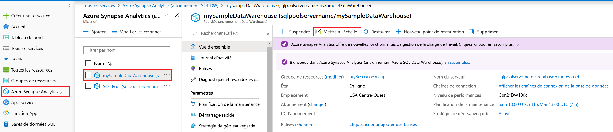
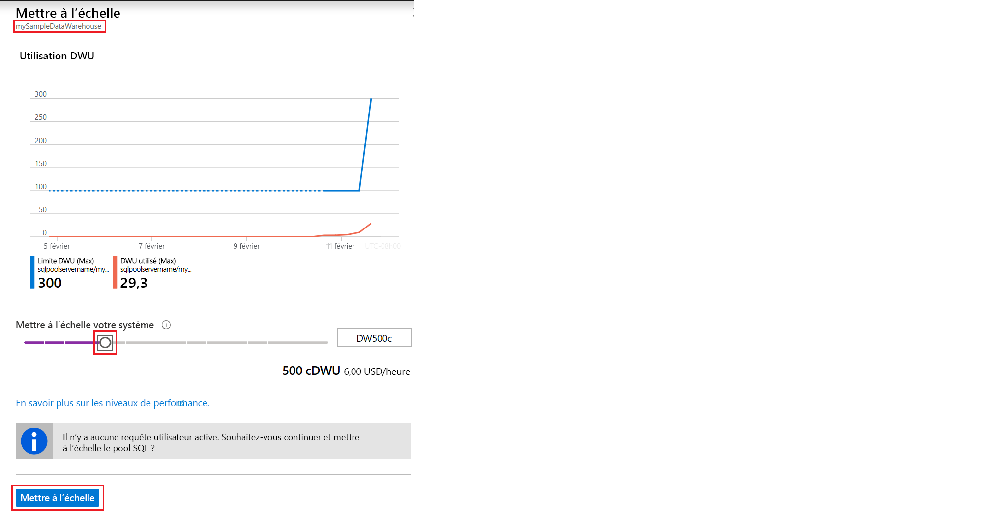

# Démarrage rapide : Mettre à l’échelle le calcul pour le pool SQL Synapse à l’aide du portail Azure

Vous pouvez mettre à l’échelle le calcul pour le pool SQL Synapse (entrepôt de données) à l’aide du portail Azure. [Effectuez un scale-out du calcul](sql-data-warehouse-manage-compute-overview.md) pour améliorer les performances, ou réduisez-le pour diminuer les coûts. 

Si vous n’avez pas d’abonnement Azure, créez un compte [gratuit](https://azure.microsoft.com/free/) avant de commencer.

## Connectez-vous au portail Azure.

Connectez-vous au [portail Azure](https://portal.azure.com/).

## Avant de commencer

Vous pouvez mettre à l’échelle un pool SQL que vous avez déjà ou utiliser la section [Démarrage rapide : Créer et connecter - Portail](create-data-warehouse-portal.md) pour créer un pool SQL nommé **mySampleDataWarehouse**. Ce guide de démarrage rapide met à l’échelle **mySampleDataWarehouse**.

>[!IMPORTANT] 
>Votre pool SQL doit être en ligne pour la mise à l’échelle. 

## Mise à l’échelle des ressources de calcul

Les ressources de calcul de pool SQL peuvent être mises à l’échelle en augmentant ou en diminuant les unités DWU (Data Warehouse Unit). Le guide [Démarrage rapide : Créer et connecter - Portail](create-data-warehouse-portal.md) a permis de créer **mySampleDataWarehouse** et de l’initialiser avec 400 DWU. Les étapes suivantes ajustent les DWU de **mySampleDataWarehouse**.

Pour modifier les unités Data Warehouse Unit :

1. Cliquez sur **Azure Synapse Analytics (anciennement SQL DW)** dans la page de gauche du portail Azure.
2. Sélectionnez **mySampleDataWarehouse** dans la page **Azure Synapse Analytics (anciennement SQL DW)** . Le pool SQL s’ouvre.
3. Cliquez sur **Scale**.

    

2. Dans le panneau Mettre à l’échelle, déplacez le curseur vers la gauche ou vers la droite pour modifier le paramètre DWU. Sélectionnez ensuite l’échelle.

    

## Étapes suivantes
Pour en savoir plus sur le pool SQL, consultez le tutoriel [Charger des données dans un pool SQL](./load-data-from-azure-blob-storage-using-copy.md).