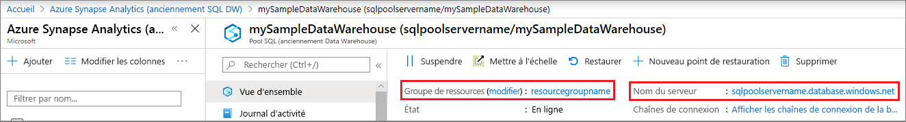

# <a name="quickstart-scale-compute-for-dedicated-sql-pool-formerly-sql-dw-with-azure-powershell"></a>Démarrage rapide : Mettre à l’échelle des ressources de calcul pour le pool SQL dédié (anciennement SQL DW) avec Azure PowerShell

Vous pouvez mettre à l’échelle des ressources de calcul pour le pool SQL dédié (anciennement SQL DW) à l’aide d’Azure PowerShell. [Effectuez un scale-out du calcul](sql-data-warehouse-manage-compute-overview.md) pour améliorer les performances, ou réduisez-le pour diminuer les coûts.

Si vous n’avez pas d’abonnement Azure, créez un compte [gratuit](https://azure.microsoft.com/free/) avant de commencer.

## <a name="before-you-begin"></a>Avant de commencer

[!INCLUDE [updated-for-az](../../../includes/updated-for-az.md)]

Ce guide de démarrage rapide part du principe que vous disposez déjà d’un pool SQL dédié (anciennement SQL DW) que vous pouvez mettre à l’échelle. Si vous devez en créer un, utilisez [Créer et connecter – Portail](create-data-warehouse-portal.md) pour créer un pool SQL dédié (anciennement SQL DW) nommé **mySampleDataWarehouse**.

## <a name="log-in-to-azure"></a>Connexion à Azure

Connectez-vous à votre abonnement Azure avec la commande [Connect-AzAccount](/powershell/module/az.accounts/connect-azaccount?toc=/azure/synapse-analytics/sql-data-warehouse/toc.json&bc=/azure/synapse-analytics/sql-data-warehouse/breadcrumb/toc.json) et suivez les instructions indiquées à l’écran.

```powershell
Connect-AzAccount
```

Pour voir l’abonnement que vous utilisez, exécutez [Get-AzSubscription](/powershell/module/az.accounts/get-azsubscription?toc=/azure/synapse-analytics/sql-data-warehouse/toc.json&bc=/azure/synapse-analytics/sql-data-warehouse/breadcrumb/toc.json).

```powershell
Get-AzSubscription
```

Si vous devez utiliser un autre abonnement que celui par défaut, exécutez [Set-AzContext](/powershell/module/az.accounts/set-azcontext?toc=/azure/synapse-analytics/sql-data-warehouse/toc.json&bc=/azure/synapse-analytics/sql-data-warehouse/breadcrumb/toc.json).

```powershell
Set-AzContext -SubscriptionName "MySubscription"
```

## <a name="look-up-data-warehouse-information"></a>Rechercher des informations sur l’entrepôt de données

Recherchez le nom de la base de données, le nom du serveur et le groupe de ressources de l’entrepôt de données que vous souhaitez suspendre et reprendre.

Suivez ces étapes pour rechercher des informations sur l’emplacement de votre entrepôt de données.

1. Connectez-vous au [portail Azure](https://portal.azure.com/).
2. Cliquez sur **Azure Synapse Analytics (anciennement SQL DW)** dans la page de navigation de gauche du portail Azure.
3. Sélectionnez **mySampleDataWarehouse** dans la page **Azure Synapse Analytics (anciennement SQL DW)** pour ouvrir l’entrepôt de données.

    

4. Notez le nom de l’entrepôt de données qui sera utilisé comme nom de base de données. N’oubliez pas qu’un entrepôt de données est un type de base de données. Notez également le nom du serveur et le groupe de ressources. Vous allez utiliser le nom du serveur et le nom du groupe de ressources dans les commandes de suspension et de reprise.
5. Utilisez uniquement la première partie du nom du serveur dans les applets de commande PowerShell. Dans l’image précédente, le nom complet du serveur est sqlpoolservername.database.windows.net. Nous utilisons **sqlpoolservername** comme nom de serveur dans l’applet de commande PowerShell.

## <a name="scale-compute"></a>Mise à l’échelle des ressources de calcul

Dans le pool SQL dédié (anciennement SQL DW), vous pouvez augmenter ou réduire les ressources de calcul en ajustant les unités DWU (Data Warehouse Unit). Le guide [Créer et connecter – Portail](create-data-warehouse-portal.md) a permis de créer **mySampleDataWarehouse** et de l’initialiser avec 400 DWU. Les étapes suivantes ajustent les DWU de **mySampleDataWarehouse**.

Pour modifier les unités de l’entrepôt de données, utilisez la cmdlet PowerShell [Set-AzSqlDatabase](/powershell/module/az.sql/set-azsqldatabase?toc=/azure/synapse-analytics/sql-data-warehouse/toc.json&bc=/azure/synapse-analytics/sql-data-warehouse/breadcrumb/toc.json). L’exemple suivant définit les unités DWU (Data Warehouse Units) sur DW300c pour la base de données **mySampleDataWarehouse** qui est hébergée dans le groupe de ressources **resourcegroupname** sur le serveur **sqlpoolservername**.

```Powershell
Set-AzSqlDatabase -ResourceGroupName "resourcegroupname" -DatabaseName "mySampleDataWarehouse" -ServerName "sqlpoolservername" -RequestedServiceObjectiveName "DW300c"
```

## <a name="check-data-warehouse-state"></a>Vérifiez l’état de l’entrepôt de données

Pour afficher l’état actuel de l’entrepôt de données, utilisez la cmdlet PowerShell [Get-AzSqlDatabase](/powershell/module/az.sql/get-azsqldatabase?toc=/azure/synapse-analytics/sql-data-warehouse/toc.json&bc=/azure/synapse-analytics/sql-data-warehouse/breadcrumb/toc.json). Cette applet de commande obtient l’état de la base de données **mySampleDataWarehouse** dans le groupe de ressources **resourcegroupname** et le serveur **sqlpoolservername.database.windows.net**.

```powershell
$database = Get-AzSqlDatabase -ResourceGroupName resourcegroupname -ServerName sqlpoolservername -DatabaseName mySampleDataWarehouse
```

Ce qui donnera quelque chose comme ceci :

```powershell
ResourceGroupName             : resourcegroupname
ServerName                    : sqlpoolservername
DatabaseName                  : mySampleDataWarehouse
Location                      : North Europe
DatabaseId                    : 34d2ffb8-b70a-40b2-b4f9-b0a39833c974
Edition                       : DataWarehouse
CollationName                 : SQL_Latin1_General_CP1_CI_AS
CatalogCollation              :
MaxSizeBytes                  : 263882790666240
Status                        : Online
CreationDate                  : 11/20/2017 9:18:12 PM
CurrentServiceObjectiveId     : 284f1aff-fee7-4d3b-a211-5b8ebdd28fea
CurrentServiceObjectiveName   : DW300c
RequestedServiceObjectiveId   : 284f1aff-fee7-4d3b-a211-5b8ebdd28fea
RequestedServiceObjectiveName :
ElasticPoolName               :
EarliestRestoreDate           :
Tags                          :
ResourceId                    : /subscriptions/xxxxxxxx-xxxx-xxxx-xxxx-xxxxxxxxxxxx/
                                resourceGroups/resourcegroupname/providers/Microsoft.Sql/servers/sqlpoolservername/databases/mySampleDataWarehouse
CreateMode                    :
ReadScale                     : Disabled
ZoneRedundant                 : False
```

Vous pouvez voir l’**État** de la base de données dans la sortie. Dans ce cas, vous pouvez voir que la base de données est en ligne.  Lorsque vous exécutez cette commande, vous devriez recevoir une valeur d’état En ligne, Suspension, Reprise, Mise à l’échelle ou Suspendu.

Pour afficher l’état proprement dit, utilisez la commande suivante :

```powershell
$database | Select-Object DatabaseName,Status
```

## <a name="next-steps"></a>Étapes suivantes

Vous savez maintenant comment mettre à l’échelle les ressources de calcul du pool SQL dédié (anciennement SQL DW). Pour en savoir plus sur le pool SQL dédié (anciennement SQL DW), passez au tutoriel sur le chargement des données.

> [!div class="nextstepaction"]
>[Charger les données dans un pool SQL dédié](load-data-from-azure-blob-storage-using-copy.md)
