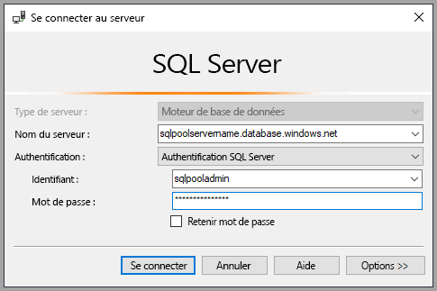
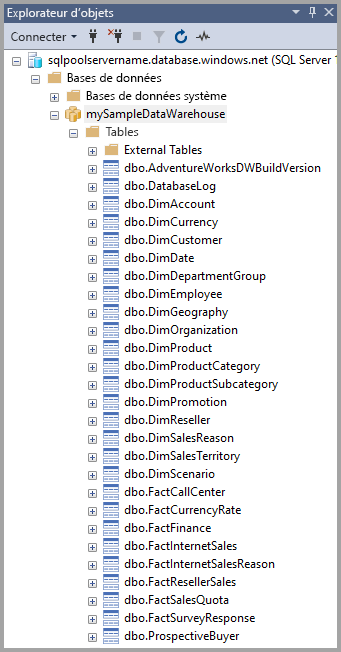
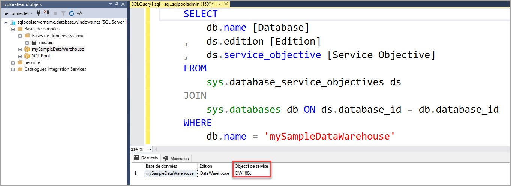
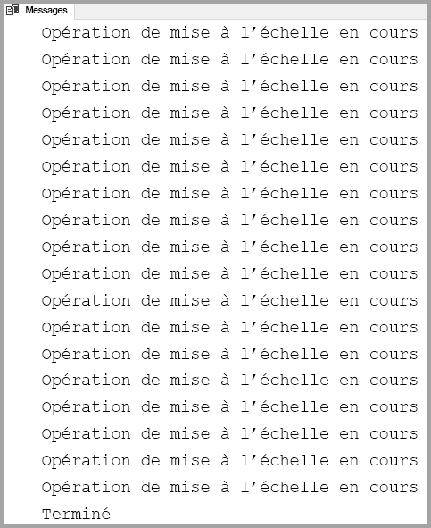

# <a name="quickstart-scale-compute-for-dedicated-sql-pool-formerly-sql-dw-in-azure-synapse-analytics-using-t-sql"></a>Démarrage rapide : Mettre à l’échelle les ressources de calcul d’un pool SQL dédié (anciennement SQL DW) dans Azure Synapse Analytics à l’aide de T-SQL

Mettez à l’échelle les ressources de calcul dans un pool SQL dédié (anciennement SQL DW) avec T-SQL et SQL Server Management Studio (SSMS). [Effectuez un scale-out du calcul](sql-data-warehouse-manage-compute-overview.md) pour améliorer les performances, ou réduisez-le pour diminuer les coûts.

Si vous n’avez pas d’abonnement Azure, créez un compte [gratuit](https://azure.microsoft.com/free/) avant de commencer.

## <a name="before-you-begin"></a>Avant de commencer

Téléchargez et installez la dernière version de [SQL Server Management Studio](/sql/ssms/download-sql-server-management-studio-ssms?toc=/azure/synapse-analytics/sql-data-warehouse/toc.json&bc=/azure/synapse-analytics/sql-data-warehouse/breadcrumb/toc.json&view=azure-sqldw-latest&preserve-view=true) (SSMS).

## <a name="create-a-dedicated-sql-pool-formerly-sql-dw"></a>Créer un pool SQL dédié (anciennement SQL DW)

Utilisez [Démarrage rapide : Créer et connecter – Portail](create-data-warehouse-portal.md) pour créer un pool SQL dédié (anciennement SQL DW) nommé **mySampleDataWarehouse**. Suivez le guide de démarrage rapide pour vérifier que vous avez une règle de pare-feu et que vous pouvez vous connecter à votre pool SQL dédié (anciennement SQL DW) à partir de SQL Server Management Studio.

## <a name="connect-to-the-server-as-server-admin"></a>Se connecter au serveur comme administrateur du serveur

Cette section utilise [SQL Server Management Studio](/sql/ssms/download-sql-server-management-studio-ssms?toc=/azure/synapse-analytics/sql-data-warehouse/toc.json&bc=/azure/synapse-analytics/sql-data-warehouse/breadcrumb/toc.json&view=azure-sqldw-latest&preserve-view=true) (SSMS) pour établir une connexion à votre serveur Azure SQL.

1. Ouvrez SQL Server Management Studio.

2. Dans la fenêtre **Se connecter au serveur**, entrez les valeurs suivantes :

   | Paramètre       | Valeur suggérée | Description |
   | ------------ | ------------------ | ------------------------------------------------- |
   | Type de serveur | Moteur de base de données | Cette valeur est obligatoire |
   | Nom du serveur | Nom complet du serveur | Voici un exemple : **mySampleDataWarehouseservername.database.windows.net**. |
   | Authentification | l’authentification SQL Server | L’authentification SQL est le seul type d’authentification configuré dans ce didacticiel. |
   | Connexion | Compte d’administrateur de serveur | Le compte que vous avez spécifié lorsque vous avez créé le serveur. |
   | Mot de passe | Mot de passe de votre compte d’administrateur de serveur | Mot de passe que vous avez spécifié quand vous avez créé le serveur. |

    

3. Cliquez sur **Connecter**. La fenêtre Explorateur d’objets s’ouvre dans SSMS.

4. Dans l’Explorateur d’objets, développez **Bases de données**. Développez ensuite **mySampleDataWarehouse** pour voir les objets présents dans votre nouvelle base de données.

    

## <a name="view-service-objective"></a>Afficher l’objectif du service

Le paramètre d’objectif du service indique le nombre d’unités DWU pour le pool SQL dédié (anciennement SQL DW).

Pour afficher les unités DWU actuelles de votre pool SQL dédié (anciennement SQL DW) :

1. Sous la connexion à **mySampleDataWarehouseservername.database.windows.net**, développez **Bases de données système**.
2. Cliquez avec le bouton droit sur **Master**, puis sélectionnez **Nouvelle requête**. Une nouvelle fenêtre de requête s’ouvre.
3. Exécutez la requête suivante pour sélectionner dans la vue de gestion dynamique sys.database_service_objectives.

    ```sql
    SELECT
        db.name [Database]
    ,    ds.edition [Edition]
    ,    ds.service_objective [Service Objective]
    FROM
         sys.database_service_objectives ds
    JOIN
        sys.databases db ON ds.database_id = db.database_id
    WHERE
        db.name = 'mySampleDataWarehouse'
    ```

4. Les résultats suivants montrent que **mySampleDataWarehouse** a un objectif de service de DW400.

    

## <a name="scale-compute"></a>Mise à l’échelle des ressources de calcul

Dans le pool SQL dédié (anciennement SQL DW), vous pouvez augmenter ou réduire les ressources de calcul en ajustant les unités DWU (Data Warehouse Unit). Le guide [Créer et connecter – Portail](create-data-warehouse-portal.md) a permis de créer **mySampleDataWarehouse** et de l’initialiser avec 400 DWU. Les étapes suivantes ajustent les DWU de **mySampleDataWarehouse**.

Pour modifier les unités Data Warehouse Unit :

1. Cliquez avec le bouton droit sur **Master**, puis sélectionnez **Nouvelle requête**.
2. Utilisez l’instruction T-SQL [ALTER DATABASE](/sql/t-sql/statements/alter-database-azure-sql-database?toc=/azure/synapse-analytics/sql-data-warehouse/toc.json&bc=/azure/synapse-analytics/sql-data-warehouse/breadcrumb/toc.json&view=azure-sqldw-latest&preserve-view=true) pour modifier l’objectif du service. Exécutez la requête suivante pour définir l’objectif du service sur DW300.

    ```Sql
    ALTER DATABASE mySampleDataWarehouse
    MODIFY (SERVICE_OBJECTIVE = 'DW300c');
    ```

## <a name="monitor-scale-change-request"></a>Suivre la requête de modification d’échelle

Pour afficher la progression de la demande de modification précédente, vous pouvez utiliser la syntaxe T-SQL `WAITFORDELAY` pour interroger la vue de gestion dynamique (DMV) sys.dm_operation_status.

Pour interroger l’état de modification des objets de service :

1. Cliquez avec le bouton droit sur **Master**, puis sélectionnez **Nouvelle requête**.
2. Exécutez la requête suivante pour interroger la vue de gestion dynamique sys.dm_operation_status.

    ```sql
    WHILE
    (
        SELECT TOP 1 state_desc
        FROM sys.dm_operation_status
        WHERE
            1=1
            AND resource_type_desc = 'Database'
            AND major_resource_id = 'mySampleDataWarehouse'
            AND operation = 'ALTER DATABASE'
        ORDER BY
            start_time DESC
    ) = 'IN_PROGRESS'
    BEGIN
        RAISERROR('Scale operation in progress',0,0) WITH NOWAIT;
        WAITFOR DELAY '00:00:05';
    END
    PRINT 'Complete';
    ```

3. La sortie affiche le journal de l’interrogation de l’état.

    

## <a name="check-dedicated-sql-pool-formerly-sql-dw-state"></a>Vérifier l’état du pool SQL dédié (anciennement SQL DW)

Lorsqu’un pool SQL dédié (anciennement SQL DW) est mis en pause, vous ne pouvez pas vous y connecter avec T-SQL. Pour voir l’état actuel du pool SQL dédié (anciennement SQL DW), vous pouvez utiliser une applet de commande PowerShell. Pour consulter un exemple, reportez-vous à [Vérifier l’état d’un pool SQL dédié (anciennement SQL DW) – PowerShell](quickstart-scale-compute-powershell.md#check-data-warehouse-state).

## <a name="check-operation-status"></a>Vérifier l’état de l’opération

Pour retourner des informations sur les diverses opérations de gestion dans votre pool SQL dédié (anciennement SQL DW), exécutez la requête suivante dans la vue de gestion dynamique [sys.dm_operation_status](/sql/relational-databases/system-dynamic-management-views/sys-dm-operation-status-azure-sql-database?toc=/azure/synapse-analytics/sql-data-warehouse/toc.json&bc=/azure/synapse-analytics/sql-data-warehouse/breadcrumb/toc.json&view=azure-sqldw-latest&preserve-view=true). Par exemple, elle retourne l’opération et l’état de l’opération, soit IN_PROGRESS ou COMPLETED.

```sql
SELECT *
FROM
    sys.dm_operation_status
WHERE
    resource_type_desc = 'Database'
AND
    major_resource_id = 'mySampleDataWarehouse'
```

## <a name="next-steps"></a>Étapes suivantes

Vous savez maintenant comment mettre à l’échelle les ressources de calcul de votre pool SQL dédié (anciennement SQL DW). Pour en savoir plus sur Azure Synapse Analytics, passez au tutoriel sur le chargement des données.

> [!div class="nextstepaction"]
>[Charger les données dans un pool SQL dédié](./load-data-from-azure-blob-storage-using-copy.md)