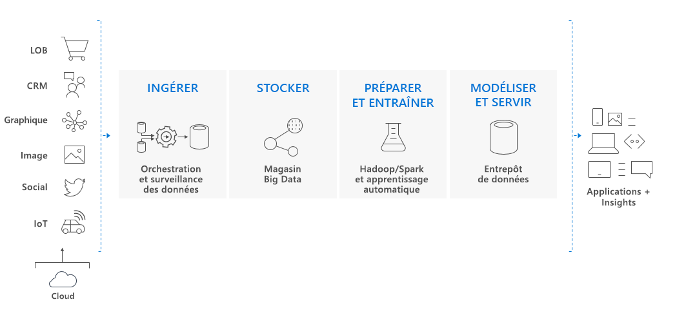

# Qu’est-ce qu’Azure Synapse Analytics (anciennement SQL DW) ?

> [!NOTE] 
>Explorez la [documentation d’Azure Synapse (espaces de travail en préversion)](../overview-what-is.md).
>

Azure Synapse est un service d’analytique qui regroupe l’entreposage des données d’entreprise et l’analytique de Big Data. Il vous donne la possibilité d’interroger les données avec votre propre vocabulaire, en utilisant des ressources serverless à la demande ou des ressources provisionnées, le tout à grande échelle. Azure Synapse rassemble ces deux mondes avec une expérience unifiée pour la réception, la préparation, la gestion et la remise de données pour les besoins immédiats d’apprentissage automatique et décisionnels.

Azure Synapse comporte quatre composants :

- Synapse SQL : Effectuer des analyses basées sur T-SQL – Disponibilité générale
  - Pool SQL (paiement par DWU configuré)
  - SQL à la demande (paiement par To traité) (préversion)
- Spark : Apache Spark profondément intégré (préversion)
- Pipelines Azure Synapse : Intégration des données hybrides (préversion)
- Studio : Expérience d'utilisateur final unifiée. (préversion)

## Pool Synapse SQL dans Azure Synapse

Le pool Synapse SQL fait référence aux fonctionnalités d’entreposage de données d’entreprise qui sont généralement disponibles dans Azure Synapse.

Le pool SQL représente une collection de ressources analytiques en cours de provisionnement quand Synapse SQL est utilisé. La taille du pool SQL est déterminée par les unités d’entreposage de données (DWU).

Importez des données volumineuses avec des requêtes T-SQL [PolyBase](/sql/relational-databases/polybase/polybase-guide?toc=/azure/synapse-analytics/sql-data-warehouse/toc.json&bc=/azure/synapse-analytics/sql-data-warehouse/breadcrumb/toc.json&view=azure-sqldw-latest) simples, puis utilisez le traitement massivement parallèle pour exécuter des analyses hautes performances. Au fil de vos intégrations et analyses, le pool Synapse SQL deviendra la seule source pertinente sur laquelle votre activité peut compter pour obtenir des insights plus rapides et robustes.  

## Composant clé de la solution Big Data

L’entreposage de données est un composant clé d’une solution de Big Data de bout en bout basée sur le cloud.

Dans une solution de données cloud, les données sont ingérées dans des magasins de données volumineuses à partir de diverses sources. Une fois dans un magasin de données volumineuses, des algorithmes d’apprentissage de données, Spark et Hadoop préparent et forment les données. Quand les données sont prêtes pour l’analyse complexe, le pool Synapse SQL utilise PolyBase pour interroger les grands magasins de données. PolyBase utilise des requêtes T-SQL standard pour rassembler les données dans des tables du pool Synapse SQL.

Le pool Synapse SQL stocke les données dans des tables relationnelles avec un stockage en colonnes. Ce format réduit considérablement le coût de stockage des données et améliore les performances de requête. Une fois les données stockées, vous pouvez exécuter des analyses à grande échelle. Par rapport aux systèmes de base de données classiques, les requêtes d’analyses se terminent en quelques secondes plutôt qu’en quelques minutes, ou en quelques heures plutôt qu’en quelques jours.

Les résultats d’analyse peuvent s’étendre aux applications ou bases de données de rapports mondiales. Les analystes commerciaux peuvent alors obtenir des informations pour prendre des décisions éclairées pour l’activité.

## Étapes suivantes

- Explorer [l’Architecture d’Azure Synapse](massively-parallel-processing-mpp-architecture.md)
- [Créer rapidement un pool SQL](create-data-warehouse-portal.md)
- [Charger des exemples de données](load-data-from-azure-blob-storage-using-polybase.md)
- Explorer les [vidéos](https://azure.microsoft.com/documentation/videos/index/?services=sql-data-warehouse)

Ou bien, consultez ces autres ressources d’Azure Synapse.

- Effectuer des recherches dans les [blogs](https://azure.microsoft.com/blog/tag/azure-sql-data-warehouse/)
- Soumettre une [demande de fonctionnalité](https://feedback.azure.com/forums/307516-sql-data-warehouse)
- [Création d’un ticket de support](sql-data-warehouse-get-started-create-support-ticket.md)
- Effectuer des recherches dans [le forum MSDN](https://social.msdn.microsoft.com/Forums/azure/home?forum=AzureSQLDataWarehouse)
- Effectuer des recherches dans le [forum Stack Overflow](https://stackoverflow.com/questions/tagged/azure-sqldw)
