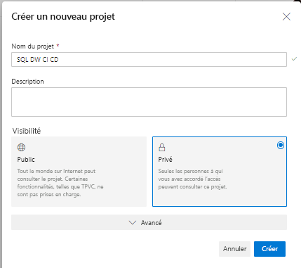
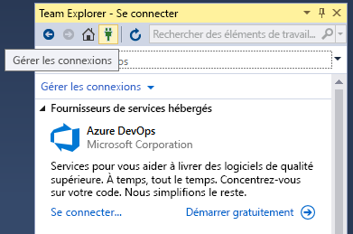
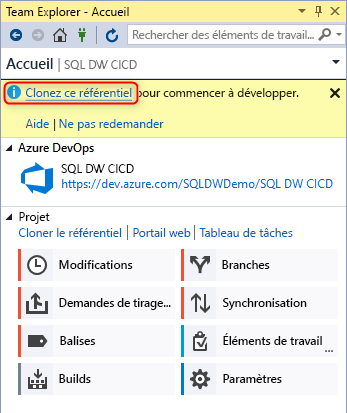
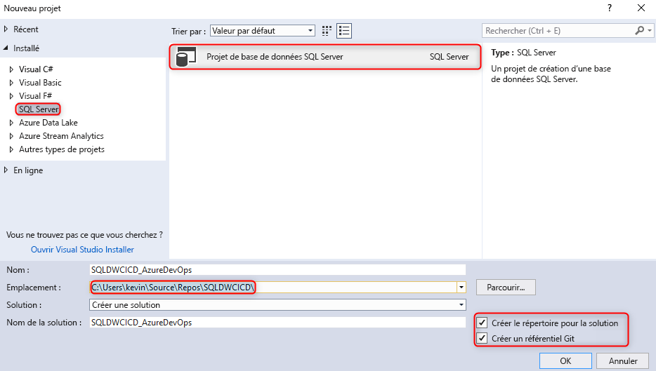
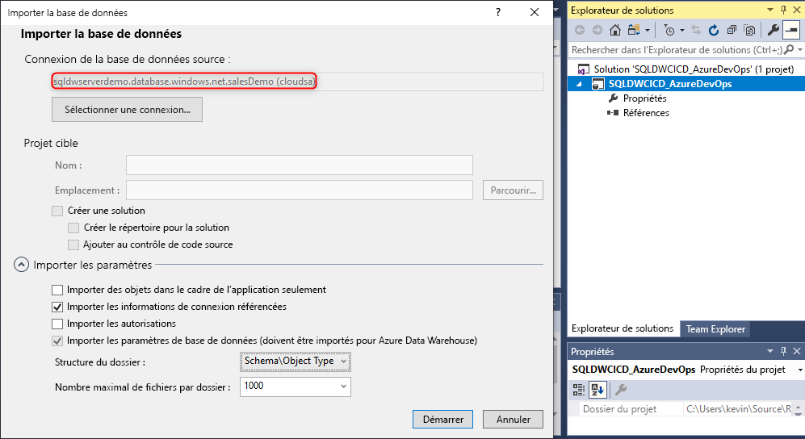
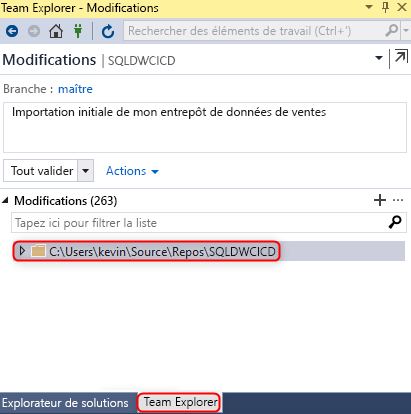
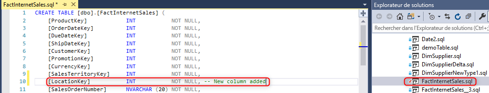
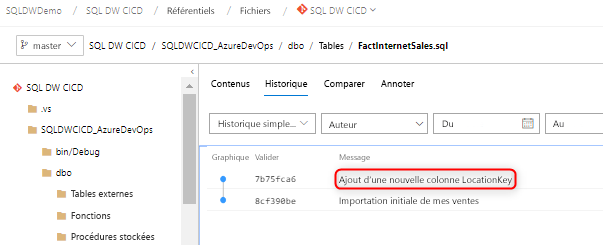

# Intégration du contrôle de code source pour le pool SQL dédié dans Azure Synapse Analytics

Ce tutoriel explique comment intégrer votre projet de base de données SSDT (SQL Server Data Tools) au contrôle de code source.  L’intégration du contrôle de code source est la première étape de la génération de votre pipeline d’intégration et de déploiement continus avec la ressource de pool SQL dédié dans Azure Synapse Analytics.

## Avant de commencer

- Inscrivez-vous pour créer une [organisation Azure DevOps](https://azure.microsoft.com/services/devops/).
- Parcourez le tutoriel [Créer et connecter](create-data-warehouse-portal.md).
- [Installez Visual Studio 2019](https://visualstudio.microsoft.com/vs/older-downloads/).

## Configurer Azure DevOps et s’y connecter

1. Dans votre organisation Azure DevOps, créez le projet appelé à héberger votre projet de base de données SSDT via un dépôt Azure.

   

2. Ouvrez Visual Studio et connectez-vous à votre organisation et à votre projet Azure DevOps de la première étape en sélectionnant **Gérer des connexions**.

   

3. Connectez-vous à votre projet en sélectionnant **Gérer les connexions**, puis **Se connecter à un projet**.
 
    

4. Recherchez le projet que vous avez créé à la première étape, puis sélectionnez **Se connecter**.
 
    

3. Clonez le dépôt Azure DevOps de votre projet sur votre ordinateur local.

   

Pour plus d’informations sur la connexion de projets en utilisant Visual Studio, consultez [Se connecter à des projets dans Team Explorer](/visualstudio/ide/connect-team-project?view=vs-2019&preserve-view=true). Pour obtenir des conseils sur le clonage d’un dépôt en utilisant Visual Studio, consultez l’article [Cloner un dépôt Git existant](/azure/devops/repos/git/clone?tabs=visual-studio). 

## Créer et connecter votre projet

1. Dans Visual Studio, créez un projet de base de données SQL Server avec un répertoire et un dépôt Git local dans votre **dépôt cloné local**.

     

2. Cliquez avec le bouton droit sur votre projet SQL vide, puis importez votre entrepôt de données dans le projet de base de données.

     

3. Dans Team Explorer, dans Visual Studio, validez les changements apportés à votre dépôt Git local.

     

4. Les changements étant validés localement dans le dépôt cloné, synchronisez-les et envoyez-les (push) à votre dépôt Azure dans votre projet Azure DevOps.

    - Préproduction")

   ")  

## Validation

1. Vérifiez que les changements ont été envoyés (push) à votre dépôt Azure en mettant à jour une colonne de table dans votre projet de base de données à partir de Visual Studio SQL Server Data Tools (SSDT).

   

2. Validez le changement et envoyez-le (push) de votre dépôt local vers votre dépôt Azure.

    des modifications")

3. Vérifiez que le changement a été envoyé (push) dans votre dépôt Azure.

   

4. (**Facultatif**) Utilisez Comparer les schémas et mettez à jour les changements apportés à votre pool SQL dédié cible à l’aide de SSDT pour être certain que les définitions d’objets dans votre dépôt Azure et le dépôt local reflètent votre pool SQL dédié.

## Étapes suivantes

- [Développement pour le pool SQL dédié](sql-data-warehouse-overview-develop.md)