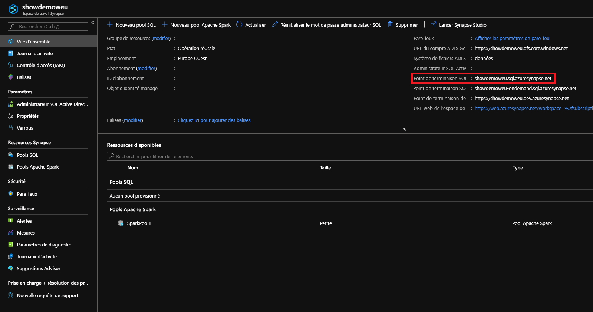
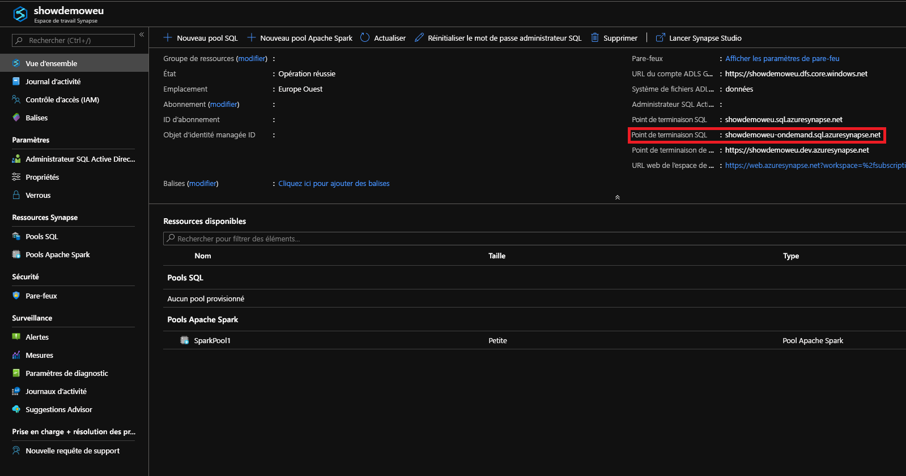

# <a name="connect-to-synapse-sql"></a>Se connecter à Synapse SQL
Connectez-vous à la capacité Synapse SQL dans Azure Synapse Analytics.

## <a name="supported-tools-for-serverless-sql-pool"></a>Outils pris en charge pour le pool SQL serverless

[Azure Data Studio](/sql/azure-data-studio/download-azure-data-studio) est entièrement pris en charge à compter de la version 1.18.0. SSMS est partiellement pris en charge à partir de la version 18.5 ; vous pouvez l’utiliser pour vous connecter et interroger uniquement.

> [!NOTE]
> Si une connexion AAD a une connexion ouverte pendant plus d’une heure au moment de l’exécution de la requête, toute requête qui s’appuie sur AAD échoue. Cela comprend l’interrogation du stockage à l’aide du transfert AAD et d’instructions qui interagissent avec AAD (par exemple, CREATE EXTERNAL PROVIDER). Cela affecte tous les outils qui maintiennent les connexions ouvertes, comme dans l’éditeur de requête de SSMS et ADS. Les outils qui ouvrent de nouvelles connexions pour exécuter une requête, comme Synapse Studio, ne sont pas affectés.

> Vous pouvez redémarrer SSMS ou vous connecter et vous déconnecter dans ADS pour atténuer ce problème. 

## <a name="find-your-server-name"></a>Recherche du nom de serveur

Dans l’exemple suivant, le nom du serveur pour le pool SQL dédié est : showdemoweu.sql.azuresynapse.net.
Dans l’exemple suivant, le nom du serveur pour le pool SQL serverless est : showdemoweu-ondemand.sql.azuresynapse.net.

Pour rechercher le nom complet du serveur :

1. Accédez au [portail Azure](https://portal.azure.com).
2. Sélectionnez **Espaces de travail Synapse**.
3. Sélectionnez l’espace de travail auquel vous souhaitez vous connecter.
4. Accédez à la vue d’ensemble.
5. Recherchez le nom complet du serveur.

## <a name="sql-pool"></a>**Pool SQL**



## <a name="serverless-sql-pool"></a>**Pool SQL serverless**



## <a name="supported-drivers-and-connection-strings"></a>Chaînes de connexion et pilotes pris en charge
Synapse SQL prend en charge [ADO.NET](/dotnet/framework/data/adonet/), [ODBC](/sql/connect/odbc/windows/microsoft-odbc-driver-for-sql-server-on-windows), [PHP](/sql/connect/php/overview-of-the-php-sql-driver?f=255&MSPPError=-2147217396) et [JDBC](/sql/connect/jdbc/microsoft-jdbc-driver-for-sql-server). Pour rechercher la dernière version et accéder à la documentation connexe, sélectionnez l’un des pilotes ci-dessus. Pour générer automatiquement la chaîne de connexion pour le pilote que vous utilisez à partir du portail Azure,sélectionnez l’option **Afficher les chaînes de connexion de la base de données** dans l’exemple précédent. Voici également quelques exemples montrant à quoi ressemble une chaîne de connexion pour chaque pilote.

> [!NOTE]
> Vous pouvez définir le délai de connexion à 300 secondes pour permettre à votre connexion de résister à des courtes périodes d’indisponibilité.

### <a name="adonet-connection-string-example"></a>Exemple de chaîne de connexion ADO.NET

```csharp
Server=tcp:{your_server}.sql.azuresynapse.net,1433;Database={your_database};User ID={your_user_name};Password={your_password_here};Encrypt=True;TrustServerCertificate=False;Connection Timeout=30;
```

### <a name="odbc-connection-string-example"></a>Exemple de chaîne de connexion ODBC

```csharp
Driver={SQL Server Native Client 11.0};Server=tcp:{your_server}.sql.azuresynapse.net,1433;Database={your_database};Uid={your_user_name};Pwd={your_password_here};Encrypt=yes;TrustServerCertificate=no;Connection Timeout=30;
```

### <a name="php-connection-string-example"></a>Exemple de chaîne de connexion PHP

```PHP
Server: {your_server}.sql.azuresynapse.net,1433 \r\nSQL Database: {your_database}\r\nUser Name: {your_user_name}\r\n\r\nPHP Data Objects(PDO) Sample Code:\r\n\r\ntry {\r\n   $conn = new PDO ( \"sqlsrv:server = tcp:{your_server}.sql.azuresynapse.net,1433; Database = {your_database}\", \"{your_user_name}\", \"{your_password_here}\");\r\n    $conn->setAttribute( PDO::ATTR_ERRMODE, PDO::ERRMODE_EXCEPTION );\r\n}\r\ncatch ( PDOException $e ) {\r\n   print( \"Error connecting to SQL Server.\" );\r\n   die(print_r($e));\r\n}\r\n\rSQL Server Extension Sample Code:\r\n\r\n$connectionInfo = array(\"UID\" => \"{your_user_name}\", \"pwd\" => \"{your_password_here}\", \"Database\" => \"{your_database}\", \"LoginTimeout\" => 30, \"Encrypt\" => 1, \"TrustServerCertificate\" => 0);\r\n$serverName = \"tcp:{your_server}.sql.azuresynapse.net,1433\";\r\n$conn = sqlsrv_connect($serverName, $connectionInfo);
```

### <a name="jdbc-connection-string-example"></a>Exemple de chaîne de connexion JDBC

```Java
jdbc:sqlserver://yourserver.sql.azuresynapse.net:1433;database=yourdatabase;user={your_user_name};password={your_password_here};encrypt=true;trustServerCertificate=false;hostNameInCertificate=*.sql.azuresynapse.net;loginTimeout=30;
```

## <a name="connection-settings"></a>Paramètres de connexion
Synapse SQL standardise certains paramètres pendant la connexion et la création d’objets. Ces paramètres, qui ne peuvent pas être remplacés, comprennent notamment :

| Paramètre de base de données | Valeur |
|:--- |:--- |
| [ANSI_NULLS](/sql/t-sql/statements/set-ansi-nulls-transact-sql?view=azure-sqldw-latest&preserve-view=true) |ACTIVÉ |
| [QUOTED_IDENTIFIERS](/sql/t-sql/statements/set-quoted-identifier-transact-sql?view=azure-sqldw-latest&preserve-view=true) |ACTIVÉ |
| [DATEFORMAT](/sql/t-sql/statements/set-dateformat-transact-sql?view=azure-sqldw-latest&preserve-view=true) |mja |
| [DATEFIRST](/sql/t-sql/statements/set-datefirst-transact-sql?view=azure-sqldw-latest&preserve-view=true) |7 |

## <a name="recommendations"></a>Recommandations

Pour exécuter des requêtes de **pool SQL serverless**, les outils recommandés sont [Azure Data Studio](get-started-azure-data-studio.md) et Azure Synapse Studio.

## <a name="next-steps"></a>Étapes suivantes
Pour vous connecter et interroger avec Visual Studio, consultez la page [Interroger Azure SQL Data Warehouse (sqlcmd) (Visual Studio)](../sql-data-warehouse/sql-data-warehouse-query-visual-studio.md?toc=/azure/synapse-analytics/toc.json&bc=/azure/synapse-analytics/breadcrumb/toc.json). Pour en savoir plus sur les options d’authentification, consultez [Authentification sur Synapse SQL](../sql-data-warehouse/sql-data-warehouse-authentication.md?toc=/azure/synapse-analytics/toc.json&bc=/azure/synapse-analytics/breadcrumb/toc.json).