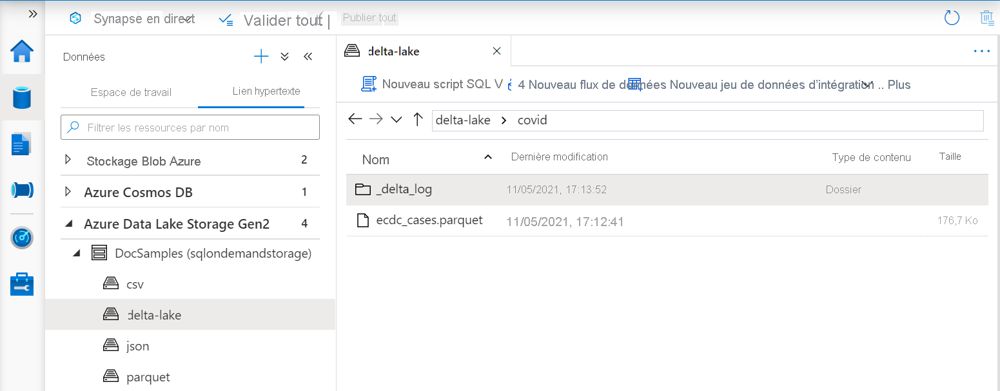

# <a name="create-and-use-native-external-tables-using-sql-pools-in-azure-synapse-analytics"></a>Créer et utiliser des tables externes natives à l’aide de pools SQL dans Azure Synapse Analytics

Cette section explique comment créer et utiliser des [tables externes natives](develop-tables-external-tables.md) dans un pool Synapse SQL. Des tables externes natives produisent de meilleures performances que des tables externes avec `TYPE=HADOOP` dans leur définition de source de données externe. Cela est dû au fait que les tables externes natives utilisent du code natif pour accéder aux données externes. 

Les tables externes sont utiles si vous souhaitez contrôler l’accès aux données externes dans un pool Synapse SQL. Elles sont également nécessaires si vous voulez vous service d’outils tels que Power BI en combinaison avec un pool Synapse SQL. Les tables externes peuvent accéder à deux types de stockage :
- le stockage public où les utilisateurs accèdent aux fichiers de stockage public ;
- le stockage protégé où les utilisateurs accèdent aux fichiers de stockage à l’aide d’informations d’identification SAP, d’une identité Azure AD ou de l’identité managée d’un espace de travail Synapse.

> [!NOTE]
>  Dans des pools SQL dédiés, vous ne pouvez utiliser que des tables externes Parquet natives. Les tables externes Parquet natives sont en préversion publique limitée dans les pools SQL dédiés, car cette fonctionnalité n’est pas encore disponible dans toutes les régions. Si vous souhaitez rejoindre la version préliminaire publique, contactez votre gestionnaire technique de compte Microsoft ou votre architecte de solution cloud pour vérifier si vous pouvez utiliser la table externe Parquet native dans vos pools dédiés. Si vous souhaitez utiliser une fonctionnalité généralement disponible dans des pools SQL dédiés, ou si vous devez accéder à des fichiers CSV ou ORC, utilisez des tables externes Hadoop. Les tables externes natives sont généralement disponibles dans les pools SQL serverless.
> Pour en savoir plus sur les différences entre les tables externes natives et Hadoop, consultez [Utiliser des tables externes avec Synapse SQL](develop-tables-external-tables.md).

## <a name="prerequisites"></a>Prérequis

La première étape consiste à créer la base de données dans laquelle les tables seront créées. Créez ensuite les objets suivants utilisés dans cet exemple :
- DATABASE SCOPED CREDENTIAL `sqlondemand` qui permet d’accéder au compte de stockage Azure `https://sqlondemandstorage.blob.core.windows.net` protégé par SAP.

    ```sql
    CREATE DATABASE SCOPED CREDENTIAL [sqlondemand]
    WITH IDENTITY='SHARED ACCESS SIGNATURE',  
    SECRET = 'sv=2018-03-28&ss=bf&srt=sco&sp=rl&st=2019-10-14T12%3A10%3A25Z&se=2061-12-31T12%3A10%3A00Z&sig=KlSU2ullCscyTS0An0nozEpo4tO5JAgGBvw%2FJX2lguw%3D'
    ```

- EXTERNAL DATA SOURCE `sqlondemanddemo` qui fait référence au compte de stockage de démonstration protégé par clé SAP et EXTERNAL DATA SOURCE `nyctlc` qui fait référence au compte de stockage Azure en disponibilité publique à l’emplacement `https://azureopendatastorage.blob.core.windows.net/nyctlc/`.

    ```sql
    CREATE EXTERNAL DATA SOURCE SqlOnDemandDemo WITH (
        LOCATION = 'https://sqlondemandstorage.blob.core.windows.net',
        CREDENTIAL = sqlondemand
    );
    GO
    CREATE EXTERNAL DATA SOURCE nyctlc
    WITH ( LOCATION = 'https://azureopendatastorage.blob.core.windows.net/nyctlc/')
    GO
    CREATE EXTERNAL DATA SOURCE DeltaLakeStorage
    WITH ( location = 'https://sqlondemandstorage.blob.core.windows.net/delta-lake/' );
    ```

- FILE FORMAT `QuotedCSVWithHeaderFormat` et FILE FORMAT `ParquetFormat` qui décrivent les types de fichiers CSV et Parquet.

    ```sql
    CREATE EXTERNAL FILE FORMAT QuotedCsvWithHeaderFormat
    WITH (  
        FORMAT_TYPE = DELIMITEDTEXT,
        FORMAT_OPTIONS ( FIELD_TERMINATOR = ',', STRING_DELIMITER = '"', FIRST_ROW = 2   )
    );
    GO
    CREATE EXTERNAL FILE FORMAT ParquetFormat WITH (  FORMAT_TYPE = PARQUET );
    GO
    CREATE EXTERNAL FILE FORMAT DeltaLakeFormat WITH (  FORMAT_TYPE = DELTA );
    GO
    ```

Les requêtes de cet article seront exécutées sur votre exemple de base de données et utiliseront ces objets. 

## <a name="external-table-on-a-file"></a>Table externe sur un fichier

Il est possible de créer des tables externes qui accèdent aux données d’un compte de stockage Azure autorisant l’accès aux utilisateurs munis d’une identité Azure AD ou d’une clé SAP. Vous pouvez créer des tables externes de la même façon que vous créez habituellement des tables externes SQL Server. 

La requête suivante crée une table externe qui lit le fichier *population.csv* à partir du compte de stockage Azure de démonstration Synapse SQL auquel il est fait référence à l’aide de la source de données `sqlondemanddemo` et qui est protégé avec les informations d’identification étendues à la base de données appelées `sqlondemand`. 

La source de données et les informations d’identification étendues à la base de données sont créées dans le [script d’installation](https://github.com/Azure-Samples/Synapse/blob/master/SQL/Samples/LdwSample/SampleDB.sql).

> [!NOTE]
> Modifiez la première ligne de la requête, c’est-à-dire [mydbname], afin d’utiliser la base de données que vous avez créée. 

```sql
USE [mydbname];
GO
CREATE EXTERNAL TABLE populationExternalTable
(
    [country_code] VARCHAR (5) COLLATE Latin1_General_BIN2,
    [country_name] VARCHAR (100) COLLATE Latin1_General_BIN2,
    [year] smallint,
    [population] bigint
)
WITH (
    LOCATION = 'csv/population/population.csv',
    DATA_SOURCE = sqlondemanddemo,
    FILE_FORMAT = QuotedCSVWithHeaderFormat
);
```

Les tables CSV natives sont actuellement disponibles uniquement dans les pools SQL serverless.

## <a name="external-table-on-a-set-of-files"></a>Table externe sur un ensemble de fichiers

Vous pouvez créer des tables externes qui lisent les données d’un ensemble de fichiers placés sur un stockage Azure :

```sql
CREATE EXTERNAL TABLE Taxi (
     vendor_id VARCHAR(100) COLLATE Latin1_General_BIN2, 
     pickup_datetime DATETIME2, 
     dropoff_datetime DATETIME2,
     passenger_count INT,
     trip_distance FLOAT,
     fare_amount FLOAT,
     tip_amount FLOAT,
     tolls_amount FLOAT,
     total_amount FLOAT
) WITH (
         LOCATION = 'yellow/puYear=*/puMonth=*/*.parquet',
         DATA_SOURCE = nyctlc,
         FILE_FORMAT = ParquetFormat
);
```

Vous pouvez spécifier le modèle auquel les fichiers doivent se conformer pour être référencés par la table externe. Le modèle n’est requis que pour des tables Parquet et CSV. Si vous utilisez le format Delta Lake, vous devez simplement spécifier un dossier racine. La table externe trouvera automatiquement le modèle.

> [!NOTE]
> La table est créée sur la structure des dossiers partitionnés, mais vous ne pouvez pas tirer parti de l’élimination de certaines partitions. Si vous souhaitez obtenir de meilleures performances en ignorant les fichiers qui ne répondent pas à certains critères (par exemple, à une année ou à un mois spécifique dans ce cas), utilisez des [vues sur les données externes](create-use-views.md#partitioned-views).

## <a name="delta-lake-external-table"></a>Table externe Delta Lake

Vous pouvez créer des tables externes sur un dossier du Delta Lake. La seule différence entre les tables externes créées sur un [fichier unique](#external-table-on-a-file) ou un [ensemble de fichiers](#external-table-on-a-set-of-files), et les tables externes créées au format Delta Lake est que, dans le cas d’une table externe Delta Lake, vous devez référencer un dossier contenant la structure Delta Lake.

> [!div class="mx-imgBorder"]
>

Voici un exemple de définition de table créée sur un dossier Delta Lake :

```sql
CREATE EXTERNAL TABLE Covid (
     date_rep date,
     cases int,
     geo_id varchar(6)
) WITH (
        LOCATION = 'covid', --> the root folder containing the Delta Lake files
        data_source = DeltaLakeStorage,
        FILE_FORMAT = DeltaLakeFormat
);
```

## <a name="use-an-external-table"></a>Utilisation d’une table externe

Il est possible d’utiliser des [tables externes](develop-tables-external-tables.md) dans les requêtes de la même façon que dans les requêtes SQL Server.

La requête suivante illustre ce point avec la table externe *population* créée dans la section précédente. Elle retourne les noms des pays/régions avec leur population en 2019, dans l’ordre décroissant.

> [!NOTE]
> Modifiez la première ligne de la requête, c’est-à-dire [mydbname], afin d’utiliser la base de données que vous avez créée.

```sql
USE [mydbname];
GO

SELECT
    country_name, population
FROM populationExternalTable
WHERE
    [year] = 2019
ORDER BY
    [population] DESC;
```

Les performances de cette requête peuvent varier en fonction de la région. Il se peut que votre espace de travail ne se trouve pas dans la même région que les comptes de stockage Azure utilisés dans ces exemples. Pour des charges de travail de production, placez votre espace de travail Synapse et votre stockage Azure dans la même région.

## <a name="next-steps"></a>Étapes suivantes

Pour plus d’informations sur la manière de stocker les résultats d’une requête dans le stockage, consultez l’article [Stocker les résultats d’une requête dans le stockage](../sql/create-external-table-as-select.md).
