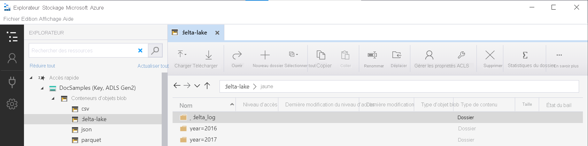

# <a name="create-and-use-views-using-serverless-sql-pool-in-azure-synapse-analytics"></a>Créer et utiliser des vues avec le pool SQL serverless dans Azure Synapse Analytics

Dans cette section, vous allez découvrir comment créer et utiliser des vues pour wrapper des requêtes de pool SQL serverless. Les vues vous permettent de réutiliser ces requêtes. Elles sont également nécessaires si vous voulez utiliser des outils comme Power BI en combinaison avec un pool SQL serverless.

## <a name="prerequisites"></a>Prérequis

La première étape consiste à créer une base de données dans laquelle la vue sera créée et à initialiser les objets nécessaires pour s’authentifier sur le stockage Azure en exécutant le [script d’installation](https://github.com/Azure-Samples/Synapse/blob/master/SQL/Samples/LdwSample/SampleDB.sql) sur cette base de données. Toutes les requêtes de cet article seront exécutées sur votre exemple de base de données.

## <a name="views-over-external-data"></a>Vues de données externes

Vous pouvez créer des vues de la même façon que vous créez des vues SQL Server standard. La requête suivante crée une vue qui lit le fichier *population.csv*.

> [!NOTE]
> Modifiez la première ligne de la requête, c’est-à-dire [mydbname], afin d’utiliser la base de données que vous avez créée.

```sql
USE [mydbname];
GO

DROP VIEW IF EXISTS populationView;
GO

CREATE VIEW populationView AS
SELECT * 
FROM OPENROWSET(
        BULK 'csv/population/population.csv',
        DATA_SOURCE = 'SqlOnDemandDemo',
        FORMAT = 'CSV', 
        FIELDTERMINATOR =',', 
        ROWTERMINATOR = '\n'
    )
WITH (
    [country_code] VARCHAR (5) COLLATE Latin1_General_BIN2,
    [country_name] VARCHAR (100) COLLATE Latin1_General_BIN2,
    [year] smallint,
    [population] bigint
) AS [r];
```

La vue utilise `EXTERNAL DATA SOURCE` avec une URL racine de votre stockage, en tant que `DATA_SOURCE` et ajoute un chemin de fichier relatif aux fichiers.

### <a name="delta-lake-views"></a>Vues de Delta Lake

Si vous créez les vues pour un dossier Delta Lake, vous devez spécifier l’emplacement du dossier racine après l’option `BULK` au lieu de spécifier le chemin d’accès du fichier.

> [!div class="mx-imgBorder"]
>

La fonction `OPENROWSET` qui lit les données du dossier Delta Lake examine la structure de celui-ci et identifie automatiquement les emplacements des fichiers.

```sql
create or alter view CovidDeltaLake
as
select *
from openrowset(
           bulk 'covid',
           data_source = 'DeltaLakeStorage',
           format = 'delta'
    ) with (
           date_rep date,
           cases int,
           geo_id varchar(6)
           ) as rows
```

Delta Lake est en préversion publique, et il existe quelques problèmes connus et des limitations. Consultez les problèmes connus dans la [page d’aide relative aux pools SQL serverless Synapse](resources-self-help-sql-on-demand.md#delta-lake).

## <a name="partitioned-views"></a>Vues partitionnées

Si vous disposez d’un ensemble de fichiers partitionnés dans la structure de dossiers hiérarchique, vous pouvez décrire le modèle de partition à l’aide des caractères génériques dans le chemin du fichier. Utilisez la fonction `FILEPATH` pour exposer des parties du chemin de dossier en tant que colonnes de partitionnement.

```sql
CREATE VIEW TaxiView
AS SELECT *, nyc.filepath(1) AS [year], nyc.filepath(2) AS [month]
FROM
    OPENROWSET(
        BULK 'parquet/taxi/year=*/month=*/*.parquet',
        DATA_SOURCE = 'sqlondemanddemo',
        FORMAT='PARQUET'
    ) AS nyc
```

Les vues partitionnées effectuent une élimination des partitions de dossier si vous interrogez cette vue avec les filtres sur les colonnes de partitionnement. Cela peut améliorer les performances de vos requêtes.

### <a name="delta-lake-partitioned-views"></a>Vues partitionnées de Delta Lake

Si vous créez les vues partitionnées pour un stockage Delta Lake, vous pouvez spécifier uniquement un dossier Delta Lake. Vous n’avez pas besoin d’exposer explicitement les colonnes de partitionnement à l’aide de la fonction `FILEPATH` :

```sql
CREATE OR ALTER VIEW YellowTaxiView
AS SELECT *
FROM  
    OPENROWSET(
        BULK 'yellow',
        DATA_SOURCE = 'DeltaLakeStorage',
        FORMAT='DELTA'
    ) nyc
```

La fonction `OPENROWSET` examine la structure du dossier Delta Lake sous-jacent, puis identifie et expose automatiquement les colonnes de partitionnement. L’élimination des partitions est effectuée automatiquement si vous placez la colonne de partitionnement dans la clause `WHERE` d’une requête.

Le nom de dossier dans la fonction `OPENROWSET` (`yellow` dans cet exemple), qui est concaténé avec l’URI `LOCATION` défini dans la source de données `DeltaLakeStorage` doit référencer le dossier Delta Lake racine contenant un sous-dossier nommé `_delta_log`.

> [!div class="mx-imgBorder"]
>

N’utilisez pas la clause `WITH` dans la fonction `OPENROWSET` lorsque vous interrogez des données Delta Lake partitionnées. En raison du problème connu dans la préversion, la clause `WITH` [ne retourne pas correctement les valeurs des colonnes de partitionnement sous-jacentes](resources-self-help-sql-on-demand.md#partitioning-column-returns-null-values). L’élimination de partition fonctionne bien si vous utilisez directement la fonction `OPENROWSET` avec la clause `WITH` (sans les vues).  

Delta Lake est en préversion publique, et il existe quelques problèmes connus et des limitations. Consultez les problèmes connus dans la [page d’aide relative aux pools SQL serverless Synapse](resources-self-help-sql-on-demand.md#delta-lake).

## <a name="use-a-view"></a>Utiliser une vue

Vous pouvez utiliser des vues dans vos requêtes, de la même façon que vous utilisez des vues dans les requêtes SQL Server.

La requête suivante illustre l’utilisation de la vue *population_csv* que nous avons créée à la section [Créer une vue](#views-over-external-data). Elle retourne les noms des pays/régions avec leur population en 2019, dans l’ordre décroissant.

> [!NOTE]
> Modifiez la première ligne de la requête, c’est-à-dire [mydbname], afin d’utiliser la base de données que vous avez créée.

```sql
USE [mydbname];
GO

SELECT
    country_name, population
FROM populationView
WHERE
    [year] = 2019
ORDER BY
    [population] DESC;
```

## <a name="next-steps"></a>Étapes suivantes

Pour plus d’informations sur la façon d’interroger différents types de fichiers, reportez-vous aux articles [Interroger un fichier CSV](query-single-csv-file.md), [Interroger des fichiers Parquet](query-parquet-files.md) et [Interroger des fichiers JSON](query-json-files.md).
