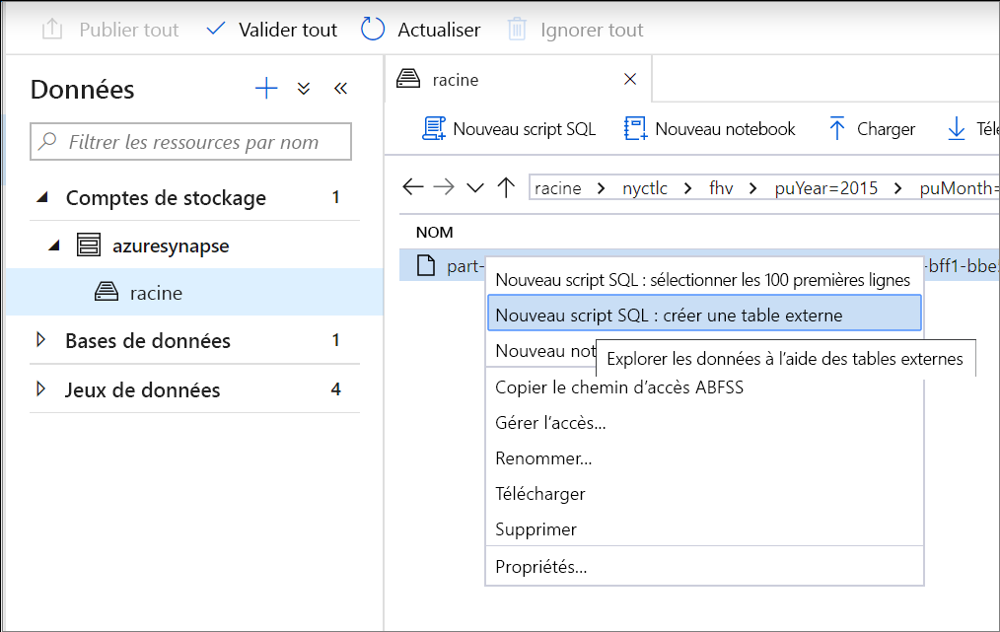
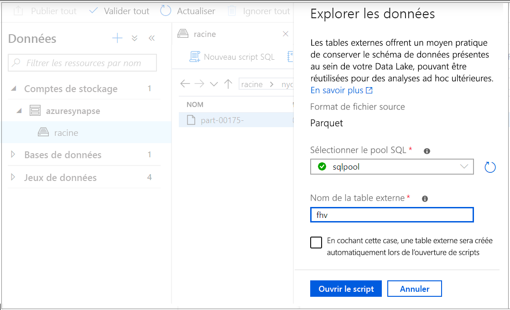
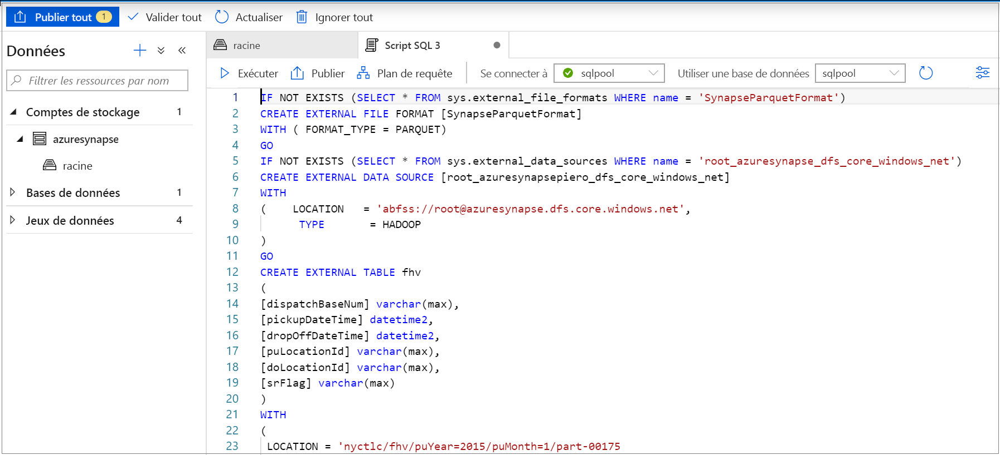
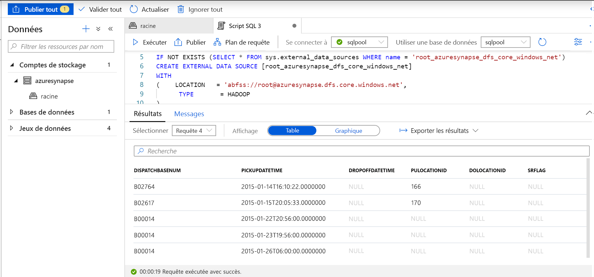
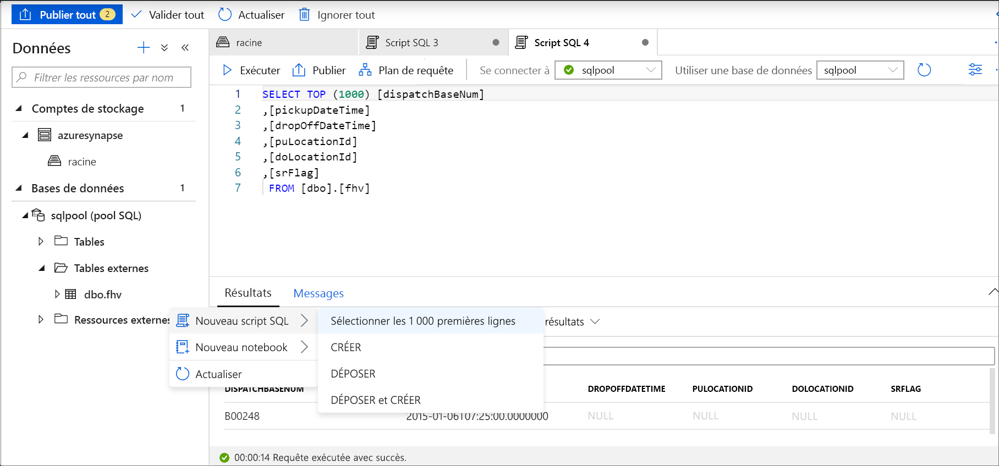

# <a name="use-external-tables-with-synapse-sql"></a>Utiliser des tables externes avec Synapse SQL

Une table externe pointe vers des données situées dans Hadoop, Stockage Blob Azure ou Azure Data Lake Storage. Les tables externes sont utilisées pour lire des données à partir de fichiers ou écrire des données dans des fichiers dans Stockage Azure. Avec Synapse SQL, vous pouvez utiliser des tables externes pour lire et écrire des données dans le pool SQL dédié ou le pool SQL serverless.

## <a name="external-tables-in-dedicated-sql-pool-and-serverless-sql-pool"></a>Tables externes dans un pool SQL dédiés et un pool SQL serverless

### <a name="dedicated-sql-pool"></a>[Pool SQL dédié](#tab/sql-pool) 

Dans un pool SQL dédié, vous pouvez utiliser une table externe pour :

- Interroger Stockage Blob Azure et Azure Data Lake Gen2 avec des instructions Transact-SQL.
- Importer et stocker des données provenant de Stockage Blob Azure et Azure Data Lake Storage dans un pool SQL dédié.

Utilisée conjointement avec l’instruction [CREATE TABLE AS SELECT](../sql-data-warehouse/sql-data-warehouse-develop-ctas.md?toc=/azure/synapse-analytics/toc.json&bc=/azure/synapse-analytics/breadcrumb/toc.json), la sélection à partir d’une table externe permet d’importer des données dans une table du pool SQL. Outre [l’instruction COPY](/sql/t-sql/statements/copy-into-transact-sql?view=azure-sqldw-latest&preserve-view=true), les tables externes sont utiles pour le chargement de données. 

Pour obtenir un tutoriel sur le chargement, consultez [Utiliser PolyBase pour charger des données du Stockage Blob Azure](../sql-data-warehouse/load-data-from-azure-blob-storage-using-copy.md?bc=%2fazure%2fsynapse-analytics%2fbreadcrumb%2ftoc.json&toc=%2fazure%2fsynapse-analytics%2ftoc.json).

### <a name="serverless-sql-pool"></a>[Pool SQL serverless](#tab/sql-on-demand)

Dans un pool SQL serverless, vous pouvez utiliser une table externe pour :

- Interroger des données dans Stockage Blob Azure ou Azure Data Lake Storage avec des instructions Transact-SQL.
- Stocker les résultats de requête de pool SQL serverless dans des fichiers dans Stockage Blob Azure ou Azure Data Lake Storage en utilisant [CETAS](develop-tables-cetas.md).

Vous pouvez créer des tables externes en utilisant un pool SQL serverless via les étapes suivantes :

1. CREATE EXTERNAL DATA SOURCE
2. CREATE EXTERNAL FILE FORMAT
3. CREATE EXTERNAL TABLE

---

### <a name="security"></a>Sécurité

L’utilisateur doit disposer de l’autorisation `SELECT` sur la table externe pour lire les données.
La table externe accède au stockage Azure sous-jacent à l’aide des informations d’identification étendues à la base de données définies dans la source de données selon les règles suivantes :
- La source de données sans informations d’identification permet aux tables externes d’accéder aux fichiers en disponibilité publique sur le stockage Azure.
- La source de données peut comporter des informations d’identification permettant aux tables externes d’accéder uniquement aux fichiers sur le stockage Azure à l’aide d’un jeton SAP ou de l’identité gérée de l’espace de travail. Pour voir des exemples, consultez l’article [Développement du contrôle d’accès au stockage des fichiers de stockage](develop-storage-files-storage-access-control.md#examples).

> [!IMPORTANT]
> Dans un pool SQL dédié, une source de données créée sans informations d’identification permet à l’utilisateur Azure AD d’accéder aux fichiers de stockage en utilisant son identité Azure AD. Dans un pool SQL serverless, vous devez créer une source de données avec des informations d’identification limitées à la base de données ayant la propriété `IDENTITY='User Identity'` (des exemples sont disponibles [ici](develop-storage-files-storage-access-control.md#examples)).

## <a name="create-external-data-source"></a>CREATE EXTERNAL DATA SOURCE

Les sources de données externes sont utilisées pour se connecter aux comptes de stockage. La documentation complète est présentée [ici](/sql/t-sql/statements/create-external-data-source-transact-sql?view=azure-sqldw-latest&preserve-view=true).

### <a name="syntax-for-create-external-data-source"></a>Syntaxe de CREATE EXTERNAL DATA SOURCE

#### <a name="dedicated-sql-pool"></a>[Pool SQL dédié](#tab/sql-pool)

```syntaxsql
CREATE EXTERNAL DATA SOURCE <data_source_name>
WITH
(    LOCATION         = '<prefix>://<path>'
     [, CREDENTIAL = <database scoped credential> ]
     , TYPE = HADOOP
)
[;]
```

#### <a name="serverless-sql-pool"></a>[Pool SQL serverless](#tab/sql-on-demand)

```syntaxsql
CREATE EXTERNAL DATA SOURCE <data_source_name>
WITH
(    LOCATION         = '<prefix>://<path>'
     [, CREDENTIAL = <database scoped credential> ]
)
[;]
```

---

### <a name="arguments-for-create-external-data-source"></a>Arguments de CREATE EXTERNAL DATA SOURCE

data_source_name

Spécifie le nom défini par l’utilisateur de la source de données. Le nom doit être unique au sein de la base de données.

#### <a name="location"></a>Emplacement
LOCATION = `'<prefix>://<path>'`   - Fournit le protocole de connectivité et le chemin de la source de données externe. Les modèles suivants peuvent être utilisés à cet emplacement :

| Source de données externe        | Préfixe de l’emplacement | Chemin d’emplacement                                         |
| --------------------------- | --------------- | ----------------------------------------------------- |
| Stockage Blob Azure          | `wasb[s]`       | `<container>@<storage_account>.blob.core.windows.net` |
| Stockage Blob Azure          | `http[s]`       | `<storage_account>.blob.core.windows.net/<container>/subfolders` |
| Azure Data Lake Store Gén. 1 | `http[s]`       | `<storage_account>.azuredatalakestore.net/webhdfs/v1` |
| Azure Data Lake Store Gén. 2 | `http[s]`       | `<storage_account>.dfs.core.windows.net/<container>/subfolders`  |

Le préfixe `https:` vous permet d’utiliser un sous-dossier dans le chemin.

#### <a name="credential"></a>Informations d'identification
CREDENTIAL = `<database scoped credential>` est une information d’identification facultative qui sera utilisée pour l’authentification sur le stockage Azure. Une source de données externe dépourvue d’informations d’identification peut accéder au compte de stockage public. 

Les sources de données externes sans informations d’identification dans un pool SQL dédié vont utiliser l’identité Azure AD de l’appelant pour accéder aux fichiers sur le stockage. Une source de données externe pour un pool SQL serverless avec des informations d’identification `IDENTITY='User Identity'` utilise l’identité Azure AD de l’appelant pour accéder aux fichiers.
- Dans un pool SQL dédié, les informations d’identification limitées à la base de données peuvent spécifier une identité d’application personnalisée, une identité managée d’espace de travail ou une clé SAS. 
- Dans un pool SQL serverless, les informations d’identification limitées à la base de données peuvent spécifier l’identité Azure AD de l’appelant, une identité managée d’espace de travail ou une clé SAS. 

#### <a name="type"></a>TYPE
TYPE = `HADOOP` est l’option obligatoire dans un pool SQL dédié et spécifie que la technologie PolyBase est utilisée pour accéder aux fichiers sous-jacents. Ce paramètre ne peut pas être utilisé dans un pool SQL serverless qui utilise le lecteur natif intégré.

### <a name="example-for-create-external-data-source"></a>Exemple pour CREATE EXTERNAL DATA SOURCE

#### <a name="dedicated-sql-pool"></a>[Pool SQL dédié](#tab/sql-pool)

L’exemple suivant crée une source de données externe pour Azure Data Lake Gen2 pointant vers le jeu de données New York :

```sql
CREATE EXTERNAL DATA SOURCE AzureDataLakeStore
WITH
  -- Please note the abfss endpoint when your account has secure transfer enabled
  ( LOCATION = 'abfss://data@newyorktaxidataset.dfs.core.windows.net' ,
    CREDENTIAL = ADLS_credential ,
    TYPE = HADOOP
  ) ;
```

#### <a name="serverless-sql-pool"></a>[Pool SQL serverless](#tab/sql-on-demand)

L’exemple suivant crée une source de données externe pour Azure Data Lake Gen2, accessible à l’aide des informations d’identification SAP :

```sql
CREATE DATABASE SCOPED CREDENTIAL [sqlondemand]
WITH IDENTITY='SHARED ACCESS SIGNATURE',  
SECRET = 'sv=2018-03-28&ss=bf&srt=sco&sp=rl&st=2019-10-14T12%3A10%3A25Z&se=2061-12-31T12%3A10%3A00Z&sig=KlSU2ullCscyTS0An0nozEpo4tO5JAgGBvw%2FJX2lguw%3D'
GO

CREATE EXTERNAL DATA SOURCE SqlOnDemandDemo WITH (
    LOCATION = 'https://sqlondemandstorage.blob.core.windows.net',
    CREDENTIAL = sqlondemand
);
```

L’exemple suivant crée une source de données externe pour Azure Data Lake Gen2 pointant vers le jeu de données New York en disponibilité publique :

```sql
CREATE EXTERNAL DATA SOURCE YellowTaxi
WITH ( LOCATION = 'https://azureopendatastorage.blob.core.windows.net/nyctlc/yellow/')
```
---

## <a name="create-external-file-format"></a>CREATE EXTERNAL FILE FORMAT

Crée un objet de format de fichier externe qui définit des données externes stockées dans Stockage Blob Azure ou Azure Data Lake Storage. La création d’un format de fichier externe est un prérequis à la création d’une table externe. La documentation complète se trouve [ici](/sql/t-sql/statements/create-external-file-format-transact-sql?view=azure-sqldw-latest&preserve-view=true).

En créant un format de fichier externe, vous spécifiez la disposition des données référencées par une table externe.

### <a name="syntax-for-create-external-file-format"></a>Syntaxe de CREATE EXTERNAL FILE FORMAT

#### <a name="sql-pool"></a>[Pool SQL](#tab/sql-pool)

```syntaxsql
-- Create an external file format for PARQUET files.  
CREATE EXTERNAL FILE FORMAT file_format_name  
WITH (  
    FORMAT_TYPE = PARQUET  
    [ , DATA_COMPRESSION = {  
        'org.apache.hadoop.io.compress.SnappyCodec'  
      | 'org.apache.hadoop.io.compress.GzipCodec'      }  
    ]);  

--Create an external file format for DELIMITED TEXT files
CREATE EXTERNAL FILE FORMAT file_format_name  
WITH (  
    FORMAT_TYPE = DELIMITEDTEXT  
    [ , DATA_COMPRESSION = 'org.apache.hadoop.io.compress.GzipCodec' ]
    [ , FORMAT_OPTIONS ( <format_options> [ ,...n  ] ) ]  
    );  

<format_options> ::=  
{  
    FIELD_TERMINATOR = field_terminator  
    | STRING_DELIMITER = string_delimiter
    | First_Row = integer
    | USE_TYPE_DEFAULT = { TRUE | FALSE }
    | Encoding = {'UTF8' | 'UTF16'}
}
```

#### <a name="serverless-sql-pool"></a>[Pool SQL serverless](#tab/sql-on-demand)

```syntaxsql
-- Create an external file format for PARQUET files.  
CREATE EXTERNAL FILE FORMAT file_format_name  
WITH (  
    FORMAT_TYPE = PARQUET  
    [ , DATA_COMPRESSION = {  
        'org.apache.hadoop.io.compress.SnappyCodec'  
      | 'org.apache.hadoop.io.compress.GzipCodec'      }  
    ]);  

--Create an external file format for DELIMITED TEXT files
CREATE EXTERNAL FILE FORMAT file_format_name  
WITH (  
    FORMAT_TYPE = DELIMITEDTEXT  
    [ , DATA_COMPRESSION = 'org.apache.hadoop.io.compress.GzipCodec' ]
    [ , FORMAT_OPTIONS ( <format_options> [ ,...n  ] ) ]  
    );  

<format_options> ::=  
{  
    FIELD_TERMINATOR = field_terminator  
    | STRING_DELIMITER = string_delimiter
    | First_Row = integer
    | USE_TYPE_DEFAULT = { TRUE | FALSE }
    | Encoding = {'UTF8' | 'UTF16'}
    | PARSER_VERSION = {'parser_version'}
}
```

---


### <a name="arguments-for-create-external-file-format"></a>Arguments de CREATE EXTERNAL FILE FORMAT

file_format_name - Spécifie un nom pour le format de fichier externe.

FORMAT_TYPE = [ PARQUET | DELIMITEDTEXT] - Spécifie le format des données externes.

- PARQUET - Spécifie un format Parquet.
- DELIMITEDTEXT - Spécifie un format de texte avec des délimiteurs de colonne, également appelés « marques de fin de champ ».

FIELD_TERMINATOR = *field_terminator* - S’applique uniquement aux fichiers texte délimité. La marque de fin de champ spécifie un ou plusieurs caractères qui indiquent la fin de chaque champ (colonne) dans le fichier texte délimité. La valeur par défaut est la barre verticale (ꞌ|ꞌ).

Exemples :

- FIELD_TERMINATOR = '|'
- FIELD_TERMINATOR = ' '
- FIELD_TERMINATOR = ꞌ\tꞌ

STRING_DELIMITER = *string_delimiter* - Spécifie la marque de fin de champ pour les données de type chaîne du fichier texte délimité. Le délimiteur de chaîne est constitué d’un ou plusieurs caractères, et est entouré de guillemets simples. La valeur par défaut est la chaîne vide ("").

Exemples :

- STRING_DELIMITER = '"'
- STRING_DELIMITER = '*'
- STRING_DELIMITER = ꞌ,ꞌ

FIRST_ROW = *First_row_int* - Spécifie le numéro de ligne qui est lu en premier et s’applique à tous les fichiers. Si vous spécifiez la valeur 2, la première ligne de chaque fichier (ligne d’en-tête) est ignorée quand les données sont chargées. Les lignes sont ignorées en présence de marques de fin de ligne (/r/n, /r, /n).

USE_TYPE_DEFAULT = { TRUE | **FALSE** } - Spécifie comment gérer les valeurs manquantes dans les fichiers texte délimité lors de la récupération des données à partir du fichier texte.

TRUE - En cas de récupération de données à partir du fichier texte, stocker chaque valeur manquante à l’aide du type de données de la valeur par défaut pour la colonne correspondante dans la définition de la table externe. Par exemple, remplacez une valeur manquante par :

- 0 si la colonne est définie comme une colonne numérique. Les colonnes décimales ne sont pas prises en charge et provoquent une erreur.
- Une chaîne vide ("") si la colonne est une colonne de chaîne.
- 1900-01-01 si la colonne est une colonne de date.

FALSE - Stocker toutes les valeurs manquantes en tant que valeurs NULL. Toutes les valeurs NULL qui sont stockées à l’aide du mot NULL dans le fichier texte délimité sont importées en tant que chaînes NULL.

Encoding = {'UTF8' | 'UTF16'} - Un pool SQL serverless peut lire des fichiers texte délimités encodés aux formats UTF8 et UTF16.

DATA_COMPRESSION = *méthode_de_compression_de_données* - Cet argument spécifie la méthode de compression appliquée aux données externes. 

Le type de format PARQUET prend en charge les méthodes de compression suivantes :

- DATA_COMPRESSION = 'org.apache.hadoop.io.compress.GzipCodec'
- DATA_COMPRESSION = 'org.apache.hadoop.io.compress.SnappyCodec'

Lors de la lecture de tables externes Parquet, cet argument est ignoré, mais il est utilisé lors de l’écriture dans des tables externes à l’aide de [CETAS](develop-tables-cetas.md).

Le type de format de fichier DELIMITEDTEXT prend en charge la méthode de compression suivante :

- DATA_COMPRESSION = 'org.apache.hadoop.io.compress.GzipCodec'

PARSER_VERSION = 'parser_version' : spécifie la version d’analyseur à utiliser lors de la lecture de fichiers. Pour plus d’informations, vérifiez l’argument PARSER_VERSION dans [Arguments OPENROWSET](develop-openrowset.md#arguments).

### <a name="example-for-create-external-file-format"></a>Exemple pour CREATE EXTERNAL FILE FORMAT

L’exemple suivant crée un format de fichier externe pour des fichiers de recensement :

```sql
CREATE EXTERNAL FILE FORMAT census_file_format
WITH
(  
    FORMAT_TYPE = PARQUET,
    DATA_COMPRESSION = 'org.apache.hadoop.io.compress.SnappyCodec'
)
```

## <a name="create-external-table"></a>CREATE EXTERNAL TABLE

La commande CREATE EXTERNAL TABLE crée une table externe pour Synapse SQL afin d’accéder aux données stockées dans Stockage Blob Azure ou Azure Data Lake Storage. 

### <a name="syntax-for-create-external-table"></a>Syntaxe de CREATE EXTERNAL TABLE

```sql
CREATE EXTERNAL TABLE { database_name.schema_name.table_name | schema_name.table_name | table_name }
    ( <column_definition> [ ,...n ] )  
    WITH (
        LOCATION = 'folder_or_filepath',  
        DATA_SOURCE = external_data_source_name,  
        FILE_FORMAT = external_file_format_name
    )  
[;]  

<column_definition> ::=
column_name <data_type>
    [ COLLATE collation_name ]
```

### <a name="arguments-create-external-table"></a>Arguments de CREATE EXTERNAL TABLE

*{ database_name.schema_name.table_name | schema_name.table_name | table_name }*

Nom (composé d’une à trois parties) de la table à créer. Pour une table externe, un pool SQL serverless stocke seulement les métadonnées de la table. Aucune donnée réelle n’est déplacée ni stockée dans un pool SQL serverless.

<column_definition>, ...*n* ]

CREATE EXTERNAL TABLE prend en charge la possibilité de configurer le nom de colonne, le type de données et le classement. Vous ne pouvez pas utiliser DEFAULT CONSTRAINT sur des tables externes.

>[!IMPORTANT]
>Les définitions de colonne, notamment les types de données et le nombre de colonnes, doivent correspondre aux données des fichiers externes. En cas de non-correspondance, les lignes du fichier sont rejetées lors de l’interrogation des données réelles.

Lors de la lecture à partir de fichiers Parquet, vous pouvez spécifier uniquement les colonnes que vous souhaitez lire et ignorer le reste.

LOCATION = '*folder_or_filepath*'

Spécifie le dossier, ou le chemin et le nom du fichier, où se trouvent les données dans Stockage Blob Azure. L’emplacement commence au dossier racine. Le dossier racine est l’emplacement de données qui est spécifié dans la source de données externe.

Si vous spécifiez un dossier pour LOCATION, une requête de pool SQL serverless effectue une sélection dans la table externe et récupère les fichiers du dossier.

> [!NOTE]
> Contrairement à Hadoop et à PolyBase, un pool SQL serverless ne retourne pas de sous-dossiers, sauf si vous spécifiez /** à la fin du chemin. Tout comme Hadoop et PolyBase, il ne retourne pas de fichiers dont le nom commence par un trait de soulignement (_) ou un point (.).

Dans cet exemple, si LOCATION='/webdata/', une requête de pool SQL serverless retourne des lignes de mydata.txt. Il ne retourne pas mydata2.txt et mydata3.txt, car ces fichiers se trouvent dans un sous-dossier.


DATA_SOURCE = *external_data_source_name* - Spécifie le nom de la source de données externe qui contient l’emplacement des données externes. Pour créer une source de données externe, utilisez [CREATE EXTERNAL DATA SOURCE](#create-external-data-source).

FILE_FORMAT = *external_file_format_name* - Spécifie le nom de l’objet de format de fichier externe qui stocke le type de fichier et la méthode de compression des données externes. Pour créer un format de fichier externe, utilisez [CREATE EXTERNAL FILE FORMAT](#create-external-file-format).

### <a name="permissions-create-external-table"></a>Autorisations pour CREATE EXTERNAL TABLE

Pour effectuer une sélection à partir d’une table externe, vous devez disposer des informations d’identification appropriées avec les autorisations de liste et de lecture.

### <a name="example-create-external-table"></a>Exemple pour CREATE EXTERNAL TABLE

L’exemple suivant crée une table externe : Il retourne la première ligne :

```sql
CREATE EXTERNAL TABLE census_external_table
(
    decennialTime varchar(20),
    stateName varchar(100),
    countyName varchar(100),
    population int,
    race varchar(50),
    sex    varchar(10),
    minAge int,
    maxAge int
)  
WITH (
    LOCATION = '/parquet/',
    DATA_SOURCE = population_ds,  
    FILE_FORMAT = census_file_format
)
GO

SELECT TOP 1 * FROM census_external_table
```

## <a name="create-and-query-external-tables-from-a-file-in-azure-data-lake"></a>Créer et interroger des tables externes à partir d’un fichier dans Azure Data Lake

Grâce aux fonctionnalités d’exploration de Data Lake, vous pouvez désormais créer et interroger une table externe en utilisant un pool SQL dédié ou un pool SQL serverless avec un simple clic droit sur le fichier. Le clic simple qui permet de créer des tables externes à partir d’un compte de stockage ADLS Gen2 est possible uniquement pour les fichiers Parquet. 

### <a name="prerequisites"></a>Prérequis

- Vous devez avoir accès à l’espace de travail avec au moins le rôle d’accès ARM Contributeur aux données Blob du stockage au compte ADLS Gen2.

- Vous devez disposer au moins d’[autorisations de créer](/sql/t-sql/statements/create-external-table-transact-sql?view=azure-sqldw-latest#permissions-2&preserve-view=true) et d’interroger des tables externes sur le pool SQL ou SQL à la demande.

Dans le panneau Données, sélectionnez le fichier à partir duquel vous souhaitez créer la table externe :
> [!div class="mx-imgBorder"]
>

Une fenêtre de dialogue s’ouvre. Sélectionnez un pool SQL dédié ou un pool SQL serverless, donnez un nom à la table et sélectionnez Ouvrir le script :

> [!div class="mx-imgBorder"]
>

Le script SQL est généré automatiquement en déduisant le schéma à partir du fichier :
> [!div class="mx-imgBorder"]
>

Exécutez le script. Le script exécutera automatiquement un Select Top 100 *. :
> [!div class="mx-imgBorder"]
>

La table externe est maintenant créée. Pour toute exploration ultérieure du contenu de cette table externe, l’utilisateur peut l’interroger directement à partir du volet Données :
> [!div class="mx-imgBorder"]
>

## <a name="next-steps"></a>Étapes suivantes

Consultez l’article [CETAS](develop-tables-cetas.md) pour découvrir comment enregistrer les résultats de la requête dans une table externe dans Stockage Azure. Vous pouvez sinon commencer à interroger des [Tables externes Apache Spark pour Azure Synapse](develop-storage-files-spark-tables.md).
