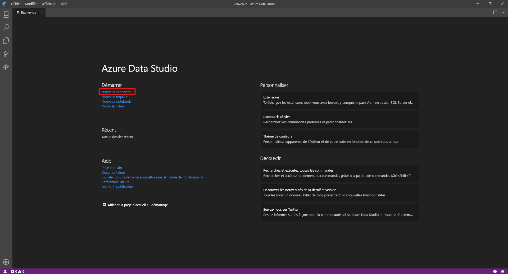
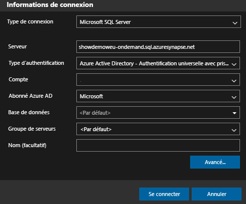
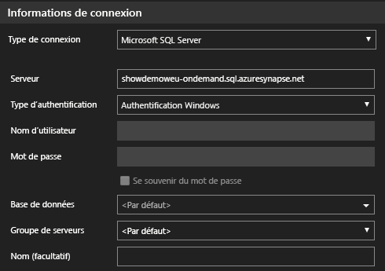
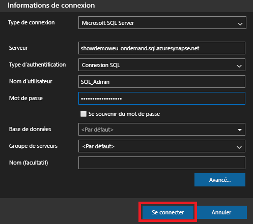
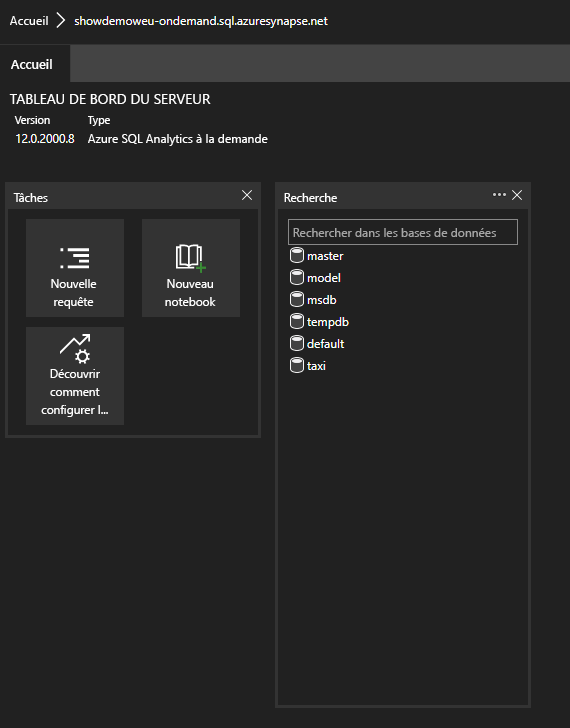
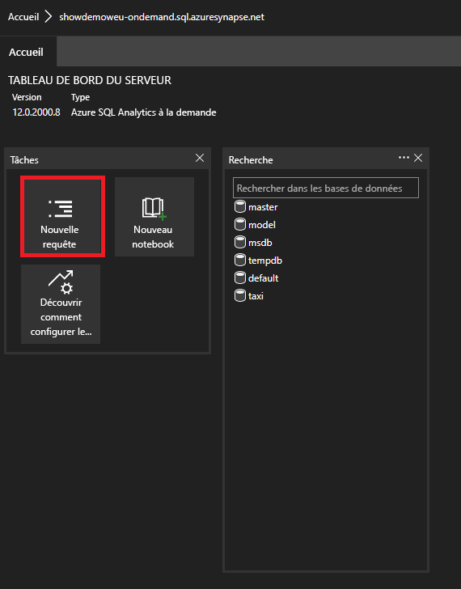

# <a name="connect-to-synapse-sql-with-azure-data-studio"></a>Se connecter à Synapse SQL avec Azure Data Studio

> [!div class="op_single_selector"]
>
> * [Azure Data Studio](get-started-azure-data-studio.md)
> * [Power BI](get-started-power-bi-professional.md)
> * [Visual Studio](../sql/get-started-visual-studio.md)
> * [sqlcmd](get-started-connect-sqlcmd.md)
> * [SSMS](get-started-ssms.md)

Vous pouvez utiliser [Azure Data Studio](/sql/azure-data-studio/download-azure-data-studio?view=azure-sqldw-latest&preserve-view=true) pour vous connecter à Synapse SQL dans Azure Synapse Analytics et l’interroger. 

## <a name="connect"></a>Se connecter

Pour vous connecter à Synapse SQL, ouvrez Azure Data Studio et sélectionnez **Nouvelle connexion**.



Choisissez **Microsoft SQL Server** comme **Type de connexion**.

La connexion nécessite les paramètres suivants :

* **Serveur :** Serveur sous la forme `<Azure Synapse workspace name>`-ondemand.sql.azuresynapse.net
* **Base de données :** Nom de la base de données

> [!NOTE]
> Si vous souhaitez utiliser le **pool SQL serverless**, l’URL doit se présenter de la façon suivante :
>
> - `<Azure Synapse workspace name>`-ondemand.sql.azuresynapse.net.
>
> Si vous souhaitez utiliser un **pool SQL dédié**, l’URL doit se présenter comme suit :
>
> - `<Azure Synapse workspace name>`.sql.azuresynapse.net

Choisissez **Authentification Windows**, **Azure Active Directory** ou **Connexion SQL** comme **Type d’authentification**.

Pour utiliser **Connexion SQL** en tant que type d’authentification, ajoutez les paramètres de nom d’utilisateur/mot de passe :

* **Utilisateur :** Utilisateur du serveur sous la forme `<User>`
* **Mot de passe :** Mot de passe associé à l’utilisateur

Pour utiliser Azure Active Directory, vous devez choisir le type d’authentification voulu.



La capture d’écran suivante montre les **Détails de la connexion** pour l’**Authentification Windows** :



La capture d’écran suivante montre les **Détails de la connexion** lors de l’utilisation d’une **Connexion SQL** :



Une fois la connexion établie, vous devez afficher un tableau de bord comme celui-ci : 

## <a name="query"></a>Requête

Une fois connecté, vous pouvez interroger Synapse SQL à l’aide des instructions [Transact-SQL (T-SQL)](/sql/t-sql/language-reference?view=azure-sqldw-latest&preserve-view=true) prises en charge sur l’instance. Sélectionnez **Nouvelle requête** à partir de l’affichage du tableau de bord pour commencer.



Par exemple, vous pouvez utiliser l’instruction Transact-SQL suivante pour [interroger des fichiers Parquet](query-parquet-files.md) en utilisant un pool SQL serverless :

```sql
SELECT COUNT(*)
FROM  
OPENROWSET(
    BULK 'https://azureopendatastorage.blob.core.windows.net/censusdatacontainer/release/us_population_county/year=20*/*.parquet',
    FORMAT='PARQUET'
)
```
## <a name="next-steps"></a>Étapes suivantes 
Explorer d’autres façons de se connecter à Synapse SQL : 

- [SSMS](get-started-ssms.md)
- [Power BI](get-started-power-bi-professional.md)
- [Visual Studio](..//sql/get-started-visual-studio.md)
- [sqlcmd](get-started-connect-sqlcmd.md)

Pour plus d’informations, consultez [Connexion et interrogation de données avec Azure Data Studio à l’aide d’un pool SQL dédié dans Azure Synapse Analytics](/sql/azure-data-studio/quickstart-sql-dw).
