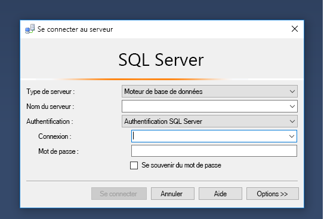
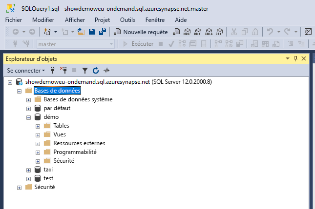
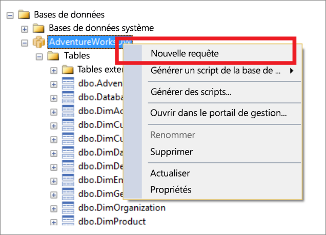
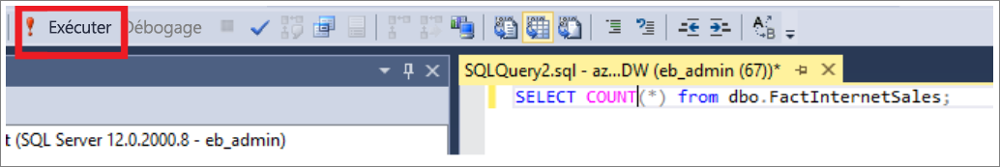
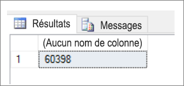
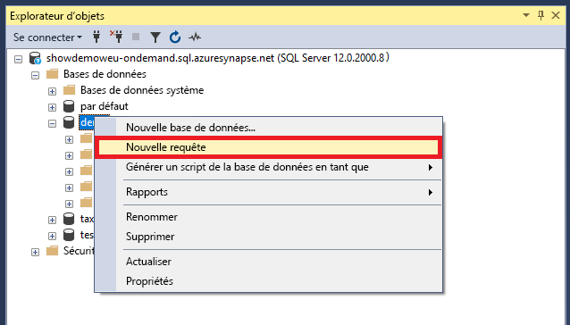
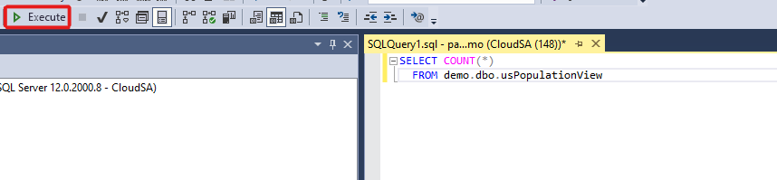
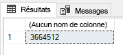

# <a name="connect-to-synapse-sql-with-sql-server-management-studio-ssms"></a>Se connecter à Synapse SQL avec SQL Server Management Studio (SSMS)
> [!div class="op_single_selector"]
> * [Azure Data Studio](get-started-azure-data-studio.md)
> * [Power BI](get-started-power-bi-professional.md)
> * [Visual Studio](../sql-data-warehouse/sql-data-warehouse-query-visual-studio.md?toc=/azure/synapse-analytics/toc.json&bc=/azure/synapse-analytics/breadcrumb/toc.json)
> * [sqlcmd](../sql/get-started-connect-sqlcmd.md)
> * [SSMS](get-started-ssms.md)
> 
> 

Vous pouvez utiliser [SQL Server Management Studio (SSMS)](/sql/ssms/download-sql-server-management-studio-ssms) pour vous connecter à Synapse SQL et l’interroger dans Azure Synapse Analytics via le pool SQL serverless ou des ressources du pool SQL dédié. 

### <a name="supported-tools-for-serverless-sql-pool"></a>Outils pris en charge pour le pool SQL serverless

[Azure Data Studio](/sql/azure-data-studio/download-azure-data-studio) est entièrement pris en charge à compter de la version 1.18.0. SSMS est partiellement pris en charge à partir de la version 18.5 ; vous pouvez l’utiliser pour vous connecter et interroger uniquement.

> [!NOTE]
> Si une connexion AAD a une connexion ouverte pendant plus d’une heure au moment de l’exécution de la requête, toute requête qui s’appuie sur AAD échoue. Cela comprend l’interrogation du stockage à l’aide du transfert AAD et d’instructions qui interagissent avec AAD (par exemple, CREATE EXTERNAL PROVIDER). Cela affecte tous les outils qui maintiennent la connexion ouverte, comme dans l’éditeur de requête de SSMS et ADS. Les outils qui ouvrent de nouvelles connexions pour exécuter une requête ne sont pas affectés, par exemple Synapse Studio.
> Vous pouvez redémarrer SSMS ou vous connecter et vous déconnecter dans ADS pour atténuer ce problème. .
## <a name="prerequisites"></a>Prérequis

Avant de commencer, vérifiez que les conditions préalables suivantes sont remplies :  

* [SQL Server Management Studio (SSMS)](/sql/ssms/download-sql-server-management-studio-ssms). 
* Pour le pool SQL dédié, vous avez besoin d’un entrepôt de données existant. Pour en créer un, consultez [Créer un pool SQL dédié](../quickstart-create-sql-pool-portal.md). Pour le pool SQL serverless, il en est déjà provisionné un sous le nom de « Built-in » dans votre espace de travail au moment de la création. 
* Le nom complet du serveur SQL Server. Pour trouver ce nom, consultez [Se connecter à Synapse SQL](connect-overview.md).

## <a name="connect"></a>Se connecter

### <a name="dedicated-sql-pool"></a>Pool SQL dédié

Pour vous connecter à Synapse SQL en utilisant un pool SQL dédié, suivez ces étapes : 

1. Ouvrez SQL Server Management Studio (SSMS). 
1. Dans la boîte de dialogue **Se connecter au serveur**, renseignez les champs et sélectionnez **Se connecter** : 
  
    
   
   * **Nom du serveur** : Saisissez le **nom du serveur** précédemment identifié.
   * **Authentification** :  Choisissez un type d’authentification, tel que **Authentification SQL Server** ou **Authentification intégrée à Active Directory**.
   * **Nom d’utilisateur** et **Mot de passe** : Entrez votre nom d’utilisateur et votre mot de passe si l’authentification SQL Server a été sélectionnée plus haut.

1. Développez votre serveur Azure SQL Server dans l’**Explorateur d’objets**. Vous pouvez afficher les bases de données associées au serveur, telles que l’exemple de base de données AdventureWorksDW. Vous pouvez développer la base de données pour afficher les tables :
   
    


### <a name="serverless-sql-pool"></a>Pool SQL serverless

Pour vous connecter à Synapse SQL en utilisant un pool SQL serverless, suivez ces étapes : 

1. Ouvrez SQL Server Management Studio (SSMS).
1. Dans la boîte de dialogue **Se connecter au serveur**, renseignez les champs et sélectionnez **Se connecter** : 
   
    
   
   * **Nom du serveur** : Saisissez le **nom du serveur** précédemment identifié.
   * **Authentification** : Choisissez un type d’authentification, tel que **Authentification SQL Server** ou **Authentification intégrée à Active Directory** :
   * **Nom d’utilisateur** et **Mot de passe** : Entrez votre nom d’utilisateur et votre mot de passe si l’authentification SQL Server a été sélectionnée plus haut.
   * Sélectionnez **Connecter**.

4. Pour voir plus d’informations, développez votre serveur SQL Azure. Vous pouvez afficher les bases de données associées au serveur. Développez la *démonstration* pour voir le contenu dans votre exemple de base de données.
   
    


## <a name="run-a-sample-query"></a>Exécuter un exemple de requête

### <a name="dedicated-sql-pool"></a>Pool SQL dédié

À présent qu’une connexion de base de données a été établie, vous pouvez interroger les données.

1. Cliquez avec le bouton droit sur votre base de données dans l’Explorateur d’objets SQL Server.
2. Sélectionnez **Nouvelle requête**. Une nouvelle fenêtre de requête s’ouvre.
   
    
3. Copiez la requête T-SQL suivante dans la fenêtre de requête :
   
    ```sql
    SELECT COUNT(*) FROM dbo.FactInternetSales;
    ```
4. Exécutez la requête en sélectionnant `Execute` ou utilisez le raccourci : `F5`.
   
    
5. Passez en revue les résultats de la requête. Dans l’exemple suivant, la table FactInternetSales contient 60 398 lignes.
   
    

### <a name="serverless-sql-pool"></a>Pool SQL serverless

À présent que vous avez établi une connexion de base de données, vous pouvez interroger les données.

1. Cliquez avec le bouton droit sur votre base de données dans l’Explorateur d’objets SQL Server.
2. Sélectionnez **Nouvelle requête**. Une nouvelle fenêtre de requête s’ouvre.
   
    
3. Copiez la requête T-SQL suivante dans la fenêtre de requête :
   
    ```sql
    SELECT COUNT(*) FROM demo.dbo.usPopulationView
    ```
4. Exécutez la requête en sélectionnant `Execute` ou utilisez le raccourci : `F5`.
   
    
5. Passez en revue les résultats de la requête. Dans cet exemple, la vue usPopulationView contient 3664512 lignes.
   
    

## <a name="next-steps"></a>Étapes suivantes
Maintenant que vous pouvez vous connecter et exécuter des requêtes, essayez de [visualiser les données avec Power BI](get-started-power-bi-professional.md).

Afin de configurer votre environnement pour l’authentification Azure Active Directory, consultez [S’authentifier auprès de Synapse SQL](../sql-data-warehouse/sql-data-warehouse-authentication.md?toc=/azure/synapse-analytics/toc.json&bc=/azure/synapse-analytics/breadcrumb/toc.json).

