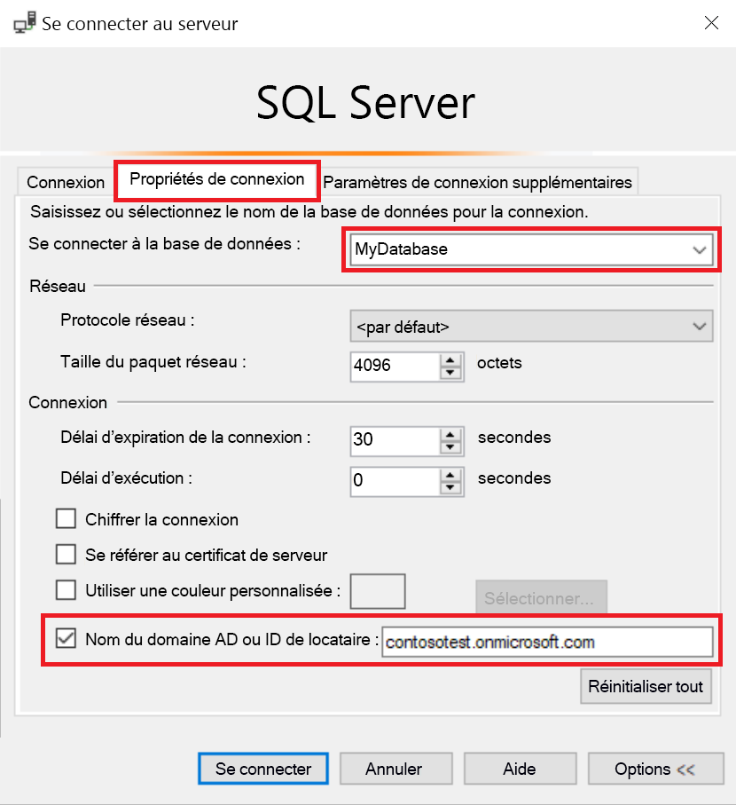
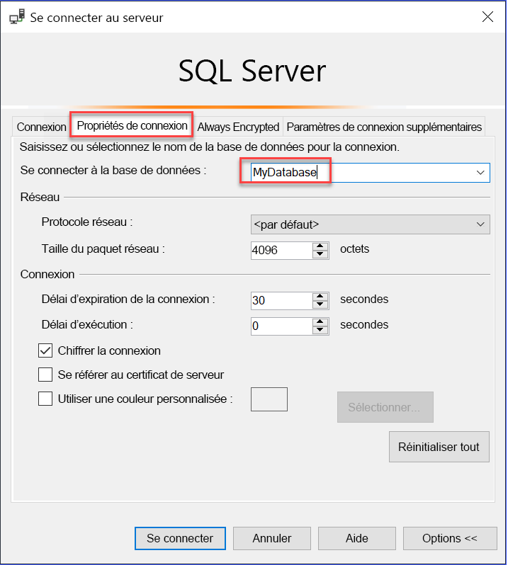

# Utiliser l’authentification multifacteur AAD avec Synapse SQL (prise en charge de SSMS pour MFA)

Synapse SQL prend en charge les connexions depuis SQL Server Management Studio (SSMS) au moyen de l’*authentification universelle Active Directory*. 

Cet article décrit les différences entre les différentes options d’authentification, ainsi que les limitations associées à l’utilisation de l’authentification universelle. 

**Télécharger la dernière version de SSMS** : sur l’ordinateur client, téléchargez la dernière version de SSMS à partir de la page [Télécharger SQL Server Management Studio (SSMS)](/sql/ssms/download-sql-server-management-studio-ssms?view=azure-sqldw-latest&preserve-view=true).

Pour toutes les fonctionnalités abordées dans cet article, utilisez au minimum la version 17.2 (juillet 2017).  La boîte de dialogue de connexion la plus récente doit ressembler à l’image suivante :

  

## Les cinq options d’authentification  

L’authentification universelle Active Directory prend en charge les deux méthodes d’authentification non interactives :
    - l’authentification `Active Directory - Password`
    - l’authentification `Active Directory - Integrated`

Il existe deux méthodes d’authentification non interactives, qui peuvent être utilisées dans de nombreuses applications (ADO.NET, JDBC, ODBC, etc.). Ces deux méthodes n’entraînent jamais l’affichage de boîtes de dialogue contextuelles :

- `Active Directory - Password`
- `Active Directory - Integrated`

La méthode interactive qui prend également en charge l’authentification multifacteur (MFA) Azure AD est la suivante :

- `Active Directory - Universal with MFA`

L’authentification multifacteur (MFA) Azure AD contribue à sécuriser l’accès aux données et aux applications tout en répondant à la demande des utilisateurs souhaitant un processus de connexion simple. Il assure une authentification forte avec une gamme d’options de vérification simples (appel téléphonique, SMS, cartes à puce avec code PIN ou notification d’application mobile) pour permettre aux utilisateurs de choisir leur méthode préférée. L’authentification multifacteur (MFA) interactive avec Azure AD peut afficher une boîte de dialogue contextuelle de validation.

Pour une description de Multi-Factor Authentication, consultez la rubrique [Multi-Factor Authentication](../../active-directory/authentication//concept-mfa-howitworks.md).

### Nom de domaine Azure AD et paramètre d’ID de locataire

À partir de [la version 17 de SSMS](/sql/ssms/download-sql-server-management-studio-ssms?view=azure-sqldw-latest&preserve-view=true), les utilisateurs qui sont importés dans le répertoire Active Directory en cours à partir d’autres répertoires Azure Active Directory en tant qu’utilisateurs invités peuvent fournir le nom de domaine Azure AD ou l’ID de locataire quand ils se connectent. 

Les utilisateurs invités incluent les utilisateurs qui sont invités à partir d’autres annuaires Azure AD, de comptes Microsoft, tels qu’outlook.com, hotmail.com et live.com, ou d’autres comptes, comme gmail.com. Grâce à ces informations, **l’authentification universelle Active Directory avec MFA** peut identifier l’autorité d’authentification appropriée. Cette option est également requise pour prendre en charge les comptes Microsoft (MSA) tels qu’outlook.com, hotmail.com, live.com, ou les comptes non-MSA. 

Les utilisateurs qui souhaitent être authentifiés à l’aide de l’authentification universelle doivent entrer leur nom de domaine Azure AD ou leur ID de locataire. Ce paramètre représente le nom de domaine/ID de locataire Azure AD lié au serveur Azure. 

Par exemple, si le serveur Azure est associé au domaine Azure AD `contosotest.onmicrosoft.com` où l’utilisateur `joe@contosodev.onmicrosoft.com` est hébergé en tant qu’utilisateur importé du domaine Azure AD `contosodev.onmicrosoft.com`, le nom de domaine requis pour authentifier cet utilisateur est `contosotest.onmicrosoft.com`. 

Lorsque l’utilisateur est un utilisateur natif d’Azure AD lié au serveur Azure et qu’il n’a pas de compte MSA, aucun nom de domaine ou ID de locataire n’est requis. 

Pour entrer le paramètre (à compter de SSMS version 17.2), dans la boîte de dialogue **Connexion à une base de données**, sélectionnez **Active Directory - Authentification universelle avec MFA**, sélectionnez **Options**, renseignez la zone **Nom d’utilisateur**, puis sélectionnez l’onglet **Propriétés de connexion**. 

Cochez la case **Nom du domaine AD ou ID de locataire** et fournissez l’autorité d’authentification, telle que le nom de domaine (**contosotest.onmicrosoft.com**) ou le GUID de l’ID de locataire.  

   

Si vous exécutez SSMS 18.x ou une version ultérieure, le nom de domaine AD ou l’ID de locataire n’est plus nécessaire pour les utilisateurs invités, car la version 18.x ou ultérieure le reconnaît automatiquement.

   

### Prise en charge d’Azure AD B2B   
Les utilisateurs Azure AD pris en charge pour les scénarios d’Azure AD B2B en tant qu’utilisateurs invités (consultez [Qu’est-ce qu’Azure AD B2B Collaboration ?](../../active-directory/external-identities/what-is-b2b.md?bc=%2fazure%2fsynapse-analytics%2fbreadcrumb%2ftoc.json&toc=%2fazure%2fsynapse-analytics%2ftoc.json)) ne peuvent se connecter à Synapse SQL qu’en tant que membres d’un groupe créé dans Azure AD et mappé manuellement à l’aide de l’instruction Transact-SQL `CREATE USER` dans une base de données spécifique. 

Par exemple, si `steve@gmail.com` est invité à Azure AD `contosotest` (avec le domaine Azure AD `contosotest.onmicrosoft.com`), un groupe Azure AD, tel que `usergroup`, doit être créé dans l’annuaire Azure AD qui contient le membre `steve@gmail.com`. Ensuite, l’administrateur Azure AD SQL ou le propriétaire de la base de données Azure AD doit créer ce groupe pour une base de données spécifique (MyDatabase) en exécutant une instruction Transact-SQL `CREATE USER [usergroup] FROM EXTERNAL PROVIDER`. 

Une fois l’utilisateur de base de données créé, l’utilisateur `steve@gmail.com` peut se connecter `MyDatabase` à l’aide de l’option d’authentification SSMS `Active Directory – Universal with MFA support`. 

Par défaut, le groupe d’utilisateurs bénéficie uniquement de l’autorisation de connexion et de tout accès aux données accordé de façon habituelle. 

En tant qu’utilisateur invité, `steve@gmail.com` doit cocher la case et ajouter le nom de domaine AD `contosotest.onmicrosoft.com` à la boîte de dialogue **Propriété de connexion** SSMS. L’option **Nom du domaine AD ou ID de locataire** est uniquement prise en charge pour les options Authentification universelle avec prise en charge de MFA ; dans le cas contraire, elle est grisée.

## Limites de l’authentification universelle pour Synapse SQL

- SSMS et SqlPackage.exe sont les seuls outils activés pour MFA par le biais de l’authentification universelle Active Directory.
- SSMS version 17.2 prend en charge l’accès simultané de plusieurs utilisateurs à l’aide de l’authentification universelle avec MFA. Les versions 17.0 et 17.1 limitaient à un seul compte Azure Active Directory la connexion à une instance de SSMS à l’aide de l’authentification universelle. Pour vous connecter comme un autre compte Azure AD, vous devez utiliser une autre instance de SSMS. (Cette restriction est limitée à l’authentification universelle Active Directory. Vous pouvez vous connecter à différents serveurs à l’aide de l’authentification de mot de passe Active Directory, l’authentification intégrée à Active Directory ou l’authentification SQL Server).
- SSMS prend en charge l’authentification universelle Active Directory pour la visualisation de l’Explorateur d’objets, de l’Éditeur de requête et du magasin de requêtes.
- SSMS version 17.2 fournit une prise en charge de l’Assistant DacFx pour l’exportation, l’extraction et le déploiement de la base de données. Une fois qu’un utilisateur spécifique est authentifié via la boîte de dialogue d’authentification initiale à l’aide de l’authentification universelle, l’Assistant DacFx fonctionne de la même manière que pour toutes les autres méthodes d’authentification.
- Le Concepteur de tables SSMS ne prend pas en charge l’authentification universelle.
- Il n’existe aucune configuration logicielle supplémentaire nécessaire pour l’authentification universelle Active Directory, sauf que vous devez utiliser une version prise en charge de SSMS.  
- La version ADAL (Active Directory Authentication Library) pour l’authentification universelle a été mise à jour vers la dernière version publiée disponible ADAL.dll 3.13.9. Consultez [Active Directory Authentication Library 3.14.1](https://www.nuget.org/packages/Microsoft.IdentityModel.Clients.ActiveDirectory/).  

## Étapes suivantes
Pour plus d’informations, consultez l’article [Se connecter à Synapse SQL avec SQL Server Management Studio](get-started-ssms.md).