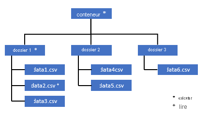
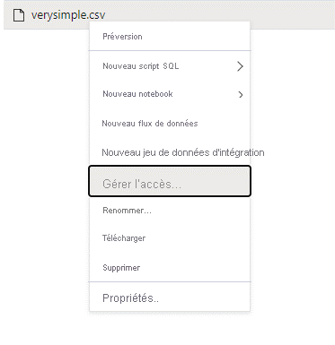
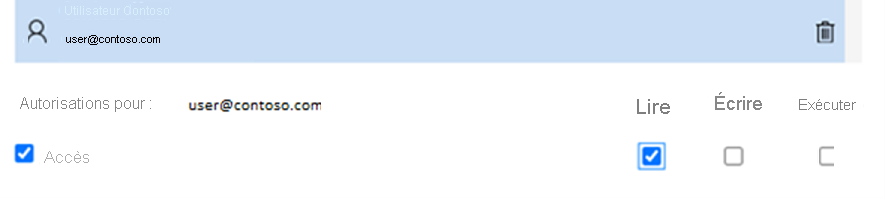

# <a name="self-help-for-serverless-sql-pool"></a>Aide autonome pour le pool SQL serverless

Cet article contient des informations sur la façon de résoudre les problèmes les plus fréquents concernant le pool SQL serverless dans Azure Synapse Analytics.

## <a name="synapse-studio"></a>Synapse Studio

### <a name="serverless-sql-pool-is-grayed-out-in-synapse-studio"></a>Le pool SQL serverless apparaît en grisé dans Synapse Studio

Si Synapse Studio ne peut pas établir de connexion au pool SQL serverless, vous voyez que le pool SQL serverless apparaît en grisé ou que son état est « Hors connexion ». En règle générale, ce problème se produit quand l’un des cas suivants se produit :

1) Votre réseau empêche la communication avec le back-end Azure Synapse. Le cas le plus fréquent est que le port 1443 est bloqué. Pour que le pool SQL serverless fonctionne, débloquez ce port. D’autres problèmes peuvent également empêcher le fonctionnement du pool SQL serverless. Pour plus d’informations, consultez le [guide de dépannage complet](../troubleshoot/troubleshoot-synapse-studio.md).
2) Vous n’avez pas les autorisations nécessaires pour vous connecter au pool SQL serverless. Pour obtenir l’accès, l’un des administrateurs de l’espace de travail Azure Synapse doit vous ajouter comme administrateur de l’espace de travail ou vous attribuer le rôle Administrateur SQL. [Pour plus d’informations, consultez le guide complet sur le contrôle d’accès](../security/synapse-workspace-access-control-overview.md).

### <a name="query-fails-with-error-websocket-connection-was-closed-unexpectedly"></a>La requête échoue avec une erreur : la connexion WebSocket a été fermée de manière inattendue.

Si votre requête échoue avec le message d’erreur suivant : « La connexion WebSocket a été fermée de manière inattendue », cela signifie que la connexion de votre navigateur à Synapse Studio a été interrompue, par exemple en raison d’un problème réseau. 

Pour résoudre ce problème, réexécutez cette requête. Si ce message s’affiche souvent dans votre environnement, demandez de l’aide à votre administrateur réseau, vérifiez les paramètres du pare-feu et [consultez ce guide de résolution des problèmes pour plus d’informations](../troubleshoot/troubleshoot-synapse-studio.md). 

Si le problème persiste, créez un [ticket de support](../../azure-portal/supportability/how-to-create-azure-support-request.md) via le portail Azure et essayez [Azure Data Studio](/sql/azure-data-studio/download-azure-data-studio) ou [SQL Server Management Studio](/sql/ssms/download-sql-server-management-studio-ssms) pour les mêmes requêtes au lieu de Synapse Studio pour approfondir les investigations.

## <a name="query-execution"></a>Exécution de la requête

### <a name="query-fails-because-file-cannot-be-opened"></a>La requête échoue car le fichier ne peut pas être ouvert

Si votre requête échoue avec une erreur indiquant que le fichier ne peut pas être ouvert parce qu’il n’existe pas ou qu’il est utilisé par un autre processus, et que vous êtes sûr que le fichier existe et qu’il n’est pas utilisé par un autre processus, cela signifie que le pool SQL serverless ne peut pas accéder au fichier. Ce problème se produit généralement lorsque votre identité Azure Active Directory ne dispose pas de droits d’accès au fichier ou qu’un pare-feu bloque l’accès au fichier. Par défaut, le pool SQL serverless tente d’accéder au fichier en utilisant votre identité Azure Active Directory. Pour résoudre ce problème, vous devez disposer des droits nécessaires pour accéder au fichier. Le moyen le plus simple consiste à vous accorder le rôle « Contributeur aux données Blob du stockage » pour le compte de stockage que vous tentez d’interroger. 
- [Pour plus d’informations, consultez le guide complet sur le contrôle d’accès Azure Active Directory pour le stockage](../../storage/blobs/assign-azure-role-data-access.md). 
- [Consultez Contrôler l’accès au compte de stockage pour le pool SQL serverless dans Azure Synapse Analytics](develop-storage-files-storage-access-control.md)

#### <a name="alternative-to-storage-blob-data-contributor-role"></a>Alternative au rôle Contributeur aux données Blob du stockage

Au lieu d’accorder le rôle Contributeur aux données Blob du stockage, vous pouvez également accorder des autorisations plus granulaires sur un sous-ensemble de fichiers. 

* Tous les utilisateurs qui doivent accéder à certaines données de ce conteneur doivent également avoir l’autorisation EXECUTE sur tous les dossiers parents jusqu’à la racine (le conteneur). En savoir plus sur la [définition des listes de contrôle d’accès dans Azure Data Lake Storage Gen2](../../storage/blobs/data-lake-storage-explorer-acl.md). 

> [!NOTE]
> L’autorisation Execute au niveau du conteneur doit être définie dans Azure Data Lake Gen2.
> Les autorisations sur le dossier peuvent être définies dans Azure Synapse. 


Si vous souhaitez interroger data2.csv dans cet exemple, les autorisations suivantes sont nécessaires : 
   - Autorisation Execute sur le conteneur
   - Autorisation Execute sur dossier1 
   - Autorisation de lecture sur data2.csv



* Connectez-vous à Azure Synapse avec un utilisateur administrateur disposant d’autorisations complètes sur les données auxquelles vous souhaitez accéder.

* Dans le volet des données, cliquez avec le bouton droit sur le fichier et sélectionnez GÉRER L'ACCÈS.



* Choisissez au moins l’autorisation « lecture », tapez le nom d'utilisateur principal ou l’ID d’objet de l’utilisateur, par exemple user@contoso.com, puis cliquez sur Ajouter

* Accordez une autorisation de lecture à cet utilisateur.


> [!NOTE]
> Pour les utilisateurs invités, cette opération doit être effectuée directement avec le service Azure Data Lake, car elle ne peut pas être effectuée directement par le biais d’Azure Synapse. 

### <a name="query-fails-because-it-cannot-be-executed-due-to-current-resource-constraints"></a>La requête échoue, car elle ne peut pas être exécutée en raison de contraintes de ressources 

Si votre requête échoue avec le message d’erreur « Cette requête ne peut pas être exécutée en raison de contraintes de ressources », cela signifie que le pool SQL serverless ne peut pas l’exécuter pour le moment en raison de contraintes de ressources : 

- Veillez à utiliser des types de données de taille raisonnable.  

- Si votre requête cible des fichiers Parquet, définissez des types explicites pour les colonnes de chaîne, car ils seront VARCHAR (8000) par défaut. [Vérifiez les types de données déduits](./best-practices-serverless-sql-pool.md#check-inferred-data-types).

- Si votre requête cible des fichiers CSV, envisagez de [créer des statistiques](develop-tables-statistics.md#statistics-in-serverless-sql-pool). 

- Pour optimiser les requêtes, consultez les [bonnes pratiques concernant les performances du pool SQL serverless](./best-practices-serverless-sql-pool.md).  

### <a name="could-not-allocate-tempdb-space-while-transferring-data-from-one-distribution-to-another"></a>Impossible d’allouer de l’espace tempdb lors du transfert de données d’une distribution à une autre

Cette erreur est un cas spécifique de l’erreur générique [La requête échoue, car elle ne peut pas être exécutée en raison de contraintes de ressources](#query-fails-because-it-cannot-be-executed-due-to-current-resource-constraints). Cette erreur est retournée quand les ressources allouées à la base de données `tempdb` sont insuffisantes pour exécuter la requête. 

Appliquez la même atténuation et les meilleures pratiques avant de soumettre un ticket de support.

### <a name="query-fails-with-error-while-handling-an-external-file"></a>La requête échoue avec une erreur lors de la gestion d’un fichier externe. 

Si votre requête échoue avec le message d’erreur « Erreur de gestion du fichier externe : nombre maximal d’erreurs atteint », cela signifie qu’il existe une incompatibilité entre un type de colonne spécifié et les données à charger. Pour obtenir plus d’informations sur l’erreur et les lignes et colonnes à examiner, remplacez la version de l’analyseur « 2.0 » par « 1.0 ». 

#### <a name="example"></a>Exemple
Si vous souhaitez interroger le fichier « names.csv » à l’aide de la requête 1, Azure Synapse SQL serverless retourne ce type d’erreur. 

names.csv
```csv
Id,first name, 
1,Adam
2,Bob
3,Charles
4,David
5,Eva
```

Requête 1 :
```sql
SELECT
    TOP 100 *
FROM
    OPENROWSET(
        BULK '[FILE-PATH OF CSV FILE]',
        FORMAT = 'CSV',
        PARSER_VERSION='2.0',
       FIELDTERMINATOR =';',
       FIRSTROW = 2
    ) 
    WITH (
    [ID] SMALLINT, 
    [Text] VARCHAR (1) COLLATE Latin1_General_BIN2 
)

    AS [result]
```
causes :

`Error handling external file: ‘Max error count reached’. File/External table name: [filepath].`

Dès que la version de l’analyseur passe de la version 2.0 à la version 1.0, les messages d’erreur permettent d’identifier le problème. Le nouveau message d’erreur est désormais : 

`Bulk load data conversion error (truncation) for row 1, column 2 (Text) in data file [filepath]`

La troncation nous indique que le type de colonne est trop petit pour contenir nos données. Le prénom le plus long dans ce fichier « names.csv » comporte sept caractères. Par conséquent, le type de données suivant à utiliser doit être au moins VARCHAR(7). L’erreur est provoquée par cette ligne de code : 

```sql 
    [Text] VARCHAR (1) COLLATE Latin1_General_BIN2
```
La modification de la requête résout l’erreur en conséquence : après le débogage, remplacez la version de l’analyseur par 2.0 pour obtenir des performances maximales. Pour en savoir plus sur le moment où utiliser la version de l’analyseur, cliquez [ici](develop-openrowset.md). 

```sql 
SELECT
    TOP 100 *
FROM
    OPENROWSET(
        BULK '[FILE-PATH OF CSV FILE]',
        FORMAT = 'CSV',
        PARSER_VERSION='2.0',
        FIELDTERMINATOR =';',
        FIRSTROW = 2
    ) 
    WITH (
    [ID] SMALLINT, 
    [Text] VARCHAR (7) COLLATE Latin1_General_BIN2 
)

    AS [result]
```

### <a name="query-fails-with-conversion-error"></a>Échec de la requête avec une erreur de conversion
Si votre requête échoue avec le message d’erreur « Erreur de conversion des données de chargement en masse (incompatibilité de type ou caractère non valide pour la page de codes spécifiée) pour la ligne n, colonne m [nom_colonne] dans le fichier de données [chemin_fichier] », cela signifie que vos types de données ne correspondent pas aux données réelles pour le numéro de ligne n et la colonne m. 

Par exemple, si vous prévoyez uniquement des entiers dans vos données, mais que dans la ligne n, il peut y avoir une chaîne, c’est le message d’erreur que vous obtiendrez. Pour résoudre ce problème, examinez le fichier et les types de données correspondants que vous avez choisis. Vérifiez également si vos paramètres de délimiteur de ligne et de marque de fin de champ sont corrects. L’exemple suivant montre comment l’inspection peut être effectuée à l’aide du type de colonne VARCHAR. Pour en savoir plus sur les marques de fin de champ, les délimiteurs de ligne et les guillemets d’échappement, cliquez [ici](query-single-csv-file.md). 

#### <a name="example"></a>Exemple 
Si vous souhaitez interroger le fichier « names.csv » à l’aide de la requête 1, Azure Synapse SQL serverless retourne ce type d’erreur. 

names.csv
```csv
Id, first name, 
1,Adam
2,Bob
3,Charles
4,David
five,Eva
```

Requête 1 :
```sql 
SELECT
    TOP 100 *
FROM
    OPENROWSET(
        BULK '[FILE-PATH OF CSV FILE]',
        FORMAT = 'CSV',
        PARSER_VERSION='1.0',
       FIELDTERMINATOR =',',
       FIRSTROW = 2
    ) 
    WITH (
    [ID] SMALLINT, 
    [Firstname] VARCHAR (25) COLLATE Latin1_General_BIN2 
)

    AS [result]
```

cause de cette erreur : `Bulk load data conversion error (type mismatch or invalid character for the specified codepage) for row 6, column 1 (ID) in data file [filepath]`

Il est nécessaire de parcourir les données et de prendre une décision en toute connaissance de cause pour gérer ce problème. Avant d’examiner les données à l’origine de ce problème, vous devez modifier le type de données. Au lieu d’interroger la colonne « ID » avec le type de données « SMALLINT », VARCHAR(100) est maintenant utilisé pour analyser ce problème. Si vous utilisez cette requête 2 légèrement modifiée, vous pouvez maintenant traiter les données et afficher la liste des noms. 

Requête 2 : 
```sql
SELECT
    TOP 100 *
FROM
    OPENROWSET(
        BULK '[FILE-PATH OF CSV FILE]',
        FORMAT = 'CSV',
        PARSER_VERSION='1.0',
       FIELDTERMINATOR =',',
       FIRSTROW = 2
    ) 
    WITH (
    [ID] VARCHAR(100), 
    [Firstname] VARCHAR (25) COLLATE Latin1_General_BIN2 
)

    AS [result]
```

names.csv
```csv
Id, first name, 
1,Adam
2,Bob
3,Charles
4,David
five,Eva
```

Il semble que les données comportent des valeurs inattendues pour l’ID dans la cinquième ligne. Dans ce cas, il est important de s’accorder avec le propriétaire de l’entreprise des données sur la manière d’éviter les données endommagées comme celles-ci. Si la prévention n’est pas possible au niveau de l’application et si la gestion de tous les types de données pour l’ID doit être effectuée, une taille raisonnable pour VARCHAR peut être la seule option ici.

> [!Tip]
> Essayez de raccourcir VARCHAR() autant que possible. Évitez VARCHAR(MAX) si possible, car cela peut nuire aux performances. 

### <a name="the-result-table-does-not-look-like-expected-result-columns-are-empty-or-unexpected-loaded"></a>La table des résultats ne ressemble pas à ce qui est attendu. Les colonnes de résultat sont vides ou sont chargées de manière inattendue. 

Si votre requête n’échoue pas, mais que vous constatez que votre table de résultats n’est pas chargée comme prévu, il est probable que le délimiteur de ligne ou que la marque de fin de champ choisie soit incorrecte. Pour résoudre ce problème, il est nécessaire de réexaminer les données et de modifier ces paramètres. Une table de résultats étant affichée, il est aisé de déboguer cette requête, comme dans l’exemple qui suit. 

#### <a name="example"></a>Exemple
Si vous souhaitez interroger le fichier « names.csv » à l’aide de cette requête 1, Azure Synapse SQL serverless retourne la table de résultats qui semble étrange. 

names.csv
```csv
Id,first name, 
1,Adam
2,Bob
3,Charles
4,David
5,Eva
```

```sql
SELECT
    TOP 100 *
FROM
    OPENROWSET(
        BULK '[FILE-PATH OF CSV FILE]',
        FORMAT = 'CSV',
        PARSER_VERSION='1.0',
       FIELDTERMINATOR =';',
       FIRSTROW = 2
    ) 
    WITH (
    [ID] VARCHAR(100), 
    [Firstname] VARCHAR (25) COLLATE Latin1_General_BIN2 
)

    AS [result]
```

provoque cette table de résultats

| id            |   firstname   | 
| ------------- |-------------  | 
| 1,Adam        | NULL | 
| 2,Bob         | NULL | 
| 3,Charles     | NULL | 
| 4,David       | NULL | 
| 5,Eva         | NULL | 

Notre colonne « FirstName » semble ne contenir aucune valeur. Au lieu de cela, toutes les valeurs finissent par se retrouver dans la colonne « ID ». Ces valeurs sont séparées par une virgule. Le problème est dû à cette ligne de code, car il est nécessaire de choisir la virgule au lieu du symbole de point-virgule comme marque de fin de champ :

```sql
FIELDTERMINATOR =';',
```

Pour résoudre le problème, il suffit de modifier ce caractère unique :

```sql
FIELDTERMINATOR =',',
```

La table de résultats créée par la requête 2 se présente maintenant comme prévu. 

Requête 2 :
```sql
SELECT
    TOP 100 *
FROM
    OPENROWSET(
        BULK '[FILE-PATH OF CSV FILE]',
        FORMAT = 'CSV',
        PARSER_VERSION='1.0',
       FIELDTERMINATOR =',',
       FIRSTROW = 2
    ) 
    WITH (
    [ID] VARCHAR(100), 
    [Firstname] VARCHAR (25) COLLATE Latin1_General_BIN2 
)

    AS [result]
``` 

retourne

| id            |   firstname   | 
| ------------- |-------------  | 
| 1        | Adam | 
| 2         | Bob | 
| 3     | Charles | 
| 4       | David | 
| 5         | Eva | 


### <a name="query-fails-with-error-column-column-name-of-type-type-name-is--not-compatible-with-external-data-type-external-data-type-name"></a>La requête échoue avec l’erreur : La colonne [nom_colonne] de type [nom_type] n’est pas compatible avec le type de données externe [nom_type_données_externes] 

Si votre requête échoue avec le message d’erreur « La colonne [nom_colonne] de type [nom_type] n’est pas compatible avec le type de données externe [...] », il est probable que vous essayiez de mapper un type de données PARQUET au type de données SQL incorrect. Par exemple, si votre fichier Parquet contient une colonne de prix avec des nombres à virgule flottante (par exemple, 12,89) et que vous avez essayé de les mapper à INT, il s’agit du message d’erreur que vous obtiendrez. 

Pour résoudre ce problème, examinez le fichier et les types de données correspondants que vous avez choisis. Cette [table de mappage](develop-openrowset.md#type-mapping-for-parquet) permet de choisir un type de données SQL. Conseil de meilleure pratique : ne spécifiez le mappage que pour les colonnes qui pourraient résoudre le type de données VARCHAR. Si c’est possible, éviter VARCHAR permet d’améliorer les performances des requêtes. 

#### <a name="example"></a>Exemple
Si vous souhaitez interroger le fichier « taxi-data.parquet » à l’aide de cette requête 1, Azure Synapse SQL serverless retourne ce type d’erreur.

taxi-data.parquet :

|PassengerCount |SumTripDistance|AvgTripDistance |
|---------------|---------------|----------------|
| 1 | 2 635 668,66000064 | 6,72731710678951 |
| 2 | 172 174,330000005 | 2,97915543404919 |
| 3 | 296 384,390000011 | 2,8991352022851  |
| 4 | 12 544 348,58999806| 6,30581582240281 |
| 5 | 13 091 570,2799993 | 111,065989028627 |

Requête 1 :
```sql
SELECT
    *
FROM
    OPENROWSET(
        BULK '<filepath>taxi-data.parquet',
        FORMAT='PARQUET'
    )  WITh
        (
        PassengerCount INT, 
        SumTripDistance INT, 
        AVGTripDistance FLOAT
        )

    AS [result]
```

cause de cette erreur : 

`Column 'SumTripDistance' of type 'INT' is not compatible with external data type 'Parquet physical type: DOUBLE', please try with 'FLOAT'. File/External table name: '<filepath>taxi-data.parquet'.`

Ce message d’erreur indique que les types de données ne sont pas compatibles et s’accompagne déjà de la suggestion d’utiliser FLOAT au lieu de INT. L’erreur est donc provoquée par cette ligne de code : 

```sql
SumTripDistance INT, 
```

Si vous utilisez cette requête 2 légèrement modifiée, vous pouvez maintenant traiter les données et afficher les trois colonnes. 

Requête 2 : 
```sql
SELECT
    *
FROM
    OPENROWSET(
        BULK '<filepath>taxi-data.parquet',
        FORMAT='PARQUET'
    )  WITh
        (
        PassengerCount INT, 
        SumTripDistance FLOAT, 
        AVGTripDistance FLOAT
        )

    AS [result]
```

### <a name="incorrect-syntax-near-not"></a>Syntaxe incorrecte près de 'NOT'

Cette erreur indique qu’il existe des tables externes avec des colonnes contenant la contrainte `NOT NULL` dans la définition de colonne. Mettez à jour la table pour supprimer `NOT NULL` de la définition de colonne.

## <a name="configuration"></a>Configuration

### <a name="query-fails-with-please-create-a-master-key-in-the-database-or-open-the-master-key-in-the-session-before-performing-this-operation"></a>La requête échoue avec le message : Créez une clé principale dans la base de données ou ouvrez la clé principale dans la session avant d’effectuer cette opération.

Si votre requête échoue avec le message d’erreur « Créez une clé principale dans la base de données ou ouvrez la clé principale dans la session avant d’effectuer cette opération », cela signifie que votre base de données utilisateur n’a actuellement pas accès à une clé principale. 

Il est très probable que vous venez de créer une base de données utilisateur et que vous n’avez pas encore créé de clé principale. 

Pour résoudre ce problème, créez une clé principale avec la requête suivante :

```sql
CREATE MASTER KEY [ ENCRYPTION BY PASSWORD ='password' ];
```

> [!NOTE]
> Remplacez « Password » par un autre secret ici. 

### <a name="create-statement-is-not-supported-in-master-database"></a>L’instruction CREATE STATEMENT n'est pas prise en charge dans la base de données MASTER

Si votre requête échoue avec le message d’erreur :

> L'exécution de la requête a échoué. Erreur : CREATE EXTERNAL TABLE/DATA SOURCE/DATABASE SCOPED CREDENTIAL/FILE FORMAT is not supported in master database.' (Instruction CREATE EXTERNAL TABLE/DATA SOURCE/DATABASE SCOPED CREDENTIAL/FILE FORMAT non prise en charge dans la base de données master). 

Cela signifie que la base de données master dans le pool SQL serverless ne prend pas en charge la création des éléments suivants :
  - Tables externes
  - Sources de données externes
  - Informations d'identification limitées à la base de données
  - Formats de fichier externe

Solution :

  1. Créer une base de données utilisateur :

```sql
CREATE DATABASE <DATABASE_NAME>
```

  2. Exécutez l’instruction CREATE dans le contexte de <DATABASE_NAME> qui a échoué précédemment pour la base de données master. 
  
  Exemple pour la création d’un format de fichier externe :
    
```sql
USE <DATABASE_NAME>
CREATE EXTERNAL FILE FORMAT [SynapseParquetFormat] 
WITH ( FORMAT_TYPE = PARQUET)
```

### <a name="operation-is-not-allowed-for-a-replicated-database"></a>L'opération n'est pas autorisée pour une base de données répliquée.
   
Si vous essayez de créer des objets SQL, des utilisateurs ou des autorisations de modification dans une base de données, vous pouvez obtenir des erreurs, telles que « L’opération CREATE USER n’est pas autorisée pour une base de données répliquée ». Cette erreur est retournée lorsque vous essayez de créer des objets dans une base de données [partagée avec le pool Spark](../metadata/database.md). Les bases de données répliquées à partir de pools Apache Spark sont en lecture seule. Vous ne pouvez pas créer d’objets dans une base de données répliquée à l’aide de T-SQL.

Créez une base de données distincte et référencez les [tables](../metadata/table.md) synchronisées à l’aide de noms en 3 parties et de requêtes de bases de données croisées.

## <a name="cosmos-db"></a>Cosmos DB

Les erreurs possibles et les actions de résolution des problèmes sont répertoriées dans le tableau suivant.

| Erreur | Cause racine |
| --- | --- |
| Erreurs de syntaxe :<br/> - Syntaxe incorrecte près de `Openrowset`<br/> -  `...` n’est pas une option reconnue de fournisseur de `BULK OPENROWSET`.<br/> - Syntaxe incorrecte près de `...` | Causes principales possibles :<br/> - N’utilise pas CosmosDB comme premier paramètre,<br/> - Utilise un littéral de chaîne au lieu d’un identificateur dans le troisième paramètre,<br/> - Ne spécifie pas le troisième paramètre (nom de conteneur). |
| Une erreur s’est produite dans la chaîne de connexion CosmosDB. | -Le compte, la base de données ou la clé n’est pas spécifié(e), <br/> - Une option dans une chaîne de connexion n’est pas reconnue,<br/> - Un point-virgule `;` est placé à la fin d’une chaîne de connexion. |
| La résolution du chemin d’accès CosmosDB a échoué avec l’erreur « Nom de compte incorrect » ou « Nom de base de données incorrect ». | Le nom de compte, le nom de la base de données ou le conteneur spécifié est introuvable, ou le stockage analytique n’a pas été activé pour la collection spécifiée.|
| La résolution du chemin d’accès CosmosDB a échoué avec l’erreur « Valeur de secret incorrecte » ou « Secret null ou vide ». | La clé du compte n’est pas valide ou est manquante. |
| La colonne `column name` de type `type name` n’est pas compatible avec le type de données externe `type name`. | Le type de colonne spécifié dans la clause `WITH` ne correspond pas au type dans le conteneur Azure Cosmos DB. Essayez de modifier le type de colonne tel que décrit dans la section [Mappages de type Azure Cosmos DB à SQL](query-cosmos-db-analytical-store.md#azure-cosmos-db-to-sql-type-mappings), ou utilisez le type `VARCHAR`. |
| La colonne contient `NULL` valeurs dans toutes les cellules. | Possibilité d’une erreur de nom de colonne ou d’expression de chemin d’accès dans la clause `WITH`. Le nom de colonne (ou l’expression de chemin d’accès après le type de colonne) dans la clause `WITH` doit correspondre à un nom de propriété dans la collection Azure Cosmos DB. La comparaison *respecte la casse*. Par exemple, `productCode` et `ProductCode` sont des propriétés différentes. |

Vous pouvez nous faire part de vos suggestions et signaler des problèmes dans la [page de commentaires Azure Synapse Analytics](https://feedback.azure.com/forums/307516-azure-synapse-analytics?category_id=387862).

### <a name="utf-8-collation-warning-is-returned-while-reading-cosmosdb-string-types"></a>Un avertissement de classement UTF-8 est retourné lors de la lecture des types de chaîne CosmosDB

Un pool SQL serverless retourne un avertissement au moment de la compilation si le classement de la colonne `OPENROWSET` n’a pas d’encodage UTF-8. Vous pouvez facilement modifier le classement par défaut pour toutes les fonctions `OPENROWSET` en cours d’exécution dans la base de données actuelle à l’aide de l’instruction T-SQL `alter database current collate Latin1_General_100_CI_AS_SC_UTF8`.

[Le classement Latin1_General_100_BIN2_UTF8](best-practices-serverless-sql-pool.md#use-proper-collation-to-utilize-predicate-pushdown-for-character-columns) offre les meilleurs résultats quand vous filtrez vos données à l’aide de prédicats de chaîne.

### <a name="some-rows-are-not-returned"></a>Certaines lignes ne sont pas retournées

- Il existe un délai de synchronisation entre les magasins transactionnels et analytiques. Le document que vous avez entré dans le magasin transactionnel Cosmos DB peut apparaître dans le magasin analytique après 2-3 minutes.
- Le document peut enfreindre certaines [contraintes de schéma](../../cosmos-db/analytical-store-introduction.md#schema-constraints). 

### <a name="query-returns-null-values"></a>La requête retourne des valeurs `NULL`

Azure Synapse SQL retourne `NULL` à la place des valeurs que vous voyez dans le magasin de transactions dans les cas suivants :
- Il existe un délai de synchronisation entre les magasins transactionnels et analytiques. La valeur que vous avez entrée dans le magasin transactionnel Cosmos DB peut apparaître dans le magasin analytique après 2-3 minutes.
- Possibilité d’une erreur de nom de colonne ou d’expression de chemin d’accès dans la clause `WITH`. Le nom de colonne (ou l’expression de chemin d’accès après le type de colonne) dans la clause `WITH` doit correspondre aux noms de propriété dans la collection Cosmos DB. La comparaison respecte la casse (par exemple, `productCode` et `ProductCode` sont des propriétés différentes). Assurez-vous que les noms de colonne correspondent exactement aux noms de propriété Cosmos DB.
- La propriété ne peut pas être déplacée vers le stockage analytique, car elle enfreint certaines [contraintes de schéma](../../cosmos-db/analytical-store-introduction.md#schema-constraints), comme plus de 1 000 propriétés ou plus de 127 niveaux d’imbrication.
- Si vous utilisez une [représentation de schéma](../../cosmos-db/analytical-store-introduction.md#schema-representation) bien définie, la valeur dans le magasin transactionnel peut avoir un type incorrect. Un schéma bien défini verrouille les types pour chaque propriété en échantillonnant les documents. Toute valeur ajoutée dans le magasin transactionnel qui ne correspond pas au type est traitée comme une valeur incorrecte et n’est pas migrée vers le magasin analytique. 
- Si vous utilisez la [représentation de schéma](../../cosmos-db/analytical-store-introduction.md#schema-representation) de fidélité optimale, assurez-vous que vous ajoutez un suffixe de type après le nom de la propriété, par exemple `$.price.int64`. Si vous ne voyez pas de valeur pour le chemin d’accès référencé, peut-être qu’elle est stockée sous un autre chemin d’accès de type, par exemple `$.price.float64`. Consultez [Comment interroger des collections Cosmos dB dans le schéma de haute fidélité](query-cosmos-db-analytical-store.md#query-items-with-full-fidelity-schema).

### <a name="column-is-not-compatible-with-external-data-type"></a>La colonne n’est pas compatible avec le type de données externe

La valeur spécifiée dans la clause `WITH` ne correspond pas aux types Cosmos DB sous-jacents dans le stockage analytique et ne peut pas être convertie de façon implicite. Utilisez le type `VARCHAR` dans le schéma.

### <a name="resolving-cosmosdb-path-has-failed"></a>La résolution du chemin CosmosDB a échoué

Si vous obtenez l’erreur : `Resolving CosmosDB path has failed with error 'This request is not authorized to perform this operation.'`, assurez-vous d’utiliser des points de terminaison privés dans Cosmos DB. Pour permettre à SQL serverless d’accéder à un magasin analytique avec un point de terminaison privé, vous devez [configurer des points de terminaison privés pour un magasin analytique Azure Cosmos DB](../../cosmos-db/analytical-store-private-endpoints.md#using-synapse-serverless-sql-pools).

### <a name="cosmosdb-performance-issues"></a>Problème de performances de CosmosDB

Si vous rencontrez des problèmes de performances inattendus, assurez-vous que vous avez appliqué les meilleures pratiques, notamment :
- Assurez-vous que vous avez placé l’application cliente, le pool serverless et le stockage analytique Cosmos DB dans [la même région](best-practices-serverless-sql-pool.md#colocate-your-azure-cosmos-db-analytical-storage-and-serverless-sql-pool).
- Assurez-vous que vous utilisez la clause `WITH` avec des [types de données optimaux](best-practices-serverless-sql-pool.md#use-appropriate-data-types).
- Assurez-vous que vous utilisez le [classement Latin1_General_100_BIN2_UTF8](best-practices-serverless-sql-pool.md#use-proper-collation-to-utilize-predicate-pushdown-for-character-columns) lorsque vous filtrez vos données à l’aide de prédicats de chaîne.
- En présence de requêtes répétitives susceptibles d’être mises en cache, essayez d’utiliser [CETAS pour stocker les résultats des requêtes dans Azure Data Lake Storage](best-practices-serverless-sql-pool.md#use-cetas-to-enhance-query-performance-and-joins).

## <a name="delta-lake"></a>Delta Lake

Il existe des limitations et des problèmes connus que vous risquez de constater dans la prise en charge de Delta Lake dans les pools SQL serverless.
- Assurez-vous que vous référencez le dossier racine Delta Lake dans la fonction [OPENROWSET](./develop-openrowset.md) ou l’emplacement de la table externe.
  - Le dossier racine doit contenir un sous-dossier nommé `_delta_log`. La requête échoue en l’absence de dossier `_delta_log`. Si vous ne voyez pas ce dossier, vous référencez des fichiers Parquet bruts qui doivent être [convertis au format Delta Lake](../spark/apache-spark-delta-lake-overview.md?pivots=programming-language-python#convert-parquet-to-delta) à l’aide de pools Apache Spark.
  - Ne spécifiez pas de caractères génériques pour décrire le schéma de partition. La requête Delta Lake identifie automatiquement les partitions Delta Lake. 
- Les tables Delta Lake créées dans les pools Apache Spark ne sont pas disponibles automatiquement dans le pool SQL serverless. Pour effectuer une requête sur ces tables Delta Lake à l’aide du langage T-SQL, exécutez l’instruction[CREATE EXTERNAL TABLE](./create-use-external-tables.md#delta-lake-external-table) et spécifiez le format Delta.
- Les tables externes ne prennent pas en charge le partitionnement. Utilisez des [vues partitionnées](create-use-views.md#delta-lake-partitioned-views) dans le dossier Delta Lake pour tirer parti de l’élimination des partitions. Consulez les roblèmes connus et solutions de contournement ci-dessous.
- Les pools SQL serverless ne prennent pas en charge les requêtes de voyage dans le temps. Vous pouvez voter pour cette fonctionnalité sur le [site de commentaires Azure](https://feedback.azure.com/forums/307516-azure-synapse-analytics/suggestions/43656111-add-time-travel-feature-in-delta-lake). Utilisez les pools Apache Spark dans Azure Synapse Analytics pour [lire les données historiques](../spark/apache-spark-delta-lake-overview.md?pivots=programming-language-python#read-older-versions-of-data-using-time-travel).
- Les pools SQL serverless ne prennent pas en charge la mise à jour des fichiers Delta Lake. Vous pouvez utiliser un pool SQL serverless pour interroger la dernière version de Delta Lake. Utilisez les pools Apache Spark dans Azure Synapse Analytics pour [mettre à jour Delta Lake](../spark/apache-spark-delta-lake-overview.md?pivots=programming-language-python#update-table-data).
- Les pools SQL serverless dans Azure Synapse Analytics ne prennent pas en charge les ensembles de données avec le [filtre BLOOM](/azure/databricks/delta/optimizations/bloom-filters).
- La prise en charge de Delta Lake n’est pas disponible dans les pools SQL dédiés. Assurez-vous que vous utilisez des pools serverless pour interroger les fichiers Delta Lake.

### <a name="content-of-directory-on-path-cannot-be-listed"></a>Impossible de lister le contenu du répertoire de ce chemin d’accès

L’erreur suivante est retournée lorsque le pool SQL serverless ne peut pas lire le dossier du journal des transactions Delta Lake.

```
Msg 13807, Level 16, State 1, Line 6
Content of directory on path 'https://.....core.windows.net/.../_delta_log/*.json' cannot be listed.
```

Assurez-vous que le dossier `_delta_log` existe (vous interrogez peut-être des fichiers Parquet bruts qui ne sont pas convertis au format Delta Lake).

Si le dossier `_delta_log` existe, assurez-vous que vous disposez des autorisations de lecture et de liste sur les dossiers Delta Lake sous-jacents.
Essayez de lire les fichiers \*.json directement à l’aide de FORMAT='CSV' (entrez votre URI dans le paramètre BULK) :

```sql
select top 10 * 
from openrowset(BULK 'https://.....core.windows.net/.../_delta_log/*.json', 
FORMAT='csv', FIELDQUOTE = '0x0b', FIELDTERMINATOR ='0x0b', ROWTERMINATOR = '0x0b') with (line varchar(max)) as logs
```

Si cette requête échoue, l’appelant n’est pas autorisé à lire les fichiers de stockage sous-jacents. 

Le moyen le plus simple consiste à vous accorder le rôle « Contributeur aux données Blob du stockage » pour le compte de stockage que vous tentez d’interroger. 
- [Pour plus d’informations, consultez le guide complet sur le contrôle d’accès Azure Active Directory pour le stockage](../../storage/blobs/assign-azure-role-data-access.md). 
- [Consultez Contrôler l’accès au compte de stockage pour le pool SQL serverless dans Azure Synapse Analytics](develop-storage-files-storage-access-control.md)

### <a name="partitioning-column-returns-null-values"></a>La colonne de partitionnement renvoie des valeurs NULL

**État** : Résolu

**Publication** : Août 2021

### <a name="query-failed-because-of-a-topology-change-or-compute-container-failure"></a>Échec de la requête en raison d’un échec de modification de la topologie ou du conteneur de calcul

**État** : Résolu

**Publication** : Août 2021

### <a name="column-of-type-varchar-is-not-compatible-with-external-data-type-parquet-column-is-of-nested-type"></a>La colonne de type « VARCHAR » n’est pas compatible avec le type de données externe « La colonne Parquet est de type imbriqué »

Vous essayez de lire des fichiers Delta Lake qui contiennent des colonnes de type imbriqué sans spécifier de clause WITH (à l’aide de l’inférence de schéma automatique).

```sql
SELECT TOP 10 *
FROM OPENROWSET(
    BULK 'https://sqlondemandstorage.blob.core.windows.net/delta-lake/data-set-with-complex-type/',
    FORMAT = 'delta') as rows;
```

L’inférence de schéma automatique ne fonctionne pas avec les colonnes imbriquées dans Delta Lake. Vérifiez que la requête retourne des résultats si vous spécifiez FORMAT=’parquet’ et ajoutez ** au chemin.

**Solution de contournement :** utilisez la clause `WITH` et attribuez explicitement le type `VARCHAR` aux colonnes imbriquées. Notez que cela ne fonctionne pas si votre jeu de données est partitionné, en raison d’un autre problème connu où la clause `WITH` retourne `NULL` pour les colonnes de partition. Les jeux de données partitionnés avec des colonnes de type complexe ne sont actuellement pas pris en charge.

### <a name="cannot-parse-field-type-in-json-object"></a>Impossible d’analyser le champ ’type’ dans l’objet JSON

Vous essayez de lire des fichiers Delta Lake qui contiennent des colonnes de type imbriqué sans spécifier de clause WITH (à l’aide de l’inférence de schéma automatique). 

```sql
SELECT TOP 10 *
FROM OPENROWSET(
    BULK 'https://sqlondemandstorage.blob.core.windows.net/delta-lake/data-set-with-complex-type/',
    FORMAT = 'delta') as rows;
```

L’inférence de schéma automatique ne fonctionne pas avec les colonnes imbriquées dans Delta Lake. Vérifiez que la requête retourne des résultats si vous spécifiez FORMAT=’parquet’ et ajoutez ** au chemin.

**Solution de contournement :** utilisez la clause `WITH` et attribuez explicitement le type `VARCHAR` aux colonnes imbriquées. Notez que cela ne fonctionne pas si votre jeu de données est partitionné, en raison d’un autre problème connu où la clause `WITH` retourne `NULL` pour les colonnes de partition. Les jeux de données partitionnés avec des colonnes de type complexe ne sont actuellement pas pris en charge.

### <a name="cannot-find-value-of-partitioning-column-in-file"></a>Valeur de la colonne de partitionnement introuvable dans le fichier 

Les jeux de données Delta Lake peuvent avoir des valeurs `NULL` dans les colonnes de partitionnement. Ces partitions sont stockées dans le dossier `HIVE_DEFAULT_PARTITION`. Ceci n’est actuellement pas pris en charge dans un pool SQL serverless. Dans ce cas, vous obtenez l’erreur qui ressemble à ceci :

```
Resolving Delta logs on path 'https://....core.windows.net/.../' failed with error:
Cannot find value of partitioning column '<column name>' in file 
'https://......core.windows.net/...../<column name>=__HIVE_DEFAULT_PARTITION__/part-00042-2c0d5c0e-8e89-4ab8-b514-207dcfd6fe13.c000.snappy.parquet'.
```

**Solution de contournement :** essayez de mettre à jour votre jeu de données Delta Lake à l’aide de pools Apache Spark et utilisez une valeur (chaîne vide ou `"null"`) plutôt que `null` dans la colonne de partitionnement.

### <a name="json-text-is-not-properly-formatted"></a>Le texte JSON n’est pas mis en forme correctement

Cette erreur indique que le pool SQL serverless ne peut pas lire le journal des transactions Delta Lake. L’erreur ressemble probablement à ceci :

```
Msg 13609, Level 16, State 4, Line 1
JSON text is not properly formatted. Unexpected character '{' is found at position 263934.
Msg 16513, Level 16, State 0, Line 1
Error reading external metadata.
```
Tout d’abord, assurez-vous que votre jeu de données Delta Lake n’est pas endommagé.
- Vérifiez que vous pouvez lire le contenu du dossier Delta Lake à l’aide du pool Apache Spark dans Azure Synapse ou le cluster Databricks. De cette façon, vous vous assurez que le fichier `_delta_log` n’est pas endommagé.
- Vérifiez que vous pouvez lire le contenu des fichiers de données en spécifiant `FORMAT='PARQUET'` et en utilisant un caractère générique récursif `/**` à la fin du chemin de l’URI. Si vous pouvez lire tous les fichiers Parquet, le problème se trouve dans le dossier du journal des transactions `_delta_log`.

Quelques erreurs courantes et solutions de contournement :

- `JSON text is not properly formatted. Unexpected character '.'` - il est possible que les fichiers Parquet sous-jacents contiennent certains types de données qui ne sont pas pris en charge par le pool SQL serverless.

**Solution de contournement :** Essayez d’utiliser un schéma WITH qui exclura les types non pris en charge.

- `JSON text is not properly formatted. Unexpected character '{'` -Il est possible que vous utilisiez un classement de base de données `_UTF8`. 

**Solution de contournement :**  Essayez d’exécuter une requête sur une base de données `master` ou toute autre base de données qui a un classement non UTF8. Si cette solution de contournement résout votre problème, utilisez une base de données sans classement `_UTF8`. Spécifiez le classement `_UTF8` dans la définition de la colonne dans la clause `WITH`.

**Solution de contournement générale** - Essayez de créer un point de contrôle sur le jeu de données Delta Lake à l’aide du pool Apache Spark et ré-exécutez la requête. Le point de contrôle agrège les fichiers journaux JSON transactionnels et peut résoudre le problème.

Si le jeu de données est valide mais que les solutions de contournement ne vous aident pas, soumettez un ticket de support et indiquez comment reproduire le problème au support Azure :
- N’apportez pas de modifications comme l’ajout/la suppression de colonnes ou l’optimisation de la table, car cela peut modifier l’état des fichiers du journal des transactions Delta Lake.
- Copiez le contenu du dossier `_delta_log` dans un nouveau dossier vide. **NE PAS** copier les fichiers `.parquet data`.
- Essayez de lire le contenu que vous avez copié dans le nouveau dossier et vérifiez que vous obtenez la même erreur.
- Vous pouvez maintenant continuer à utiliser le dossier Delta Lake avec le pool Spark. Vous fournirez les données copiées au support Microsoft si vous êtes autorisé à les partager.
- Envoyez le contenu du fichier copié `_delta_log` au support Azure.

L’équipe Azure examine le contenu du fichier `delta_log` et fournit plus d’informations sur les erreurs possibles et les solutions de contournement.

### <a name="resolving-delta-log-on-path--failed-with-error-cannot-parse-json-object-from-log-file"></a>Résolution du chemin d’accès du journal delta... Échec avec l’erreur : Impossible d’analyser l’objet JSON à partir du fichier journal

Cette erreur peut se produire pour les raisons suivantes/à cause de fonctionnalités non prises en charge :
- [Filtre BLOOM](/azure/databricks/delta/optimizations/bloom-filters) sur le jeu de données Delta Lake. Les pools SQL serverless dans Azure Synapse Analytics ne prennent pas en charge les ensembles de données avec le [filtre BLOOM](/azure/databricks/delta/optimizations/bloom-filters).
- Colonne float dans le jeu de données Delta Lake avec des statistiques.
- Jeu de données partitionné sur une colonne de type float.

**Solution de contournement** : [Supprimez le filtre BLOOM](/azure/databricks/delta/optimizations/bloom-filters#drop-a-bloom-filter-index) si vous souhaitez lire le dossier Delta Lake à l’aide du pool SQL serverless. Si vous avez des `float` colonnes à l’origine du problème, vous devez repartitionner le jeu de données ou supprimer les statistiques.

## <a name="performance"></a>Performances

Les pools SQL serverless affectent les ressources aux requêtes en fonction de la taille des données définie et de la complexité des requêtes. Vous ne pouvez pas affecter ou limiter les ressources fournies aux requêtes. Dans certains cas, il se peut que vous rencontriez des dégradations de performances de requête inattendues et que vous identifiiez les causes racines.

### <a name="query-duration-is-very-long"></a>La durée des requêtes est très longue 

Si vous utilisez Synapse Studio, essayez d’utiliser un client de bureau comme SQL Server Management Studio ou Azure Data Studio. Synapse Studio est un client web qui se connecte au pool serverless avec le protocole HTTP, ce qui est généralement plus lent que les connexions SQL natives utilisées dans SQL Server Management Studio ou Azure Data Studio.

Si vous avez des requêtes d’une durée supérieure à 30 minutes, cela indique que le retour de résultats au client est lent. Le pool SQL serverless a une limite d’exécution de 30 minutes et tout temps additionnel est consacré au streaming des résultats.

Si vous constatez un ralentissement de l’exécution des requêtes, vérifiez les points suivants :
-   Assurez-vous que les applications clientes sont colocalisées avec le point de terminaison du pool SQL serverless. L’exécution d’une requête dans la région peut entraîner une latence supplémentaire et ralentir le streaming du jeu de résultats.
-   Veillez à ne pas avoir de problèmes de réseau susceptibles de provoquer un ralentissement du streaming du jeu de résultats. 
-   Veillez à ce que l’application cliente dispose de suffisamment de ressources (par exemple, en n’utilisant pas 100 % du processeur). 
-   Vérifiez que le compte de stockage ou le stockage analytique Cosmos DB se trouve dans la même région que votre point de terminaison SQL serverless.

Consultez les bonnes pratiques pour [colocaliser les ressources](best-practices-serverless-sql-pool.md#client-applications-and-network-connections).

### <a name="high-variations-in-query-durations"></a>Variations élevées des durées des requêtes

Si vous exécutez la même requête et observez des variations des durées des requêtes, ce comportement peut avoir plusieurs raisons :  
- Vérifiez s’il s’agit de la première exécution d’une requête. La première exécution d’une requête collecte les statistiques nécessaires à la création d’un plan. Ces statistiques sont collectées en analysant les fichiers sous-jacents et peuvent allonger la durée de la requête. Dans Synapse Studio, vous verrez des requêtes de « création de statistiques globales » supplémentaires dans la liste des demandes SQL, qui sont exécutées avant votre requête.
- Les statistiques peuvent expirer après un certain temps, ce qui peut avoir un impact sur les performances, car le pool serverless doit analyser et recréer les statistiques. Vous pouvez remarquer des requêtes de « création de statistiques globales » supplémentaires dans la liste des demandes SQL, qui sont exécutées avant votre requête.
- Vérifiez si des charges de travail supplémentaires s’exécutent sur le même point de terminaison lorsque vous exécutez la requête avec la plus longue durée. Le point de terminaison SQL serverless alloue de manière égale les ressources à toutes les requêtes exécutées en parallèle, et la requête peut être retardée.

## <a name="connections"></a>Connexions

### <a name="sql-on-demand-is-currently-unavailable"></a>SQL à la demande n’est pas disponible actuellement

Le point de terminaison du pool SQL serverless est automatiquement désactivé lorsqu’il n’est pas utilisé. Le point de terminaison est automatiquement activé lors de la réception de la demande SQL suivante à partir d’un client quelconque. Dans certains cas, le point de terminaison peut ne pas démarrer correctement quand une première requête est exécutée. Dans la plupart des cas de ce type, il s’agit d’une erreur temporaire. Répéter la requête activera l’instance.

Si vous voyez ce message pendant plus longtemps, soumettez un ticket de support via le portail Azure.

### <a name="cannot-connect-from-synapse-studio"></a>Impossible de se connecter à partir de Synapse Studio

Reportez-vous à la [section Synapse Studio](#synapse-studio).

## <a name="security"></a>Sécurité

### <a name="aad-service-principal-login-failures-when-spi-is-creating-a-role-assignment"></a>Échecs de connexion du principal du service AAD lorsque SPI crée une attribution de rôle
Si vous souhaitez créer une attribution de rôle pour l’application d’identificateur de principal de service/AAD à l’aide d’un autre SPI ou si vous en avez déjà créé un et qu’il ne parvient pas à se connecter, vous recevez probablement l’erreur suivante :
```
Login error: Login failed for user '<token-identified principal>'.
```
Pour les principaux de service, la connexion doit être créée avec l’ID d’application en tant que SID (et non avec l’ID d’objet). Il existe une limitation connue pour les principaux de service qui empêche le service Azure Synapse de récupérer l’ID d’application à partir d’Azure AD Graph lors de la création de l’attribution de rôle pour un autre SPI ou une autre application.  

#### <a name="solution-1"></a>Solution no 1
Accédez au portail Azure > Synapse Studio > Gérer > Contrôle d’accès et ajoutez manuellement Administrateur Synapse ou Administrateur Synapse SQL pour le principal de service souhaité.

#### <a name="solution-2"></a>Solution no 2
Vous devez créer manuellement une connexion appropriée par code SQL :
```sql
use master
go
CREATE LOGIN [<service_principal_name>] FROM EXTERNAL PROVIDER;
go
ALTER SERVER ROLE sysadmin ADD MEMBER [<service_principal_name>];
go
```

#### <a name="solution-3"></a>Solution #3
Vous pouvez également configurer l’Administrateur Synapse du principal de service à l’aide de PowerShell. Vous devez avoir installé le [module Az.Synapse](/powershell/module/az.synapse).
La solution consiste à utiliser la cmdlet New-AzSynapseRoleAssignment avec `-ObjectId "parameter"` - et dans ce champ de paramètre, fournir l’ID de l’application (au lieu de l’ID de l’objet) en utilisant les informations d’identification du principal de service Azure de l’administrateur de l’espace de travail. Script PowerShell :
```azurepowershell
$spAppId = "<app_id_which_is_already_an_admin_on_the_workspace>"
$SPPassword = "<application_secret>"
$tenantId = "<tenant_id>"
$secpasswd = ConvertTo-SecureString -String $SPPassword -AsPlainText -Force
$cred = New-Object -TypeName System.Management.Automation.PSCredential -ArgumentList $spAppId, $secpasswd

Connect-AzAccount -ServicePrincipal -Credential $cred -Tenant $tenantId

New-AzSynapseRoleAssignment -WorkspaceName "<workspaceName>" -RoleDefinitionName "Synapse Administrator" -ObjectId "<app_id_to_add_as_admin>" [-Debug]
```

#### <a name="validation"></a>Validation
Connectez-vous au point de terminaison SQL serverless et vérifiez que l’identifiant externe avec le SID `app_id_to_add_as_admin` est créé :
```sql
select name, convert(uniqueidentifier, sid) as sid, create_date
from sys.server_principals where type in ('E', 'X')
```
Vous pouvez aussi essayer de vous connecter au point de terminaison SQL serverless à l’aide de l’application d’administration que vous venez de définir.

## <a name="constraints"></a>Contraintes

Certaines contraintes générales système peuvent affecter votre charge de travail :

| Propriété | Limitation |
|---|---|
| Nombre maximal d’espaces de travail Synapse par abonnement | 20 |
| Nombre maximal de bases de données par pool serverless | 20 (sans compter les bases de données synchronisées à partir du pool Apache Spark) |
| Nombre maximal de bases de données synchronisées à partir du pool Apache Spark | Non limité |
| Nombre maximal d’objets de bases de données par base de données | La somme du nombre de tous les objets d’une base de données ne peut pas dépasser 2 147 483 647 (voir [Limitations relatives au moteur de base de données SQL Server](/sql/sql-server/maximum-capacity-specifications-for-sql-server#objects)) |
| Longueur maximale de l’identificateur maximale (en caractères) | 128 (voir [Limitations relatives au moteur de base de données SQL Server](/sql/sql-server/maximum-capacity-specifications-for-sql-server#objects))|
| Durée maximale de la requête | 30 min |
| Taille maximale du jeu de résultats | jusqu’à 200 Go (partagés entre les requêtes simultanées) |
| Concurrence maximale | Non limitée et basée sur la complexité des requêtes et le volume de données analysées. Un pool de SQL serverless peut simultanément gérer 1 000 sessions actives qui exécutent des requêtes légères, mais ce nombre diminue si les requêtes sont plus complexes ou analysent un plus grand volume de données. |

## <a name="next-steps"></a>Étapes suivantes

Pour plus d’informations sur l’utilisation du pool SQL serverless, consultez les articles suivants :

- [Interroger un fichier CSV](query-single-csv-file.md)

- [Interroger des dossiers et plusieurs fichiers CSV](query-folders-multiple-csv-files.md)

- [Interroger des fichiers spécifiques](query-specific-files.md)

- [Interroger des fichiers Parquet](query-parquet-files.md)

- [Interroger des types imbriqués Parquet](query-parquet-nested-types.md)

- [Interroger des fichiers JSON](query-json-files.md)

- [Créer et utiliser des vues](create-use-views.md)

- [Créer et utiliser des tables externes](create-use-external-tables.md)

- [Stocker les résultats de la requête dans le stockage](create-external-table-as-select.md)
