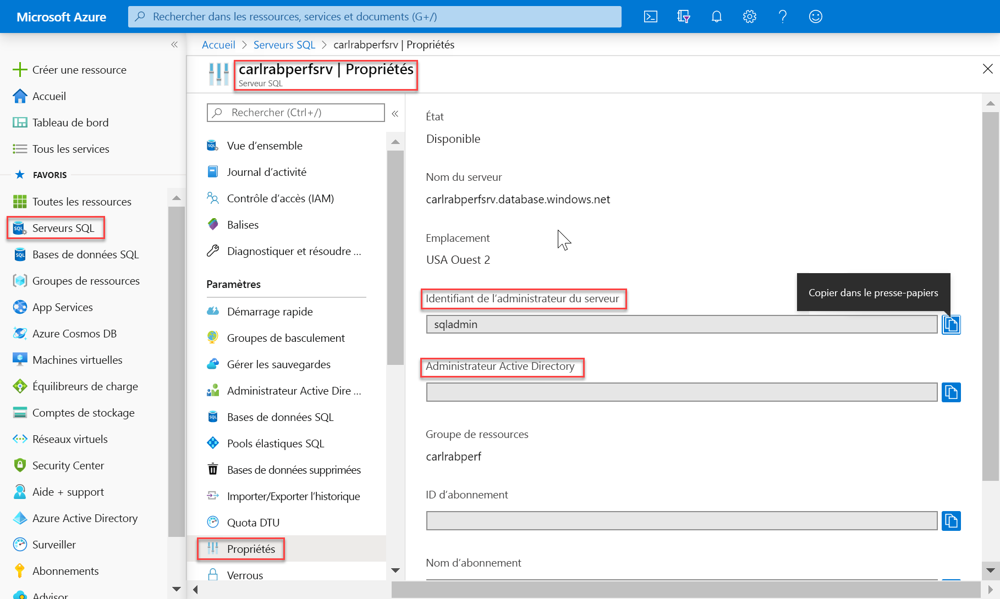
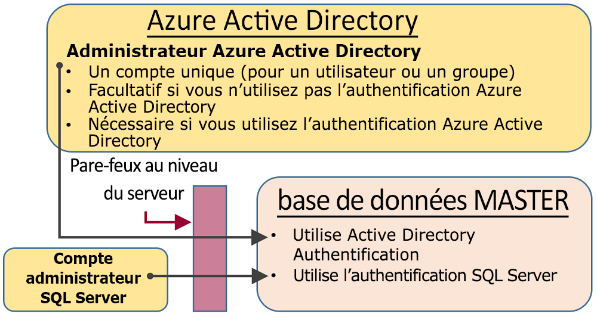
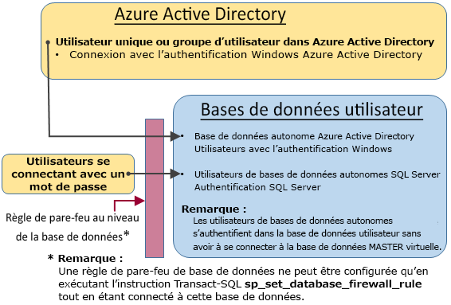

# <a name="sql-authentication"></a>Authentification SQL

Azure Synapse Analytics compte deux facteurs de forme SQL qui vous permettent de contrôler la consommation de ressources. Cet article explique comment les deux facteurs de forme contrôlent l’authentification utilisateur.

Pour autoriser l’accès à Synapse SQL, vous pouvez utiliser deux types d’autorisation :

- Autorisation AAD
- Autorisation SQL

L’autorisation AAD s’appuie sur Azure Active Directory et vous permet de disposer d’un emplacement unique pour la gestion des utilisateurs. L’autorisation SQL permet aux applications existantes d’utiliser Synapse SQL d’une manière qu’elles connaissent bien.

## <a name="administrative-accounts"></a>Comptes d’administration

Il existe deux comptes d’administration (**Administrateur de serveur** et **Administrateur Active Directory**) qui agissent en tant qu’administrateurs. Pour identifier ces comptes d’administrateur pour votre serveur SQL, ouvrez le portail Azure et accédez à l’onglet Propriétés de votre Synapse SQL.



- **Administrateur de serveur**

  Lorsque vous créez une instance Azure Synapse Analytics, vous devez désigner une **connexion d’administrateur serveur**. Le serveur SQL crée ce compte comme une connexion dans la base de données MASTER. Ce compte se connecte à l’aide de l’authentification SQL Server (nom d’utilisateur et mot de passe). Un seul de ces comptes peut exister.

- **Administrateur Azure Active Directory**

  Un compte Azure Active Directory individuel ou de groupe de sécurité peut également être configuré en tant qu’administrateur. La configuration d’un administrateur Azure AD est facultative, mais un administrateur Azure AD **doit** être configuré si vous voulez utiliser les comptes Azure AD pour vous connecter à Synapse SQL.

Les comptes d’**administrateur de serveur** et d’**administrateur Azure AD** présentent les caractéristiques suivantes :

- Ce sont les seuls comptes pouvant se connecter automatiquement à n’importe quelle base de données SQL sur le serveur. (Pour se connecter à une base de données utilisateur, vous devez disposer d’un compte de propriétaire de la base de données ou d’un compte d’utilisateur dans la base de données utilisateur.)
- Ces comptes accèdent aux bases de données utilisateur en tant qu’`dbo` utilisateur et possèdent toutes les autorisations dans les bases de données utilisateur. (Le propriétaire d’une base de données utilisateur accède également à la base de données en tant qu’utilisateur `dbo`.)
- Ces comptes n’ont pas accès à la base de données `master` en tant qu’utilisateur `dbo` et ils ont des autorisations limitées dans MASTER.
- Ces comptes **ne sont pas** membres du rôle serveur fixe SQL standard `sysadmin`, qui n’est pas disponible dans SQL Database.  
- Ces comptes peuvent créer, modifier et supprimer des bases de données, des connexions, des utilisateurs de MASTER et des règles de pare-feu IP au niveau du serveur.
- Ces comptes peuvent ajouter et supprimer des membres aux rôles `dbmanager` et `loginmanager`.
- Ces comptes peuvent afficher la table système `sys.sql_logins`.

## <a name="sql-on-demand-preview"></a>[SQL à la demande (préversion)](#tab/serverless)

Pour gérer les utilisateurs ayant accès à SQL à la demande, vous pouvez utiliser les instructions ci-dessous.

Pour créer une connexion à SQL à la demande, utilisez la syntaxe suivante :

```sql
CREATE LOGIN Mary WITH PASSWORD = '<strong_password>';
-- or
CREATE LOGIN Mary@domainname.net FROM EXTERNAL PROVIDER;
```
Une fois la connexion établie, vous pouvez créer des utilisateurs dans les bases de données individuelles, à l’intérieur du point de terminaison SQL à la demande, et accorder les autorisations nécessaires à ces utilisateurs. Pour créer un utilisateur, vous pouvez vous servir de la syntaxe suivante :
```sql
CREATE USER Mary FROM LOGIN Mary;
-- or
CREATE USER Mary FROM LOGIN Mary@domainname.net;
-- or
CREATE USER [mike@contoso.com] FROM EXTERNAL PROVIDER;
```

Dès la connexion et l’utilisateur créés, vous pouvez vous servir de la syntaxe SQL Server standard pour octroyer des droits.

## <a name="sql-pool"></a>[Pool SQL](#tab/provisioned)

### <a name="administrator-access-path"></a>Chemin d’accès administrateur

Lorsque le pare-feu au niveau du serveur est correctement configuré, l’**administrateur de serveur SQL** et l’**administrateur Azure Active Directory** peuvent se connecter à l’aide des outils clients tels que SQL Server Management Studio ou SQL Server Data Tools. Seuls les outils les plus récents fournissent toutes les fonctionnalités et capacités. 

Le diagramme suivant illustre une configuration classique avec deux comptes d’administrateur :
 


Lorsque vous utilisez un port ouvert dans le pare-feu au niveau du serveur, les administrateurs peuvent se connecter à n’importe quelle base de données SQL.

### <a name="database-creators"></a>Créateurs de bases de données

L’un de ces rôles d’administration est le rôle **dbmanager**. Les membres de ce rôle peuvent créer des bases de données. Pour l’utiliser, vous créez un utilisateur dans la base de données `master`, puis vous ajoutez l’utilisateur au rôle de base de données **dbmanager**. 

Pour créer une base de données, l’utilisateur doit être un utilisateur basé sur une connexion SQL Server dans la base de données `master`, ou un utilisateur de base de données autonome basé sur un utilisateur Azure Active Directory.

1. À l’aide d’un compte d’administrateur, connectez-vous à la base de données `master`.
2. créer une connexion d’authentification SQL Server à l’aide de l’instruction [CREATE LOGIN](/sql/t-sql/statements/create-login-transact-sql?toc=/azure/synapse-analytics/toc.json&bc=/azure/synapse-analytics/breadcrumb/toc.json&view=azure-sqldw-latest). Exemple d’instruction :

   ```sql
   CREATE LOGIN Mary WITH PASSWORD = '<strong_password>';
   ```

   > [!NOTE]
   > Utilisez un mot de passe fort au moment de la création d’une connexion ou d’un utilisateur de base de données autonome. Pour plus d’informations, consultez [Strong Passwords](/sql/relational-databases/security/strong-passwords?toc=/azure/synapse-analytics/toc.json&bc=/azure/synapse-analytics/breadcrumb/toc.json&view=azure-sqldw-latest).

   Pour améliorer les performances, les connexions (principaux au niveau du serveur) sont temporairement mises en cache au niveau de la base de données. Pour actualiser le cache d’authentification, consultez [DBCC FLUSHAUTHCACHE](/sql/t-sql/database-console-commands/dbcc-flushauthcache-transact-sql?toc=/azure/synapse-analytics/toc.json&bc=/azure/synapse-analytics/breadcrumb/toc.json&view=azure-sqldw-latest).

3. Dans la base de données `master`, créez un utilisateur à l’aide de l’instruction [CREATE USER](/sql/t-sql/statements/create-user-transact-sql?toc=/azure/synapse-analytics/toc.json&bc=/azure/synapse-analytics/breadcrumb/toc.json&view=azure-sqldw-latest). L’utilisateur peut être un utilisateur de base de données autonome de l’authentification Azure Active Directory (si vous avez configuré votre environnement pour l’authentification Azure AD), un utilisateur de base de données autonome de l’authentification SQL Server ou un utilisateur de l’authentification SQL Server basée sur une connexion d’authentification SQL Server (créé à l’étape précédente). Exemples d’instructions :

   ```sql
   CREATE USER [mike@contoso.com] FROM EXTERNAL PROVIDER; -- To create a user with Azure Active Directory
   CREATE USER Ann WITH PASSWORD = '<strong_password>'; -- To create a SQL Database contained database user
   CREATE USER Mary FROM LOGIN Mary;  -- To create a SQL Server user based on a SQL Server authentication login
   ```

4. Ajoutez le nouvel utilisateur au rôle de base de données **dbmanager** dans `master` à l’aide de l’instruction [ALTER ROLE](/sql/t-sql/statements/alter-role-transact-sql?toc=/azure/synapse-analytics/toc.json&bc=/azure/synapse-analytics/breadcrumb/toc.json&view=azure-sqldw-latest). Exemples d’instructions :

   ```sql
   ALTER ROLE dbmanager ADD MEMBER Mary;
   ALTER ROLE dbmanager ADD MEMBER [mike@contoso.com];
   ```

   > [!NOTE]
   > dbmanager étant un rôle de base de données dans une base de données MASTER, vous pouvez uniquement ajouter un utilisateur de base de données au rôle dbmanager. Vous ne pouvez pas ajouter une connexion au niveau du serveur au rôle au niveau de la base de données.

5. Si nécessaire, configurez une règle de pare-feu pour permettre au nouvel utilisateur de se connecter. (Le nouvel utilisateur peut être couvert par une règle de pare-feu existante.)

Désormais, l’utilisateur peut se connecter à la base de données `master` et créer de nouvelles bases de données. Le compte qui crée la base de données devient propriétaire de cette dernière.

### <a name="login-managers"></a>Gestionnaires de connexion

L’autre rôle d’administration est le rôle loginmanager. Les membres de ce rôle peuvent créer des connexions dans la base de données MASTER. Si vous le souhaitez, vous pouvez effectuer les mêmes étapes (créer une connexion et un utilisateur, puis ajouter l’utilisateur au rôle **loginmanager**) pour permettre aux utilisateurs de créer des connexions dans la base de données MASTER. Cela n’est généralement pas nécessaire, car Microsoft recommande d’avoir recours aux utilisateurs de base de données autonome qui s’authentifient au niveau de la base de données plutôt qu’à des utilisateurs basés sur les connexions. Pour plus d’informations, voir [Utilisateurs de base de données autonome - Rendre votre base de données portable](/sql/relational-databases/security/contained-database-users-making-your-database-portable?toc=/azure/synapse-analytics/toc.json&bc=/azure/synapse-analytics/breadcrumb/toc.json&view=azure-sqldw-latest).

---

## <a name="non-administrator-users"></a>Utilisateurs non administrateurs

En règle générale, les comptes non administrateurs n’ont pas besoin d’accéder à la base de données MASTER. Créez des utilisateurs de base de données autonome dans le niveau de base de données à l’aide de l’instruction [CREATE USER (Transact-SQL)](https://msdn.microsoft.com/library/ms173463.aspx). 

L’utilisateur peut être un utilisateur de base de données autonome de l’authentification Azure Active Directory (si vous avez configuré votre environnement pour l’authentification Azure AD), un utilisateur de base de données autonome de l’authentification SQL Server ou un utilisateur de l’authentification SQL Server basée sur une connexion d’authentification SQL Server (créé à l’étape précédente).  

Pour créer des utilisateurs, connectez-vous à la base de données et exécutez des instructions similaires eux exemples suivants :

```sql
CREATE USER Mary FROM LOGIN Mary;
CREATE USER [mike@contoso.com] FROM EXTERNAL PROVIDER;
```

Initialement, seul l’un des administrateurs ou le propriétaire de la base de données peut créer des utilisateurs. Pour autoriser des utilisateurs supplémentaires à créer des utilisateurs, accordez à l’utilisateur sélectionné l’autorisation `ALTER ANY USER` , en utilisant l’une des instructions suivantes :

```sql
GRANT ALTER ANY USER TO Mary;
```

Pour donner le contrôle total de la base de données aux utilisateurs supplémentaires, faites-les membres du rôle de base de données fixe **db_owner**.

Dans Azure SQL Database, utilisez l’instruction `ALTER ROLE`.

```sql
ALTER ROLE db_owner ADD MEMBER Mary;
```

Dans le pool SQL, utilisez [EXEC sp_addrolemember](/sql/relational-databases/system-stored-procedures/sp-addrolemember-transact-sql?toc=/azure/synapse-analytics/toc.json&bc=/azure/synapse-analytics/breadcrumb/toc.json&view=azure-sqldw-latest).

```sql
EXEC sp_addrolemember 'db_owner', 'Mary';
```

> [!NOTE]
> La nécessité pour les utilisateurs d’accéder à plusieurs bases de données représente l’un des motifs courants de création d’un utilisateur de base de données reposant sur une connexion serveur. Étant donné que les utilisateurs de base de données autonome constituent des entités individuelles, chaque base de données gère un utilisateur et un mot de passe qui lui sont propres. Cela risque d’entraîner un surcroît de complexité dans la mesure où l’utilisateur doit mémoriser le mot de passe de chacune des bases de données, cette situation pouvant même devenir intenable lorsqu’il devient nécessaire de modifier plusieurs mots de passe pour un grand nombre de bases de données. Toutefois, en cas d’utilisation des connexions SQL Server et de la haute disponibilité (géoréplication active et groupes de basculement), les connexions SQL Server doivent être définies manuellement sur chaque serveur. Dans le cas contraire, l’utilisateur de base de données ne sera plus mappé sur la connexion serveur après un basculement et ne sera pas en mesure d’accéder à la base de données suite au basculement. 

Pour plus d’informations sur la configuration de connexions pour la géoréplication, consultez [Configurer et gérer la sécurité Azure SQL Database pour la géo-restauration ou le basculement](../../azure-sql/database/active-geo-replication-security-configure.md?toc=/azure/synapse-analytics/toc.json&bc=/azure/synapse-analytics/breadcrumb/toc.json).

### <a name="configuring-the-database-level-firewall"></a>Configuration du pare-feu au niveau de la base de données

En tant que meilleure pratique, les utilisateurs non administrateurs doivent uniquement bénéficier d’un accès via le pare-feu aux bases de données qu’ils utilisent. Au lieu d’autoriser leurs adresses IP via le pare-feu du niveau du serveur et de leur donner accès à toutes les bases de données, utilisez l’instruction [sp_set_database_firewall_rule](/sql/relational-databases/system-stored-procedures/sp-set-database-firewall-rule-azure-sql-database?toc=/azure/synapse-analytics/toc.json&bc=/azure/synapse-analytics/breadcrumb/toc.json&view=azure-sqldw-latest) pour configurer le pare-feu au niveau de la base de données. Le pare-feu du niveau de base de données ne peut pas être configuré à l’aide du portail.

### <a name="non-administrator-access-path"></a>Chemin d’accès non administrateur

Lorsque le pare-feu du niveau de base de données est correctement configuré, les utilisateurs de base de données peuvent se connecter à l’aide des outils clients tels que SQL Server Management Studio ou SQL Server Data Tools. Seuls les outils les plus récents fournissent toutes les fonctionnalités et capacités. Le diagramme suivant montre un chemin d’accès non-administrateur classique.



## <a name="groups-and-roles"></a>Groupes et rôles

Une gestion des accès efficace utilise les autorisations assignées aux groupes et aux rôles plutôt qu’aux utilisateurs individuels.

- Lorsque vous utilisez l’authentification Azure Active Directory, placez les utilisateurs Azure Active Directory dans un groupe Azure Active Directory. Créez un utilisateur de base de données autonome pour le groupe. Placez un ou plusieurs utilisateurs de base de données dans un [rôle de base de données](/sql/relational-databases/security/authentication-access/database-level-roles?toc=/azure/synapse-analytics/toc.json&bc=/azure/synapse-analytics/breadcrumb/toc.json&view=azure-sqldw-latest), puis attribuez des [autorisations](/sql/relational-databases/security/permissions-database-engine?toc=/azure/synapse-analytics/toc.json&bc=/azure/synapse-analytics/breadcrumb/toc.json&view=azure-sqldw-latest) au rôle de base de données.

- Lorsque vous utilisez l’authentification SQL Server, créez des utilisateurs de base de données autonome dans la base de données. Placez un ou plusieurs utilisateurs de base de données dans un [rôle de base de données](/sql/relational-databases/security/authentication-access/database-level-roles?toc=/azure/synapse-analytics/toc.json&bc=/azure/synapse-analytics/breadcrumb/toc.json&view=azure-sqldw-latest), puis attribuez des [autorisations](/sql/relational-databases/security/permissions-database-engine?toc=/azure/synapse-analytics/toc.json&bc=/azure/synapse-analytics/breadcrumb/toc.json&view=azure-sqldw-latest) au rôle de base de données.

Les rôles de base de données peuvent être les rôles intégrés, tels que **db_owner**, **db_ddladmin**, **db_datawriter**, **db_datareader**, **db_denydatawriter** et **db_denydatareader**. **db_owner** est couramment utilisé pour accorder toutes les autorisations à quelques utilisateurs seulement. Les autres rôles de base de données fixe sont utiles pour obtenir rapidement une base de données simple en développement, mais ne sont pas recommandés pour la plupart des bases de données de production. 

Par exemple, le rôle de base de données fixe **db_datareader** accorde l’accès en lecture à toutes les tables de la base de données, ce qui est généralement plus que le minimum nécessaire. 

Il est préférable d’utiliser l’instruction [CREATE ROLE](https://msdn.microsoft.com/library/ms187936.aspx) pour créer vos propres rôles de base de données définis par l’utilisateur et accorder soigneusement à chaque rôle les autorisations minimales nécessaires aux besoins de l’entreprise. Lorsqu’un utilisateur est membre de plusieurs rôles, toutes les autorisations sont agrégées.

## <a name="permissions"></a>Autorisations

Il existe plus de 100 autorisations qui peuvent être accordées ou refusées individuellement dans la base de données SQL. La plupart de ces autorisations sont imbriquées. Par exemple, l’autorisation `UPDATE` sur un schéma inclut l’autorisation `UPDATE` sur chaque table dans ce schéma. Comme dans la plupart des systèmes d’autorisation, le refus d’une autorisation remplace l’octroi. 

En raison de la nature imbriquée et du nombre d’autorisations, la plus grande attention est requise pour concevoir un système d’autorisation approprié capable de protéger correctement votre base de données. 

Démarrez avec la liste des autorisations sous [Autorisations (moteur de base de données)](https://docs.microsoft.com/sql/relational-databases/security/permissions-database-engine) et passez en revue le [graphique de taille affiche](https://docs.microsoft.com/sql/relational-databases/security/media/database-engine-permissions.png) des autorisations.

### <a name="considerations-and-restrictions"></a>Considérations et restrictions

Prenez en compte les aspects suivants lors de la gestion des connexions et des utilisateurs dans SQL Database :

- Vous devez être connecté à la base de données **master** lors de l’exécution des instructions `CREATE/ALTER/DROP DATABASE`.
- L’utilisateur de base de données correspondant à la connexion **d’administrateur de serveur** ne peut pas être modifié ou supprimé.
- L’anglais américain est la langue par défaut de la connexion d’**administrateur de serveur**.
- Seuls les administrateurs (connexion d’**administrateur de serveur** ou administrateur Azure AD) et les membres du rôle de base de données **dbmanager** dans la base de données **Master** sont autorisés à exécuter les instructions `CREATE DATABASE` et `DROP DATABASE`.
- Vous devez être connecté à la base de données master lors de l’exécution des instructions `CREATE/ALTER/DROP LOGIN` . L’utilisation de connexions est toutefois déconseillée. Préférez l’emploi d’utilisateurs de base de données autonome.
- Pour vous connecter à une base de données utilisateur, vous devez renseigner le nom de la base de données dans la chaîne de connexion.
- Seule la connexion principale au niveau du serveur et les membres du rôle de base de données **loginmanager** dans la base de données **master** sont autorisés à exécuter les instructions `CREATE LOGIN`, `ALTER LOGIN` et `DROP LOGIN`.
- Lors de l’exécution des instructions `CREATE/ALTER/DROP LOGIN` et `CREATE/ALTER/DROP DATABASE` dans une application ADO.NET, l’utilisation de commandes paramétrées est interdite. Pour plus d’informations, voir [Commandes et paramètres](/dotnet/framework/data/adonet/commands-and-parameters?toc=/azure/synapse-analytics/toc.json&bc=/azure/synapse-analytics/breadcrumb/toc.json).
- Lors de l’exécution des instructions `CREATE/ALTER/DROP DATABASE` et `CREATE/ALTER/DROP LOGIN`, chacune d’entre elles doit être la seule instruction dans un batch Transact-SQL. Sinon, une erreur se produit. Par exemple, l’instruction Transact-SQL suivant vérifie l’existence de la base de données. Si elle existe, une instruction `DROP DATABASE` est appelée pour supprimer la base de données. Comme l’instruction `DROP DATABASE` n’est pas la seule instruction du lot, l’exécution de l’instruction Transact-SQL suivante génère une erreur.

  ```sql
  IF EXISTS (SELECT [name]
           FROM   [sys].[databases]
           WHERE  [name] = N'database_name')
  DROP DATABASE [database_name];
  GO
  ```
  
  Au lieu de cela, utilisez l’instruction Transact-SQL suivante :
  
  ```sql
  DROP DATABASE IF EXISTS [database_name]
  ```

- Lors de l’exécution de l’instruction `CREATE USER` avec l’option `FOR/FROM LOGIN`, elle doit être la seule instruction du batch Transact-SQL.
- Lors de l’exécution de l’instruction `ALTER USER` avec l’option `WITH LOGIN`, elle doit être la seule instruction du batch Transact-SQL.
- Pour exécuter les instructions `CREATE/ALTER/DROP`, un utilisateur a besoin de l’autorisation `ALTER ANY USER` sur la base de données.
- Quand le propriétaire d’un rôle de base de données tente d’ajouter un autre utilisateur de base de données à ce rôle de base de données (ou de le supprimer de ce dernier), l’erreur suivante peut se produire : **L’utilisateur ou le rôle « Nom » n’existe pas dans cette base de données.** Cette erreur survient, car l’utilisateur n’est pas visible par le propriétaire. Pour résoudre ce problème, accordez au propriétaire du rôle l’autorisation `VIEW DEFINITION` sur l’utilisateur. 

## <a name="next-steps"></a>Étapes suivantes

Pour plus d’informations, voir [Utilisateurs de base de données autonome - Rendre votre base de données portable](https://msdn.microsoft.com/library/ff929188.aspx).
 
