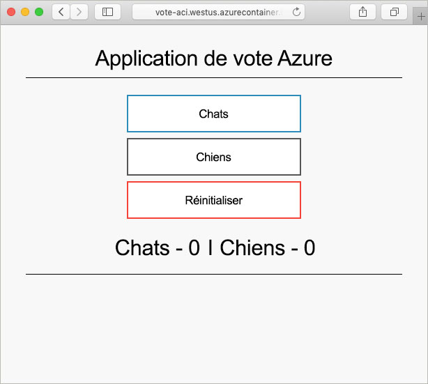

# <a name="quickstart-create-a-terraform-configuration-for-azure"></a>Démarrage rapide : Créer une configuration Terraform pour Azure

Dans ce guide de démarrage rapide, vous allez créer des ressources Azure à l'aide de Terraform. Les étapes décrites dans cet article vous permettront de créer les ressources suivantes :

> [!div class="checklist"]
> * Instance d'Azure Cosmos DB
> * Azure Container Instance
> * Application compatible avec ces deux ressources

## <a name="create-first-configuration"></a>Créer la première configuration

Dans cette section, vous allez créer la configuration d'une instance d'Azure Cosmos DB.

1. Connectez-vous au [portail Azure](https://go.microsoft.com/fwlink/p/?LinkID=525040).

1. Ouvrez Azure Cloud Shell.

1. Démarrez l'éditeur Cloud Shell :

    ```bash
    code main.tf
    ```

1. La configuration présentée dans cette étape modélise deux ressources Azure. Ces ressources incluent un groupe de ressources Azure et une instance d'Azure Cosmos DB. Un entier aléatoire est utilisé afin de créer un nom unique pour l'instance de Cosmos DB. Plusieurs paramètres Cosmos DB sont également configurés. Pour plus d'informations, consultez la [Référence Cosmos DB Terraform](https://www.terraform.io/docs/providers/azurerm/r/cosmosdb_account.html). Copiez et collez la configuration Terraform suivante dans l'éditeur :

    ```hcl
    resource "azurerm_resource_group" "vote-resource-group" {
      name     = "vote-resource-group"
      location = "westus"
    }

    resource "random_integer" "ri" {
      min = 10000
      max = 99999
    }

    resource "azurerm_cosmosdb_account" "vote-cosmos-db" {
      name                = "tfex-cosmos-db-${random_integer.ri.result}"
      location            = azurerm_resource_group.vote-resource-group.location
      resource_group_name = azurerm_resource_group.vote-resource-group.name
      offer_type          = "Standard"
      kind                = "GlobalDocumentDB"

      consistency_policy {
        consistency_level       = "BoundedStaleness"
        max_interval_in_seconds = 10
        max_staleness_prefix    = 200
      }

      geo_location {
        location          = "westus"
        failover_priority = 0
      }
    }
    ```

1. Enregistrez le fichier ( **&lt;Ctrl>S**) et quittez l’éditeur ( **&lt;Ctrl>Q**).

## <a name="run-the-configuration"></a>Exécuter la configuration

Dans cette section, vous allez utiliser différentes commandes Terraform pour exécuter la configuration.

1. La commande [terraform init](https://www.terraform.io/docs/commands/init.html) initialise le répertoire de travail. Exécutez la commande suivante dans Cloud Shell :

    ```bash
    terraform init
    ```

1. La commande [terraform plan](https://www.terraform.io/docs/commands/plan.html) permet de valider la syntaxe de configuration. Le paramètre `-out` dirige les résultats vers un fichier. Le fichier de sortie pourra être utilisé ultérieurement pour appliquer la configuration. Exécutez la commande suivante dans Cloud Shell :

    ```bash
    terraform plan --out plan.out
    ```

1. La commande [terraform apply](https://www.terraform.io/docs/commands/apply.html) permet d'appliquer la configuration. Le fichier de sortie de l'étape précédente est spécifié. Cette commande entraîne la création des ressources Azure. Exécutez la commande suivante dans Cloud Shell :

    ```bash
    terraform apply plan.out
    ```

1. Pour vérifier les résultats sur le portail Azure, accédez au nouveau groupe de ressources. La nouvelle instance d'Azure Cosmos DB se trouve dans le nouveau groupe de ressources.

## <a name="update-configuration"></a>Mettre à jour la configuration

Cette section explique comment mettre à jour la configuration de manière à inclure une instance de conteneur Azure. Le conteneur exécute une application qui lit et écrit des données dans l’instance Cosmos DB.

1. Démarrez l'éditeur Cloud Shell :

    ```bash
    code main.tf
    ```

1. La configuration présentée dans cette étape définit deux variables d'environnement : `COSMOS_DB_ENDPOINT` et `COSMOS_DB_MASTERKEY`. Ces variables contiennent l’emplacement de la base de données et la clé permettant d’y accéder. Les valeurs de ces variables proviennent de l'instance de base de données créée à l'étape précédente. Ce processus est connu sous le nom d’interpolation. Pour en savoir plus, consultez l’article consacré à la [syntaxe d’interpolation dans Terraform](https://www.terraform.io/docs/configuration/interpolation.html). La configuration inclut également un bloc de sortie qui retourne le nom de domaine complet de l’instance de conteneur. Copiez et collez le code suivant dans l'éditeur :

    ```hcl
    resource "azurerm_container_group" "vote-aci" {
      name                = "vote-aci"
      location            = azurerm_resource_group.vote-resource-group.location
      resource_group_name = azurerm_resource_group.vote-resource-group.name
      ip_address_type     = "public"
      dns_name_label      = "vote-aci"
      os_type             = "linux"

      container {
        name   = "vote-aci"
        image  = "microsoft/azure-vote-front:cosmosdb"
        cpu    = "0.5"
        memory = "1.5"
        ports {
          port     = 80
          protocol = "TCP"
        }

        secure_environment_variables = {
          "COSMOS_DB_ENDPOINT"  = azurerm_cosmosdb_account.vote-cosmos-db.endpoint
          "COSMOS_DB_MASTERKEY" = azurerm_cosmosdb_account.vote-cosmos-db.primary_master_key
          "TITLE"               = "Azure Voting App"
          "VOTE1VALUE"          = "Cats"
          "VOTE2VALUE"          = "Dogs"
        }
      }
    }

    output "dns" {
      value = azurerm_container_group.vote-aci.fqdn
    }
    ```

1. Enregistrez le fichier ( **&lt;Ctrl>S**) et quittez l’éditeur ( **&lt;Ctrl>Q**).

1. Comme dans la section précédente, exécutez la commande suivante pour visualiser les modifications à apporter :

    ```bash
    terraform plan --out plan.out
    ```

1. Exécutez la commande `terraform apply` pour appliquer la configuration.

    ```bash
    terraform apply plan.out
    ```

1. Notez le nom de domaine complet de l'instance de conteneur.

## <a name="test-application"></a>Tester l’application

Pour tester l'application, accédez au nom de domaine complet de l'instance de conteneur. Vous obtenez normalement des résultats similaires à la sortie suivante :



## <a name="clean-up-resources"></a>Nettoyer les ressources

Lorsque vous n’en avez plus besoin, supprimez les ressources créées dans cet article.

Exécutez la commande [terraform destroy](https://www.terraform.io/docs/commands/destroy.html) pour supprimer les ressources Azure créées dans ce didacticiel :

```bash
terraform destroy -auto-approve
```

## <a name="next-steps"></a>Étapes suivantes

> [!div class="nextstepaction"]
> [Installer et configurer Terraform pour approvisionner des ressources Azure](terraform-install-configure.md).