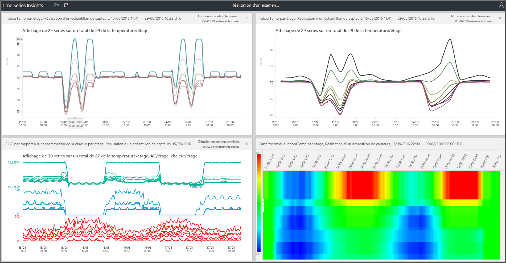

# Explorateur Azure Time Series Insights

Cet article décrit les fonctionnalités et options de disponibilité en général pour Azure Time Series Insights [explorer web app](https://insights.timeseries.azure.com/). L’Explorateur Time Series Insights démontre les capacités de visualisation de données puissantes proposées par le service et sont accessibles au sein de votre propre environnement.

Azure Time Series Insights est un service entièrement managé d’analyse, de stockage et de visualisation qui simplifie la découverte et l’analyse simultanées de milliards d’événements IoT. Cette solution vous donne une vue globale de vos données, ce qui vous permet de valider rapidement votre solution IoT et d’éviter des temps morts coûteux d’appareils stratégiques. Vous pouvez découvrir des tendances masquées, détecter les anomalies et effectuer des analyses de cause première quasiment en temps réel. L’Explorateur Time Series Insights est actuellement en version préliminaire publique.

> [!TIP]
> Pour une visite guidée de l’environnement de démonstration, consultez le [Guide de démarrage rapide Azure Time Series Insights](time-series-quickstart.md).

## Vidéo

### En savoir plus sur l’interrogation des données à l’aide de l’Explorateur Time Series Insights.  

> [!VIDEO https://www.youtube.com/embed/SHFPZvrR71s]

>[!NOTE]
>Regardez la vidéo précédente <a href="https://www.youtube.com/watch?v=6ehNf6AJkFo">« Prise en main Time Series Insights à l’aide d’un accélérateur de IoT Solution Azure. »</a>

## Conditions préalables

Avant de pouvoir utiliser l’Explorateur Time Series Insights, vous devez :

- Créez un environnement Time Series Insights. Pour plus d’informations, consultez [la prise en main avec Time Series Insights](./time-series-insights-get-started.md).
- [Fournir un accès](time-series-insights-data-access.md) à votre compte dans l’environnement.
- Ajouter un [IoT hub](time-series-insights-how-to-add-an-event-source-iothub.md) ou [concentrateur d’événements](time-series-insights-how-to-add-an-event-source-eventhub.md) source d’événements.

## Explorer et interroger les données

Après quelques minutes suite à la connexion de votre source d’événements à votre environnement Time Series Insights, vous pouvez explorer et interroger vos données de série chronologique.

1. Pour démarrer, ouvrez le [Explorateur Time Series Insights](https://insights.timeseries.azure.com/) dans votre navigateur web. Sur le côté gauche de la fenêtre, sélectionnez un environnement. Tous les environnements auxquels vous avez accès sont répertoriés par ordre alphabétique.

1. Après avoir sélectionné un environnement, soit utiliser le **de** et **à** configurations en haut, ou cliquez et faites glisser l’intervalle de temps que vous souhaitez. Sélectionnez la Loupe dans l’angle supérieur droit, ou avec le bouton droit sur l’intervalle de temps sélectionné et sélectionnez **recherche**.

1. Vous aussi pourrez Actualiser disponibilité automatiquement toutes les minutes en sélectionnant le **automatique sur** bouton. Le **automatique sur** bouton s’applique uniquement au graphique de disponibilité, pas le contenu de la visualisation principale.

1. L’icône Azure cloud vous accédez à votre environnement dans le portail Azure.

   

1. Ensuite, vous voyez un graphique qui affiche le nombre total d’événements pendant la période sélectionnée. Vous avez plusieurs commandes disponibles :

    - **Panneau de l’éditeur de conditions**: L’espace de terme correspond à l’endroit où vous interrogez votre environnement. Il se trouve sur le côté gauche de l’écran :
      - **Mesure** : Cette liste déroulante affiche toutes les colonnes numériques (**Doubles**).
      - **Diviser par** : Cette liste déroulante affiche les colonnes catégorielles (**chaînes**).
      - Vous pouvez activer l’interpolation par étape, afficher minimale et maximale et ajuster l’axe des ordonnées à partir du panneau regard **mesure**. Vous pouvez également ajuster si les données affichées sont un nombre, une moyenne ou une somme de données.
      - Vous pouvez ajouter jusqu'à cinq conditions à afficher sur l’axe des abscisses. Utilisez le **copie déroulante** bouton pour ajouter un terme supplémentaire, ou sélectionnez **ajouter** pour ajouter un nouveau terme.

        

      - **Prédicat** : Utiliser le prédicat pour filtrer rapidement les événements à l’aide de l’ensemble d’opérandes répertoriés dans le tableau suivant. Si vous effectuez une recherche ou en cliquant sur, le prédicat automatiquement mises à jour selon cette recherche. Les types d’opérandes pris en charge comprennent les suivants :

         |Opération  |Types pris en charge  |Notes  |
         |---------|---------|---------|
         |`<`, `>`, `<=`, `>=`     |  Double, DateTime, TimeSpan       |         |
         |`=`, `!=`, `<>`     | Chaîne, Bool, Double, DateTime, TimeSpan, NULL        |         |
         |IN     | Chaîne, Bool, Double, DateTime, TimeSpan, NULL        |  Tous les opérandes doivent être du même type ou être la constante NULL.        |
         |HAS     | Chaîne        |  Seuls les littéraux de chaîne constante sont autorisés à droite. Chaînes vides et NULL ne sont pas autorisés.       |

      - **Exemples de requêtes**

         

1. Vous pouvez utiliser la **taille de l’intervalle** curseur pour effectuer un zoom vers et depuis les intervalles sur le même laps de temps. Le curseur fournit un contrôle plus précis du déplacement entre les tranches de temps volumineuses qui montrent les tendances lissées jusqu'à tranches aussi petit que la milliseconde, ce qui vous permet de voir des morceaux granulaires, haute résolution de vos données. Point de départ de la valeur par défaut du curseur est définie en tant que la vue optimale des données à partir de votre sélection pour équilibrer la résolution, vitesse de la requête et la granularité.

1. Le **pinceau horaire** outil facilite la navigation à partir d’un intervalle de temps à une autre.

1. Utilisez le **enregistrer** commande pour enregistrer votre requête en cours et le partager avec d’autres utilisateurs de l’environnement. Lorsque vous utilisez **Open**, vous pouvez voir toutes vos requêtes enregistrées et autres utilisateurs dans les environnements que vous avez accès à toutes les requêtes partagées.

   

## Visualiser les données

1. Utilisez le **vue en Perspective** outil pour une vue simultanée de jusqu'à quatre requêtes uniques. Le **vue en Perspective** bouton se trouve dans le coin supérieur droit du graphique.

   

1. Afficher un graphique pour Explorer vos données visuellement et utiliser le **graphique** outils :

    - **Sélectionnez** ou **cliquez sur** un intervalle de temps spécifique ou une série de données.
    - Au sein d’une sélection de l’intervalle de temps, vous pouvez effectuer un zoom ou Explorer les événements.
    - Au sein d’une série de données, vous pouvez fractionner la série par une autre colonne, ajouter la série en tant que nouveau terme, afficher uniquement la série sélectionnée, exclure les séries sélectionnées, effectuer un test ping sur cette série ou explorer les événements de la série sélectionnée.
    - Dans la zone de filtre à gauche du graphique, vous pouvez voir toutes les séries de données affichées et Réorganiser par valeur ou par nom. Vous pouvez également afficher toutes les séries de données ou de n’importe quelle série ou non épinglées. Vous pouvez sélectionner une seule série de données et fractionner la série par une autre colonne, ajouter la série en tant que nouveau terme, afficher uniquement la série sélectionnée, exclure les séries sélectionnées, épingler cette série ou Explorer les événements de la série sélectionnée.
    - Lorsque vous affichez plusieurs termes simultanément, vous pouvez empiler, désempiler, voir les données supplémentaires relatives à une série de données et utiliser la même axe des ordonnées sur tous les termes. Utilisez les boutons dans le coin supérieur droit du graphique.

    

1. Utilisez le **carte thermique** permet d’identifier rapidement les séries de données uniques ou anormales dans une requête donnée. Un seul terme de recherche peut être visualisé comme une carte thermique.

    

1. Lorsque vous explorez les événements en sélectionnant ou en effectuant un clic droit, le **événements** panneau est mis à disposition. Ici, vous pouvez voir tous les événements bruts et exporter vos événements sous forme de fichiers JSON ou CSV. Time Series Insights stocke toutes les données brutes.

    

1. Sélectionnez le **statistiques** onglet après avoir exploré les événements pour exposer des modèles et statistiques de colonne.

    - **Modèles**: Cette fonctionnalité proactive met en évidence les modèles statistiquement les plus significatives dans une région de données sélectionnée. Vous n’êtes pas obligé d’examiner plusieurs milliers d’événements afin de comprendre les modèles nécessitent le plus de temps et d’énergie. Time Series Insights, vous pouvez passer directement dans ces modèles statistiquement significatifs pour continuer la réalisation d’une analyse. Cette fonctionnalité est également utile pour les enquêtes post mortem des données historiques.
    - **Statistiques de colonne** : Statistiques de colonne fournissent des graphiques et des tables qui décomposent les données de chaque colonne de la série de données sélectionnée sur l’intervalle de temps sélectionné.

      

Vous avez maintenant vu les différentes fonctionnalités et options qui sont disponibles dans l’application web de l’Explorateur Time Series Insights.

## Étapes suivantes

- Découvrez comment [diagnostiquer et résoudre les problèmes](time-series-insights-diagnose-and-solve-problems.md) dans votre environnement Time Series Insights.
- Prendre le guidée [Guide de démarrage rapide Azure Time Series Insights](time-series-quickstart.md) visite guidée.
