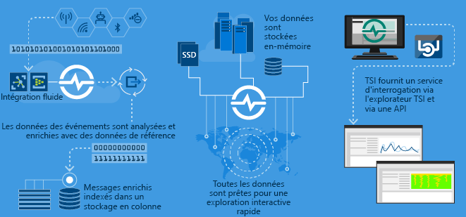
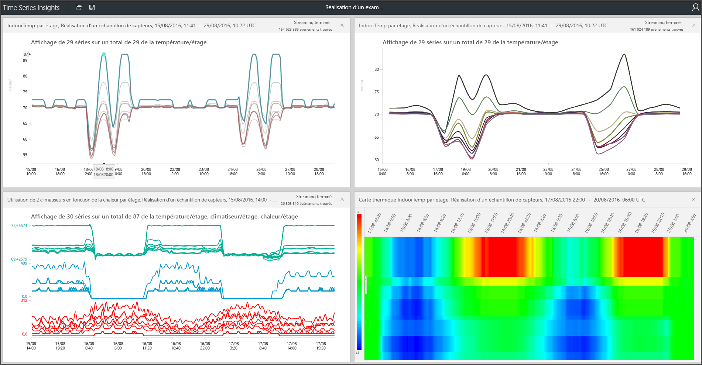

# Qu’est-ce que Azure Time Series Insights ?

Azure Time Series Insights est conçu pour stocker, visualiser et interroger de grandes quantités de données de série chronologique, comme celles générées par les appareils IoT. Si vous souhaitez stocker, gérer, interroger ou visualiser des données de série chronologique dans le cloud, Time Series Insights est probablement la solution que vous cherchez.

Time Series Insights a quatre tâches principales :

- Il s’intègre entièrement à des passerelles cloud comme Azure IoT Hub et Azure Event Hubs. Il se connecte facilement à ces sources d’événements et analyse le JSON des messages et des structures qui comportent des données dans des colonnes et des lignes propres. Il joint des métadonnées aux données de télémétrie et indexe les données dans un magasin orienté colonnes.
- Time Series Insights gère le stockage de vos données. Pour que les données soient toujours faciles d’accès, il peut les stocker en mémoire et sur SSD jusqu’à 400 jours. Vous pouvez interroger de manière interactive des milliards d’événements en quelques secondes, à la demande.
- Time Series Insights offre une visualisation prête à l'emploi par le biais de l'explorateur Time Series Insights.
- Time Series Insights propose un service de requête, à la fois dans l’explorateur Time Series Insights et par le biais d’API faciles à intégrer, pour intégrer les données de série chronologique dans des applications personnalisées.

Si vous générez une application en vue d’une utilisation en interne ou pour des clients externes, vous pouvez utiliser Time Series Insights comme back-end. Vous pouvez l’utiliser pour indexer, stocker et agréger des données de série chronologique. Pour créer une visualisation et une expérience utilisateur personnalisées, utilisez le [SDK client](https://github.com/microsoft/tsiclient/blob/master/docs/API.md). Time Series Insights intègre également plusieurs [API de requête](how-to-shape-query-json.md) pour permettre ces scénarios personnalisés.

Les données de série chronologique représentent la façon dont un élément multimédia ou un processus changent au fil du temps. Les données de série chronologique sont indexées par horodatages, et l’heure représente l’axe le plus explicite le long duquel ces données sont organisées. Les données de série chronologique arrivant généralement dans un ordre séquentiel, elles sont considérées comme une instruction insert, plutôt qu’une mise à jour pour votre base de données.

Il peut s’avérer complexe d’indexer, d’interroger, d’analyser et de visualiser de grands volumes de données de séries chronologiques.
Comme Azure Time Series Insights capture et stocke chaque nouvel événement sous la forme d’une ligne, le changement est mesuré efficacement au fil du temps. Ainsi, vous pouvez effectuer une recherche en arrière afin de prévoir un changement à partir d’événements passés.

## Vidéo

### En savoir plus sur Azure Time Series Insights, la plateforme d’analyse IoT basée sur le cloud. 

## Principaux scénarios

- Stocker les données de série chronologique de manière scalable.

   À sa base, Time Series Insights a une base de données conçue avec les données de série chronologique à l’esprit. Comme il est complètement managé et scalable, Time Series Insights gère les tâches de stockage et de gestion des événements.

- Explorer les données quasiment en temps réel.

   Time Series Insights fournit un explorateur qui permet de visualiser toutes les données qui affluent dans un environnement. Peu de temps après vous être connecté à une source d’événement, vous pouvez afficher, explorer et interroger des données d’événements dans Time Series Insights. Les données vous aident à vérifier si un appareil émet des données comme prévu et à superviser une ressource IoT à des fins d’intégrité, de productivité et d’efficacité globale.

- Effectuer une analyse de la cause première et détecter les anomalies.

   Time Series Insights a des outils tels que les modèles et les vues de perspective pour effectuer et enregistrer des analyses de cause première multi-étapes. Time Series Insights fonctionne également avec des services de génération d’alertes tels qu’Azure Stream Analytics afin que vous puissiez afficher les alertes et les anomalies détectées presque en temps réel dans l’explorateur Time Series Insights.

- Obtenir une vue globale des données de série chronologique qui affluent d’emplacements différents pour la comparaison de plusieurs ressources ou sites.

   Vous pouvez vous connecter à plusieurs sources d’événements dans un environnement de Time Series Insights. De cette façon, vous pouvez, quasiment en temps réel, afficher ensemble les données qui affluent de plusieurs emplacements. Les utilisateurs peuvent tirer parti de ce niveau de visibilité pour partager des données avec les responsables commerciaux. Ils peuvent mieux collaborer avec des experts du domaine qui peuvent appliquer leur expertise pour aider à résoudre les problèmes, appliquer les bonnes pratiques et partager des retours.

- Générer une application client sur la base de Time Series Insights.

   Time Series Insights expose des API REST avec lesquelles vous pouvez générer des applications qui utilisent des données de série chronologique.

## Fonctionnalités

- **Prise en main rapide** : comme Azure Time Series Insights ne requiert pas de préparation préalable des données, vous pouvez rapidement vous connecter à des millions d’événements dans votre hub IoT ou hub d’événements. Une fois connecté, vous pouvez visualiser les données de capteurs et interagir avec celles-ci pour valider rapidement vos solutions IoT. Vous pouvez interagir avec vos données sans écrire de code et vous n’êtes pas obligé d’apprendre un nouveau langage. Time Series Insights propose aux utilisateurs expérimentés une zone de recherche de texte libre précise ainsi qu’une expérience d’exploration « pointer et cliquer ».

- **Insights en temps quasi réel** : Time Series Insights peut recevoir des millions d’événements de capteur par jour, avec une latence d’une minute. Time Series Insights vous permet de tirer des insights de vos données de capteur. Utilisez-le pour identifier des tendances et des anomalies, effectuer des analyses de cause première et éviter des temps d’arrêt coûteux. Une corrélation croisée entre données en temps réel et données historiques vous aide à trouver les tendances cachées dans les données.

- **Créer des solutions personnalisées** : incorporez les données Azure Time Series Insights dans vos applications existantes. Vous pouvez également créer des solutions personnalisées avec les API REST de Time Series Insights. Créez des affichages personnalisés que vous pouvez partager afin que d’autres personnes puissent explorer vos analyses.

- **Scalabilité** : Time Series Insights est conçu pour prendre en charge l’IoT une fois mis à l’échelle. De 1 à 100 millions d’événements peuvent être entrés par jour, avec une durée de conservation par défaut de 31 jours. Vous pouvez visualiser et analyser les flux de données en direct en temps presque réel, en plus des données historiques.

## Bien démarrer

Pour commencer, suivez ces étapes.

1. Provisionnez un environnement Time Series Insights dans le portail Azure.
1. Connectez-vous à une source d’événements telle qu’un hub IoT ou un hub d’événements.
1. Chargez des données de référence. Il ne s’agit pas d’un service supplémentaire.
1. Passez en revue et affichez vos données en quelques minutes avec l’Explorateur Time Series Insights.

## Explorer

Affichez, analysez et découvrez les tendances de vos données avec l’Explorateur Azure Time Series Insights.

Découvrez comment utiliser l’[Explorateur Azure Time Series Insights](time-series-insights-explorer.md) et dégagez des insights de vos données.

## Étapes suivantes

- Explorer la disponibilité générale d’Azure Time Series Insights dans un [environnement de démonstration gratuit](./time-series-quickstart.md).

- Découvrez comment [planifier votre environnement Time Series Insights](time-series-insights-environment-planning.md).
