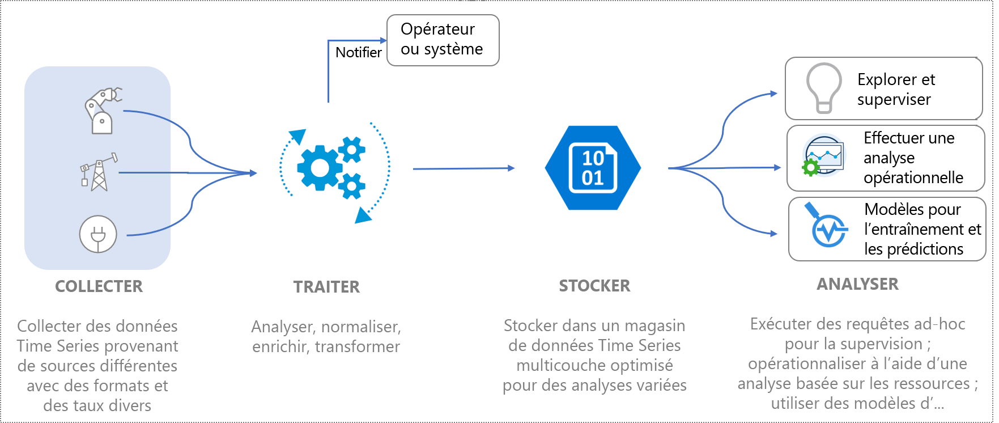
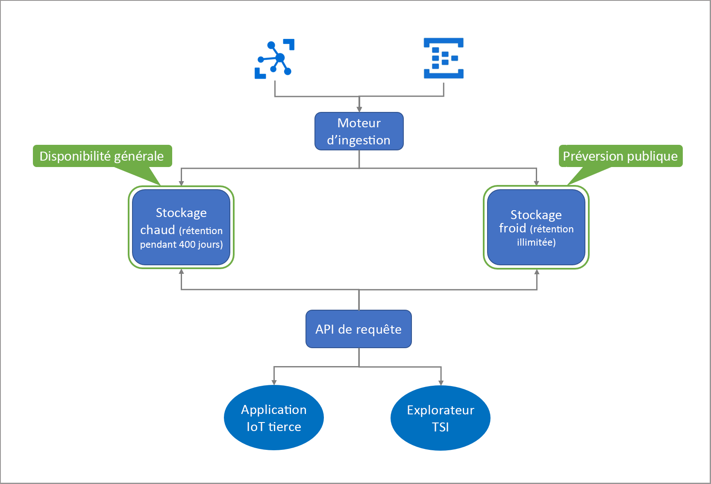

# Qu’est-ce qu’Azure Time Series Insights (préversion) ?

La préversion d’Azure Time Series Insights est une offre PaaS (platform-as-a-service) de bout en bout. Vous pouvez l’utiliser pour collecter, traiter, stocker, analyser et interroger des données à l’échelle de l’Internet des objets (des données hautement contextualisées et optimisées pour les séries chronologiques). 

Time Series Insights est conçu pour l’exploration de données ad hoc et l’analyse opérationnelle. C’est une offre de service personnalisée et extensible qui répond aux besoins étendus des déploiements IoT sectoriels.

## Vidéo

Découvrez Azure Time Series Insights (préversion).

> [!VIDEO https://channel9.msdn.com/Shows/Internet-of-Things-Show/Azure-Time-Series-Insights-e2e-solution-for-industrial-IoT-analytics/player]

## Définition des données IoT

Les données IoT sectorielles dans des organisations utilisant de nombreuses ressources manquent souvent de cohérence structurelle en raison de la diversité des appareils et capteurs présents dans un milieu industriel. Les données provenant de ces flux se caractérisent par des lacunes importantes, parfois des messages corrompus, et des relevés erronés. Les données IoT sont souvent utiles dans le contexte d’entrées de données supplémentaires provenant de sources internes ou tierces, comme CRM ou ERP qui ajoutent un contexte aux flux de travail de bout en bout. Les entrées provenant de sources de données tierces telles que des données météorologiques peuvent contribuer à augmenter les flux de télémétrie dans une installation donnée. 

Tout cela implique que seule une fraction des données est utilisée à des fins commerciales et opérationnelles, et une contextualisation est requise pour l’analyse. Les données industrielles sont souvent replacées dans un historique pour une analyse approfondie sur de plus longues périodes afin de comprendre les tendances et les mettre en corrélation. La transformation des données IoT collectées en informations exploitables nécessite : 

* Un traitement des données pour nettoyer, filtrer, interpoler, transformer et préparer les données en vue de leur analyse.
* Une structuration des données pour pouvoir les explorer et les comprendre, la normalisation et la contextualisation des données.
* Stocker à peu de frais des données traitées (ou dérivées) et brutes dans l’optique d’une conservation longue ou infinie.

Ces données sont des sources d’information cohérentes, complètes, actuelles et fiables qui permettent de créer des rapports d’entreprise et de procéder à des analyses.

L’image suivante illustre un flux de données IoT classique.

## Azure Time Series Insights pour l’IoT sectoriel

Le paysage de l’IoT est varié et ses clients occupent différents segments d’activité tels que l’industrie, l’automobile, l’énergie, les services publics, le bâtiment intelligent et le conseil. Sur ce vaste marché de l’IoT pour le secteur industriel, les solutions natives du cloud offrant une analytique complète ciblée sur des données IoT à grande échelle sont en constante évolution. 

Azure Time Series Insights répond à cette demande de marché en fournissant une solution d’analytique IoT de bout en bout clé en main avec la modélisation sémantique enrichie pour la contextualisation de données de série chronologique, les insights basés sur des ressources et une expérience utilisateur optimale pour la découverte, le repérage de tendances, la détection d’anomalies et l’intelligence opérationnelle. 

Grâce à la combinaison d’une plateforme d’analytique opérationnelle enrichie et de nos capacités d’exploration des données interactive, vous pouvez utiliser Time Series Insights pour mieux exploiter les données collectées auprès des ressources IoT. L’offre de préversion prend en charge : 

* Une solution de stockage multicouche avec prise en charge de l’analytique à chaud et à froid, offrant aux clients la possibilité d’acheminer des données entre chaud et froid pour l’analytique interactive sur des données à chaud ainsi que l’intelligence opérationnelle sur l’équivalent de plusieurs décennies de données d’historique. 

    *   Une solution d’analytique à chaud hautement interactive pour exécuter des requêtes fréquentes et en grand nombre sur des données couvrant une période plus courte 
    *   Un lac de données de série chronologique évolutif, optimisé en termes de performances et de coûts basé sur Stockage Azure, permettant aux clients d’afficher les tendances de données de série chronologique sur plusieurs années en quelques secondes. 

* Un modèle sémantique permettant de décrire le domaine et les métadonnées associés aux signaux dérivés et bruts de ressources et d’appareils.

* Une plateforme d’analytique flexible permettant de stocker des données de série chronologique historiques dans un compte Stockage Azure appartenant au client. Les clients restent ainsi propriétaires de leurs données IoT. Les données sont stockées dans un format Apache Parquet open source qui permet la connectivité et l’interopérabilité dans différents scénarios de données, notamment l’analyse prédictive, le machine learning et d’autres calculs personnalisés effectués à l’aide de technologies classiques telles que Spark, Databricks et Jupyter.

* Une analytique enrichie avec des API de requête améliorées et une expérience utilisateur qui combine les insights de données basés sur des ressources et l’analytique de données ad hoc complète prenant en charge l’interpolation, les fonctions scalaire et d’agrégation, les variables catégoriques, les nuages de points et les signaux de série chronologique avec décalage temporel pour une analyse approfondie.

*   Une plateforme de qualité professionnelle pour prendre en charge les besoins en matière d’évolutivité, de performance, de sécurité et de fiabilité de nos clients IoT d’entreprise.

* La prise en charge de l’extensibilité et de l’intégration pour l’analytique de bout en bout. Time Series Insights offre une plateforme d’analytique extensible pour un large éventail de scénarios de données. Le connecteur Power BI Time Series Insights permet aux clients de traiter les requêtes qu’ils effectuent dans Time Series Insights directement dans Power BI afin d’obtenir une vue unifiée de leurs analyses de décisionnel et chronologiques dans un seul et même volet.

Le schéma ci-dessous présente le flux de données général.

  

Azure Time Series Insights offre un modèle de paiement à l’utilisation évolutif pour le traitement, le stockage (données et métadonnées) et l’interrogation des données, qui permet aux clients d’ajuster leur utilisation en fonction de leurs besoins professionnels. 
 
Avec l’introduction de ces fonctionnalités IoT sectorielles clés, Time Series Insights offre également les avantages suivants.  

| | |
| ---| ---|
| Stockage multicouche pour les données de séries chronologiques IoT | Grâce à un pipeline de traitement de données partagé pour l’ingestion de données, vous pouvez ingérer des données dans des magasins chauds et froids. Utilisez un magasin chaud pour les requêtes interactives et un magasin froid pour le stockage de gros volumes de données. Pour savoir comment tirer parti des requêtes basées sur des ressources hautement performantes, consultez [requêtes](./time-series-insights-update-tsq.md). |
| Modèle de séries chronologiques pour la contextualisation des données de télémétrie brutes et la dérivation d’insights basés sur les ressources | Vous pouvez utiliser le modèle de série chronologique pour créer des instances, des hiérarchies, des types et des variables pour vos données de série chronologique. Pour en savoir plus sur le modèle de série chronologique, consultez [Modèle de série chronologique](./time-series-insights-update-tsm.md).  |
| Intégration fluide et continue à d’autres solutions de données | Les données dans le magasin froid Time Series Insights sont [stockées](./time-series-insights-update-storage-ingress.md) dans des fichiers Apache Parquet open source. Cela permet l’intégration de données avec d’autres solutions de données (internes ou tierces) pour des scénarios qui incluent le décisionnel, le machine learning avancé et l’analyse prédictive. |
| Exploration de données en quasi temps réel | L’expérience utilisateur de [l’explorateur de la préversion d’Azure Time Series Insights](./time-series-insights-update-explorer.md) permet de visualiser toutes les données diffusées en continu via le pipeline d’ingestion. Après la connexion à une source d’événement, vous pouvez afficher, explorer et interroger des données d’événement. De cette façon, vous pouvez vérifier si un appareil émet des données comme prévu. Vous pouvez également surveiller l’intégrité, la productivité et l’efficacité globale d’une ressource IoT. | 
| Extensibilité et intégration | L’intégration du connecteur Power BI Azure Time Series Insights est disponible directement dans l’expérience utilisateur de l’Explorateur Time Series via l’option **Exporter**, qui permet aux clients d’exporter les requêtes de série chronologique créées dans notre expérience utilisateur directement vers Power BI Desktop, et d’afficher leurs graphiques avec d’autres analyses de décisionnel. Cela ouvre la voie à une nouvelle classe de scénarios pour les entreprises IoT industrielles qui ont investi dans Power BI, en offrant une grande transparence sur l’analytique à partir de différentes sources de données y compris les séries chronologiques IoT. | 
| Applications personnalisées créées sur la plateforme Time Series Insights | Time Series Insights prend en charge le [kit SDK JavaScript](https://github.com/microsoft/tsiclient/blob/master/docs/API.md). Le kit SDK fournit des contrôles complets et un accès simplifié aux requêtes. Utilisez le kit SDK afin de créer des applications IoT personnalisées sur Time Series Insights pour répondre à vos besoins professionnels. Vous pouvez également utiliser les [API de requête](./time-series-insights-update-tsq.md) Time Series Insights directement pour intégrer directement des données dans des applications IoT personnalisées. |

## Étapes suivantes

Prenez en main Azure Time Series Insights (préversion) :

> [!div class="nextstepaction"]
> [Guide de démarrage rapide](./time-series-insights-update-quickstart.md)

Découvrez les cas d’utilisation :

> [!div class="nextstepaction"]
> [Cas d’utilisation de la préversion d’Azure Time Series Insights](./time-series-insights-update-use-cases.md)