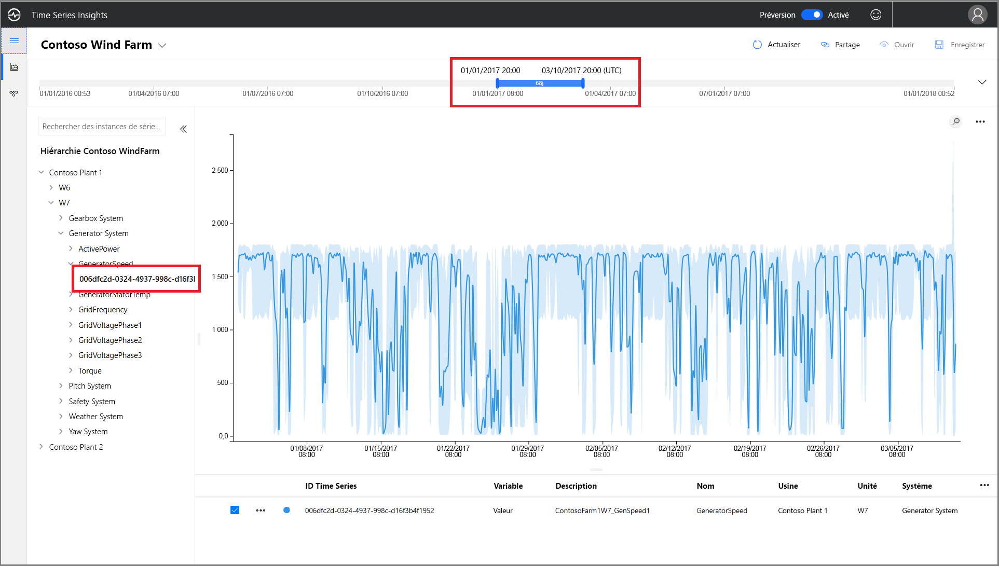
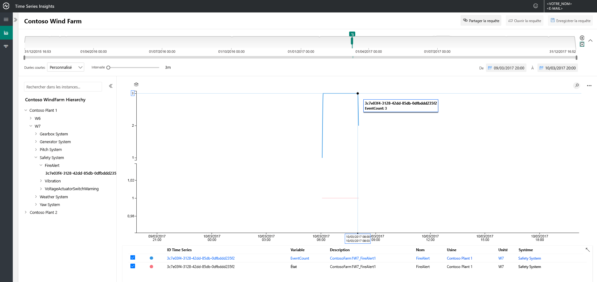
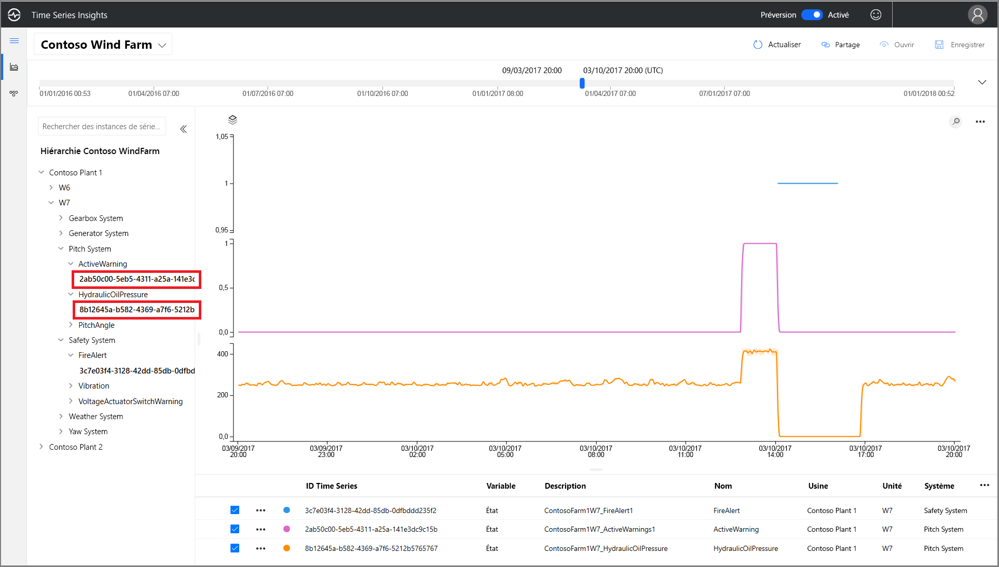
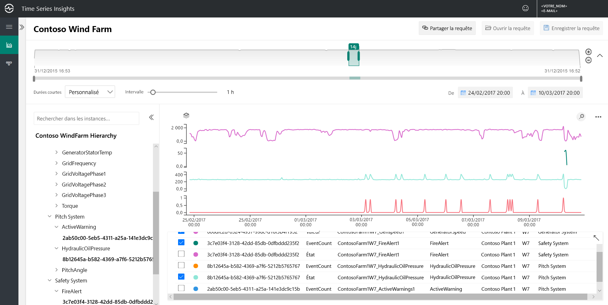
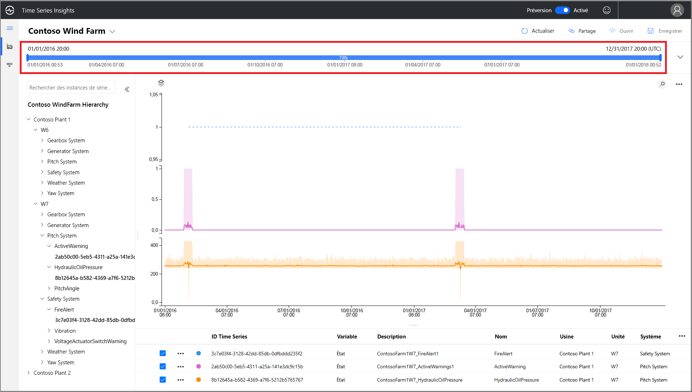
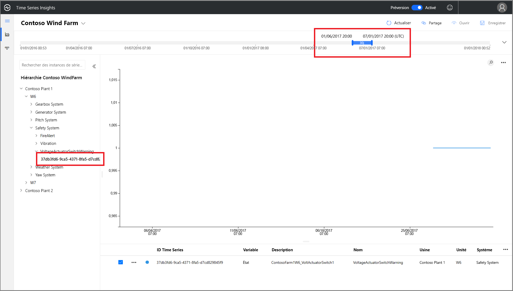
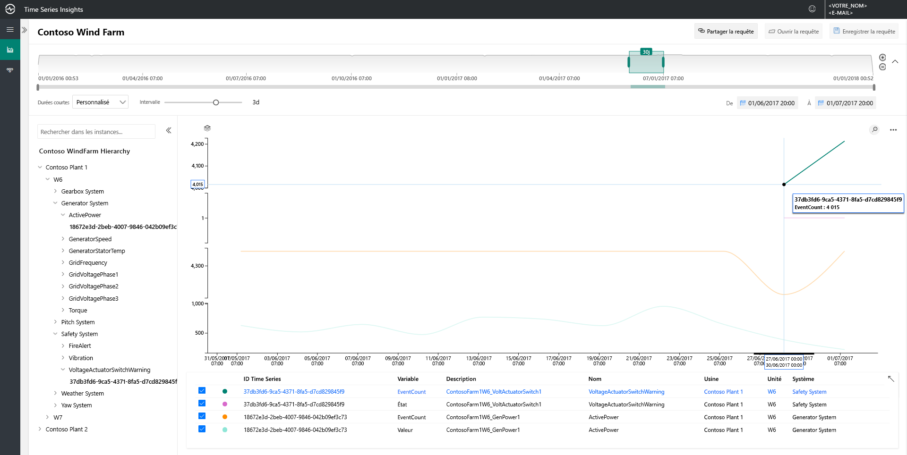
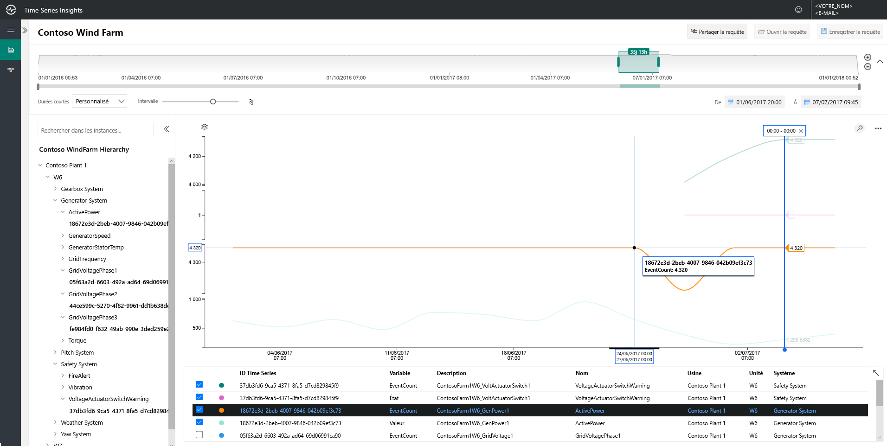
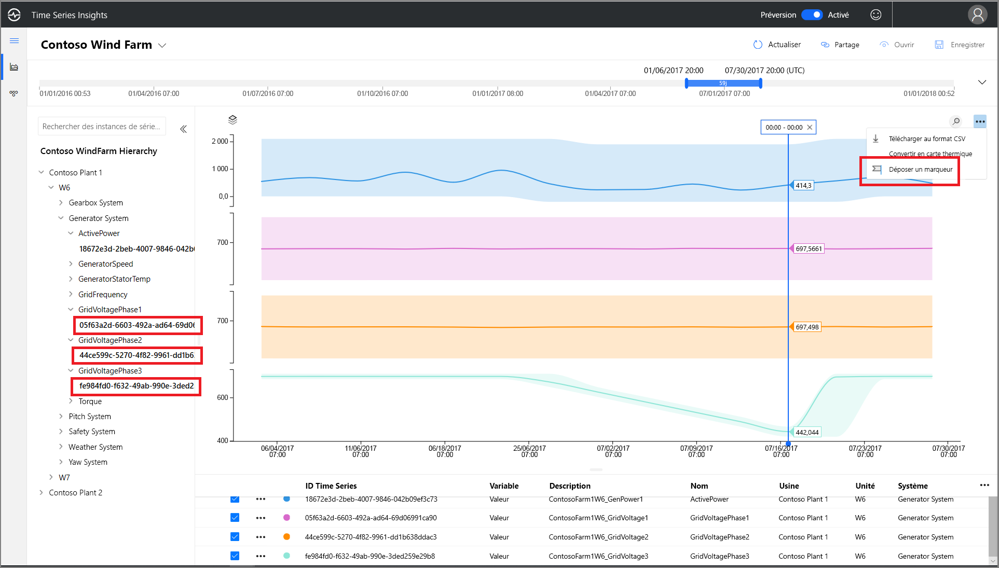
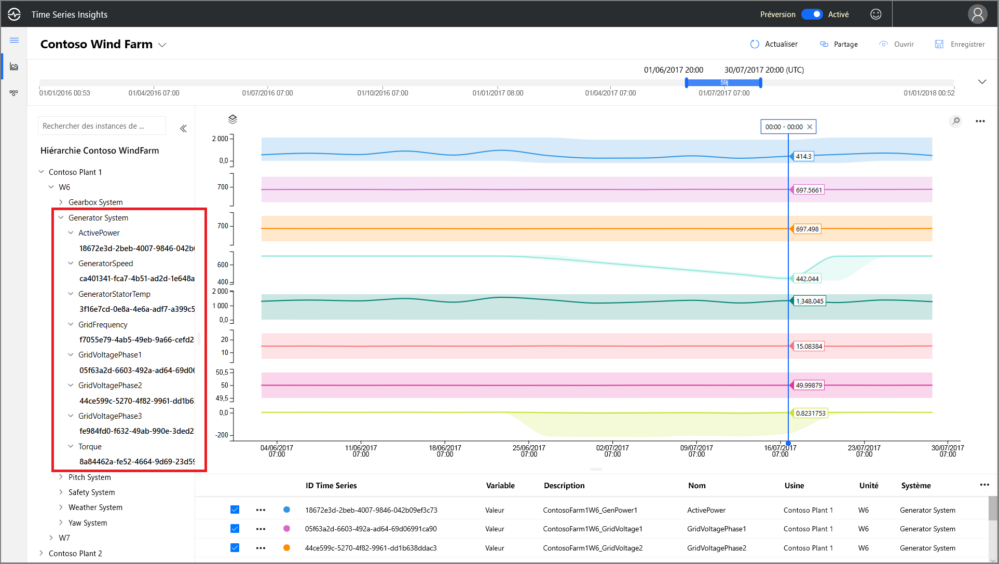

# Démarrage rapide : Explorer l’environnement de démonstration Azure Time Series Insights (préversion)

Ce guide de démarrage rapide vous permet de vous familiariser avec la préversion d’Azure Time Series Insights. La démonstration gratuite va vous faire découvrir les fonctionnalités clés qui ont été ajoutées à la préversion de Time Series Insights.

L’environnement de démonstration de la préversion fait appel à une société fictive, Contoso, qui exploite deux parcs éoliens comprenant chacun 10 éoliennes, chacune dotée de 20 capteurs qui transmettent des données toutes les minutes à Azure IoT Hub. Les capteurs collectent des informations sur les conditions météorologiques, le pas des pales et la position de lacet. Ils capturent également des donnés sur les performances de la génératrice, le comportement du multiplicateur et les moniteurs de sécurité.

 Vous allez apprendre à utiliser Time Series Insights pour rechercher des insights actionnables dans les données de Contoso. Vous allez également effectuer une brève analyse des causes racines pour mieux prédire les défaillances critiques et les tâches de maintenance.

## Découvrir l’Explorateur Time Series Insights dans un environnement de démonstration

L’Explorateur Time Series Insights (préversion) présente des données d’historique et l’analyse des causes racines. Pour commencer :

1. Créez un [compte Azure gratuit](https://azure.microsoft.com/free/?ref=microsoft.com&utm_source=microsoft.com&utm_medium=docs&utm_campaign=visualstudio) si ce n’est pas déjà fait.

1. Accédez à l’environnement de démonstration [Contoso Wind Farm](https://insights.timeseries.azure.com/preview/samples).  

1. Si vous y êtes invité, connectez-vous à l’Explorateur Time Series Insights à l’aide de vos informations d’identification de compte Azure.

## Utiliser les données d’historique

1. Intéressons-nous à l’éolienne **W7** du parc **Contoso Plant 1**.  

    * Sélectionnez une plage d’affichage allant du **01/01/17 20:00 au 10/03/17 20:00 (UTC)** .
    * Sélectionnez le capteur **Contoso Plant 1** > **W7** > **Generator System** > **GeneratorSpeed**. Passez en revue les valeurs résultantes.

      

1. Dernièrement, Contoso a détecté un incendie sur l’éolienne **W7**. Les opinions varient sur la cause directe de l’incendie. En y regardant de plus près, nous constatons que le capteur d’alerte incendie a été activé durant l’incendie.

    * Sélectionnez une plage d’affichage allant du **09/03/17 20:00 au 10/03/17 20:00 (UTC)** .
    * Sélectionnez le capteur **Safety System** > **FireAlert**.

      

1. Passez en revue les autres événements qui se sont produits au moment de l’incendie pour comprendre ce qui s’est passé. Notez l’augmentation de la pression de l’huile et des avertissements actifs avant l’incendie.

    * Sélectionnez le capteur **Pitch System** > **HydraulicOilPressure**.
    * Sélectionnez le capteur **Pitch System** > **ActiveWarning**.

      

1. Notez l’augmentation des capteurs associés à la pression de l’huile et aux avertissements actifs juste avant l’incendie. Développez la série chronologique affichée pour déterminer la présence d’autres signes précurseurs de l’incendie. Les deux capteurs fluctuent régulièrement au fil du temps, indiquant une tendance persistante et préoccupante.

    * Sélectionnez une plage d’affichage allant du **24/02/17 20:00 au 10/03/17 20:00 (UTC)** .

      

1. L’examen des deux années de données d’historique révèle un autre événement d’incendie associé à la même fluctuation des capteurs.

    * Sélectionnez une plage d’affichage allant du **01/01/16 to 31/12/17** (toutes les données).

      

Avec Azure Time Series Insights et les données de télémétrie de nos capteurs, nous avons découvert une tendance problématique à long terme dissimulée dans nos données d’historique. Avec ces nouveaux insights, nous pouvons :

> [!div class="checklist"]
> * Expliquer ce qui s’est réellement passé.
> * Corriger le problème.
> * Mettre en place des systèmes de notification d’alerte supérieurs.

## Analyse de la cause racine

1. Certains scénarios nécessitent une analyse sophistiquée pour découvrir des indices subtils dans les données. Sélectionnez l’éolienne **W6** en date du **25/6**.

    * Sélectionnez une plage d’affichage allant du **01/06/17 20:00 au 01/07/17 20:00 (UTC)** .
    * Sélectionnez ensuite le capteur **Contoso Plant 1** > **W6** > **Safety System** > **VoltageActuatorSwitchWarning**.

      

1. L’avertissement indique un problème au niveau de la tension émise par la génératrice. La puissance de sortie totale de la génératrice se trouve dans les limites de la normale compte tenu de notre intervalle actuel. Si nous augmentons notre intervalle, une autre tendance se dégage : une baisse nette.

    * Supprimez le capteur **VoltageActuatorSwitchWarning**.
    * Sélectionnez le capteur **Generator System** > **ActivePower**.
    * Choisissez **3d** comme intervalle.

      

1. En développant l’intervalle de temps, nous pouvons déterminer si le problème s’est arrêté ou s’il persiste.

    * Faites passer l’intervalle de temps à 60 jours.

      

1. Vous pouvez ajouter d’autres points de données de capteur pour fournir davantage de contexte. Plus il y a de capteurs, plus il est facile de cerner le problème. Nous allons placer un marqueur pour voir les valeurs réelles. 

    * Sélectionnez les capteurs **Generator System** > **GridVoltagePhase1**, **GridVoltagePhase2** et **GridVoltagePhase3**.
    * Placez un marqueur sur le dernier point de données dans la zone visible.

      

    Les trois capteurs de tension fonctionnent de manière comparable et dans les limites de la normale. Il semble que le capteur **GridVoltagePhase3** soit la cause du problème.

1. Avec l’ajout de données hautement contextuelles, la baisse au niveau de la phase 3 apparaît encore plus comme le problème. Nous sommes maintenant prêts à soumettre le problème à l’équipe de maintenance bien en amont avec des informations sur la cause de l’avertissement.  

    * Mettez à jour l’affichage pour superposer tous les capteurs **Generator System** sur la même échelle de graphique.

       

## Étapes suivantes

Vous êtes prêt à créer votre propre environnement Time Series Insights (préversion) :

> [!div class="nextstepaction"]
> [Planifier votre environnement Time Series Insights (préversion)](time-series-insights-update-plan.md)

Apprendre à naviguer dans la démonstration et ses fonctionnalités :

> [!div class="nextstepaction"]
> [Explorateur Time Series Insights (préversion)](time-series-insights-update-explorer.md)
