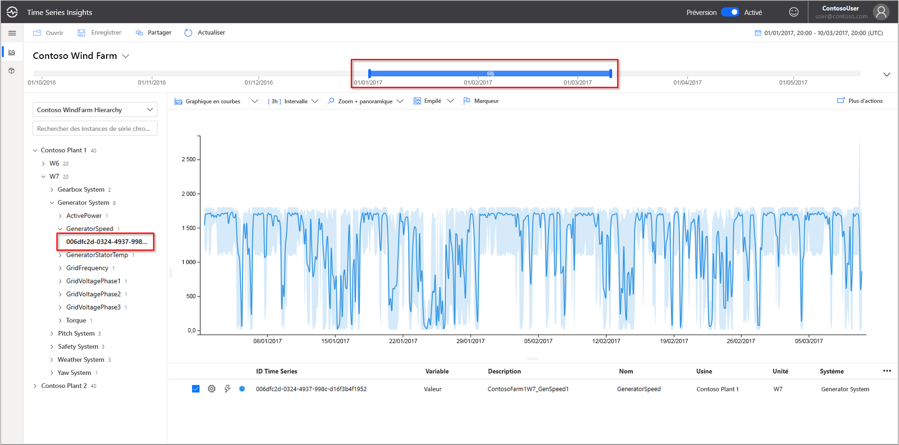
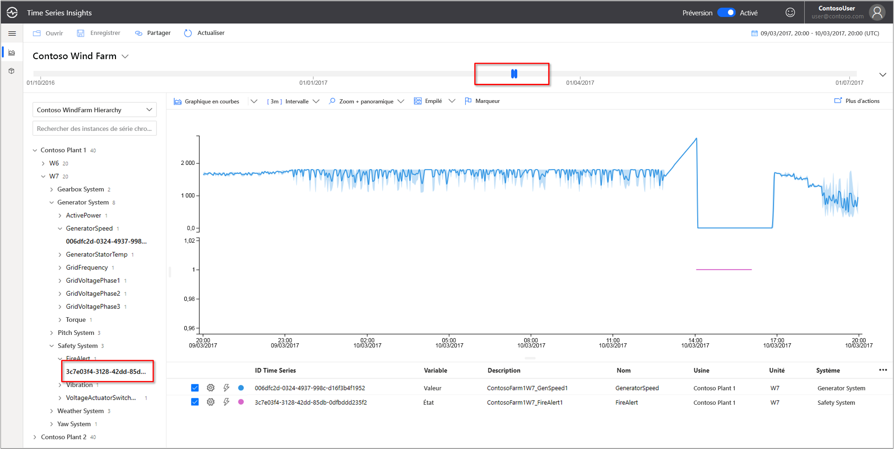
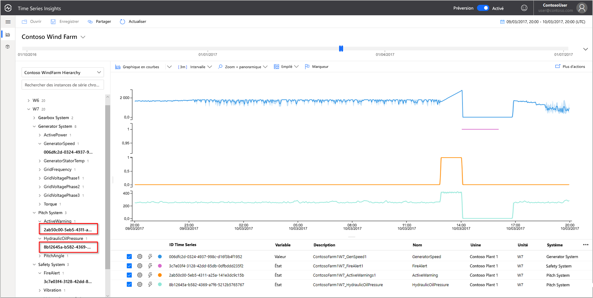
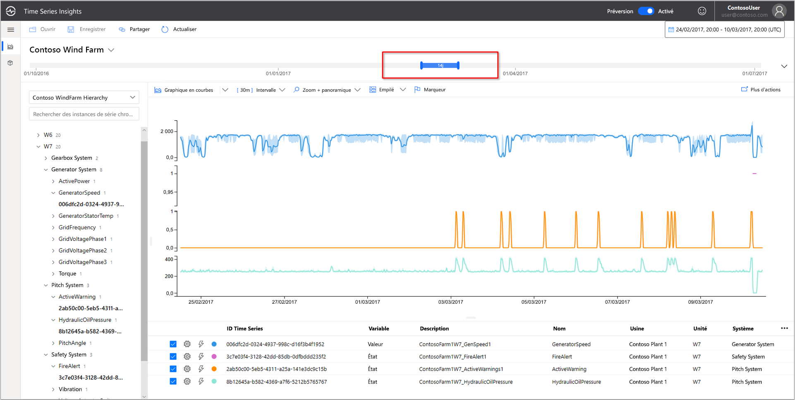
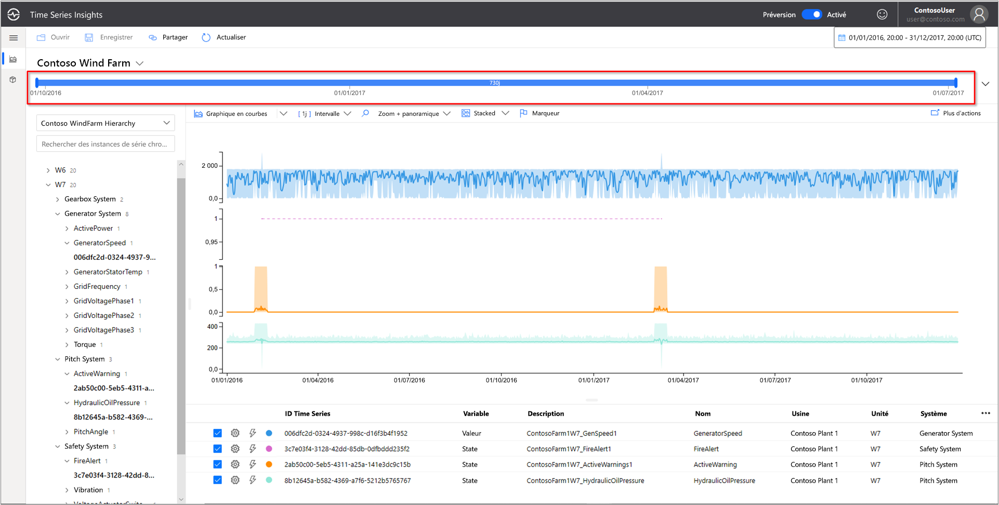
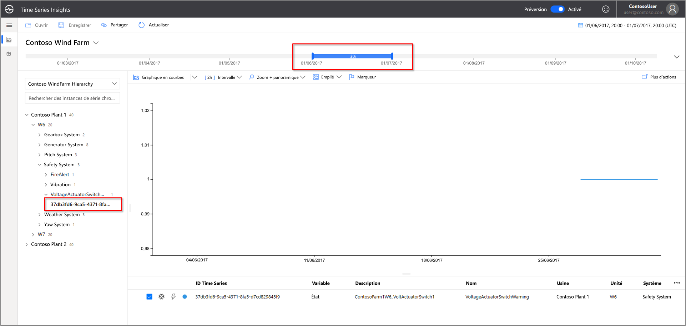
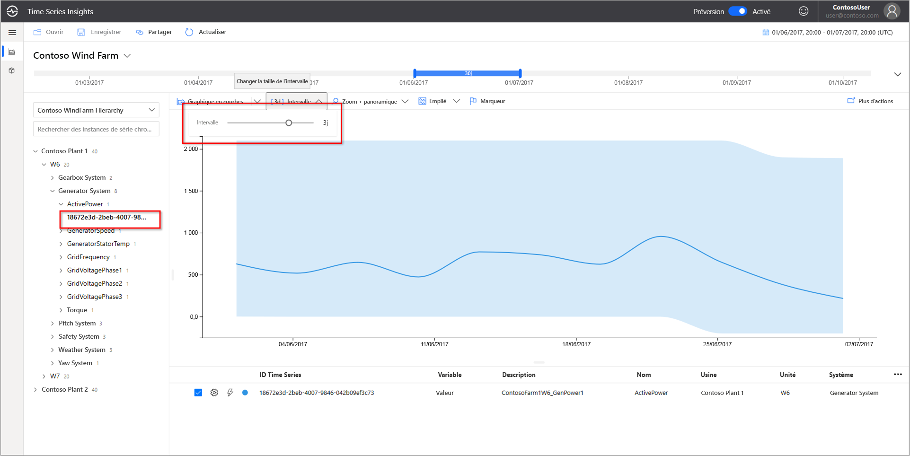
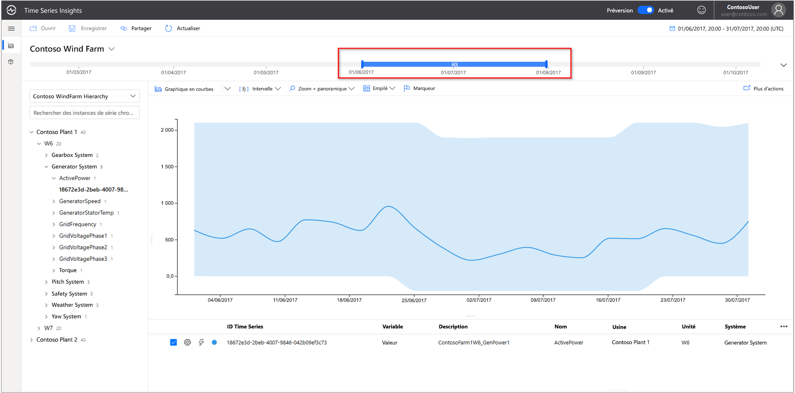
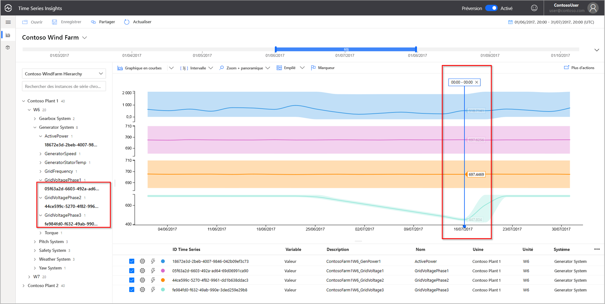
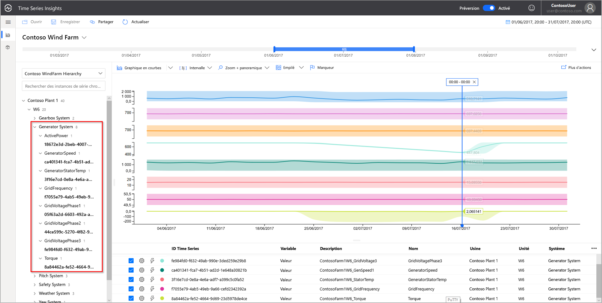

# Démarrage rapide : Explorer l’environnement de démonstration Azure Time Series Insights (préversion)

Ce guide de démarrage rapide vous permet de vous familiariser avec l’environnement en préversion d’Azure Time Series Insights. La démonstration gratuite vous permet de découvrir les fonctionnalités clés qui ont été ajoutées à la préversion de Time Series Insights.

L’environnement de démonstration de la préversion de Time Series Insights fait appel à une société fictive, Contoso, qui exploite deux parcs éoliens. Chaque parc contient 10 éoliennes. chacune dotée de 20 capteurs qui transmettent des données toutes les minutes à Azure IoT Hub. Les capteurs collectent des informations sur les conditions météorologiques, le pas des pales et la position de lacet. Ils capturent également des donnés sur les performances de la génératrice, le comportement du multiplicateur et les moniteurs de sécurité.

Dans ce démarrage rapide, vous allez apprendre à utiliser Time Series Insights pour rechercher des insights exploitables dans les données de Contoso. Vous allez également effectuer une brève analyse des causes racines pour mieux prédire les défaillances critiques et les tâches de maintenance.

> [!IMPORTANT]
> Créez un [compte Azure gratuit](https://azure.microsoft.com/free/?ref=microsoft.com&utm_source=microsoft.com&utm_medium=docs&utm_campaign=visualstudio) si vous n’en avez pas.

## Découvrir l’Explorateur Time Series Insights dans un environnement de démonstration

L’Explorateur Time Series Insights (préversion) présente des données historiques et l’analyse des causes racines. Pour commencer :

1. Accédez à l’environnement de  [démonstration Contoso Wind Farm](https://insights.timeseries.azure.com/preview/samples).  

1. Si vous y êtes invité, connectez-vous à l’Explorateur Time Series Insights à l’aide de vos informations d’identification de compte Azure.

## Utiliser les données d’historique

1. Intéressons-nous à l’éolienne **W7** du parc **Contoso Plant 1**.  

   1. Remplacez la plage d’affichage par **Du 01/01/17 20:00:00.00 au 10/03/17 20:00:00.00 (UTC)** .
   1. Pour sélectionner un capteur, choisissez **Contoso Plant 1** > **W7** > **Generator System** > **GeneratorSpeed**. Ensuite, passez en revue les valeurs qui sont affichées.

      

1. Dernièrement, Contoso a détecté un incendie sur l’éolienne **W7**. Les opinions varient sur ce qui a provoqué l’incendie. Dans Time Series Insights, nous pouvons constater que le capteur d’alerte incendie a été activé au cours de l’incendie.

   1. Remplacez la plage d’affichage par **Du 09/03/17 20:00:00.00 au 10/03/17 20:00:00.00 (UTC)** .
   1. Sélectionnez **Safety System** > **FireAlert**.

      

1. Passez en revue les autres événements qui se sont produits au moment de l’incendie pour comprendre ce qui s’est passé. Notez l’augmentation de la pression de l’huile et des avertissements actifs avant l’incendie.

   1. Sélectionnez **Pitch System** > **HydraulicOilPressure**.
   1. Sélectionnez **Pitch System** > **ActiveWarning**.

      

1. Notez l’augmentation des capteurs associés à la pression de l’huile et aux avertissements actifs juste avant l’incendie. Développez la série chronologique affichée pour déterminer la présence d’autres signes précurseurs de l’incendie. Les deux capteurs ont fluctué de manière cohérente au fil du temps. Les fluctuations indiquent un modèle persistant et préoccupant.

    * Remplacez la plage d’affichage par **Du 24/02/17 20:00:00.00 au 10/03/17 20:00:00.00 (UTC)** .

      

1. L’examen des deux années de données d’historique révèle un autre événement d’incendie associé à la même fluctuation des capteurs.

    * Modifiez la plage d’affichage sur **01/01/16 au 31/12/17** (toutes les données).

      

Avec Time Series Insights et la télémétrie des capteurs, nous avons découvert une tendance à long terme dissimulée dans les données historiques. Avec ces nouveaux insights, nous pouvons :

* Expliquer ce qui s’est réellement passé.
* Corriger le problème.
* Mettre en place de meilleurs systèmes de notification d’alerte.

## Analyse de la cause racine

1. Certains scénarios exigent une analyse sophistiquée pour découvrir des indices dans les données. Sélectionnez l’éolienne **W6** en date du **25/6**.

    1. Remplacez la plage d’affichage par **Du 01/06/17 20:00:00.00 au 01/07/17 20:00:00.00 (UTC)** .
    1. Sélectionnez **Contoso Plant 1** > **W6** > **Safety System** > **VoltageActuatorSwitchWarning**.

       

1. L’avertissement indique un problème au niveau de la tension du générateur. La puissance de sortie totale du générateur se trouve dans les paramètres normaux dans l’intervalle actuel. Si nous augmentons notre intervalle, une autre tendance se dégage. Il se produit une nette baisse.

    1. Supprimez le capteur **VoltageActuatorSwitchWarning**.
    1. Sélectionnez **Generator System** > **ActivePower**.
    1. Modifiez l’intervalle sur **3d**.

       

1. En développant l’intervalle de temps, nous pouvons déterminer si le problème s’est arrêté ou s’il persiste.

    * Faites passer l’intervalle de temps à 60 jours.

      

1. Vous pouvez ajouter d’autres points de données de capteur pour fournir davantage de contexte. Plus il y a de capteurs, plus il est facile de cerner le problème. Nous allons placer un marqueur pour voir les valeurs réelles. 

    1. Sélectionnez **Generator System**, puis sélectionnez trois capteurs : **GridVoltagePhase1**, **GridVoltagePhase2** et **GridVoltagePhase3**.
    1. Placez un marqueur sur le dernier point de données dans la zone visible.

       

    Deux des capteurs de tension fonctionnent de manière comparable et dans les limites de la normale. Il semble que le capteur **GridVoltagePhase3** soit la cause du problème.

1. Avec l’ajout de données hautement contextuelles, la baisse au niveau de la phase 3 apparaît encore plus comme le problème. Maintenant, nous avons une bonne piste sur la cause de l’avertissement. Nous sommes prêts à signaler le problème à notre équipe de maintenance.  

    * Modifiez l’affichage pour superposer tous les capteurs **Generator System** sur la même échelle de graphique.

      

## Nettoyer les ressources

Maintenant que vous avez suivi le démarrage rapide, nettoyez les ressources que vous avez créées :

1. Dans le menu de gauche du [Portail Azure](https://portal.azure.com), sélectionnez **Toutes les ressources**, puis recherchez votre groupe de ressources Azure Time Series Insights.
1. Vous pouvez supprimer l’intégralité du groupe de ressources (et toutes les ressources qu’il contient) en sélectionnant **Supprimer** ou supprimer chaque ressource individuellement.

## Étapes suivantes

Vous êtes prêt à créer votre propre environnement en préversion Time Series Insights. Pour commencer :

> [!div class="nextstepaction"]
> [Planifier votre environnement Time Series Insights (préversion)](time-series-insights-update-plan.md)

Apprenez à utiliser la démonstration et ses fonctionnalités :

> [!div class="nextstepaction"]
> [Explorateur Time Series Insights (préversion)](time-series-insights-update-explorer.md)