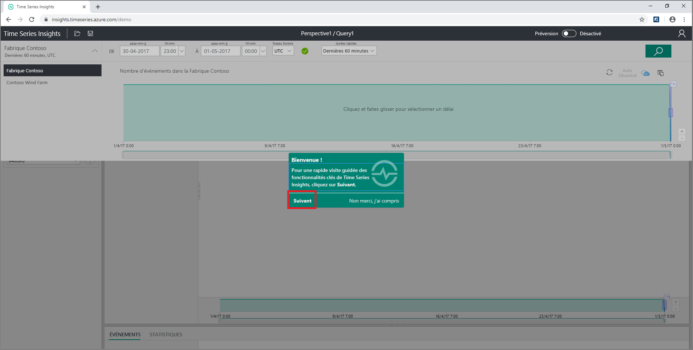
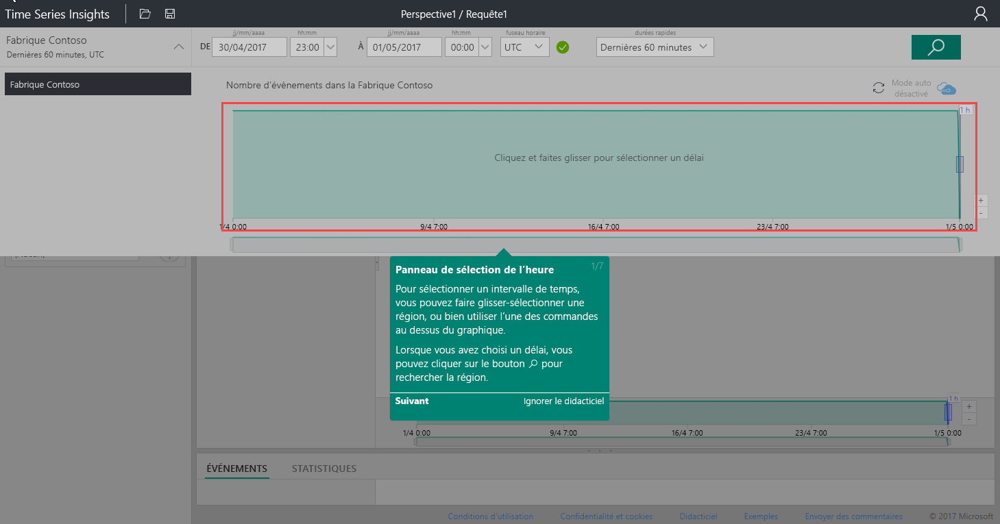
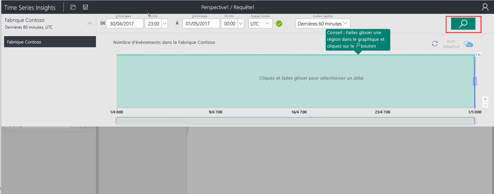
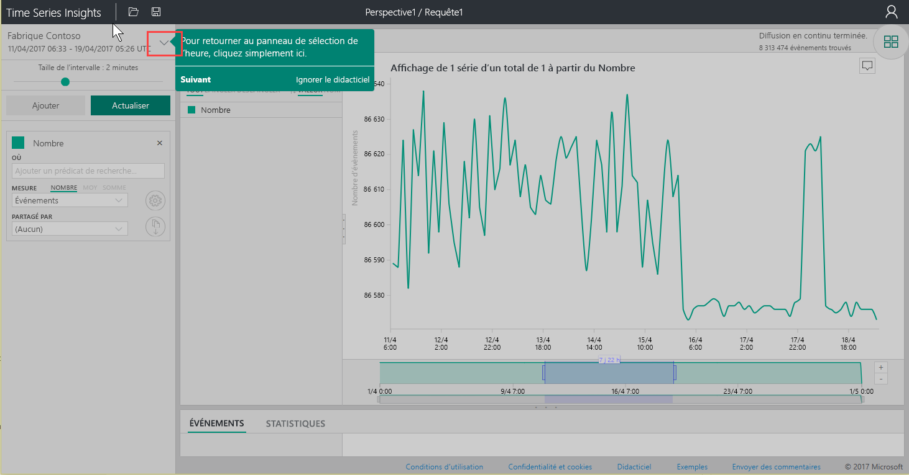
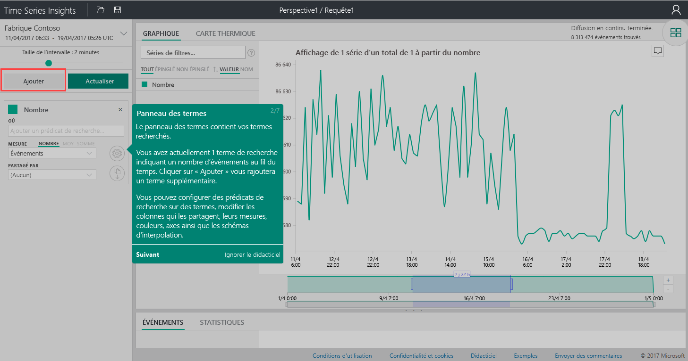
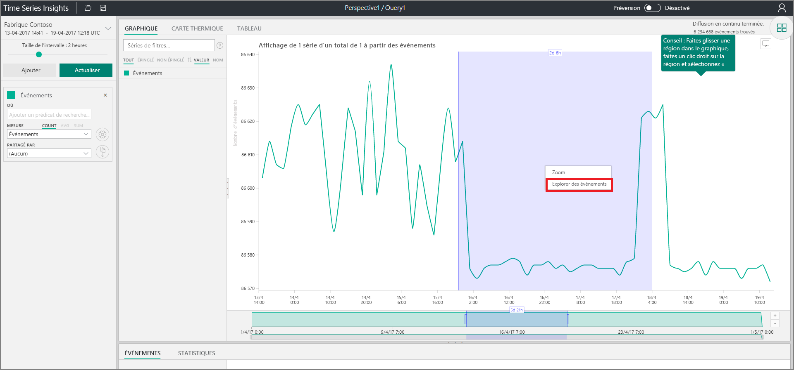
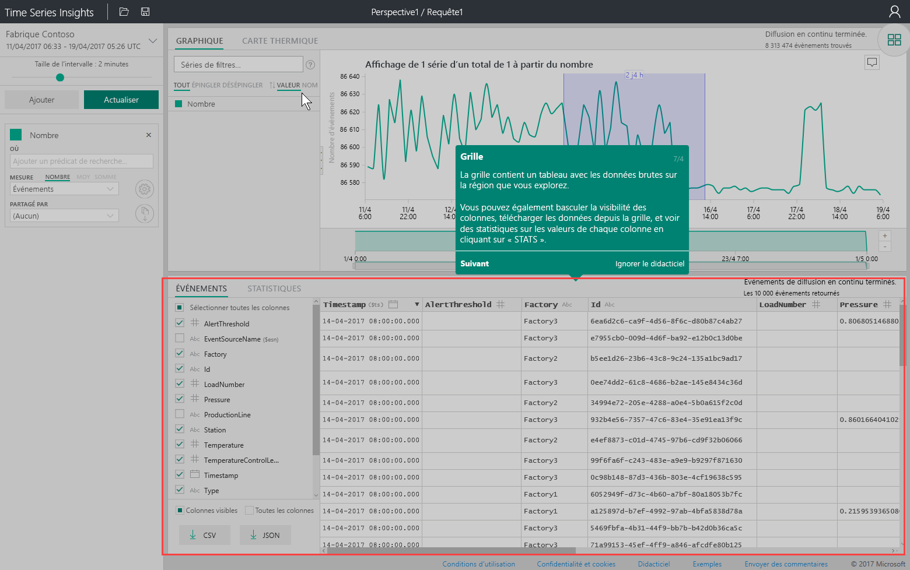
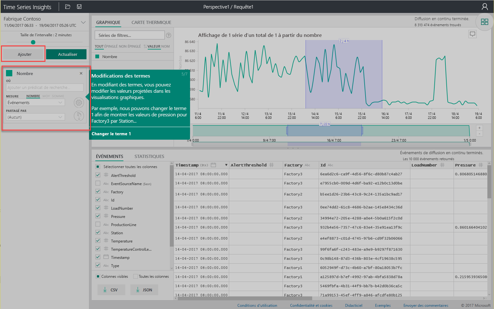
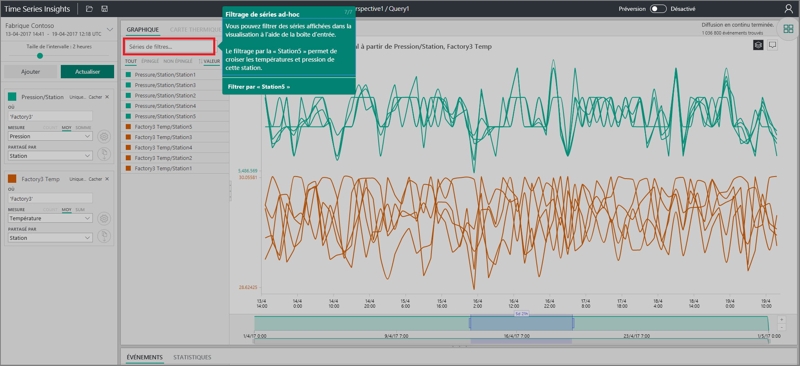

# Démarrage rapide : Explorer Azure Time Series Insights

Ce guide de démarrage rapide consacré à l’explorateur Azure Time Series Insights vous aide à démarrer avec Time Series Insights dans un environnement de démonstration gratuit. Ce guide de démarrage rapide explique comment utiliser votre navigateur web pour visualiser de grands volumes de données IoT avant de faire le tour de fonctionnalités clés désormais en disponibilité générale.

Azure Time Series Insights est un service entièrement managé d’analyse, de stockage et de visualisation qui simplifie la découverte et l’analyse simultanées de milliards d’événements IoT. Cette solution vous donne une vue globale de vos données afin que vous puissiez valider rapidement votre solution IoT et éviter des temps morts coûteux d’appareils stratégiques. Azure Time Series Insights vous aide à découvrir des tendances masquées, détecter les anomalies et effectuer des analyses de cause première quasiment en temps réel.

Pour plus de flexibilité, vous pouvez ajouter Azure Time Series Insights à des applications préexistantes via ses [API REST](./time-series-insights-update-tsq.md) puissantes et son [kit SDK client](https://github.com/microsoft/tsiclient). Vous pouvez utiliser les API pour stocker, interroger et consommer des données de série chronologique dans l’application cliente de votre choix. Vous pouvez également utiliser le kit SDK client pour ajouter des composants d’interface utilisateur à votre application existante.

Ce guide de démarrage rapide consacré à l’explorateur Time Series Insights propose une visite guidée des fonctionnalités désormais en disponibilité générale.

> [!IMPORTANT]
> Créez un [compte Azure gratuit](https://azure.microsoft.com/free/?ref=microsoft.com&utm_source=microsoft.com&utm_medium=docs&utm_campaign=visualstudio) si ce n’est déjà fait.

## Préparer l’environnement de démonstration

1. Dans votre navigateur, accédez à la [démonstration de la disponibilité générale](https://insights.timeseries.azure.com/demo).

1. Si vous y êtes invité, connectez-vous à l’Explorateur Time Series Insights à l’aide de vos informations d’identification de compte Azure.

1. La page de présentation Time Series Insights s’affiche. Sélectionnez **Suivant** pour commencer la visite guidée.

   

## Explorer l’environnement de démonstration

1. Le **Volet de sélection de temps** s’affiche. Utilisez ce volet pour sélectionner un intervalle de temps à visualiser.

   

1. Sélectionnez un intervalle de temps et faites-le glisser dans la région. Ensuite, sélectionner **Rechercher**.

   

   Time Series Insights affiche une visualisation de graphique pour l’intervalle de temps spécifié. Vous pouvez effectuer diverses actions dans le graphique en courbes. Par exemple, vous pouvez filtrer, épingler, trier et empiler.

   Pour revenir au **volet de sélection de temps**, sélectionnez la flèche vers le bas, comme illustré :

   

1. Sélectionnez **Ajouter** dans le **Volet de temps** pour ajouter un nouveau terme de recherche.

   

1. Dans le graphique, vous pouvez sélectionner une région en cliquant avec le bouton droit de la région et en sélectionnant **Explorer les événements**.

   

   Une grille de vos données brutes s’affiche à partir de la région que vous explorez.

   

## Sélectionner et filtrer les données

1. Modifiez vos termes pour changer les valeurs dans le graphique. Ajoutez un autre terme pour effectuer une corrélation croisée entre différents types de valeurs.

   

1. Entrez une condition de filtre dans la zone **Filtrer les séries** pour le filtrage improvisé de séries. Pour le démarrage rapide, saisissez **Station5** pour avoir une corrélation croisée de la température et de la pression pour cette station.

   

Après avoir terminé le démarrage rapide, vous pouvez tester l’exemple de jeu de données pour créer différentes visualisations.

## Supprimer des ressources

Maintenant que vous avez terminé le didacticiel, nettoyez les ressources que vous avez créées :

1. Dans le menu de gauche du [portail Azure](https://portal.azure.com), sélectionnez **Toutes les ressources**, puis votre groupe de ressources Azure Time Series Insights.
1. Vous pouvez supprimer l’intégralité du groupe de ressources (et toutes les ressources qu’il contient) en sélectionnant **Supprimer** ou supprimer chaque ressource individuellement.

## Étapes suivantes

Vous êtes prêt à créer votre propre environnement Time Series Insights :
> [!div class="nextstepaction"]
> [Planifier votre environnement Time Series Insights](time-series-insights-environment-planning.md)
