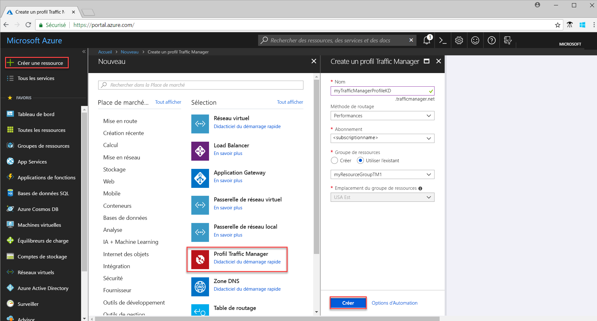
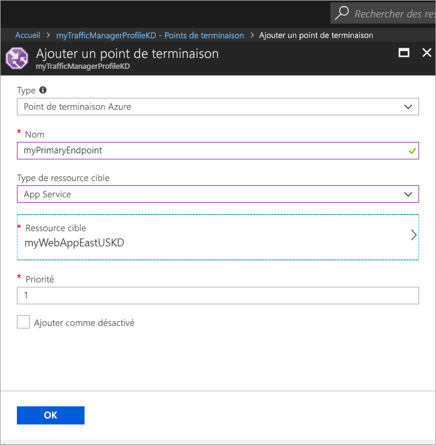

# Démarrage rapide : créer un profil Traffic Manager pour une application web hautement disponible

Ce démarrage rapide explique comment créer un profil Traffic Manager qui assure une haute disponibilité pour votre application web. 

Le scénario décrit dans ce démarrage rapide inclut deux instances d’une application web en cours d’exécution dans différentes régions Azure. Un profil Traffic Manager basé sur une [priorité de point de terminaison](traffic-manager-routing-methods.md#priority) est créé pour vous aider à rediriger le trafic utilisateur vers le site principal qui exécute l’application. Traffic Manager surveille en continu l’application web et fournit un basculement automatique vers le site de sauvegarde lorsque le site principal n’est pas disponible.

Si vous n’avez pas d’abonnement Azure, créez un [compte gratuit](https://azure.microsoft.com/free/?WT.mc_id=A261C142F) avant de commencer.

## Connexion à Azure 
Connectez-vous au portail Azure sur https://portal.azure.com.

## Prérequis
Ce démarrage rapide nécessite le déploiement deux instances d’une application web en cours d’exécution dans différentes régions Azure (*USA Est* et *Europe Ouest*). Les deux instances d’application web servent de points de terminaison principal et de sauvegarde pour Traffic Manager.

1. Dans l’angle supérieur gauche de l’écran, sélectionnez **Créer une ressource** > **Web** > **Application web** > **Créer**.
2. Dans **Application Web**, entrez ou sélectionnez les informations suivantes et entrez les paramètres par défaut lorsqu’aucun n’est spécifié :

     | Paramètre         | Valeur     |
     | ---              | ---  |
     | NOM           | Entrez un nom unique pour votre application web  |
     | Groupe de ressources          | Sélectionnez **Nouveau**, puis tapez *myResourceGroupTM1* |
     | Plan/lieu App Service         | Sélectionnez **Nouveau**.  Dans le plan App Service, entrez *myAppServicePlanEastUS*, puis sélectionnez **OK**. 
     |      Lieu  |   USA Est        |
    |||

3. Sélectionnez **Créer**.
4. Un site Web par défaut est créé lorsque l’application web est déployée avec succès.
5. Répétez les étapes 1 à 3 pour créer un deuxième site Web dans une autre région Azure avec les paramètres suivants :

     | Paramètre         | Valeur     |
     | ---              | ---  |
     | NOM           | Entrez un nom unique pour votre application web  |
     | Groupe de ressources          | Sélectionnez **Nouveau**, puis tapez *myResourceGroupTM2* |
     | Plan/lieu App Service         | Sélectionnez **Nouveau**.  Dans le plan App Service, entrez *myAppServicePlanEastUS*, puis sélectionnez **OK**. 
     |      Lieu  |   Europe Ouest      |
    |||

## Créer un profil Traffic Manager
Créez un profil Traffic manager qui redirige le trafic utilisateur en fonction de la priorité du point de terminaison.

1. Dans l’angle supérieur gauche de l’écran, cliquez sur **Créer une ressource** > **Mise en réseau** > **Profil Traffic Manager** > **Créer**.
2. Dans **Créer un profil Traffic Manager**, entrez ou sélectionnez les informations suivantes, acceptez les valeurs par défaut pour les autres paramètres, puis choisissez **Créer** :
    
    | Paramètre                 | Valeur                                              |
    | ---                     | ---                                                |
    | NOM                   | Ce nom doit être unique au sein de la zone trafficmanager.net et résulte dans le nom DNS **trafficmanager.net** qui est utilisé pour accéder à votre profil Traffic Manager.|
    | Méthode de routage          | Sélectionnez la méthode de routage en fonction de la **Priorité**.|
    | Abonnement            | Sélectionnez votre abonnement.|
    | Groupe de ressources          | Sélectionnez **Existant**, puis *myResourceGroupTM1*.|
    |Lieu |Ce paramètre fait référence à l’emplacement du groupe de ressources et n’a pas d’impact sur le profil Traffic Manager qui sera déployé globalement.|
    |||
    
    
   

## Ajouter des points de terminaison Traffic Manager

Ajoutez le site web dans la région *USA Est* en tant que point de terminaison principal pour acheminer tout le trafic utilisateur. Ajoutez le site web dans la région *Europe Ouest* en tant que point de terminaison de sauvegarde. Lorsque le point de terminaison principal n’est pas disponible, le trafic est automatiquement acheminé vers le point de terminaison secondaire.

1. Dans la barre de recherche du portail, recherchez le nom du profil Traffic Manager que vous avez créé dans la section précédente et sélectionnez le profil dans les résultats affichés.
2. Dans **Profil Traffic Manager**, dans la section **Paramètres**, cliquez sur **Points de terminaison**, puis sur **Ajouter**.
3. Entrez ou sélectionnez les informations suivantes, acceptez les valeurs par défaut pour les autres paramètres, puis cliquez sur **OK** :

    | Paramètre                 | Valeur                                              |
    | ---                     | ---                                                |
    | type                    | Point de terminaison Azure                                   |
    | NOM           | myPrimaryEndpoint                                        |
    | Type de ressource cible           | App Service                          |
    | Ressource cible          | **Choisissez une ressource cible** pour afficher la liste des applications web sous le même abonnement. Dans **Ressources**, choisissez le service d’application que vous souhaitez ajouter en tant que premier point de terminaison. |
    | Priorité               | Sélectionnez **1**. Ainsi, tout le trafic est dirigé vers ce point de terminaison, s’il est intègre.    |
    
4. Répétez les étapes 2 et 3 pour le prochain point de terminaison d’applications web. Veillez à ajouter à sa valeur de **Priorité** définie sur **2**.
5.  Lorsque l’ajout de deux points de terminaison est terminé, ceux-ci s’affichent dans **Profil Traffic Manager** avec leur état de surveillance défini sur **En ligne**.

    

## Tester le profil Traffic Manager
Dans cette section, vous déterminez tout d’abord le nom de domaine de votre profil Traffic Manager, puis vous affichez comment Traffic Manager bascule vers le point de terminaison secondaire lorsque le point de terminaison principal n’est pas disponible.
### Déterminer le nom DNS
1.  Dans la barre de recherche du portail, recherchez le nom du **profil Traffic Manager** que vous avez créé dans la section précédente. Dans les résultats affichés, cliquez sur le profil Traffic Manager.
2. Cliquez sur **Overview**.
3. Le **profil Traffic Manager** affiche le nom DNS de votre profil Traffic Manager nouvellement créé.
  
   

### Afficher Traffic Manager en action

1. Dans un navigateur web, tapez le nom DNS de votre profil Traffic Manager pour afficher le site web par défaut de votre application web. Dans ce scénario de démarrage rapide, toutes les demandes sont acheminées vers le point de terminaison principal défini sur **Priorité 1**.

2. Pour afficher le basculement de Traffic Manager en action, désactivez votre site principal comme suit :
    1. Dans la page Profil Traffic Manager, sélectionnez **Paramètres**>**Points de terminaison**>*MyPrimaryEndpoint*.
    2. Dans *MyPrimaryEndpoint*, sélectionnez **Désactivé**. 
    3. L’état du point de terminaison principal *MyPrimaryEndpoint* affiche maintenant **Désactivé**.
3. Copiez le nom DNS de votre profil Traffic Manager de l’étape précédente pour afficher avec succès le site web dans un navigateur web. Lorsque le point de terminaison principal est désactivé, le trafic utilisateur est acheminé vers le point de terminaison secondaire.

## Supprimer les ressources
Lorsque vous n’en avez plus besoin, supprimez le groupe de ressources, les application web et toutes les ressources associées. Pour ce faire, sélectionnez les groupes de ressources (*myResourceGroupTM1* et *myResourceGroupTM2*) et cliquez sur **Supprimer**.

## Étapes suivantes
Au cours de ce démarrage rapide, vous avez créé un profil Traffic Manager qui vous permet de rediriger le trafic utilisateur pour une application web à haute disponibilité. Pour en savoir plus sur l’acheminement du trafic, passez aux didacticiels Traffic Manager.

> [!div class="nextstepaction"]
> [Didacticiels Traffic Manager](traffic-manager-configure-performance-routing-method.md)

