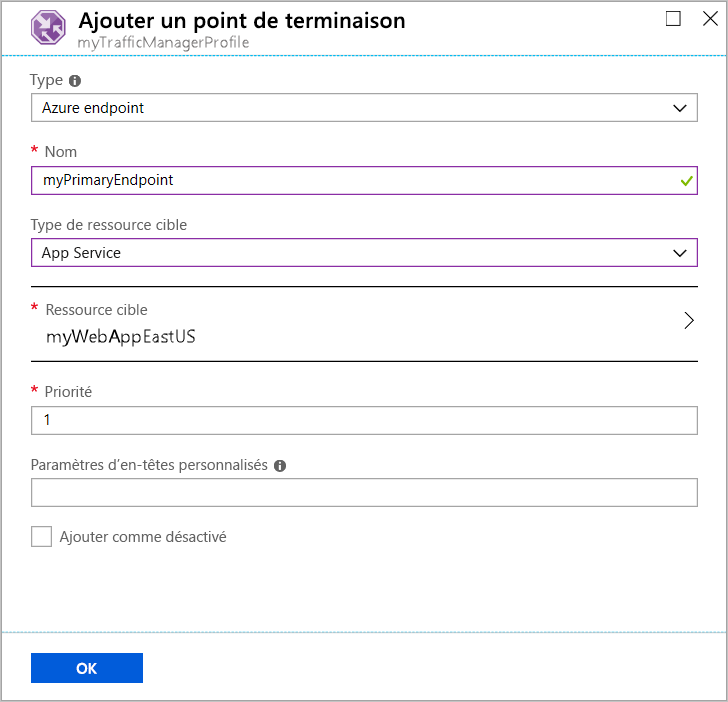
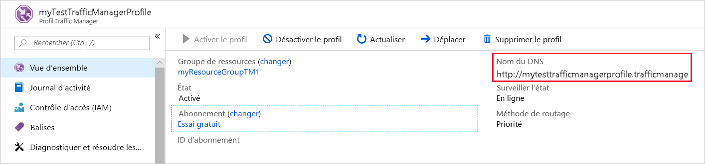
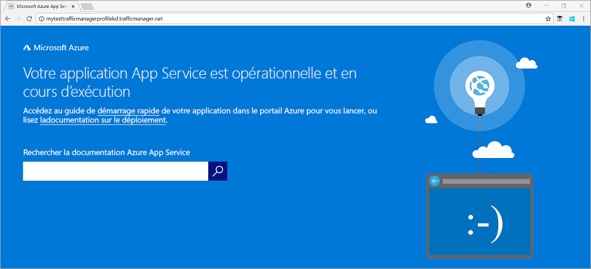

# Démarrage rapide : Créer un profil Traffic Manager à l’aide du portail Azure

Ce démarrage rapide explique comment créer un profil Traffic Manager qui assure une haute disponibilité pour votre application web.

Dans ce démarrage rapide, il est question de deux instances d’une application web. Chacune d’elles s’exécute dans une région Azure distincte. Vous allez créer un profil Traffic Manager en fonction de la [priorité du point de terminaison](traffic-manager-routing-methods.md#priority-traffic-routing-method). Le profil dirige le trafic utilisateur vers le site principal exécutant l’application web. Traffic Manager supervise en permanence l’application web. Si le site principal est indisponible, il assure un basculement automatique vers le site de secours.

Si vous n’avez pas d’abonnement Azure, créez un [compte gratuit](https://azure.microsoft.com/free/?WT.mc_id=A261C142F) maintenant.

## Connexion à Azure

Connectez-vous au [portail Azure](https://portal.azure.com).

## Prérequis

Pour ce guide de démarrage rapide, vous aurez besoin de deux instances d’une application web déployée dans deux régions Azure différentes (*USA Est* et *Europe Ouest*). Chacune servira de point de terminaison principal et de point de terminaison de basculement à Traffic Manager.

1. En haut à gauche de l’écran, sélectionnez **Créer une ressource** > **Web** > **Application web**.

1. Dans **Créer une application web**, tapez ou sélectionnez les valeurs suivantes sous l’onglet **De base** :

   - **Abonnement** > **Groupe de ressources** : Sélectionnez **Créer un nouveau**, puis tapez **myResourceGroupTM1**.
   - **Détails de l’instance** > **Nom** : Tapez *myWebAppEastUS*.
   - **Détails de l’instance** > **Publier** : Sélectionnez **Code**.
   - **Instance Details** > **Pile d’exécution** : Sélectionnez **ASP.net v 4.7**.
   - **Détails de l’instance** > **Système d’exploitation** : Sélectionnez **Windows**.
   - **Détails de l’instance** > **Région** :  Sélectionnez **USA Est**.
   - **Plan App Service** > **Plan Windows (USA Est)**  : Sélectionnez **Créer un nouveau**, puis tapez **myAppServicePlanEastUS**
   - **Plan App Service** > **Référence et taille** : Sélectionnez **Standard S1**.
   
3. Sélectionnez l’onglet **Surveillance**, ou **Suivant:Surveillance**.  Sous **Surveillance**, définissez **Application Insights** > **Activer Application Insights** sur **Non**.

4. Sélectionnez **Examiner et créer**.

5. Vérifiez les paramètres, puis cliquez sur **Créer**.  Quand l’application web est déployé correctement, elle crée un site web par défaut.

6. Suivez les étapes pour créer une deuxième application web nommée *myWebAppWestEurope*, avec le nom de **Groupe de ressources** *myResourceGroupTM2*, la **Région** *Europe Ouest*, le nom de **Plan App Service** **myAppServicePlanWestEurope** et tous les autres paramètres identiques à *myWebAppEastUS*.

## Créer un profil Traffic Manager

Créez un profil Traffic Manager qui dirige le trafic utilisateur en fonction de la priorité du point de terminaison.

1. En haut à gauche de l’écran, sélectionnez **Créer une ressource** > **Mise en réseau** > **Profil Traffic Manager**.
2. Dans **Créer un profil Traffic Manager**, entrez ou sélectionnez ces paramètres :

    | Paramètre | Valeur |
    | --------| ----- |
    | Nom | Attribuez un nom unique à votre profil Traffic Manager.|
    | Méthode de routage | Sélectionnez **Priorité**.|
    | Abonnement | Sélectionnez l’abonnement auquel vous souhaitez appliquer le profil Traffic Manager. |
    | Resource group | Sélectionnez *myResourceGroupTM1*.|
    | Emplacement |Ce paramètre fait référence à l’emplacement du groupe de ressources. Il n’a aucun effet sur le profil Traffic Manager qui sera déployé globalement.|

3. Sélectionnez **Create** (Créer).

## Ajouter des points de terminaison Traffic Manager

Ajoutez le site web dans la région *USA Est* en tant que point de terminaison principal pour acheminer tout le trafic utilisateur. Ajoutez le site web dans la région *Europe Ouest* comme point de terminaison de basculement. Quand le point de terminaison principal n’est pas disponible, le trafic est automatiquement routé vers le point de terminaison de basculement.

1. Dans la barre de recherche du portail, entrez le nom du profil Traffic Manager que vous avez créé dans la section précédente.
2. Sélectionnez le profil dans les résultats de recherche.
3. Dans **Profil Traffic Manager**, dans la section **Paramètres**, sélectionnez **Points de terminaison**, puis sélectionnez **Ajouter**.
4. Entrez ou sélectionnez ces paramètres :

    | Paramètre | Valeur |
    | ------- | ------|
    | Type | Sélectionnez **Point de terminaison Azure**. |
    | Nom | Entrez *myPrimaryEndpoint*. |
    | Type de ressource cible | Sélectionner **App Service**. |
    | Ressource cible | Sélectionnez **Choisir un service d’application** > **USA Est**. |
    | Priority | Sélectionnez **1**. Tout le trafic se dirige vers ce point de terminaison quand il est sain. |

    

5. Sélectionnez **OK**.
6. Pour créer un point de terminaison de basculement pour votre deuxième région Azure, répétez les étapes 3 et 4 avec ces paramètres :

    | Paramètre | Valeur |
    | ------- | ------|
    | Type | Sélectionnez **Point de terminaison Azure**. |
    | Nom | Entrez *myFailoverEndpoint*. |
    | Type de ressource cible | Sélectionner **App Service**. |
    | Ressource cible | Sélectionnez **Choisir un service d’application** > **Europe Ouest**. |
    | Priority | Sélectionnez **2**. Tout le trafic se dirige vers ce point de terminaison de basculement si le point de terminaison principal n’est pas sain. |

7. Sélectionnez **OK**.

Une fois que vous avez ajouté les deux points de terminaison, il figurent dans **Profil Traffic Manager**. Notez que leur état de supervision est maintenant **En ligne**.

## Tester le profil Traffic Manager

Dans cette section, vous allez vérifier le nom de domaine de votre profil Traffic Manager. Vous allez aussi configurer le point de terminaison principal pour le rendre indisponible. Enfin, vous allez pouvoir constater que l’application est toujours disponible. Cela est dû au fait que Traffic Manager envoie le trafic au point de terminaison de basculement.

### Vérifier le nom DNS

1. Dans la barre de recherche du portail, recherchez le nom du **profil Traffic Manager** que vous avez créé dans la section précédente.
2. Sélectionnez le profil Traffic Manager. La **Vue d’ensemble** s’affiche.
3. Le **profil Traffic Manager** affiche le nom DNS de votre profil Traffic Manager nouvellement créé.
  
   

### Afficher Traffic Manager en action

1. Dans un navigateur web, entrez le nom DNS de votre profil Traffic Manager pour afficher le site web par défaut de votre application web.

    > [!NOTE]
    > Dans ce scénario de démarrage rapide, toutes les demandes sont routées vers le point de terminaison principal. Il est défini sur **Priorité 1**.

    

2. Pour voir le basculement de Traffic Manager en action, désactivez votre site principal :
    1. Dans la page Profil Traffic Manager, à partir de la **Vue d’ensemble**, sélectionnez **myPrimaryEndpoint**.
    2. Dans *MyPrimaryEndpoint*, sélectionnez **Désactivé** > **Enregistrer**.
    3. Fermez **myPrimaryEndpoint**. Notez que l’état est maintenant **Désactivé**.
3. Copiez le nom DNS de votre profil Traffic Manager de l’étape précédente pour afficher le site web dans une nouvelle session de navigateur web.
4. Vérifiez que l’application web est toujours disponible.

Le point de terminaison principal n’étant pas disponible, vous avez été routé vers le point de terminaison de basculement.

## Nettoyer les ressources

Une fois que vous avez terminé, supprimez les groupes de ressources, les applications web et toutes les ressources associées. Pour ce faire, sélectionnez individuellement chaque élément dans le tableau de bord, puis sélectionnez **Supprimer** en haut de chaque page.

## Étapes suivantes

Dans ce guide de démarrage rapide, vous avez créé un profil Traffic Manager. Celui-ci vous permet de diriger le trafic utilisateur pour les applications web à haute disponibilité. Pour plus d’informations sur le routage du trafic, passez aux tutoriels Traffic Manager.

> [!div class="nextstepaction"]
> [Didacticiels Traffic Manager](tutorial-traffic-manager-improve-website-response.md)
