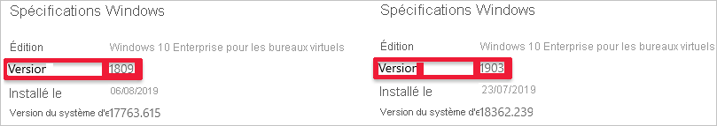

# <a name="session-host-virtual-machine-configuration"></a>Configuration d’une machine virtuelle hôte de session

Utilisez cet article pour résoudre les problèmes rencontrés lors de la configuration des machines virtuelles hôtes de session Windows Virtual Desktop.

## <a name="provide-feedback"></a>Fournir des commentaires

Rendez-vous sur le site [Windows Virtual Desktop Tech Community](https://techcommunity.microsoft.com/t5/Windows-Virtual-Desktop/bd-p/WindowsVirtualDesktop) pour discuter du service Windows Virtual Desktop avec l’équipe de produit et les membres actifs de la communauté.

## <a name="vms-are-not-joined-to-the-domain"></a>Les machines virtuelles ne sont pas jointes au domaine

Suivez ces instructions si vous rencontrez des problèmes de jonction de machines virtuelles au domaine.

- Pour joindre la machine virtuelle manuellement, consultez [Joindre une machine virtuelle Windows Server à un domaine géré](../active-directory-domain-services/join-windows-vm.md) ou utilisez le [modèle de jonction de domaine](https://azure.microsoft.com/resources/templates/201-vm-domain-join-existing/).
- Essayez d'envoyer une requête Ping au nom de domaine à partir de la ligne de commande de la machine virtuelle.
- Passez en revue la liste des messages d’erreur de jonction de domaine dans [Résolution des problèmes de jonction de domaine](https://social.technet.microsoft.com/wiki/contents/articles/1935.troubleshooting-domain-join-error-messages.aspx).

### <a name="error-incorrect-credentials"></a>Erreur : Informations d’identification incorrectes

**Cause :** Une faute de frappe a été commise lors de la saisie des informations d'identification dans les correctifs d'interface du modèle Azure Resource Manager.

**Correctif :** Pour résoudre ce problème, effectuez l’une des actions suivantes.

- Ajoutez manuellement les machines virtuelles à un domaine.
- Redéployez le modèle une fois les informations d’identification confirmées. Consultez [Créer un pool d’hôtes avec PowerShell](create-host-pools-powershell.md).
- Pour joindre des machines virtuelles à un domaine en utilisant un modèle, consultez [Joindre une machine virtuelle Windows existante au domaine AD](https://azure.microsoft.com/resources/templates/201-vm-domain-join-existing/).

### <a name="error-timeout-waiting-for-user-input"></a>Erreur : Le délai d'attente pour l’entrée utilisateur a expiré.

**Cause :** Le compte utilisé pour joindre le domaine peut présenter une authentification multifacteur (MFA).

**Correctif :** Pour résoudre ce problème, effectuez l’une des actions suivantes.

- Supprimez temporairement l’authentification multifacteur du compte.
- Utilisez un compte de service.

### <a name="error-the-account-used-during-provisioning-doesnt-have-permissions-to-complete-the-operation"></a>Erreur : Le compte utilisé lors de l'approvisionnement ne dispose pas des autorisations requises pour mener à bien l'opération.

**Cause :** Pour des raisons de réglementation et de conformité, le compte utilisé ne dispose pas des autorisations requises pour joindre des machines virtuelles au domaine.

**Correctif :** Pour résoudre ce problème, effectuez l’une des actions suivantes.

- Utilisez un compte appartenant au groupe d'administrateurs.
- Accordez les autorisations nécessaires au compte utilisé.

### <a name="error-domain-name-doesnt-resolve"></a>Erreur : Le nom de domaine est impossible à résoudre.

**Cause 1 :** Les machines virtuelles se trouvent dans un réseau virtuel qui n’est pas associé au réseau virtuel (VNET) où se trouve le domaine.

**Correctif 1 :** Créez un peering de réseaux virtuels entre le réseau virtuel dans lequel les machines virtuelles ont été approvisionnées et le réseau virtuel dans lequel le contrôleur s'exécute. Consultez [Créer un peering de réseaux virtuels - Resource Manager - Abonnements différents](../virtual-network/create-peering-different-subscriptions.md).

**Cause 2 :** Lors de l’utilisation d’Azure Active Directory Domain Services (Azure AD DS), les paramètres du serveur DNS du réseau virtuel ne sont pas mis à jour sur le réseau virtuel pour pointer vers les contrôleurs de domaine gérés.

**Correctif 2 :** Pour mettre à jour les paramètres DNS du réseau virtuel contenant Azure AD DS, voir [Mettre à jour les paramètres DNS pour le réseau virtuel Azure](../active-directory-domain-services/tutorial-create-instance.md#update-dns-settings-for-the-azure-virtual-network).

**Cause 3 :** Les paramètres de serveur DNS de l’interface réseau ne pointent pas vers le serveur DNS approprié sur le réseau virtuel.

**Correctif 3 :** Effectuez l’une des actions suivantes pour résoudre le problème, en suivant les étapes décrites dans [Modifier les serveurs DNS].
- Définissez les paramètres de serveur DNS de l’interface réseau sur **Personnalisés** en suivant les étapes décrites dans la section [Modifier les serveurs DNS](../virtual-network/virtual-network-network-interface.md#change-dns-servers), puis spécifiez les adresses IP privées des serveurs DNS sur le réseau virtuel.
- Définissez les paramètres de serveur DNS de l’interface réseau sur **Hériter de VNet** en suivant les étapes décrites dans la section [Modifier les serveurs DNS](../virtual-network/virtual-network-network-interface.md#change-dns-servers),puis changez les paramètres du serveur DNS du réseau virtuel avec les étapes décrites dans [Modifier les serveurs DNS](../virtual-network/manage-virtual-network.md#change-dns-servers).

## <a name="windows-virtual-desktop-agent-and-windows-virtual-desktop-boot-loader-are-not-installed"></a>L'agent Windows Virtual Desktop et le chargeur de démarrage Windows Virtual Desktop ne sont pas installés.

Pour approvisionner les machines virtuelles, il est recommandé d'utiliser le modèle Azure Resource Manager **Créer et approvisionner le pool d'hôtes Windows Virtual Desktop**. Ce modèle installe automatiquement l'agent et le chargeur de démarrage Windows Virtual Desktop.

Suivez ces instructions pour vérifier que les composants sont installés et rechercher d'éventuels messages d'erreur.

1. Vérifiez que les deux composants sont installés en accédant à **Panneau de configuration** > **Programmes** > **Programmes et fonctionnalités**. Si l'**agent Windows Virtual Desktop** et le **chargeur de démarrage de l'agent Windows Virtual Desktop** ne sont pas visibles, ils ne sont pas installés sur la machine virtuelle.
2. Ouvrez l’**Explorateur de fichiers** et accédez à **C:\Windows\Temp\ScriptLog.log**. Si le fichier n'y figure pas, cela signifie la DSC PowerShell qui a installé les deux composants n’a pas pu s’exécuter dans le contexte de sécurité fourni.
3. Si le fichier **C:\Windows\Temp\ScriptLog.log** y figure, ouvrez-le et recherchez les messages d’erreur.

### <a name="error-windows-virtual-desktop-agent-and-windows-virtual-desktop-agent-boot-loader-are-missing-cwindowstempscriptloglog-is-also-missing"></a>Erreur : L'agent Windows Virtual Desktop et le chargeur de démarrage de l'agent Windows Virtual Desktop sont manquants. C:\Windows\Temp\ScriptLog.log est également manquant.

**Cause 1 :** Les informations d’identification fournies pour le modèle Azure Resource Manager sont incorrectes ou les autorisations sont insuffisantes.

**Correctif 1 :** Ajoutez manuellement les composants manquants aux machines virtuelles en utilisant [Créer un pool d’hôtes avec PowerShell](create-host-pools-powershell.md).

**Cause 2 :** La DSC PowerShell a réussi à démarrer et à s'exécuter, mais pas à se connecter à Windows Virtual Desktop ni à obtenir les informations requises.

**Correctif 2 :** Vérifiez les éléments dans la liste suivante.

- Assurez-vous que le compte ne dispose pas de l'authentification multifacteur.
- Vérifiez que le nom du locataire est correct et que le locataire existe dans Windows Virtual Desktop.
- Vérifiez que le compte dispose au minimum des autorisations Contributeur RDS.

### <a name="error-authentication-failed-error-in-cwindowstempscriptloglog"></a>Erreur : L’authentification a échoué, erreur dans C:\Windows\Temp\ScriptLog.log

**Cause :** La DSC PowerShell a réussi à s'exécuter, mais pas à se connecter à Windows Virtual Desktop.

**Correctif :** Vérifiez les éléments dans la liste suivante.

- Inscrivez manuellement les machines virtuelles auprès du service Windows Virtual Desktop.
- Vérifiez que le compte utilisé pour se connecter à Windows Virtual Desktop dispose des autorisations requises par le locataire pour créer des pools d’hôtes.
- Vérifiez que le compte ne dispose pas de l'authentification multifacteur.

## <a name="windows-virtual-desktop-agent-is-not-registering-with-the-windows-virtual-desktop-service"></a>L'agent Windows Virtual Desktop n'est pas enregistré auprès du service Windows Virtual Desktop.

Lorsque l’agent Windows Virtual Desktop est installé pour la première fois sur les machines virtuelles hôtes de session (manuellement ou via le modèle Azure Resource Manager et la DSC PowerShell), il fournit un jeton d’inscription. La section suivante traite de la résolution des problèmes ayant trait à l'agent Windows Virtual Desktop et au jeton.

### <a name="error-the-status-filed-in-get-rdssessionhost-cmdlet-shows-status-as-unavailable"></a>Erreur : L’état consigné dans la cmdlet Get-RdsSessionHost indique Non disponible.


**Cause :** L’agent n’est pas en mesure de se mettre à jour vers une nouvelle version.

**Correctif :** Suivez ces instructions pour mettre à jour manuellement l’agent.

1. Téléchargez une nouvelle version de l’agent sur la machine virtuelle hôte de session.
2. Lancez le Gestionnaire des tâches et dans l’onglet Service, arrêtez le service RDAgentBootLoader.
3. Exécutez le programme d’installation pour la nouvelle version de l’agent Windows Virtual Desktop.
4. Lorsque le jeton d'inscription vous est demandé, supprimez l’entrée INVALID_TOKEN et appuyez sur Suivant (un nouveau jeton n’est pas nécessaire).
5. Terminez l’Assistant d'installation.
6. Ouvrez le Gestionnaire des tâches et démarrez le service RDAgentBootLoader.

## <a name="error--windows-virtual-desktop-agent-registry-entry-isregistered-shows-a-value-of-0"></a>Erreur :  L'entrée de registre IsRegistered de l'agent Windows Virtual Desktop affiche une valeur nulle.

**Cause :** Le jeton d’inscription a expiré ou a été généré avec une valeur d’expiration de 999999.

**Correctif :** Suivez ces instructions pour corriger l'erreur de registre de l'agent.

1. Si un jeton d’inscription existe déjà, supprimez-le avec Remove-RDSRegistrationInfo.
2. Générez un nouveau jeton avec Rds-NewRegistrationInfo.
3. Vérifiez que le paramètre -ExpriationHours est défini sur 72 (la valeur maximale est 99999).

### <a name="error-windows-virtual-desktop-agent-isnt-reporting-a-heartbeat-when-running-get-rdssessionhost"></a>Erreur : L'agent Windows Virtual Desktop ne signale aucune pulsation lors de l'exécution de Get-RdsSessionHost.

**Cause 1 :** Le service RDAgentBootLoader a été arrêté.

**Correctif 1 :** Lancez le Gestionnaire des tâches et, si l’onglet Service signale un état arrêté pour RDAgentBootLoader, démarrez le service.

**Cause 2 :** Le port 443 est peut-être fermé.

**Correctif 2 :** Suivez ces instructions pour ouvrir le port 443.

1. Vérifiez que le port 443 est ouvert en téléchargeant l’outil PSPing depuis [Outils Sysinternal](/sysinternals/downloads/psping/).
2. Installez PSPing sur la machine virtuelle hôte de session où l’agent s'exécute.
3. Ouvrez une invite de commandes en tant qu’administrateur et exécutez la commande ci-dessous :

    ```cmd
    psping rdbroker.wvdselfhost.microsoft.com:443
    ```

4. Vérifiez que PSPing a reçu les informations à partir de RDBroker :

    ```
    PsPing v2.10 - PsPing - ping, latency, bandwidth measurement utility
    Copyright (C) 2012-2016 Mark Russinovich
    Sysinternals - www.sysinternals.com
    TCP connect to 13.77.160.237:443:
    5 iterations (warmup 1) ping test:
    Connecting to 13.77.160.237:443 (warmup): from 172.20.17.140:60649: 2.00ms
    Connecting to 13.77.160.237:443: from 172.20.17.140:60650: 3.83ms
    Connecting to 13.77.160.237:443: from 172.20.17.140:60652: 2.21ms
    Connecting to 13.77.160.237:443: from 172.20.17.140:60653: 2.14ms
    Connecting to 13.77.160.237:443: from 172.20.17.140:60654: 2.12ms
    TCP connect statistics for 13.77.160.237:443:
    Sent = 4, Received = 4, Lost = 0 (0% loss),
    Minimum = 2.12ms, Maximum = 3.83ms, Average = 2.58ms
    ```

## <a name="troubleshooting-issues-with-the-windows-virtual-desktop-side-by-side-stack"></a>Résolution des problèmes liés à la pile côte à côte Windows Virtual Desktop

La pile côte à côte Windows Virtual Desktop est automatiquement installée avec Windows Server 2019. Utilisez Microsoft Installer (MSI) pour installer la pile côte à côte sur Microsoft Windows Server 2016 ou Windows Server 2012 R2. Pour Microsoft Windows 10, la pile de côte à côte Windows Virtual Desktop est activée avec **enablesxstackrs.ps1**.

Il existe trois méthodes principales pour installer ou activer la pile côte à côte sur les machines virtuelles hôtes de session :

- Avec le modèle Azure Resource Manager **Créer et approvisionner un pool d'hôtes Windows Virtual Desktop**
- En l'incluant et en l'activant sur l’image principale
- En l'installant ou en l'activant manuellement sur chaque machine virtuelle (ou avec des extensions/PowerShell)

Si vous rencontrez des problèmes avec la pile côte à côte Windows Virtual Desktop, entrez la commande **qwinsta** à partir de l’invite de commandes pour vérifier que cette pile côte à côte est bien installée ou activée.

La sortie de **qwinsta** indique **rdp-sxs** si la pile côte à côte est installée et activée.


Examinez les entrées de registre répertoriées ci-dessous et vérifiez que leurs valeurs correspondent. En cas de clés de registre manquantes ou de valeurs incompatibles, suivez les instructions contenues dans [Créer un pool d’hôtes avec PowerShell](create-host-pools-powershell.md) pour savoir comment réinstaller la pile côte à côte.

```registry
    HKEY_LOCAL_MACHINE\SYSTEM\CurrentControlSet\Control\Terminal
    Server\WinStations\rds-sxs\"fEnableWinstation":DWORD=1

    HKEY_LOCAL_MACHINE\SYSTEM\CurrentControlSet\Control\Terminal
    Server\ClusterSettings\"SessionDirectoryListener":rdp-sxs
```

### <a name="error-o_reverse_connect_stack_failure"></a>Erreur : O_REVERSE_CONNECT_STACK_FAILURE


**Cause :** La pile côte à côte n'est pas installée sur la machine virtuelle hôte de session.

**Correctif :** Suivez ces instructions pour installer la pile de côte à côte sur la machine virtuelle hôte de session.

1. Utilisez le protocole RDP (Remote Desktop Protocol) pour accéder directement à la machine virtuelle hôte de session en tant qu’administrateur local.
2. Si ce n’est déjà fait, téléchargez et importez le [module PowerShell Windows Virtual Desktop](/powershell/windows-virtual-desktop/overview/) pour l’utiliser dans votre session PowerShell, puis exécutez cette applet de commande pour vous connecter à votre compte :

    ```powershell
    Add-RdsAccount -DeploymentUrl "https://rdbroker.wvd.microsoft.com"
    ```

3. Pour installer la pile côte à côte, consultez [Créer un pool d'hôtes avec PowerShell](create-host-pools-powershell.md).

## <a name="how-to-fix-a-windows-virtual-desktop-side-by-side-stack-that-malfunctions"></a>Procédure de résolution d'un dysfonctionnement de pile côte à côte Windows Virtual Desktop

Plusieurs cas de figure peuvent entraîner un dysfonctionnement de la pile côte à côte :

- Non-suivi dans l'ordre qui convient des étapes permettant d'activer la pile côte à côte
- Mise à jour automatique vers Windows 10 Enhanced Versatile Disc (EVD)
- Rôle Hôte de session Bureau à distance manquant
- Exécutions multiples de enablesxsstackrc.ps1
- Exécution de enablesxsstackrc.ps1 dans un compte ne disposant pas de privilèges d’administrateur local

Les instructions contenues dans cette section peuvent vous aider à désinstaller la pile de côte à côte Windows Virtual Desktop. Après avoir désinstallé la pile côte à côte, accédez à « Inscrire la machine virtuelle auprès du pool d’hôtes Windows Virtual Desktop » dans [Créer un pool d’hôtes avec PowerShell](create-host-pools-powershell.md) pour réinstaller la pile côte à côte.

La machine virtuelle utilisée pour exécuter la correction doit se trouver sur les mêmes sous-réseau et domaine que la machine virtuelle présentant un dysfonctionnement de pile côte à côte.

Suivez ces instructions pour exécuter la correction à partir des mêmes sous-réseau et domaine :

1. Connectez-vous à l'aide du protocole RDP (Remote Desktop Protocol) standard à la machine virtuelle à partir de laquelle le correctif sera appliqué.
2. Téléchargez PsExec à partir de https://docs.microsoft.com/sysinternals/downloads/psexec.
3. Décompressez le fichier téléchargé.
4. Lancez une invite de commandes en tant qu’administrateur local.
5. Accédez au dossier dans lequel le fichier PsExec a été décompressé.
6. À partir de l'invite de commandes, utilisez la commande suivante :

    ```cmd
            psexec.exe \\<VMname> cmd
    ```

    >[!Note]
    >VMname correspond au nom de la machine virtuelle présentant un dysfonctionnement de pile côte à côte.

7. Acceptez le Contrat de licence PsExec en cliquant sur Accepter.

    

    >[!Note]
    >Cette boîte de dialogue s’affiche uniquement lors de la première exécution de PsExec.

8. Une fois la session d'invite de commandes ouverte sur la machine virtuelle présentant un dysfonctionnement de pile côte à côte, exécutez qwinsta et vérifiez qu'une entrée nommée rdp-sxs est disponible. Si ce n’est pas le cas, cela signifie qu'une pile côte à côte n’est pas présente et que le problème n'est pas lié à cette dernière.

    

9. Exécutez la commande suivante afin de répertorier les composants Microsoft installés sur la machine virtuelle présentant un dysfonctionnement de pile côte à côte.

    ```cmd
        wmic product get name
    ```

10. Exécutez la commande ci-dessous avec les noms de produits de l’étape précédente.

    ```cmd
        wmic product where name="<Remote Desktop Services Infrastructure Agent>" call uninstall
    ```

11. Désinstallez tous les produits commençant par « Bureau à distance ».

12. Une fois tous les composants Windows Virtual Desktop désinstallés, suivez les instructions correspondant à votre système d’exploitation :

13. Si vous utilisez Windows Server, redémarrez la machine virtuelle présentant un dysfonctionnement de pile côte à côte (à l'aide du portail Azure ou de l’outil PsExec).

Si vous utilisez Microsoft Windows 10, suivez les instructions ci-dessous :

14. À partir de la machine virtuelle exécutant PsExec, ouvrez l’Explorateur de fichiers et copiez le fichier disablesxsstackrc.ps1 sur le disque système de la machine virtuelle présentant un dysfonctionnement de pile côte à côte.

    ```cmd
        \\<VMname>\c$\
    ```

    >[!NOTE]
    >VMname correspond au nom de la machine virtuelle présentant un dysfonctionnement de pile côte à côte.

15. Processus recommandé : à partir de l’outil PsExec, démarrez PowerShell, accédez au dossier de l’étape précédente, puis exécutez disablesxsstackrc.ps1. Vous pouvez également exécuter les cmdlets suivantes :

    ```PowerShell
    Remove-ItemProperty -Path "HKLM:\SYSTEM\CurrentControlSet\Control\Terminal Server\ClusterSettings" -Name "SessionDirectoryListener" -Force
    Remove-Item -Path "HKLM:\SYSTEM\CurrentControlSet\Control\Terminal Server\WinStations\rdp-sxs" -Recurse -Force
    Remove-ItemProperty -Path "HKLM:\SYSTEM\CurrentControlSet\Control\Terminal Server\WinStations" -Name "ReverseConnectionListener" -Force
    ```

16. Une fois les cmdlets exécutées, redémarrez la machine virtuelle présentant un dysfonctionnement de pile côte à côte.

## <a name="remote-desktop-licensing-mode-isnt-configured"></a>Le mode de licence des services Bureau à distance n’est pas configuré

Si vous vous connectez à Windows 10 Entreprise multisession à l’aide d’un compte d’administrateur, vous pouvez recevoir une notification indiquant ceci : « Le mode de licence des services Bureau à distance n’est pas configuré, les services Bureau à distance cesseront de fonctionner dans X jours. Sur le serveur Broker pour les connexions, utilisez le gestionnaire de serveur pour spécifier le mode de licence des services Bureau à distance. »

Si le délai limite expire, le message d’erreur « La session distante a été déconnectée, car aucune licence d’accès client Bureau à distance n’est disponible pour cet ordinateur » s’affiche.

Si vous voyez l’un de ces messages, cela signifie que les dernières mises à jour Windows ne sont pas installées sur l’image ou que vous définissez le mode de licence Bureau à distance via la stratégie de groupe. Suivez les étapes décrites dans les sections suivantes pour vérifier le paramètre de stratégie de groupe, identifier la version de Windows 10 Entreprise multi-session et installer la mise à jour correspondante.  

>[!NOTE]
>Windows Virtual Desktop nécessite une licence d’accès client (CAL) aux services Bureau à distance uniquement si votre pool d’hôtes contient des hôtes de session Windows Server. Pour savoir comment configurer une licence d’accès client aux services Bureau à distance, consultez [Gérer les licences de votre déploiement Services Bureau à distance avec des licences d’accès client (CAL)](/windows-server/remote/remote-desktop-services/rds-client-access-license/).

### <a name="disable-the-remote-desktop-licensing-mode-group-policy-setting"></a>Désactiver le paramètre de stratégie de groupe du mode de licence des services Bureau à distance

Vérifiez le paramètre de stratégie de groupe en ouvrant l’éditeur de stratégie de groupe dans la machine virtuelle et en accédant à **Modèles administratifs** > **Composants Windows** > **Services Bureau à distance** > **Hôte de session de B à distance** > **Gestion des licences** > **Définissez le mode de licence des services Bureau à distance**. Si le paramètre de stratégie de groupe est **Activé**, remplacez-le par **Désactivé**. S’il est déjà désactivé, laissez-le tel quel.

>[!NOTE]
>Si vous définissez la stratégie de groupe par le biais de votre domaine, désactivez ce paramètre sur les stratégies qui ciblent ces machines virtuelles à plusieurs sessions Windows 10 Entreprise.

### <a name="identify-which-version-of-windows-10-enterprise-multi-session-youre-using"></a>Identifier le numéro de votre version de Windows 10 Entreprise multisession

Pour identifier le numéro de votre version de Windows 10 Entreprise multisession :

1. Connectez-vous avec votre compte administrateur.
2. Entrez « À propos de » dans la barre de recherche à côté du menu Démarrer.
3. Sélectionnez **À propos de votre PC**.
4. Regardez quel nombre figure à côté de « Version ». Le nombre doit être « 1809 » ou « 1903 », comme dans l’image suivante.

    

Maintenant que vous connaissez le numéro de votre version, passez directement à la section correspondante.

### <a name="version-1809"></a>Version 1809

Si votre numéro de version indique « 1809 », installez [la mise à jour KB4516077](https://support.microsoft.com/help/4516077).

### <a name="version-1903"></a>Version 1903

Redéployez le système d’exploitation hôte avec la dernière version de l’image Windows 10 version 1903 à partir de la galerie Azure.

## <a name="next-steps"></a>Étapes suivantes

- Pour découvrir une vue d’ensemble de la résolution des problèmes Windows Virtual Desktop et des procédures d’escalade, consultez l’article [Vue d’ensemble du dépannage, commentaires et support](troubleshoot-set-up-overview.md).
- Pour résoudre les problèmes de création d’un pool de locataires et d’hôtes dans un environnement Windows Virtual Desktop, consultez [Création d’un pool de locataires et d’hôtes](troubleshoot-set-up-issues.md).
- Pour résoudre les problèmes de configuration d’une machine virtuelle dans Windows Virtual Desktop, consultez [Configuration d’une machine virtuelle hôte de session](troubleshoot-vm-configuration.md).
- Pour résoudre les problèmes de connexion au client Windows Virtual Desktop, consultez [Connexions au service Windows Virtual Desktop](troubleshoot-service-connection.md).
- Pour résoudre les problèmes liés aux clients Bureau à distance, consultez [Résoudre des problèmes du client Bureau à distance](troubleshoot-client.md).
- Pour résoudre les problèmes d’utilisation de PowerShell avec Windows Virtual Desktop, consultez [Windows Virtual Desktop PowerShell](troubleshoot-powershell.md).
- Pour plus d’informations sur le service, consultez [Environnement Windows Virtual Desktop](environment-setup.md).
- Suivez le [Didacticiel : Résoudre les problèmes liés aux déploiements de modèles Resource Manager](../azure-resource-manager/templates/template-tutorial-troubleshoot.md).
- Pour en savoir plus sur les actions d’audit, consultez [Opérations d’audit avec Resource Manager](../azure-resource-manager/management/view-activity-logs.md).
- Pour en savoir plus sur les actions visant à déterminer les erreurs au cours du déploiement, consultez [Voir les opérations de déploiement](../azure-resource-manager/templates/deployment-history.md).
