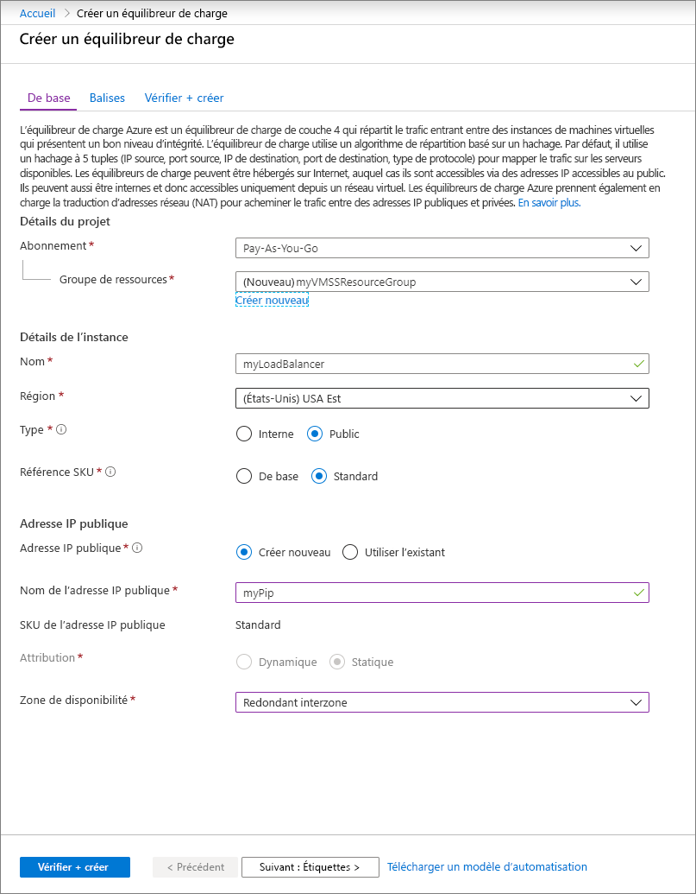
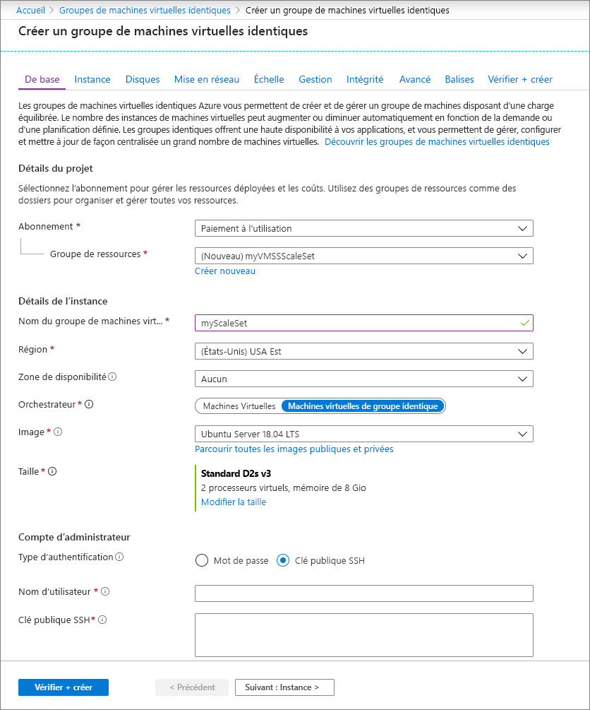

# Démarrage rapide : Créer un groupe de machines virtuelles identiques dans le portail Azure

Un groupe de machines virtuelles identiques vous permet de déployer et de gérer un ensemble de machines virtuelles prenant en charge la mise à l’échelle automatique. Vous pouvez mettre à l’échelle manuellement le nombre de machines virtuelles du groupe identique ou définir des règles de mise à l’échelle automatique en fonction de l’utilisation des ressources telles que l’UC, la demande de mémoire ou le trafic réseau. Un équilibreur de charge Azure distribue ensuite le trafic vers les instances de machine virtuelle du groupe identique. Dans ce guide de démarrage rapide, vous créez un groupe de machines virtuelles identiques dans le portail Azure.

Si vous n’avez pas d’abonnement Azure, créez un [compte gratuit](https://azure.microsoft.com/free/?WT.mc_id=A261C142F) avant de commencer.

## Connexion à Azure
Connectez-vous au portail Azure sur https://portal.azure.com.

## Créer un équilibrage de charge

L’[équilibrer la charge](../load-balancer/load-balancer-overview.md) Azure distribue le trafic entrant entre les instances de machine virtuelle saines. 

Commencez par créer un équilibreur de charge Standard public en utilisant le portail. Le nom et l’adresse IP publique que vous créez sont automatiquement configurés comme front-end de l’équilibreur de charge.

1. Dans la zone de recherche, tapez **équilibreur de charge**. Sous **Place de marché** dans les résultats de la recherche, choisissez **Équilibreur de charge**.
1. Dans l’onglet **De base** de la page **Créer un équilibreur de charge**, entrez ou sélectionnez les informations suivantes :

    | Paramètre                 | Valeur   |
    | ---| ---|
    | Abonnement  | Sélectionnez votre abonnement.    |    
    | Resource group | Sélectionnez **Créer**, puis entrez *myVMSSResourceGroup* dans la zone de texte.|
    | Nom           | *myLoadBalancer*         |
    | Région         | Sélectionnez **USA Est**.       |
    | Type          | Sélectionnez **Public**.       |
    | SKU           | Sélectionnez **Standard**.       |
    | Adresse IP publique | Sélectionnez **Créer nouveau**. |
    | Nom de l’adresse IP publique  | *MyPip*   |
    | Affectation| statique |

1. Quand vous avez terminé, sélectionnez **Vérifier + Créer** 
1. Après la validation, sélectionnez **Créer**. 

## Créer un groupe de machines virtuelles identiques
Vous pouvez déployer un groupe identique avec une image Windows Server ou une image Linux, comme RHEL, CentOS, Ubuntu ou SLES.

1. Tapez **Groupe identique** dans la zone de recherche. Dans les résultats, sous **Place de marché**, sélectionnez **Groupes de machines virtuelles identiques**. La page **Créer un groupe de machines virtuelles identiques** s’ouvre. 
1. Sous l’onglet **De base**, sous **Détails du projet**, vérifiez que l’abonnement approprié est sélectionné, puis choisissez **Créer** pour créer un groupe de ressources. Tapez *myVMSSResourceGroup* pour le nom, puis sélectionnez **OK**. 
1. Tapez *myScaleSet* comme nom de votre groupe identique.
1. Dans **Région**, sélectionnez une région proche de vous.
1. Laissez la valeur par défaut de **Machines virtuelles identiques** pour **Orchestrateur**.
1. Sélectionnez une image de la place de marché pour **Image**. Dans cet exemple, nous avons choisi *Ubuntu Server 18.04 LTS*.
1. Entrez le nom d’utilisateur de votre choix, puis sélectionnez le type d’authentification que vous préférez.
   - Un **mot de passe** doit comporter au moins 12 caractères, avec au moins trois des quatre caractères suivants : une minuscule, une majuscule, un chiffre et un caractère spécial. Pour plus d’informations, consultez les [critères de nom d’utilisateur et de mot de passe](../virtual-machines/windows/faq.md#what-are-the-username-requirements-when-creating-a-vm).
   - Si vous sélectionnez une image de disque du système d’exploitation Linux, vous pouvez choisir à la place **Clé publique SSH**. Entrez uniquement votre clé publique, comme *~/.ssh/id_rsa.pub*. Vous pouvez utiliser Azure Cloud Shell à partir du portail pour [créer et utiliser des clés SSH](../virtual-machines/linux/mac-create-ssh-keys.md).
   
    

1. Sélectionnez **Suivant** pour déplacer les autres pages. 
1. Laissez les valeurs par défaut pour les pages **Instance** et **Disques**.
1. Dans la page **Mise en réseau**, sous **Équilibrage de charge**, sélectionnez **Oui** pour placer les instances du groupe identique derrière un équilibreur de charge. 
1. Pour **Options d’équilibrage de charge**, sélectionnez **Équilibreur de charge Azure**.
1. Pour **Sélectionner un équilibreur de charge**, choisissez *MyLoadBalancer* créé précédemment.
1. Sous **Sélectionner un pool principal**, sélectionnez **Créer**, puis tapez *myBackendPool* et sélectionnez **Créer**.
1. Quand vous avez terminé, sélectionnez **Vérifier + créer**. 
1. Après la validation, sélectionnez **Créer** pour déployer le groupe identique.

## Nettoyer les ressources
Quand vous n’en avez plus besoin, supprimez le groupe de ressources, le groupe identique et toutes les ressources associées. Pour ce faire, sélectionnez le groupe de ressources pour le groupe identique, puis sélectionnez **Supprimer**.

## Étapes suivantes
Dans ce guide de démarrage rapide, vous avez créé un groupe de machines virtuelles identiques dans le portail Azure. Pour en savoir plus, passez au didacticiel dédié à la création et la gestion des groupes de machines virtuelles identiques Azure.

> [!div class="nextstepaction"]
> [Créer et gérer des groupes de machines virtuelles identiques Azure](tutorial-create-and-manage-powershell.md)
