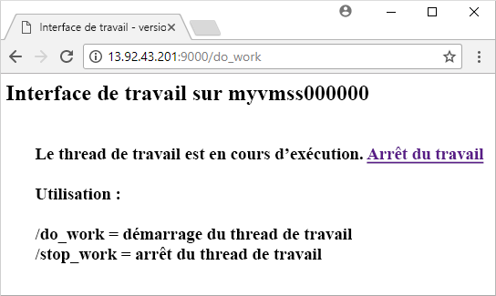

# <a name="quickstart-create-a-linux-virtual-machine-scale-set-with-an-arm-template"></a>Démarrage rapide : Créer un groupe de machines virtuelles identiques Linux à l’aide d’un modèle ARM

Un groupe de machines virtuelles identiques vous permet de déployer et de gérer un ensemble de machines virtuelles prenant en charge la mise à l’échelle automatique. Vous pouvez mettre à l’échelle manuellement le nombre de machines virtuelles du groupe identique ou définir des règles de mise à l’échelle automatique en fonction de l’utilisation des ressources telles que l’UC, la demande de mémoire ou le trafic réseau. Un équilibreur de charge Azure distribue ensuite le trafic vers les instances de machine virtuelle du groupe identique. Dans ce guide de démarrage rapide, vous allez créer un groupe de machines virtuelles identiques et déployer un exemple d’application avec un modèle Azure Resource Manager (modèle ARM).

[!INCLUDE [About Azure Resource Manager](../../includes/resource-manager-quickstart-introduction.md)]

Les modèles ARM vous permettent de déployer des groupes de ressources associées. Dans un modèle unique, vous pouvez créer le groupe de machines virtuelles identiques, installer des applications et configurer des règles de mise à l’échelle automatique. Avec l’utilisation de variables et de paramètres, ce modèle peut être réutilisé pour mettre à jour des groupes identiques existants ou en créer d’autres. Vous pouvez déployer des modèles via le Portail Azure, Azure CLI ou Azure PowerShell, ou à partir de pipelines d’intégration continue/de livraison continue.

Si votre environnement remplit les prérequis et que vous êtes déjà familiarisé avec l’utilisation des modèles ARM, sélectionnez le bouton **Déployer sur Azure**. Le modèle s’ouvre dans le portail Azure.

[](https://portal.azure.com/#create/Microsoft.Template/uri/https%3A%2F%2Fraw.githubusercontent.com%2FAzure%2Fazure-quickstart-templates%2Fmaster%2F201-vmss-bottle-autoscale%2Fazuredeploy.json)

## <a name="prerequisites"></a>Prérequis

Si vous n’avez pas d’abonnement Azure, créez un [compte gratuit](https://azure.microsoft.com/free/?WT.mc_id=A261C142F) avant de commencer.

## <a name="review-the-template"></a>Vérifier le modèle

Le modèle utilisé dans ce démarrage rapide est tiré des [modèles de démarrage rapide Azure](https://azure.microsoft.com/resources/templates/201-vmss-bottle-autoscale/).

:::code language="json" source="~/quickstart-templates/201-vmss-bottle-autoscale/azuredeploy.json":::

Ces ressources Azure sont définies dans le modèle :

- [**Microsoft.Network/virtualNetworks**](/azure/templates/microsoft.network/virtualnetworks)
- [**Microsoft.Network/publicIPAddresses**](/azure/templates/microsoft.network/publicipaddresses)
- [**Microsoft.Network/loadBalancers**](/azure/templates/microsoft.network/loadbalancers)
- [**Microsoft.Compute/virtualMachineScaleSets**](/azure/templates/microsoft.compute/virtualmachinescalesets)
- [**Microsoft.Insights/autoscaleSettings**](/azure/templates/microsoft.insights/autoscalesettings)

### <a name="define-a-scale-set"></a>Définir un groupe identique

Pour créer un groupe identique avec un modèle, vous définissez les ressources appropriées. Les parties essentielles du type de ressource de groupe de machines virtuelles identiques sont :

| Propriété                     | Description de la propriété                                  | Exemple de valeur de modèle                    |
|------------------------------|----------------------------------------------------------|-------------------------------------------|
| type                         | Type de ressource Azure à créer                            | Microsoft.Compute/virtualMachineScaleSets |
| name                         | Nom du groupe identique                                       | myScaleSet                                |
| location                     | Emplacement de création du groupe identique                     | USA Est                                   |
| sku.name                     | Taille de machine virtuelle pour chaque instance de groupe identique                  | Standard_A1                               |
| sku.capacity                 | Nombre d’instances de machines virtuelles à créer initialement           | 2                                         |
| upgradePolicy.mode           | Mode de mise à niveau d’instance de machine virtuelle lorsque des modifications se produisent              | Automatique                                 |
| imageReference               | Plateforme ou image personnalisée à utiliser pour les instances de machine virtuelle | Canonical Ubuntu Server 16.04-LTS         |
| osProfile.computerNamePrefix | Préfixe du nom de chaque instance de machine virtuelle                     | myvmss                                    |
| osProfile.adminUsername      | Nom d’utilisateur de chaque instance de machine virtuelle                        | azureuser                                 |
| osProfile.adminPassword      | Mot de passe de chaque instance de machine virtuelle                        | P@ssw0rd!                                 |

Pour personnaliser un modèle de groupe identique, vous pouvez changer la taille ou la capacité initiale des machines virtuelles. L’autre possibilité consiste à utiliser une autre plateforme ou une image personnalisée.

### <a name="add-a-sample-application"></a>Ajouter un exemple d’application

Pour tester votre groupe identique, installez une application web de base. Lorsque vous déployez un groupe identique, les extensions de machine virtuelle peuvent fournir des tâches d’automatisation et de configuration après le déploiement, telles que l’installation d’une application. Des scripts peuvent être téléchargés à partir de Stockage Azure ou de GitHub, ou fournis dans le portail Azure lors de l’exécution de l’extension. Pour appliquer une extension à votre groupe identique, vous ajoutez la section *extensionProfile* à l’exemple de ressource précédent. En règle générale, le profil d’extension définit les propriétés suivantes :

- Type d’extension
- Éditeur d’extension
- Version d’extension
- Emplacement des scripts de configuration ou d’installation
- Commandes à exécuter sur les instances de machine virtuelle

Le modèle utilise l’extension de script personnalisé pour installer [Bottle](https://bottlepy.org/docs/dev/), un framework web Python, et un serveur HTTP simple.

Deux scripts sont définis dans **fileUris** - *installserver.sh* et *workserver.py*. Ces fichiers sont téléchargés à partir de GitHub, puis *commandToExecute* exécute `bash installserver.sh` pour installer et configurer l’application.

## <a name="deploy-the-template"></a>Déployer le modèle

Vous pouvez déployer le modèle en sélectionnant le bouton **Déployer dans Azure** suivant. Ce bouton ouvre le portail Azure, charge le modèle complet et vous invite à renseigner quelques paramètres comme le nom du groupe identique, le nombre d’instances et les informations d’identification d’administrateur.

[](https://portal.azure.com/#create/Microsoft.Template/uri/https%3A%2F%2Fraw.githubusercontent.com%2FAzure%2Fazure-quickstart-templates%2Fmaster%2F201-vmss-bottle-autoscale%2Fazuredeploy.json)

Vous pouvez également déployer un modèle Resource Manager en utilisant Azure CLI :

```azurecli-interactive
# Create a resource group
az group create --name myResourceGroup --location EastUS

# Deploy template into resource group
az deployment group create \
    --resource-group myResourceGroup \
    --template-uri https://raw.githubusercontent.com/Azure/azure-quickstart-templates/master/201-vmss-bottle-autoscale/azuredeploy.json
```

Renseignez le nom du groupe identique, le nombre d’instances et les informations d’identification d’administrateur pour les instances de machine virtuelle. Quelques minutes sont nécessaires pour que le groupe identique et les ressources associées soient créés.

## <a name="validate-the-deployment"></a>Valider le déploiement

Pour voir votre groupe identique en action, accédez à l’exemple d’application web dans un navigateur web. Obtenez l’adresse IP publique de l’équilibreur de charge avec [az network public-ip list](/cli/azure/network/public-ip) comme suit :

```azurecli-interactive
az network public-ip list \
    --resource-group myResourceGroup \
    --query [*].ipAddress -o tsv
```

Entrez l’adresse IP publique de l’équilibreur de charge dans un navigateur web au format *http:\//publicIpAddress:9000/do_work*. L’équilibreur de charge répartit le trafic vers l’une de vos instances de machine virtuelle, comme illustré dans l’exemple suivant :



## <a name="clean-up-resources"></a>Nettoyer les ressources

Lorsque vous n’en avez plus besoin, vous pouvez utiliser la commande [az group delete](/cli/azure/group) pour supprimer le groupe de ressources, le groupe identique et toutes les ressources associées, comme suit. Le paramètre `--no-wait` retourne le contrôle à l’invite de commandes sans attendre que l’opération se termine. Le paramètre `--yes` confirme que vous souhaitez supprimer les ressources sans passer par une invite supplémentaire à cette fin.

```azurecli-interactive
az group delete --name myResourceGroup --yes --no-wait
```

## <a name="next-steps"></a>Étapes suivantes

Dans ce guide de démarrage rapide, vous avez créé un groupe identique Linux avec un modèle ARM et vous avez utilisé l’extension de script personnalisé pour installer un serveur web Python de base sur les instances de machine virtuelle. Pour en savoir plus, passez au didacticiel dédié à la création et la gestion des groupes de machines virtuelles identiques Azure.

> [!div class="nextstepaction"]
> [Créer et gérer des groupes de machines virtuelles identiques Azure](tutorial-create-and-manage-cli.md)
