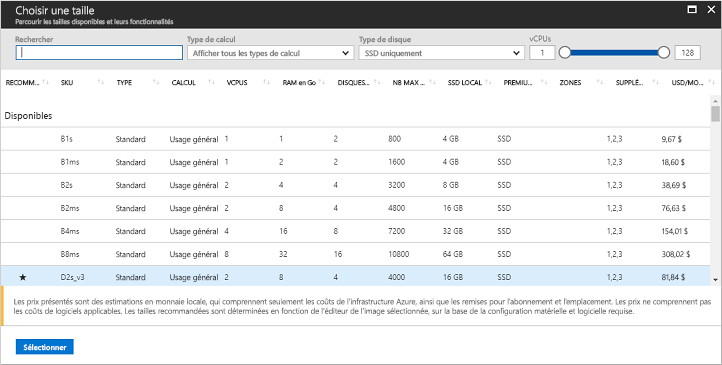

# <a name="quickstart-create-a-linux-virtual-machine-in-the-azure-portal"></a>Démarrage rapide : Créer une machine virtuelle Linux sur le Portail Azure

Le Portail Azure peut être utilisé pour créer des machines virtuelles Azure. Cette méthode fournit une interface utilisateur sur navigateur permettant de créer les machines virtuelles et les ressources associées. Ce guide de démarrage rapide explique comment utiliser le Portail Azure pour déployer dans Azure une machine virtuelle Linux qui fonctionne sous Ubuntu. Pour voir votre machine virtuelle en action, vous établirez une connexion SSH à la machine virtuelle et installerez le serveur web NGINX.

Si vous n’avez pas d’abonnement Azure, créez un [compte gratuit](https://azure.microsoft.com/free/?WT.mc_id=A261C142F) avant de commencer.

## <a name="create-ssh-key-pair"></a>Créer la paire de clés SSH

Vous aurez besoin d’une paire de clés SSH pour suivre ce guide de démarrage rapide. Si vous disposez déjà d’une paire de clés SSH, vous pouvez ignorer cette étape.

Pour créer une paire de clés SSH et ouvrir une session sur les machines virtuelles Linux, exécutez la commande suivante à partir d’un interpréteur de commandes Bash et suivez les instructions qui s’affichent à l’écran. Vous pouvez par exemple utiliser [Azure Cloud Shell](../../cloud-shell/overview.md) ou le [sous-système Windows pour Linux](/windows/wsl/install-win10). La sortie de la commande inclut le nom du fichier de clé publique. Copiez le contenu du fichier de clé publique (`cat ~/.ssh/id_rsa.pub`) dans le Presse-papiers :

```bash
ssh-keygen -t rsa -b 2048
```

Pour plus d’informations sur la création de paires de clés SSH, notamment l’utilisation de PuTTy, voir [Guide pratique pour utiliser des clés SSH avec Windows](ssh-from-windows.md).

## <a name="log-in-to-azure"></a>Connexion à Azure

Connectez-vous au portail Azure à l’adresse suivante : http://portal.azure.com

## <a name="create-virtual-machine"></a>Créer une machine virtuelle

1. Sélectionnez **Créer une ressource** dans le coin supérieur gauche du Portail Azure.

2. Dans la zone de recherche au-dessus de la liste des ressources de la Place de marché Azure, recherchez et sélectionnez **Ubuntu Server 16.04 LTS** de Canonical, puis choisissez **Créer**.

3. Donnez un nom à la machine virtuelle, par exemple, *myVM*, gardez le type de disque *SSD*, puis indiquez un nom d’utilisateur, par exemple, *azureuser*.

4. . Dans **Type d’authentification**, sélectionnez **Clé publique SSH**, puis collez votre clé publique dans la zone de texte. Veillez à supprimer les espaces blancs au début ou à la fin de votre clé publique.

    

5. Choisissez **Nouveau** pour créer un groupe de ressources, puis indiquez un nom, par exemple, *myResourceGroup*. Choisissez **l’Emplacement** souhaité, puis sélectionnez **OK**.

4. Choisissez la taille de la machine virtuelle. Vous pouvez filtrer par *Type de calcul* ou par *Type de disque*, par exemple. Nous suggérons la taille de machine virtuelle *D2s_v3*.

    

5. Sous **Paramètres**, laissez les valeurs par défaut et sélectionnez **OK**.

6. Sur la page de résumé, sélectionnez **Créer** pour démarrer le déploiement de la machine virtuelle.

7. La machine virtuelle est épinglée au tableau de bord du Portail Azure. Une fois le déploiement terminé, le récapitulatif de la machine virtuelle s’ouvre automatiquement.

## <a name="connect-to-virtual-machine"></a>Connexion à la machine virtuelle

Créez une connexion SSH avec la machine virtuelle.

1. Sélectionnez le bouton **Se connecter** sur la page de présentation de la machine virtuelle. 

    

2. Sur la page **Se connecter à la machine virtuelle**, conservez les options par défaut pour vous connecter par nom DNS sur le port 22. Dans **Se connecter à l’aide d’un compte local de machine virtuelle**, une commande de connexion s’affiche. Cliquez sur le bouton pour copier la commande. L’exemple suivant montre la commande de connexion SSH :

    ```bash
    ssh azureuser@myvm-123abc.eastus.cloudapp.azure.com
    ```

3. Collez la commande de connexion SSH dans un interpréteur de commandes, par exemple, Azure Cloud Shell ou Bash sur Ubuntu sous Windows pour créer la connexion. 

## <a name="install-web-server"></a>Installer le serveur web

Pour voir votre machine virtuelle en action, installez le serveur web NGINX. Pour mettre à jour les sources du package et installer la dernière version du package NGINX, exécutez les commandes suivantes dans votre session SSH :

```bash
# update packages
sudo apt-get -y update

# install NGINX
sudo apt-get -y install nginx
```

Ensuite, quittez (`exit`) la session SSH et revenez aux propriétés de la machine virtuelle sur le Portail Azure.

## <a name="open-port-80-for-web-traffic"></a>Ouvrez le port 80 pour le trafic web

Un Groupe de sécurité réseau (NSG) sécurise le trafic entrant et sortant. Lorsqu’une machine virtuelle est créée à partir du portail Azure, une règle de trafic entrant est créée sur le port 22 pour les connexions SSH. Dans la mesure où cette machine virtuelle héberge un serveur web, il est nécessaire de créer une règle NSG pour le port 80.

1. Sur la page de présentation de la machine virtuelle, sélectionnez **Réseaux**.
2. La liste des règles existantes d’entrée et de sortie s’affiche. Choisissez **Ajouter une règle de port d’entrée**.
3. Sélectionnez l’option **De base** en haut, puis choisissez *HTTP* dans la liste des services disponibles. Le port 80, une priorité et un nom vous sont fournis.
4. Pour créer la règle, sélectionnez **Ajouter**.

## <a name="view-the-web-server-in-action"></a>Voir le serveur web en action

Une fois NGINX installé et le port 80 ouvert sur la machine virtuelle, le serveur web est accessible par Internet. Ouvrez un navigateur web et saisissez l’adresse IP publique de la machine virtuelle. L’adresse IP publique se trouve sur la page de présentation de la machine virtuelle, ou en haut de la page *Réseaux* sur laquelle vous ajoutez la règle de port d’entrée.


## <a name="clean-up-resources"></a>Supprimer des ressources

Dès que vous n’en avez plus besoin, vous pouvez supprimer le groupe de ressources, la machine virtuelle et toutes les ressources associées. Pour cela, sélectionnez le groupe de ressources de la machine virtuelle, sélectionnez **Supprimer**, puis confirmez le nom du groupe de ressources à supprimer.

## <a name="next-steps"></a>Étapes suivantes

Avec ce guide de démarrage rapide, vous avez déployé une machine virtuelle simple, créé un Groupe de sécurité réseau et une règle, et installé un serveur web de base. Pour en savoir plus sur les machines virtuelles Azure, suivez le didacticiel pour les machines virtuelles Linux.

> [!div class="nextstepaction"]
> [Didacticiels sur les machines virtuelles Azure Linux](./tutorial-manage-vm.md)
