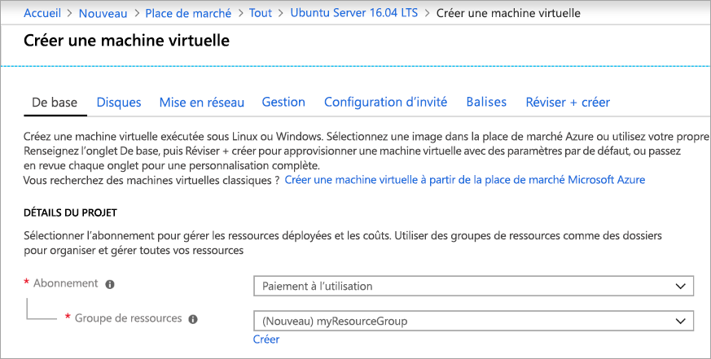
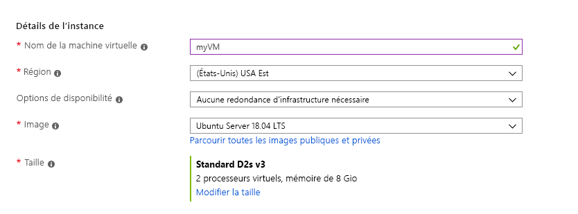
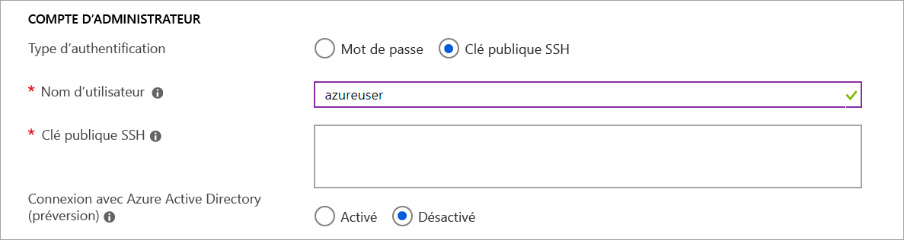
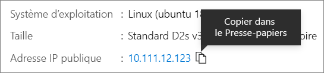

# <a name="quickstart-create-a-linux-virtual-machine-in-the-azure-portal"></a>Démarrage rapide : Créer une machine virtuelle Linux dans le portail Azure

Le Portail Azure peut être utilisé pour créer des machines virtuelles Azure. Le portail Azure est une interface utilisateur basée sur un navigateur permettant de créer des ressources Azure. Ce démarrage rapide explique comment utiliser le portail Azure pour déployer une machine virtuelle Linux exécutant Ubuntu 18.04 LTS. Pour voir votre machine virtuelle en action, vous établissez également une connexion SSH à la machine virtuelle et installez le serveur web NGINX.

Si vous n’avez pas d’abonnement Azure, créez un [compte gratuit](https://azure.microsoft.com/free/?WT.mc_id=A261C142F) avant de commencer.

## <a name="sign-in-to-azure"></a>Connexion à Azure

Si ce n’est pas déjà fait, connectez-vous au [portail Azure](https://portal.azure.com).

## <a name="create-virtual-machine"></a>Créer une machine virtuelle

1. Tapez **machines virtuelles** dans la zone de recherche.
1. Sous **Services**, sélectionnez **Machines virtuelles**.
1. Sur la page **Machines virtuelles**, sélectionnez **Ajouter**. La page **Créer une machine virtuelle** s’ouvre.
1. Sous l’onglet **De base**, sous **Détails du projet**, vérifiez que l’abonnement approprié est sélectionné, puis choisissez **Créer** pour créer un groupe de ressources. Tapez le nom *myResourceGroup*. 

    

1. Sous **Détails de l’instance**, tapez *myVM* comme **Nom de la machine virtuelle**, puis choisissez *USA Est* comme **Région** et *Ubuntu 18.04 LTS* comme **Image**. Conservez les autres valeurs par défaut.

    

1. Sous **Compte Administrateur**, sélectionnez **Clé publique SSH**.

1. Dans **Nom d’utilisateur**, tapez *azureuser*.

1. Pour **Source de clé publique SSH**, laissez la valeur par défaut **Générer une nouvelle paire de clés**, puis tapez *myKey* comme **Nom de la paire de clés**.

    

1. Sous **Règles des ports d’entrée** > **Ports d’entrée publics**, choisissez **Autoriser les ports sélectionnés**, puis sélectionnez **SSH (22)** et **HTTP (80)** dans la liste déroulante. 

    

1. Conservez les valeurs par défaut restantes, puis sélectionnez le bouton **Vérifier + créer** en bas de la page.

1. Sur la page **Create a virtual machine** (Créer une machine virtuelle), vous pouvez voir les détails de la machine virtuelle que vous allez créer. Lorsque vous êtes prêt, sélectionnez **Créer**.

1. Quand la fenêtre **Générer une nouvelle paire de clés** s’ouvre, sélectionnez **Télécharger la clé privée et créer une ressource**. Votre fichier de clé sera téléchargé en tant que **myKey.pem**. Notez où le fichier `.pem` a été téléchargé ; vous aurez besoin du chemin à l’étape suivante.

1. Une fois le déploiement terminé, sélectionnez **Accéder à la ressource**.

1. Dans la page de votre nouvelle machine virtuelle, sélectionnez l’adresse IP publique et copiez-la dans le presse-papiers.


    

## <a name="connect-to-virtual-machine"></a>Connexion à la machine virtuelle

Créez une connexion SSH avec la machine virtuelle.

1. Si vous êtes sur un ordinateur Mac ou Linux, ouvrez une invite Bash. Si vous êtes sur un ordinateur Windows, ouvrez une invite PowerShell. 

1. À l’invite, ouvrez une connexion SSH à votre machine virtuelle. Remplacez l’adresse IP par celle de votre machine virtuelle, et remplacez le chemin de `.pem` par l’emplacement où le fichier de clé a été téléchargé.

```console
ssh -i .\Downloads\myKey1.pem azureuser@10.111.12.123
```

> [!TIP]
> Vous pourrez utiliser la clé SSH que vous avez créée la prochaine fois que vous créerez une machine virtuelle dans Azure. Il vous suffira de sélectionner **Utiliser une clé stockée dans Azure** pour **Source de la clé publique SSH** la prochaine fois que vous créerez une machine virtuelle. Vous disposerez déjà de la clé privée sur votre ordinateur, et n’aurez donc pas besoin de télécharger quoi que ce soit.

## <a name="install-web-server"></a>Installer le serveur web

Pour voir votre machine virtuelle en action, installez le serveur web NGINX. Dans votre session SSH, mettez à jour vos sources de package, puis installez le dernier package NGINX.

```bash
sudo apt-get -y update
sudo apt-get -y install nginx
```

Lorsque vous avez terminé, tapez `exit` pour quitter la session SSH.


## <a name="view-the-web-server-in-action"></a>Voir le serveur web en action

Utilisez le navigateur web de votre choix pour visualiser la page d’accueil NGINX par défaut. Entrez l’adresse IP publique de la machine virtuelle comme adresse web. Vous trouverez l’adresse IP publique sur la page de vue d’ensemble de la machine virtuelle ou en tant que partie de la chaîne de connexion SSH que vous avez utilisée précédemment.


## <a name="clean-up-resources"></a>Nettoyer les ressources

Dès que vous n’en avez plus besoin, vous pouvez supprimer le groupe de ressources, la machine virtuelle et toutes les ressources associées. Pour cela, sélectionnez le groupe de ressources de la machine virtuelle, sélectionnez **Supprimer**, puis confirmez le nom du groupe de ressources à supprimer.

## <a name="next-steps"></a>Étapes suivantes

Avec ce guide de démarrage rapide, vous avez déployé une machine virtuelle simple, créé un groupe de sécurité réseau et une règle, et installé un serveur web de base. Pour en savoir plus sur les machines virtuelles Azure, suivez le didacticiel pour les machines virtuelles Linux.

> [!div class="nextstepaction"]
> [Didacticiels sur les machines virtuelles Azure Linux](./tutorial-manage-vm.md)
