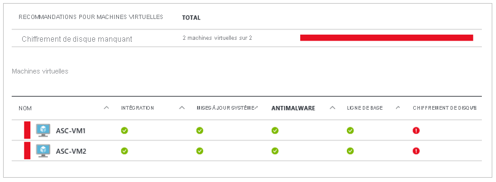

# Azure Disk Encryption pour les machines virtuelles Windows 

Azure Disk Encryption vous aide à protéger et à préserver vos données de façon à répondre aux engagements de votre entreprise en matière de sécurité et de conformité. Il utilise la fonctionnalité [Bitlocker](https://en.wikipedia.org/wiki/BitLocker) de Windows pour assurer le chiffrement de volume des disques de système d’exploitation et de données des machines virtuelles Azure. Il s’intègre à [Azure Key Vault](../../key-vault/index.yml) pour vous aider à contrôler et à gérer les secrets et les clés de chiffrement de disque. 

Si vous utilisez [Azure Security Center](../../security-center/index.yml), vous recevez une alerte dès lors que certaines de vos machines virtuelles ne sont pas chiffrées. Les alertes indiquent un niveau de gravité élevé et recommandent de chiffrer ces machines virtuelles.

> [!WARNING]
> - Si vous avez déjà utilisé Azure Disk Encryption avec Azure AD pour chiffrer une machine virtuelle, vous devez continuer à utiliser cette option pour chiffrer votre machine virtuelle. Pour plus d’informations, consultez [Azure Disk Encryption avec Azure AD (version précédente)](disk-encryption-overview-aad.md). 
> - Certaines recommandations peuvent entraîner une augmentation de l’utilisation des données, des réseaux ou des ressources de calcul débouchant sur des coûts de licence ou d’abonnement supplémentaires. Vous devez disposer d’un abonnement Azure actif valide pour créer des ressources dans Azure dans les régions prises en charge.

Vous pouvez découvrir les notions de base d’Azure Disk Encryption pour Windows en quelques minutes avec les guides de démarrage rapide [Créer et chiffrer une machine virtuelle Windows avec Azure CLI](disk-encryption-cli-quickstart.md) et [Créer et chiffrer une machine virtuelle Windows avec Azure PowerShell](disk-encryption-powershell-quickstart.md).

## Machines virtuelles et systèmes d’exploitation pris en charge

### Tailles des machines virtuelles prises en charge

Les machines virtuelles Windows sont disponibles dans une [gamme de tailles](sizes-general.md). Azure Disk Encryption n’est pas disponible sur les [machines virtuelles De base et de série A](https://azure.microsoft.com/pricing/details/virtual-machines/series/), ni sur celles disposant de moins de 2 Go de mémoire.

Azure Disk Encryption est également disponible pour les machines virtuelles avec stockage premium.

### Systèmes d’exploitation pris en charge

- Client Windows : Windows 8 et ultérieur.
- Serveur Windows : Windows Server 2008 R2 et ultérieur.  
 
> [!NOTE]
> Windows Server 2008 R2 nécessite l’installation de .NET Framework 4.5 pour le chiffrement. Installez-le à partir de Windows Update avec la mise à jour facultative Microsoft .NET Framework 4.5.2 pour les systèmes Windows Server 2008 R2 x64 ([KB2901983](https://www.catalog.update.microsoft.com/Search.aspx?q=KB2901983)).  
>  
> Windows Server 2012 R2 Core et Windows Server 2016 Core nécessitent l’installation du composant bdehdcfg sur la machine virtuelle pour le chiffrement.

## Configuration requise du réseau
L’activation d’Azure Disk Encryption nécessite que les machines virtuelles répondent aux exigences de configuration du point de terminaison de réseau suivantes :
  - Pour obtenir un jeton afin de se connecter à votre coffre de clés, la machine virtuelle Windows doit être en mesure de se connecter au point de terminaison Azure Active Directory \[login.microsoftonline.com\].
  - Pour écrire les clés de chiffrement dans votre coffre de clés, la machine virtuelle Windows doit être en mesure de se connecter au point de terminaison du coffre de clés.
  - La machine virtuelle Windows doit être en mesure de se connecter au point de terminaison de stockage Azure qui héberge le référentiel d’extensions Azure et au compte de stockage Azure qui héberge les fichiers de disque dur virtuel.
  -  Si votre stratégie de sécurité limite l’accès à Internet à partir des machines virtuelles Azure, vous pouvez résoudre l’URI ci-dessus et configurer une règle spécifique pour autoriser les connexions sortantes vers les adresses IP. Pour plus d’informations, consultez l’article [Azure Key Vault derrière un pare-feu](../../key-vault/key-vault-access-behind-firewall.md).    

## Exigences de stratégies de groupe

Azure Disk Encryption utilise le protecteur de clé externe BitLocker pour les machines virtuelles Windows. Pour les machines virtuelles jointes à un domaine, n’envoyez (push) pas de stratégies de groupe qui appliquent des protecteurs de Module de plateforme sécurisée (TPM). Pour en savoir plus sur la stratégie de groupe pour « Autoriser BitLocker sans module de plateforme sécurisée compatible », consultez la rubrique [BitLocker Group Policy Reference](/windows/security/information-protection/bitlocker/bitlocker-group-policy-settings#bkmk-unlockpol1) (Référence de stratégie de groupe BitLocker).

La stratégie BitLocker sur les machines virtuelles jointes à un domaine avec stratégie de groupe personnalisée doit inclure le paramètre suivant : [Configurer le stockage par les utilisateurs des informations de récupération BitLocker -> Autoriser une clé de récupération de 256 bits](/windows/security/information-protection/bitlocker/bitlocker-group-policy-settings). En cas d'incompatibilité des paramètres de la stratégie de groupe personnalisée de BitLocker, Azure Disk Encryption échouera. Sur les machines dont le paramètre de stratégie était incorrect, il peut être nécessaire d’appliquer la nouvelle stratégie, de forcer la mise à jour de cette dernière (gpupdate.exe /force), puis de procéder à un redémarrage.

Azure Disk Encryption échoue si la stratégie de groupe au niveau du domaine bloque l’algorithme AES-CBC, qui est utilisé par BitLocker.

## Exigences liées au stockage des clés de chiffrement  

Azure Disk Encryption exige Azure Key Vault pour contrôler et gérer les clés et les secrets de chiffrement de disque. Votre coffre de clés et vos machines virtuelles doivent se trouver dans la même région et le même abonnement Azure.

Pour plus d’informations, consultez [Création et configuration d’un coffre de clés pour Azure Disk Encryption](disk-encryption-key-vault.md).

## Terminologie
Le tableau suivant définit certains termes courants utilisés dans la documentation d’Azure Disk Encryption :

| Terminologie | Définition |
| --- | --- |
| Azure Key Vault | Key Vault est un service de gestion de clés de chiffrement basé sur des modules de sécurité matériels validés FIPS (Federal Information Processing Standard). Ces normes permettent de protéger vos clés de chiffrement et vos secrets sensibles. Pour plus d’informations, consultez la documentation [Azure Key Vault](https://azure.microsoft.com/services/key-vault/) et [Création et configuration d’un coffre de clés pour Azure Disk Encryption](disk-encryption-key-vault.md). |
| Azure CLI | [Azure CLI](/cli/azure/install-azure-cli) est optimisé pour gérer et administrer des ressources Azure en ligne de commande.|
| BitLocker |[BitLocker](https://technet.microsoft.com/library/hh831713.aspx) est une technologie de chiffrement de volume Windows qui permet d’activer le chiffrement de disque sur des machines virtuelles Windows. |
| Clé de chiffrement principale (KEK) | Clé asymétrique (RSA 2048) que vous pouvez utiliser pour protéger ou encapsuler le secret. Vous pouvez fournir une clé protégée par un module de sécurité matériel ou une clé protégée par logiciel. Pour plus d’informations, consultez la documentation [Azure Key Vault](https://azure.microsoft.com/services/key-vault/) et [Création et configuration d’un coffre de clés pour Azure Disk Encryption](disk-encryption-key-vault.md). |
| Applets de commande PowerShell | Pour plus d’informations, voir [Cmdlets Azure PowerShell](/powershell/azure/overview). |

## Étapes suivantes

- [Démarrage rapide : Créer et chiffrer une machine virtuelle Windows avec Azure CLI](disk-encryption-cli-quickstart.md)
- [Démarrage rapide : Créer et chiffrer une machine virtuelle Windows avec Azure PowerShell](disk-encryption-powershell-quickstart.md)
- [Scénarios Azure Disk Encryption sur les machines virtuelles Windows](disk-encryption-windows.md)
- [Script d’interface CLI des prérequis Azure Disk Encryption](https://github.com/ejarvi/ade-cli-getting-started)
- [Script PowerShell des prérequis Azure Disk Encryption](https://github.com/Azure/azure-powershell/tree/master/src/Compute/Compute/Extension/AzureDiskEncryption/Scripts)
- [Création et configuration d’un coffre de clés pour Azure Disk Encryption](disk-encryption-key-vault.md)

