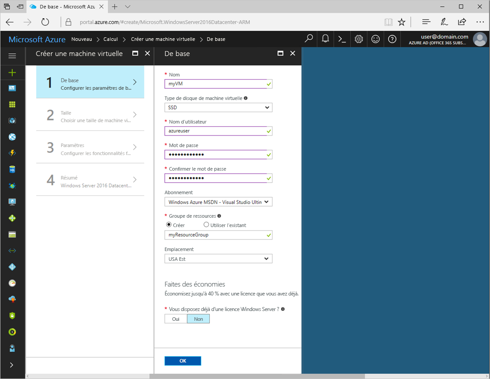
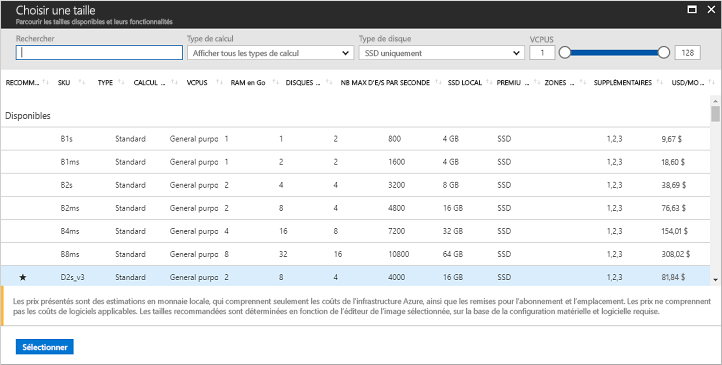
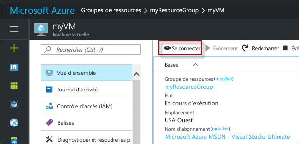

# <a name="quickstart-create-a-windows-virtual-machine-in-the-azure-portal"></a>Démarrage rapide : Créer une machine virtuelle Windows sur le Portail Azure

Le Portail Azure peut être utilisé pour créer des machines virtuelles Azure. Cette méthode fournit une interface utilisateur sur navigateur permettant de créer les machines virtuelles et les ressources associées. Ce guide de démarrage rapide explique comment utiliser le Portail Azure pour déployer dans Azure une machine virtuelle qui fonctionne avec Windows Server 2016. Pour voir votre machine virtuelle en action, vous établirez une connexion RDP à la machine virtuelle et installerez le serveur web IIS.

Si vous n’avez pas d’abonnement Azure, créez un [compte gratuit](https://azure.microsoft.com/free/?WT.mc_id=A261C142F) avant de commencer.

## <a name="sign-in-to-azure"></a>Connexion à Azure

Connectez-vous au portail Azure sur https://portal.azure.com.

## <a name="create-virtual-machine"></a>Créer une machine virtuelle

1. Sélectionnez **Créer une ressource** dans le coin supérieur gauche du Portail Azure.

2. Dans la zone de recherche au-dessus de la liste des ressources de la Place de marché Azure, recherchez et sélectionnez **Windows Server 2016 Datacenter**, puis choisissez **Créer**.

3. Donnez un nom à la machine virtuelle, par exemple, *myVM*, gardez le type de disque *SSD*, puis indiquez un nom d’utilisateur, par exemple, *azureuser*. Le mot de passe doit contenir au moins 12 caractères et satisfaire aux [exigences de complexité définies](faq.md#what-are-the-password-requirements-when-creating-a-vm).

    

5. Choisissez **Nouveau** pour créer un groupe de ressources, puis indiquez un nom, par exemple, *myResourceGroup*. Choisissez votre **Emplacement** et sélectionnez **OK**.

4. Choisissez la taille de la machine virtuelle. Vous pouvez filtrer par *Type de calcul* ou par *Type de disque*, par exemple. Nous suggérons la taille de machine virtuelle *D2s_v3*. Cliquez sur **Sélectionner** une fois que vous avez choisi une taille.

    

5. Dans la page **Paramètres**, dans **Réseau** > **Groupe de sécurité réseau** > **Sélectionner des ports d’entrée publics**, sélectionnez **HTTP** et **RDP (3389)** dans le menu déroulant. Laissez les autres valeurs par défaut et sélectionnez **OK**.

6. Sur la page de résumé, sélectionnez **Créer** pour démarrer le déploiement de la machine virtuelle.

7. La machine virtuelle est épinglée au tableau de bord du Portail Azure. Une fois le déploiement terminé, le récapitulatif de la machine virtuelle s’ouvre automatiquement.

## <a name="connect-to-virtual-machine"></a>Connexion à la machine virtuelle

Créez une connexion Bureau à distance à la machine virtuelle. Ces instructions expliquent comment se connecter à la machine virtuelle à partir d’un ordinateur Windows. Sur un Mac, vous avez besoin d’un client RDP similaire à ce [Client Bureau à distance](https://itunes.apple.com/us/app/microsoft-remote-desktop/id715768417?mt=12) disponible sur le Mac App Store.

1. Cliquez sur le bouton **Se connecter** sur la page de propriétés de la machine virtuelle. 

    
    
2. Sur la page **Se connecter à la machine virtuelle**, conservez les options par défaut pour vous connecter par nom DNS sur le port 3389 et cliquez sur **Télécharger le fichier RDP**.

2. Ouvrez le fichier RDP téléchargé et cliquez sur **Se connecter** lorsque vous y êtes invité. 

3. Dans la fenêtre **Sécurité Windows**, sélectionnez **Plus de choix**, puis **Utiliser un autre compte**. Tapez le nom d’utilisateur sous la forme *nom_machine_virtuelle*\\*nom_utilisateur*, entrez le mot de passe créé pour la machine virtuelle, puis cliquez sur **OK**.

4. Un avertissement de certificat peut s’afficher pendant le processus de connexion. Cliquez sur **Oui** ou **Continuer** pour créer la connexion.

## <a name="install-web-server"></a>Installer le serveur web

Pour voir votre machine virtuelle en action, installez le serveur web IIS. Ouvrez une invite PowerShell sur la machine virtuelle et exécutez la commande suivante :

```powershell
Install-WindowsFeature -name Web-Server -IncludeManagementTools
```

Une fois terminé, fermez la connexion RDP à la machine virtuelle.


## <a name="view-the-iis-welcome-page"></a>Afficher la page d’accueil IIS

Dans le portail, sélectionnez la machine virtuelle et dans la vue d’ensemble de la machine virtuelle, utilisez le bouton **Cliquer pour copier** à droite de l’adresse IP pour la copier-coller dans un onglet de navigateur. La page d’accueil IIS par défaut s’ouvre et devrait ressembler à ceci :


## <a name="clean-up-resources"></a>Supprimer les ressources

Dès que vous n’en avez plus besoin, vous pouvez supprimer le groupe de ressources, la machine virtuelle et toutes les ressources associées. Pour cela, sélectionnez le groupe de ressources de la machine virtuelle, sélectionnez **Supprimer**, puis confirmez le nom du groupe de ressources à supprimer.

## <a name="next-steps"></a>Étapes suivantes

Avec ce guide de démarrage rapide, vous avez déployé une machine virtuelle simple, ouvert un port réseau pour le trafic web et installé un serveur web de base. Pour en savoir plus sur les machines virtuelles Azure, suivez le didacticiel pour les machines virtuelles Windows.

> [!div class="nextstepaction"]
> [Didacticiels sur les machines virtuelles Azure Windows](./tutorial-manage-vm.md)
