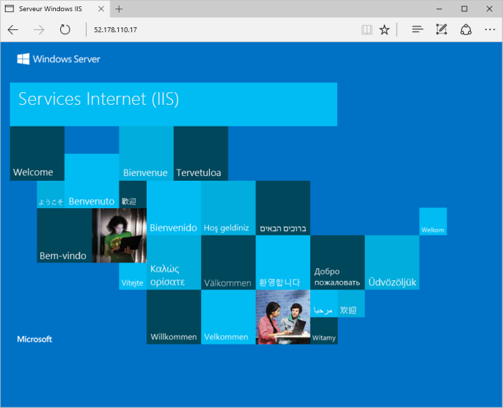

# <a name="quickstart-create-a-windows-virtual-machine-in-azure-with-powershell"></a>Démarrage rapide : Créer une machine virtuelle Windows dans Azure avec PowerShell

Le module Azure PowerShell est utilisé pour créer et gérer des ressources Azure à partir de la ligne de commande PowerShell ou dans des scripts. Ce guide de démarrage rapide explique comment utiliser le module Azure PowerShell pour déployer dans Azure une machine virtuelle qui fonctionne avec Windows Server 2016. Vous établirez une connexion RDP à la machine virtuelle et installerez le serveur web IIS afin de voir la machine virtuelle en action.

Si vous n’avez pas d’abonnement Azure, créez un [compte gratuit](https://azure.microsoft.com/free/?WT.mc_id=A261C142F) avant de commencer.

## <a name="launch-azure-cloud-shell"></a>Lancement d’Azure Cloud Shell

Azure Cloud Shell est un interpréteur de commandes interactif et gratuit que vous pouvez utiliser pour exécuter les étapes de cet article. Il contient des outils Azure courants préinstallés et configurés pour être utilisés avec votre compte. 

Pour ouvrir Cloud Shell, sélectionnez simplement **Essayer** en haut à droite d’un bloc de code. Vous pouvez également lancer Cloud Shell dans un onglet distinct du navigateur en accédant à [https://shell.azure.com/powershell](https://shell.azure.com/powershell). Sélectionnez **Copier** pour copier les blocs de code, collez-les dans Cloud Shell, puis appuyez sur Entrée pour les exécuter.


## <a name="create-resource-group"></a>Créer un groupe de ressources

Créez un groupe de ressources Azure avec [New-AzResourceGroup](/powershell/module/az.resources/new-azresourcegroup). Un groupe de ressources est un conteneur logique dans lequel les ressources Azure sont déployées et gérées.

```azurepowershell-interactive
New-AzResourceGroup -Name myResourceGroup -Location EastUS
```

## <a name="create-virtual-machine"></a>Créer une machine virtuelle

Créez une machine virtuelle avec [New-AzVM](/powershell/module/az.compute/new-azvm). Indiquez le nom de chacune des ressources. L’applet de commande `New-AzVM` les crée si les ressources spécifiées n’existent pas déjà.

Lorsque vous y êtes invité, indiquez un nom d’utilisateur et un mot de passe à utiliser comme informations d’identification pour se connecter à la machine virtuelle :

```azurepowershell-interactive
New-AzVm `
    -ResourceGroupName "myResourceGroup" `
    -Name "myVM" `
    -Location "East US" `
    -VirtualNetworkName "myVnet" `
    -SubnetName "mySubnet" `
    -SecurityGroupName "myNetworkSecurityGroup" `
    -PublicIpAddressName "myPublicIpAddress" `
    -OpenPorts 80,3389
```

## <a name="connect-to-virtual-machine"></a>Connexion à la machine virtuelle

Une fois le déploiement terminé, établissez une connexion RDP vers la machine virtuelle. Pour que vous puissiez voir votre machine virtuelle en action, le serveur web IIS est installé.

Pour voir l’adresse IP publique de la machine virtuelle, utilisez l’applet de commande [Get-AzPublicIpAddress](/powershell/module/az.network/get-azpublicipaddress) :

```powershell
Get-AzPublicIpAddress -ResourceGroupName "myResourceGroup" | Select "IpAddress"
```

Utilisez la commande suivante pour créer une session Bureau à distance à partir de votre ordinateur local. Remplacez l’adresse IP par l’adresse IP publique de votre machine virtuelle. 

```powershell
mstsc /v:publicIpAddress
```

Dans la fenêtre **Sécurité Windows**, sélectionnez **Plus de choix**, puis **Utiliser un autre compte**. Tapez le nom d’utilisateur sous la forme **localhost**\\*username*, entrez le mot de passe créé pour la machine virtuelle, puis cliquez sur **OK**.

Un avertissement de certificat peut s’afficher pendant le processus de connexion. Cliquez sur **Oui** ou **Continuer** pour créer la connexion

## <a name="install-web-server"></a>Installer le serveur web

Pour voir votre machine virtuelle en action, installez le serveur web IIS. Ouvrez une invite PowerShell sur la machine virtuelle et exécutez la commande suivante :

```powershell
Install-WindowsFeature -name Web-Server -IncludeManagementTools
```

Une fois terminé, fermez la connexion RDP à la machine virtuelle.

## <a name="view-the-web-server-in-action"></a>Voir le serveur web en action

Une fois IIS installé et le port 80 ouvert d’Internet à votre machine virtuelle, utilisez le navigateur web de votre choix pour afficher la page d’accueil IIS par défaut. Utilisez l’adresse IP publique de votre machine virtuelle, obtenue précédemment. L’exemple suivant montre le site web IIS par défaut :



## <a name="clean-up-resources"></a>Nettoyer les ressources

Lorsque vous n’en avez plus besoin, vous pouvez utiliser la cmdlet [Remove-AzResourceGroup](/powershell/module/az.resources/remove-azresourcegroup) pour supprimer le groupe de ressources, la machine virtuelle et toutes les ressources associées :

```azurepowershell-interactive
Remove-AzResourceGroup -Name myResourceGroup
```

## <a name="next-steps"></a>Étapes suivantes

Avec ce guide de démarrage rapide, vous avez déployé une machine virtuelle simple, ouvert un port réseau pour le trafic web et installé un serveur web de base. Pour en savoir plus sur les machines virtuelles Azure, suivez le didacticiel pour les machines virtuelles Windows.

> [!div class="nextstepaction"]
> [Didacticiels sur les machines virtuelles Azure Windows](./tutorial-manage-vm.md)
