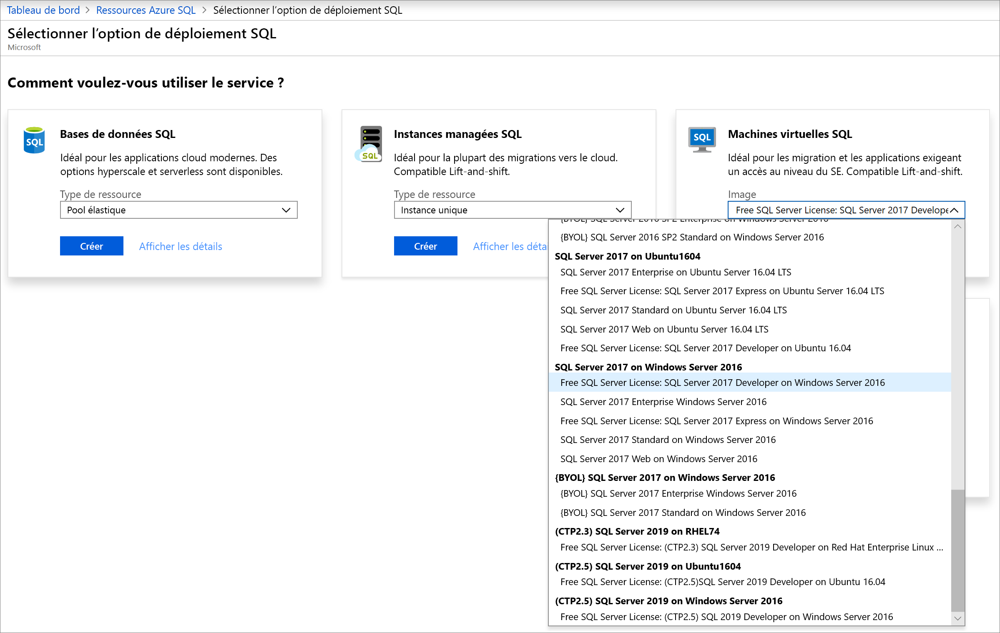
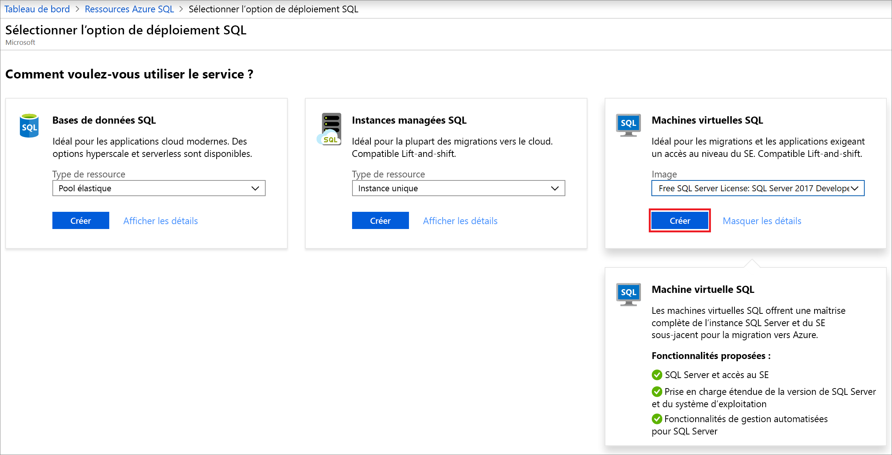
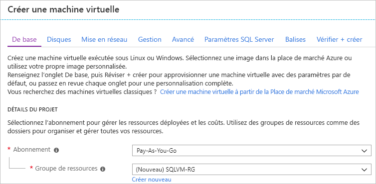
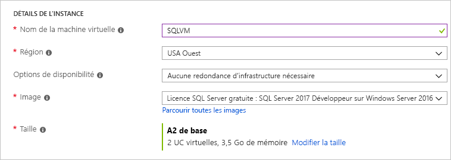
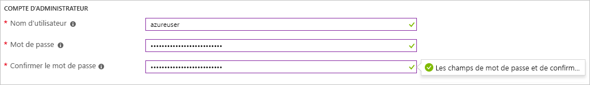
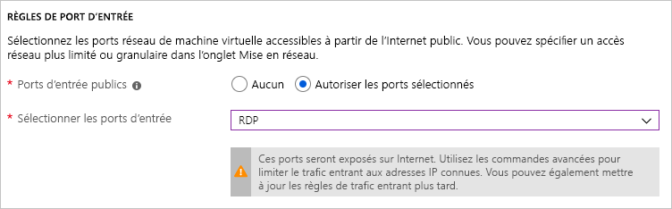
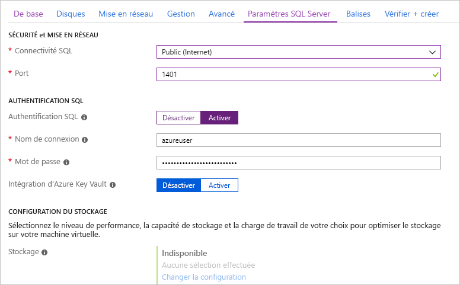
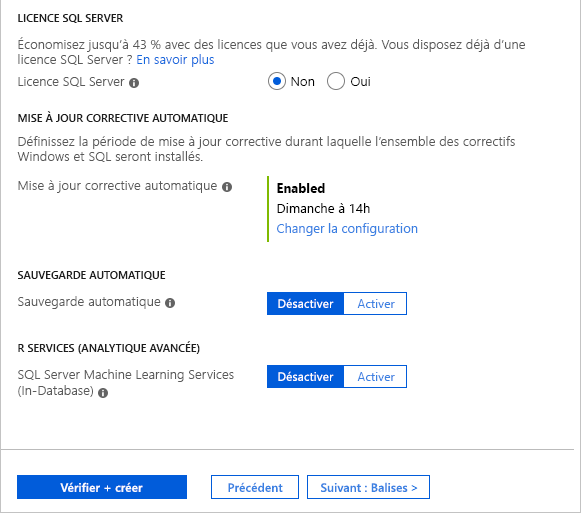

# Démarrage rapide : Créer une machine virtuelle Windows SQL Server 2017 dans le portail Azure

> [!div class="op_single_selector"]
> * [Windows](quickstart-sql-vm-create-portal.md)
> * [Linux](../../linux/sql/provision-sql-server-linux-virtual-machine.md)

Ce démarrage rapide décrit les étapes de base de création d’une machine virtuelle SQL Server dans le portail Azure.

  > [!TIP]
  > - Ce démarrage rapide vous présente les étapes de mise en service et de connexion rapide d’une machine virtuelle SQL. Pour plus d’informations sur les autres options de mise en service des machines virtuelles SQL, consultez le [guide de mise en service des machines virtuelles Windows SQL Server dans le portail Azure](virtual-machines-windows-portal-sql-server-provision.md).
  > - Si vous avez des questions sur les machines virtuelles SQL Server, consultez le [Forum aux Questions](virtual-machines-windows-sql-server-iaas-faq.md).

##  Obtenir un abonnement Azure

Si vous n’avez pas d’abonnement Azure, créez un [compte gratuit](https://azure.microsoft.com/free/?WT.mc_id=A261C142F) avant de commencer.

##  Sélectionner une image de machine virtuelle SQL Server

1. Connectez-vous au [portail Azure](https://portal.azure.com) à l’aide de votre compte.

1. Dans le menu de gauche du portail Azure, sélectionnez **Azure SQL**. Si **Azure SQL** ne figure pas dans la liste, sélectionnez **Tous les services**, puis tapez *Azure SQL* dans la zone de recherche.
1. Sélectionnez **+Ajouter** pour ouvrir la page **Sélectionner l’option de déploiement SQL**. Vous pouvez afficher des informations supplémentaires en sélectionnant **Afficher les détails** sur la vignette **Machines virtuelles SQL**.
1. Sélectionnez l’image **Licence gratuite SQL Server : SQL Server 2017 Developer sur Windows Server 2016** dans la liste déroulante.

   

1. Sélectionnez **Create** (Créer).

   

##  Fournir des informations de base

Sous l’onglet **De base**, fournissez les informations suivantes :

1. Dans la section **Détails du projet**, sélectionnez votre abonnement Azure, puis sélectionnez **Créer** pour créer un groupe de ressources. Tapez _SQLVM-RG_ pour le nom.

   

1. Sous **Détails de l’instance** :
    1. Tapez _SQLVM_ pour le **Nom de la machine virtuelle**. 
    1. Choisissez un emplacement pour votre **Région**. 
    1. Pour les besoins de ce guide, laissez **Options de disponibilité** défini sur _Aucune redondance d’infrastructure requise_. Pour plus d’informations sur les options de disponibilité, voir [Disponibilité](../../windows/availability.md). 
    1. Dans la liste **Image**, sélectionnez _Licence SQL Server gratuite : SQL Server 2017 Developer sous Windows Server 2016_. 
    1. Choisissez **Modifier la taille** pour la **taille** de la machine virtuelle, puis sélectionnez l’offre **A2 de base**. Nettoyez vos ressources lorsque vous n’en avez plus besoin afin d’éviter des frais imprévus. 

   

1. Sous **Compte d’administrateur**, indiquez un nom d’utilisateur (par exemple, _azureuser_) et un mot de passe. Le mot de passe doit contenir au moins 12 caractères et satisfaire aux [exigences de complexité définies](../../windows/faq.md#what-are-the-password-requirements-when-creating-a-vm).

   

1. Sous **Règles des ports d’entrée**, choisissez **Autoriser les ports sélectionnés**, puis sélectionnez **RDP (3389)** dans la liste déroulante. 

   

## Paramètres de SQL Server

Sous l’onglet **Paramètres SQL Server**, configurez les options suivantes :

1. Sous **Sécurité et réseaux**, sélectionnez _Public (Internet)_ pour **Connectivité SQL**, puis remplacez le port par `1401` pour éviter d’utiliser un numéro de port connu dans un scénario public. 
1. Sous **Authentification SQL**, sélectionnez **Activer**. La connexion SQL est définie sur les mêmes nom d’utilisateur et mot de passe que vous avez configurés pour la machine virtuelle. Utilisez le paramètre par défaut pour l’[**intégration Azure Key Vault**](virtual-machines-windows-ps-sql-keyvault.md). La **configuration du stockage** n’est pas disponible pour les images de base des machines virtuelles SQL Server. Si vous souhaitez connaître les options qui sont disponibles pour les autres images, consultez [Configuration du stockage](virtual-machines-windows-sql-server-storage-configuration.md#new-vms).  

   

1. Modifiez d’autres paramètres si nécessaire, puis sélectionnez **Vérifier + créer**. 

   

## Créer la machine virtuelle SQL Server

Sous l’onglet **Vérifier + créer**, lisez le récapitulatif, puis sélectionnez **Créer** pour créer l’instance SQL Server, le groupe de ressources et les ressources spécifiées pour cette machine virtuelle.

Vous pouvez surveiller le déploiement à partir du portail Azure. Le bouton **Notifications** en haut de l’écran affiche l’état de base du déploiement. Le déploiement peut prendre plusieurs minutes. 

## Se connecter à SQL Server

1. Dans le portail, recherchez l’**adresse IP publique** de votre machine virtuelle SQL Server dans la section **Vue d’ensemble** des propriétés de votre machine virtuelle.

1. Sur un autre ordinateur connecté à Internet, ouvrez [SQL Server Management Studio (SSMS)](/sql/ssms/download-sql-server-management-studio-ssms).

1. Dans la boîte de dialogue **Se connecter au serveur** ou **Se connecter au moteur de base de données**, modifiez la valeur **Nom du serveur**. Entrez l’adresse IP publique de votre machine virtuelle. Ajoutez ensuite une virgule, puis ajoutez le port personnalisé, **1401**, que nous avons spécifié lors de la configuration de la nouvelle machine virtuelle. Par exemple : `11.22.33.444,1401`.

1. Dans la zone **Authentification**, sélectionnez **Authentification SQL Server**.

1. Dans la zone **Connexion** , saisissez le nom d’une connexion SQL valide.

1. Dans la zone **Mot de passe** , saisissez le mot de passe de la connexion.

1. Sélectionnez **Connecter**.

    

##  Se connecter à la machine virtuelle à distance

Pour vous connecter à la machine virtuelle SQL Server à l’aide du Bureau à distance, procédez comme suit.

[!INCLUDE [Connect to SQL Server VM with remote desktop](../../../../includes/virtual-machines-sql-server-remote-desktop-connect.md)]

Une fois que vous vous connectez à la machine virtuelle SQL Server, vous pouvez lancer SQL Server Management Studio et vous connecter avec l’authentification Windows à l’aide de vos informations d’identification d’administrateur local. Si vous avez activé l’authentification SQL Server, vous pouvez également vous connecter avec l’authentification SQL à l’aide de la connexion SQL et du mot de passe configuré lors de l’approvisionnement.

L’accès à la machine permet de modifier directement les paramètres SQL Server et ceux de la machine en fonction de vos besoins. Par exemple, vous pourriez configurer les paramètres du pare-feu ou modifier les paramètres de configuration SQL Server.

## Nettoyer les ressources

Si vous n’avez pas besoin que votre machine virtuelle SQL s’exécute en permanence, vous pouvez éviter les frais inutiles en l’arrêtant lorsque vous ne vous en servez pas. Vous pouvez également supprimer définitivement toutes les ressources associées à la machine virtuelle en effaçant son groupe de ressources dans le portail. Cette commande supprime la machine virtuelle de façon définitive, donc utilisez-la avec précaution. Pour plus d’informations, consultez [Gérer les ressources Azure sur le portail](../../../azure-resource-manager/management/manage-resource-groups-portal.md).

## Étapes suivantes

Dans ce guide de démarrage rapide, vous avez créé une machine virtuelle SQL Server 2017 dans le portail Azure. Pour en savoir plus sur la façon de migrer vos données vers la nouvelle instance SQL Server, consultez l’article suivant.

> [!div class="nextstepaction"]
> [Migrer une base de données SQL Server vers SQL Server dans une machine virtuelle Azure](virtual-machines-windows-migrate-sql.md)
