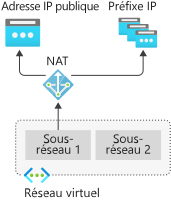
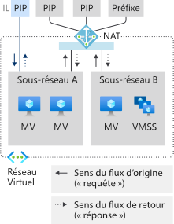
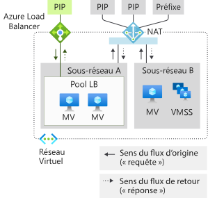
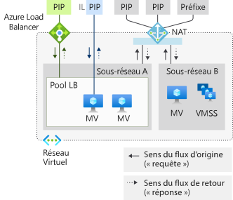
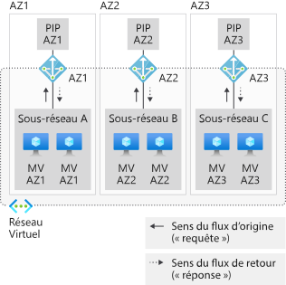
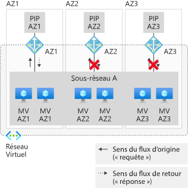
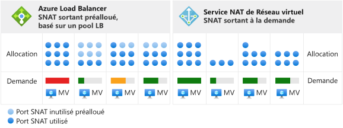
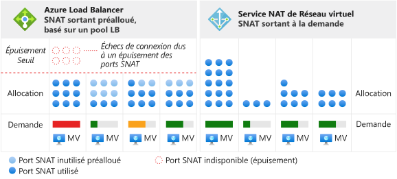

# <a name="designing-virtual-networks-with-nat-gateway-resources-public-preview"></a>Conception de réseaux virtuels avec des ressources de passerelle NAT (préversion publique)

Les ressources de passerelle NAT font partie du [service NAT de Réseau virtuel](nat-overview.md) et offrent une connectivité Internet sortante à un ou plusieurs sous-réseaux d’un réseau virtuel. Le sous-réseau du réseau virtuel indique quelle passerelle NAT est utilisée. Le service NAT fournit la traduction d’adresses réseau sources (SNAT) à un sous-réseau.  Les ressources de passerelle NAT spécifient les adresses IP statiques utilisées par les machines virtuelles lors de la création de flux sortants. Les adresses IP statiques proviennent des ressources d’adresses IP publiques, des ressources de préfixes d’adresses IP publiques ou des deux. Une ressource de passerelle NAT peut utiliser jusqu’à 16 adresses IP statiques.


<p align="center">
  
</p>

*Figure : Service NAT de Réseau virtuel pour le trafic sortant vers Internet*


>[!NOTE] 
>Le service NAT de Réseau virtuel est disponible en préversion publique pour l’instant. Actuellement, il n’est disponible que dans un ensemble limité de [régions](nat-overview.md#region-availability). Cette préversion est fournie sans contrat de niveau de service et n’est pas recommandée pour les charges de travail de production. Certaines fonctionnalités peuvent être limitées ou non prises en charge. Consultez les [Conditions d’utilisation supplémentaires des préversions de Microsoft Azure](https://azure.microsoft.comsupport/legal/preview-supplemental-terms).

## <a name="how-to-deploy-nat"></a>Comment déployer le service NAT

La configuration et l’utilisation de la passerelle NAT sont volontairement simples :  

Ressource de passerelle NAT :
- Créez une ressource de passerelle NAT régionale ou zonale (isolé dans une zone).
- Affectez des adresses IP.
- Modifiez le délai d’inactivité (facultatif).

Réseau virtuel :
- Configurez un sous-réseau de réseau virtuel pour utiliser une passerelle NAT.

Les routes définies par l’utilisateur ne sont pas nécessaires.

## <a name="resource"></a>Ressource

La ressource est conçue pour être simple, comme vous pouvez le voir dans l’exemple Azure Resource Manager suivant défini dans un format de type modèle.  Ce format de type modèle est présenté ici pour illustrer les concepts et la structure.  Modifiez l’exemple selon vos besoins.  Ce document n’a pas vocation à service de tutoriel.

Le diagramme suivant montre les références accessibles en écriture entre les différentes ressources Azure Resource Manager.  La flèche indique la direction de la référence, depuis l’emplacement où elle est accessible en écriture. Révision 

<p align="center">
  
</p>

*Figure : Modèle objet NAT de Réseau virtuel*

La traduction d’adresses réseau (NAT) est recommandée pour la plupart des charges de travail, sauf si vous avez une dépendance spécifique vis-à-vis d’une [connectivité sortante Load Balancer basée sur un pool](../load-balancer/load-balancer-outbound-connections.md).  

Vous pouvez migrer à partir de scénarios d’équilibreur de charge standard, [règles de trafic sortant](../load-balancer/load-balancer-outbound-rules-overview.md) comprises, vers une passerelle NAT. Pour migrer, déplacez les ressources d’adresses IP publiques et les ressources de préfixes d’adresses IP publiques des front-ends de l’équilibreur de charge vers la passerelle NAT. Les nouvelles adresses IP de la passerelle NAT ne sont pas nécessaires. L’adresse IP publique et le préfixe standard peuvent être réutilisés tant que le total ne dépasse pas 16 adresses IP. Planifiez la migration sans oublier l’interruption de service pendant la transition.  Vous pouvez réduire cette interruption au minimum en automatisant le processus. Testez d’abord la migration dans un environnement intermédiaire.  Pendant la transition, les flux entrants ne sont pas affectés.

L’exemple suivant crée une ressource de passerelle NAT appelée _myNATGateway_ dans la région _USA Est 2, AZ 1_ avec un délai d’inactivité de _4 minutes_. Les adresses IP sortantes fournies sont :
- Un ensemble de ressources d’adresses IP publiques _myIP1_ et _myIP2_. 
- Un ensemble de ressources de préfixes d’adresses IP publiques _myPrefix1_ et _myPrefix2_. 

Le nombre total d’adresses IP fournies par ces quatre ressources d’adresses IP ne peut pas dépasser 16 adresses IP. Tout nombre d’adresses IP compris entre 1 et 16 est autorisé.

```json
{
"name": "myNATGateway",
   "type": "Microsoft.Network/natGateways",
   "apiVersion": "2018-11-01",
   "location": "East US 2",
   "sku": { "name": "Standard" },
   "zones": [ "1" ],
   "properties": {
      "idleTimeoutInMinutes": 4, 
      "publicIPPrefixes": [
         {
            "id": "ref to myPrefix1"
         },
         {
            "id": "ref to myPrefix2"
         }
      ],
      "publicIPAddresses": [
         {
            "id": "ref to myIP1"
         },
         {
            "id": "ref to myIP2"
         }
      ]
   }
}
```

Quand la ressource de passerelle NAT est créée, elle peut être utilisée sur un ou plusieurs sous-réseaux d’un réseau virtuel. Spécifiez les sous-réseaux qui utilisent cette ressource de passerelle NAT. Une passerelle NAT ne peut pas s’étendre sur plusieurs réseaux virtuels. Il n’est pas nécessaire d’attribuer la même passerelle NAT à tous les sous-réseaux d’un réseau virtuel. Les sous-réseaux individuels peuvent être configurés avec différentes ressources de passerelle NAT.

Les scénarios qui n’utilisent pas de zones de disponibilité sont régionaux (aucune zone spécifiée). Si vous utilisez des zones de disponibilité, vous pouvez spécifier une zone pour isoler la traduction d’adresses réseau dans une zone spécifique. La redondance dans une zone n’est pas prise en charge. Examinez les [zones de disponibilité](#availability-zones) NAT.


```json
{
   "name": "myVNet",
   "apiVersion": "2018-11-01",
   "type": "Microsoft.Network/virtualNetworks",
   "location": "myRegion", 
   "properties": {
      "addressSpace": {
          "addressPrefixes": [
           "192.168.0.0/16"
          ]
      },
      "subnets": [
         {
            "name": "mySubnet1",
            "properties": {
               "addressPrefix": "192.168.0.0/24",
               "natGateway": {
                  "id": "ref to myNATGateway"
               }
            }
         } 
      ]
   }
}
```
Les passerelles NAT sont définies avec une propriété sur un sous-réseau au sein d’un réseau virtuel. Les flux créés par des machines virtuelles sur le sous-réseau _mySubnet1_ du réseau virtuel _myVNet_ utilisent la passerelle NAT. Toute la connectivité sortante utilise les adresses IP associées à _myNatGateway_ comme adresse IP source.


## <a name="design-guidance"></a>Conseils pour la conception

Passez en revue cette section pour vous familiariser avec les considérations relatives à la conception des réseaux virtuels avec le service NAT.  

1. [Optimisation des coûts](#cost-optimization)
1. [Coexistence des trafics entrant et sortant](#coexistence-of-inbound-and-outbound)
2. [Gestion des ressources de base](#managing-basic-resources)
3. [Zones de disponibilité](#availability-zones)

### <a name="cost-optimization"></a>Optimisation des coûts

Les [points de terminaison de service](virtual-network-service-endpoints-overview.md) et le [lien privé](../private-link/private-link-overview.md) sont deux options à prendre en compte pour optimiser les coûts quand la traduction d’adresses réseau n’est pas nécessaire.  Tout trafic dirigé vers des points de terminaison de service ou un lien privé n’est pas traité par le service NAT du réseau virtuel.  

Les points de terminaison de service lient les ressources de service Azure à votre réseau virtuel et contrôlent l’accès à vos ressources de service Azure. Par exemple, lorsque vous accédez au stockage Azure, utilisez un point de terminaison de service pour le stockage afin d’éviter des frais de traitement de données par le service NAT. Les points de terminaison de service sont gratuits.

Un lien privé expose le service PaaS Azure (ou d’autres services hébergés avec un lien privé) en tant que point de terminaison privé au sein d’un réseau virtuel.  Un lien privé est facturé selon la durée et les données traitées.

Déterminez si l’une ou l’autre de ces approches convient à votre scénario et utilisez-la si nécessaire.

### <a name="coexistence-of-inbound-and-outbound"></a>Coexistence des trafics entrant et sortant

La passerelle NAT est compatible avec :

 - Équilibreur de charge standard
 - Adresse IP publique standard
 - Préfixe d’adresse IP publique standard

Quand vous développez un nouveau déploiement, commencez avec des références SKU standard.

<p align="center">
  
</p>

*Figure : Service NAT de Réseau virtuel pour le trafic sortant vers Internet*

Le scénario Internet sortant uniquement fourni par la passerelle NAT peut être étendu avec les fonctionnalités de trafic entrant à partir d’Internet. Chaque ressource est consciente de la direction d’origine d’un flux. Sur un sous-réseau doté d’une passerelle NAT, tous les scénarios de trafic sortant vers Internet sont remplacés par la passerelle NAT. Les scénarios de trafic entrant à partir d’Internet sont fournis par la ressource respective.

#### <a name="nat-and-vm-with-instance-level-public-ip"></a>Service NAT et machine virtuelle avec une adresse IP publique au niveau de l’instance

<p align="center">
  
</p>

*Figure : Service NAT de Réseau virtuel et machine virtuelle avec une adresse IP publique au niveau de l’instance*

| Sens | Ressource |
|:---:|:---:|
| Trafic entrant | Machine virtuelle avec une adresse IP publique au niveau de l’instance |
| Règle de trafic sortant | Passerelle NAT |

La machine virtuelle utilise la passerelle NAT pour le trafic sortant.  Le trafic entrant n’est pas affecté.

#### <a name="nat-and-vm-with-public-load-balancer"></a>Service NAT et machine virtuelle avec équilibreur de charge public

<p align="center">
  
</p>

*Figure : Service NAT de Réseau virtuel et machine virtuelle avec équilibreur de charge public*

| Sens | Ressource |
|:---:|:---:|
| Trafic entrant | Équilibreur de charge public |
| Règle de trafic sortant | Passerelle NAT |

Toute configuration de trafic sortant à partir d’une règle d’équilibrage de charge ou de règles de trafic sortant est remplacée par la passerelle NAT.  Le trafic entrant n’est pas affecté.

#### <a name="nat-and-vm-with-instance-level-public-ip-and-public-load-balancer"></a>Service NAT et machine virtuelle avec une adresse IP publique au niveau de l’instance et un équilibreur de charge public

<p align="center">
  
</p>

*Figure : Service NAT de Réseau virtuel et machine virtuelle avec une adresse IP publique au niveau de l’instance et un équilibreur de charge public*

| Sens | Ressource |
|:---:|:---:|
| Trafic entrant | Machine virtuelle avec une adresse IP publique au niveau de l’instance et un équilibreur de charge public |
| Règle de trafic sortant | Passerelle NAT |

Toute configuration de trafic sortant à partir d’une règle d’équilibrage de charge ou de règles de trafic sortant est remplacée par la passerelle NAT.  La machine virtuelle utilise également la passerelle NAT pour le trafic sortant.  Le trafic entrant n’est pas affecté.

### <a name="managing-basic-resources"></a>Gestion des ressources de base

L’équilibreur de charge standard, l’adresse IP publique et le préfixe d’adresse IP publique sont compatibles avec la passerelle NAT. Les passerelles NAT fonctionnent dans l’étendue d’un sous-réseau. La référence SKU de base de ces services doit être déployée sur un sous-réseau sans passerelle NAT. Cette séparation permet aux deux variantes de référence SKU de coexister sur le même réseau virtuel.

Les passerelles NAT ont la priorité sur les scénarios de trafic sortant du sous-réseau. L’équilibreur de charge de base ou l’adresse IP publique (et tout service géré créé avec eux) ne peuvent pas s’ajuster aux traductions appropriées. La passerelle NAT prend le contrôle du trafic sortant vers Internet sur un sous-réseau. Le trafic entrant vers l’équilibreur de charge de base et l’adresse IP publique n’est pas disponible. Le trafic entrant vers un équilibreur de charge de base et/ou une adresse IP publique configurée sur une machine virtuelle n’est pas disponible.

### <a name="availability-zones"></a>Zones de disponibilité

Même sans zones de disponibilité, le service NAT est résilient et peut survivre à plusieurs défaillances de composants d’infrastructure. Quand des zones de disponibilité font partie de votre scénario, vous devez configurer le service NAT pour une zone spécifique.  Les opérations du plan de contrôle et le plan de données sont limités à la zone spécifiée. Une défaillance dans une zone autre que celle où se trouve votre scénario est supposée n’exercer aucun impact sur le service NAT. Le trafic sortant des machines virtuelles dans la même zone échoue en raison de l’isolement de la zone.

<p align="center">
  
</p>

*Figure : Service NAT de Réseau virtuel avec des zones de disponibilité*

Une passerelle NAT isolée dans une zone exige que les adresses IP correspondent à la zone de la passerelle NAT. Les ressources de passerelle NAT avec des adresses IP d’une autre zone ou sans zone ne sont pas prises en charge.

Les réseaux virtuels et les sous-réseaux s’alignent sur une région et non une zone. Une machine virtuelle doit être dans la même zone que la passerelle NAT pour une promesse zonale de connexions sortantes. L’isolement d’une zone est créé par une « pile » zonale par zone de disponibilité. Aucune promesse zonale n’existe en cas de franchissement des zones d’une passerelle NAT zonale ou d’utilisation d’une passerelle NAT régionale avec des machines virtuelles zonales.

Lorsque vous déployez des groupes de machines virtuelles identiques à utiliser avec le service NAT, vous déployez un groupe identique zonal sur son propre sous-réseau et attachez la passerelle NAT de zone correspondante à ce sous-réseau. Si vous utilisez des groupes identiques qui s’étendent sur plusieurs zones (au moins deux zones), le service NAT ne tient pas de promesse zonale.  Le service NAT ne prend pas en charge la redondance dans une zone.  Seul l’isolement régional ou de zone est pris en charge.

<p align="center">
  
</p>

*Figure : Service NAT de Réseau virtuel couvrant des zones*

La propriété des zones n’est pas mutable.  Redéployez la ressource de passerelle NAT avec la préférence régionale ou de zone souhaitée.

>[!NOTE] 
>Les adresses IP ne sont pas par elles-mêmes redondantes dans une zone, si aucune zone n’est spécifiée.  Le front-end d’un service [Standard Load Balancer est redondant dans une zone](../load-balancer/load-balancer-standard-availability-zones.md#frontend) si aucune adresse IP n’est créée dans une zone spécifique.  Cela ne s’applique pas au service NAT.  Seul l’isolement régional ou de zone est pris en charge.

## <a name="source-network-address-translation"></a>Traduction d’adresses réseau sources

La traduction d’adresses réseau sources (SNAT) réécrit la source d’un flux pour qu’il provienne d’une autre adresse IP.  Les ressources de passerelle NAT utilisent une variante de SNAT communément appelée traduction d’adresses de port (PAT). PAT réécrit l’adresse source et le port source. Avec SNAT, il n’existe aucune relation fixe entre le nombre d’adresses privées et leurs adresses publiques traduites.  

### <a name="fundamentals"></a>Notions de base

Examinons un exemple de quatre flux pour expliquer le concept de base.  La passerelle NAT utilise une ressource d’adresse IP publique 65.52.0.2.

| Flux | Tuple source | Tuple de destination |
|:---:|:---:|:---:|
| 1 | 192.168.0.16:4283 | 65.52.0.1:80 |
| 2 | 192.168.0.16:4284 | 65.52.0.1:80 |
| 3 | 192.168.0.17.5768 | 65.52.0.1:80 |
| 4 | 192.168.0.16:4285 | 65.52.0.2:80 |

Ces flux peuvent ressembler à ceci après l’application de PAT :

| Flux | Tuple source | Tuple source après SNAT | Tuple de destination | 
|:---:|:---:|:---:|:---:|
| 1 | 192.168.0.16:4283 | 65.52.0.2:234 | 65.52.0.1:80 |
| 2 | 192.168.0.16:4284 | 65.52.0.2:235 | 65.52.0.1:80 |
| 3 | 192.168.0.17.5768 | 65.52.0.2:236 | 65.52.0.1:80 |
| 4 | 192.168.0.16:4285 | 65.52.0.2:237 | 65.52.0.2:80 |

La destination voit que la source du flux est 65.52.0.2 (Tuple source SNAT) avec le port attribué indiqué.  PAT, comme indiqué dans le tableau précédent, est également appelé SNAT de déguisement de port.  Plusieurs sources privées se font passer pour une adresse IP et un port.

N’utilisez pas de dépendance vis-à-vis de la façon dont les ports sources sont affectés.  L’illustration précédente montre uniquement le concept de base.

La traduction d’adresses réseau sources (SNAT) fournie par le service NAT diffèrent de [Load Balancer](../load-balancer/load-balancer-outbound-connections.md) sous plusieurs aspects.

### <a name="on-demand"></a>À la demande

NAT fournit des ports SNAT à la demande pour les nouveaux flux de trafic sortant. Tous les ports SNAT disponibles dans l’inventaire sont utilisés par toute machine virtuelle sur les sous-réseaux configurés avec NAT. 

<p align="center">
  
</p>

*Figure : SNAT de trafic sortant à la demande du service NAT de Réseau virtuel*

Toute configuration IP d’une machine virtuelle peut créer des flux sortants à la demande si besoin.  Aucune préallocation, par planification d’instance incluant le surprovisionnement du pire cas par instance, n’est nécessaire.  

<p align="center">
  
</p>

*Figure : Différences dans les scénarios d’épuisement*

Une fois qu’un port SNAT est libéré, il devient disponible pour être utilisé par toute machine virtuelle sur des sous-réseaux configurés avec NAT.  L’allocation à la demande permet aux charges de travail dynamiques et divergentes sur des sous-réseaux d’utiliser des ports SNAT selon leurs besoins.  Tant qu’un inventaire des ports SNAT est disponible, les flux SNAT aboutissent. Les zones réactives de port SNAT bénéficient plutôt de l’inventaire plus grand. Les ports SNAT ne sont pas laissés inutilisés pour les machines virtuelles qui n’en ont pas activement besoin.

### <a name="scaling"></a>Mise à l'échelle

NAT a besoin d’un inventaire de ports SNAT suffisant pour le scénario de trafic sortant complet. La mise à l’échelle NAT est principalement une fonction de gestion de l’inventaire des ports SNAT partagés et disponibles. L’inventaire doit être suffisant pour traiter le pic du flux sortant pour tous les sous-réseaux attachés à une ressource de passerelle NAT.

SNAT mappe plusieurs adresses privées à une seule adresse publique et utilise plusieurs adresses IP publiques pour la mise à l’échelle.

Une ressource de passerelle NAT utilise 64 000 ports (ports SNAT) d’une adresse IP publique.  Ces ports SNAT deviennent l’inventaire disponible pour le mappage des flux privés et publics. L’ajout d’autres adresses IP publiques augmente les ports SNAT disponibles dans l’inventaire. Les ressources de passerelle NAT peuvent comprendre jusqu’à 16 adresses IP et 1 million de ports SNAT.  Les protocoles TCP et UDP sont des inventaires de ports SNAT distincts qui ne sont pas liés.

Les ressources de passerelle NAT réutilisent de façon opportuniste les ports sources. À des fins de mise à l’échelle, vous devez partir du principe que chaque flux nécessite un nouveau port SNAT et mettre à l’échelle le nombre total d’adresses IP disponibles pour le trafic sortant.

### <a name="protocols"></a>Protocoles

Les ressources de passerelle NAT interagissent avec les en-têtes IP et de transport IP des flux UDP et TCP. Elles sont indépendantes des charges utiles de la couche Application.  Les autres protocoles IP ne sont pas pris en charge.

### <a name="timers"></a>Minuteurs

Le délai d’inactivité peut varier de 4 minutes (par défaut) à 120 minutes (2 heures) pour tous les flux.  De plus, vous pouvez réinitialiser le minuteur d’inactivité avec du trafic en cours de flux.  Un modèle recommandé pour l’actualisation des connexions inactives longues et la détection d’activité sur les points de terminaison consiste à utiliser des conservations de connexion active TCP.  Les conservations de connexion active TCP apparaissent comme des accusés de réception en double sur les points de terminaison, leur surcharge est faible et elles sont invisibles pour la couche Application.

Les minuteurs suivants sont utilisés pour la libération des ports SNAT :

| Minuterie | Valeur |
|---|---|
| TCP FIN | 60 secondes |
| TCP RST | 10 secondes |
| TCP demi-ouvert | 30 secondes |

Un port SNAT peut être réutilisé pour la même adresse IP de destination et le même port de destination au bout de 5 secondes.

>[!NOTE] 
>Ces paramètres de minuteur sont susceptibles d’être modifiés. Les valeurs sont fournies pour faciliter la résolution des problèmes et vous ne devez pas dépendre de minuteurs spécifiques pour le moment.

## <a name="limitations"></a>Limites

- NAT est compatible avec des ressources d’adresses IP publiques, de préfixes d’adresses IP publiques et d’équilibreur de charge de la référence SKU standard.   Les ressources de base (par exemple, un équilibreur de charge de base) et tous les produits dérivés de celles-ci ne sont pas compatibles avec NAT.  Les ressources de base doivent être placées sur un sous-réseau non configuré avec NAT.
- La famille d’adresses IPv4 est prise en charge.  NAT n’interagit pas avec la famille d’adresses IPv6.
- La journalisation des flux de groupe de sécurité réseau n’est pas prise en charge lors de l’utilisation de NAT.
- NAT ne peut pas s’étendre sur plusieurs réseaux virtuels.

## <a name="preview-participation"></a>Participation à la préversion

Suivez les [instructions pour activer votre abonnement](nat-overview.md#public-preview-participation).

## <a name="feedback"></a>Commentaires

Nous aimerions savoir comment nous pouvons améliorer le service. Faites-nous part de vos [commentaires sur la préversion publique](https://aka.ms/natfeedback).  Proposez-nous de nouvelles fonctionnalités et votez pour celles que vous préférez en nous contactant sur [UserVoice for NAT](https://aka.ms/natuservoice).

## <a name="next-steps"></a>Étapes suivantes

- Découvrez-en plus sur le [service NAT de Réseau virtuel](nat-overview.md).
- Tutoriel de validation de NAT Gateway
  * [Azure CLI](tutorial-create-validate-nat-gateway-cli.md)
  * [PowerShell](tutorial-create-validate-nat-gateway-cli.md)
  * [Portail](tutorial-create-validate-nat-gateway-cli.md)
- Démarrage rapide du déploiement d’une ressource de passerelle NAT
  * [Azure CLI](./quickstart-create-nat-gateway-cli.md)
  * [PowerShell](./quickstart-create-nat-gateway-powershell.md)
  * [Portail](./quickstart-create-nat-gateway-portal.md)
- Découvrez-en plus sur les [zones de disponibilité](../availability-zones/az-overview.md).
- Découvrez-en plus sur l’[équilibreur de charge standard](../load-balancer/load-balancer-standard-overview.md).
- Découvrez-en plus sur les [zones de disponibilité et l’équilibreur de charge standard](../load-balancer/load-balancer-standard-availability-zones.md).
- Découvrez-en plus sur l’API de ressource de passerelle NAT
  * [API REST](https://docs.microsoft.com/rest/api/virtualnetwork/natgateways)
  * [Azure CLI](https://docs.microsoft.com/cli/azure/network/nat/gateway?view=azure-cli-latest)
  * [PowerShell](https://docs.microsoft.com/powershell/module/az.network/new-aznatgateway).
- [Dites-nous quoi créer ensuite dans UserVoice](https://aka/natuservoice).
- [Faites-nous part de vos commentaires sur la préversion publique](https://aka.ms/natfeedback).
