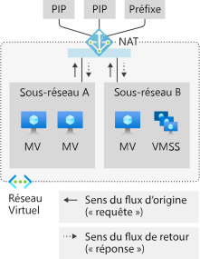

# Métriques du service NAT du réseau virtuel Azure

Les ressources de la passerelle NAT du réseau virtuel Azure fournissent des métriques multidimensionnelles. Vous pouvez utiliser ces métriques pour observer l’opération et pour la [résolution des problèmes](nat-metrics.md).  Il est possible de configurer des alertes pour des problèmes critiques comme l’épuisement des ressources SNAT.

  

*Figure : Service NAT de Réseau virtuel pour le trafic sortant vers Internet*

>[!NOTE] 
>Le service NAT de Réseau virtuel est disponible en préversion publique pour l’instant. Actuellement, il n’est disponible que dans un ensemble limité de [régions](nat-overview.md#region-availability). Cette préversion est fournie sans contrat de niveau de service et n’est pas recommandée pour les charges de travail de production. Certaines fonctionnalités peuvent être limitées ou non prises en charge. Consultez les [Conditions d’utilisation supplémentaires des préversions de Microsoft Azure](https://azure.microsoft.com/support/legal/preview-supplemental-terms).

## Mesures

Les ressources de passerelle NAT fournissent les métriques multidimensionnelles suivantes dans Azure Monitor :

| Métrique | Description | Agrégation recommandée | Dimensions |
|---|---|---|---|
| Octets | Octets entrants et sortants traités | SUM | Direction (In ; Out), Protocole (6 TCP ; 17 UDP) |
| Paquets | Paquets entrants et sortants traités | SUM | Direction (In ; Out), Protocole (6 TCP ; 17 UDP) |
| Paquets ignorés | Paquets ignorés par la passerelle NAT | SUM | / |
| Nombre de connexions SNAT | Transitions d’état par intervalle | SUM | État de la connexion, Protocole (6 TCP; 17 UDP) |
| Nombre total de connexions SNAT | Connexions SNAT actives actuelles (~ ports SNAT utilisés) | SUM | Protocole (6 TCP ; 17 UDP) |

## Alertes

Les alertes relatives aux métriques peuvent être configurées dans Azure Monitor pour chacune des [métriques](#metrics) précédentes.

## Limites

Resource Health n’est pas pris en charge.

## Étapes suivantes

- Apprenez-en davantage sur le service [Nat de Réseau virtuel](nat-overview.md).
- Découvrir la [ressource de passerelle NAT](nat-gateway-resource.md)
- Découvrir [Azure Monitor](../azure-monitor/overview.md)
- Découvrez la [résolution des problèmes liés aux ressources de passerelle NAT](troubleshoot-nat.md).

