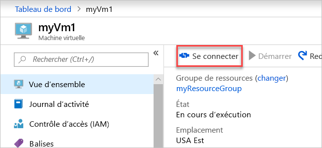

# <a name="quickstart-create-a-virtual-network-using-the-azure-portal"></a>Démarrage rapide : Créer un réseau virtuel au moyen du portail Azure

Dans ce démarrage rapide, vous découvrez comment créer un réseau virtuel à l’aide du portail Azure. Vous déployez deux machines virtuelles. Ensuite, vous établissez une communication sécurisée entre les machines virtuelles et vous vous connectez aux machines virtuelles à partir d’Internet. Un réseau virtuel est le bloc de construction fondamental de votre réseau privé dans Azure. Il permet à des ressources Azure, comme des machines virtuelles, de communiquer de manière sécurisée entre elles et avec Internet.

## <a name="prerequisites"></a>Prérequis

* Compte Azure avec un abonnement actif. [Créez-en un gratuitement](https://azure.microsoft.com/free/?ref=microsoft.com&utm_source=microsoft.com&utm_medium=docs&utm_campaign=visualstudio).

## <a name="sign-in-to-azure"></a>Connexion à Azure

Connectez-vous au [portail Azure](https://portal.azure.com).

## <a name="create-a-virtual-network"></a>Créez un réseau virtuel

1. Dans le menu du Portail Azure, sélectionnez **Créer une ressource**. À partir de la Place de marché Azure, sélectionnez **Mise en réseau** > **Réseau virtuel**.

1. Dans **Créer un réseau virtuel**, entrez ou sélectionnez ces informations :

    | Paramètre | Valeur |
    | ------- | ----- |
    | Abonnement | Sélectionnez votre abonnement.|
    | Resource group | Sélectionnez **Créer nouveau**, entrez *myResourceGroup* et sélectionnez **OK**. |
    | Nom | Entrez *myVirtualNetwork*. |
    | Emplacement | Sélectionnez **USA Est**.|

1. Sélectionnez **Suivant : Adresses IP** et, pour **Espace d’adressage IPv4**, entrez *10.1.0.0/16*.

1. Sélectionnez **Ajouter un sous-réseau**, puis entrez *myVirtualSubnet* pour **Nom de sous-réseau** et *10.1.0.0/24* pour la **Plage d’adresses de sous-réseau**.

1. Sélectionnez **Ajouter**, puis **Vérifier + créer**. Conservez les autres valeurs par défaut, puis sélectionnez **Créer**.

1. Dans **Créer un réseau virtuel**, sélectionnez **Créer**.

## <a name="create-virtual-machines"></a>Créer des machines virtuelles

Créez deux machines virtuelles dans le réseau virtuel :

### <a name="create-the-first-vm"></a>Créer la première machine virtuelle

1. Dans le menu du Portail Azure, sélectionnez **Créer une ressource**.

1. À partir de la Place de marché Azure, sélectionnez **Calcul** > **Windows Server 2019 Datacenter**. Sélectionnez **Create** (Créer).

1. Dans **Créer une machine virtuelle - Notions de base**, entrez ou sélectionnez ces informations :

    | Paramètre | Valeur |
    | ------- | ----- |
    | **Détails du projet** | |
    | Abonnement | Sélectionnez votre abonnement. |
    | Resource group | Sélectionnez **myResourceGroup**. Vous avez créé ce groupe de ressources dans la section précédente. |
    | **Détails de l’instance** |  |
    | Nom de la machine virtuelle | Entrez *myVm1*. |
    | Région | Sélectionnez **USA Est**. |
    | Options de disponibilité | La valeur par défaut est **Aucune redondance d'infrastructure nécessaire**. |
    | Image | La valeur par défaut est **Windows Server 2019 Datacenter**. |
    | Taille | La valeur par défaut est **Standard DS1 v2**. |
    | **Compte Administrateur** |  |
    | Nom d’utilisateur | Entrez un nom d’utilisateur de votre choix. |
    | Mot de passe | Entrez un mot de passe de votre choix. Le mot de passe doit contenir au moins 12 caractères et satisfaire aux [exigences de complexité définies](../virtual-machines/windows/faq.md?toc=%2fazure%2fvirtual-network%2ftoc.json#what-are-the-password-requirements-when-creating-a-vm).|
    | Confirmer le mot de passe | Entrez à nouveau le mot de passe. |
    | **Règles de port d’entrée** |  |
    | Aucun port d’entrée public | Sélectionnez **Autoriser les ports sélectionnés**. |
    | Sélectionner des ports d’entrée | Entrez *HTTP (80)* et *RDP (3389)* . |
    | **Économiser de l’argent** |  |
    | Vous disposez déjà d’une licence Windows ? | La valeur par défaut est **Non**. |

1. Sélectionnez **Suivant : Disques**.

1. Dans **Créer une machine virtuelle - Disques**, conservez les valeurs par défaut et sélectionnez **Suivant : Mise en réseau**.

1. Dans **Créer une machine virtuelle - Mise en réseau**, sélectionnez ces informations :

    | Paramètre | Valeur |
    | ------- | ----- |
    | Réseau virtuel | La valeur par défaut est **myVirtualNetwork**. |
    | Subnet | La valeur par défaut est **myVirtualSubnet (10.1.0.0/24)** . |
    | Adresse IP publique | La valeur par défaut est **(nouveau) myVm-ip**. |
    | Groupe de sécurité réseau de la carte réseau | La valeur par défaut est **De base**. |
    | Aucun port d’entrée public | La valeur par défaut est **Autoriser les ports sélectionnés**. |
    | Sélectionner des ports d’entrée | La valeur par défaut est **HTTP** et **RDP**.

1. Sélectionnez **Suivant : Gestion**.

1. Dans **Créer une machine virtuelle - Gestion**, pour **Compte de stockage de diagnostics**, sélectionnez **Créer**.

1. Dans **Créer un compte de stockage**, entrez ou sélectionnez ces informations :

    | Paramètre | Valeur |
    | ------- | ----- |
    | Nom | Entrez *myvmstorageaccount*. Si ce nom est utilisé, créez un nom unique.|
    | Type de compte | La valeur par défaut est **Stockage (universel v1)** . |
    | Performances | La valeur par défaut est **Standard**. |
    | Réplication | La valeur par défaut est **Stockage localement redondant (LRS)** . |

1. Sélectionnez **OK**, puis **Vérifier + créer**. Vous êtes redirigé vers la page **Vérifier + créer** où Azure valide votre configuration.

1. Lorsque le message **Validation passed** (Validation réussie) apparaît, sélectionnez **Créer**.

### <a name="create-the-second-vm"></a>Créer la seconde machine virtuelle

Répétez la procédure de la section précédente pour créer une autre machine virtuelle.

> [!IMPORTANT]
> Pour **Nom de la machine virtuelle**, entrez *myVm2*.
>
> Pour **Compte de stockage de diagnostic**, sélectionnez **myvmstorageaccount** au lieu d’en créer un.

## <a name="connect-to-a-vm-from-the-internet"></a>Se connecter à une machine virtuelle à partir d’Internet

Après avoir créé *myVm1*, connecter-vous à Internet.

1. Dans le portail Azure, recherchez et sélectionnez *myVm1*.

1. Sélectionnez **Connecter**, puis **RDP**.

    

    La page **Connecter** s’ouvre.

1. Sélectionnez **Télécharger le fichier RDP**. Azure crée un fichier de protocole RDP (Remote Desktop Protocol) ( *.rdp*) et le télécharge sur votre ordinateur.

1. Ouvrez le fichier RDP. Si vous y êtes invité, sélectionnez **Connexion**.

1. Entrez le nom d’utilisateur et le mot de passe spécifiés lors de la création de la machine virtuelle.

    > [!NOTE]
    > Vous devrez peut-être sélectionner **Plus de choix** > **Utiliser un autre compte**, pour spécifier les informations d’identification que vous avez entrées lorsque vous avez créé la machine virtuelle.

1. Sélectionnez **OK**.

1. Vous recevez peut-être un avertissement de certificat quand vous vous connectez. Si vous recevez un avertissement de certificat, sélectionnez **Oui** ou **Continuer**.

1. Une fois que le bureau de la machine virtuelle s’affiche, réduisez-le pour revenir à votre poste de travail local.

## <a name="communicate-between-vms"></a>Établir une communication entre les machines virtuelles

1. Dans le Bureau à distance de *myVm1*, ouvrez PowerShell.

1. Entrez `ping myVm2`.

    Vous recevez un message similaire à celui-ci :

    ```output
    Pinging myVm2.0v0zze1s0uiedpvtxz5z0r0cxg.bx.internal.clouda
    Request timed out.
    Request timed out.
    Request timed out.
    Request timed out.

    Ping statistics for 10.1.0.5:
    Packets: Sent = 4, Received = 0, Lost = 4 (100% loss),
    ```

    `ping` a échoué car `ping` utilise le protocole ICMP (Internet Control Message Protocol). Par défaut, le protocole ICMP n’est pas autorisé par le pare-feu Windows.

1. Pour autoriser *myVm2* à effectuer un test ping *myVm1* entrez la commande suivante dans une étape ultérieure :

    ```powershell
    New-NetFirewallRule –DisplayName "Allow ICMPv4-In" –Protocol ICMPv4
    ```

    Cette commande autorise le protocole ICMP entrant via le pare-feu Windows :

1. Fermez la connexion Bureau à distance sur *myVm1*.

1. Effectuez à nouveau les étapes dans [Se connecter à une machine virtuelle à partir d’internet](#connect-to-a-vm-from-the-internet), mais connectez-vous à *myVm2*.

1. À partir d’une invite de commandes, entrez `ping myvm1`.

    Vous allez obtenir un message comme celui-ci :

    ```output
    Pinging myVm1.0v0zze1s0uiedpvtxz5z0r0cxg.bx.internal.cloudapp.net [10.1.0.4] with 32 bytes of data:
    Reply from 10.1.0.4: bytes=32 time=1ms TTL=128
    Reply from 10.1.0.4: bytes=32 time<1ms TTL=128
    Reply from 10.1.0.4: bytes=32 time<1ms TTL=128
    Reply from 10.1.0.4: bytes=32 time<1ms TTL=128

    Ping statistics for 10.1.0.4:
        Packets: Sent = 4, Received = 4, Lost = 0 (0% loss),
    Approximate round trip times in milli-seconds:
        Minimum = 0ms, Maximum = 1ms, Average = 0ms
    ```

    Vous recevez des réponses de *myVm1*, car vous avez autorisé ICMP via le pare-feu Windows sur la machine virtuelle *myVm1* à l’étape 3.

1. Fermez la connexion Bureau à distance sur *myVm2*.

## <a name="clean-up-resources"></a>Nettoyer les ressources

Dans ce démarrage rapide, vous avez créé un réseau virtuel par défaut et deux machines virtuelles. Vous vous êtes connecté à une machine virtuelle à partir d’Internet et avez établi une communication sécurisée entre les deux machines virtuelles.

Lorsque vous avez fini d’utiliser le réseau virtuel et les machines virtuelles, supprimez le groupe de ressources et toutes les ressources qu’il contient :

1. Recherchez et sélectionnez *myResourceGroup*.

1. Sélectionnez **Supprimer le groupe de ressources**.

1. Entrez *myResourceGroup* dans **TAPER LE NOM DU GROUPE DE RESSOURCES** puis sélectionnez **Supprimer**.

## <a name="next-steps"></a>Étapes suivantes

Pour plus d’informations sur les paramètres de réseau virtuel, consultez [Créer, changer ou supprimer un réseau virtuel](manage-virtual-network.md).

Par défaut, Azure autorise une communication sécurisée entre les machines virtuelles. Azure autorise uniquement les connexions Bureau à distance entrantes d’Internet vers les machines virtuelles Windows. Pour en savoir plus sur les types de communications réseau de machines virtuelles, consultez [Filtrer le trafic réseau](tutorial-filter-network-traffic.md).
