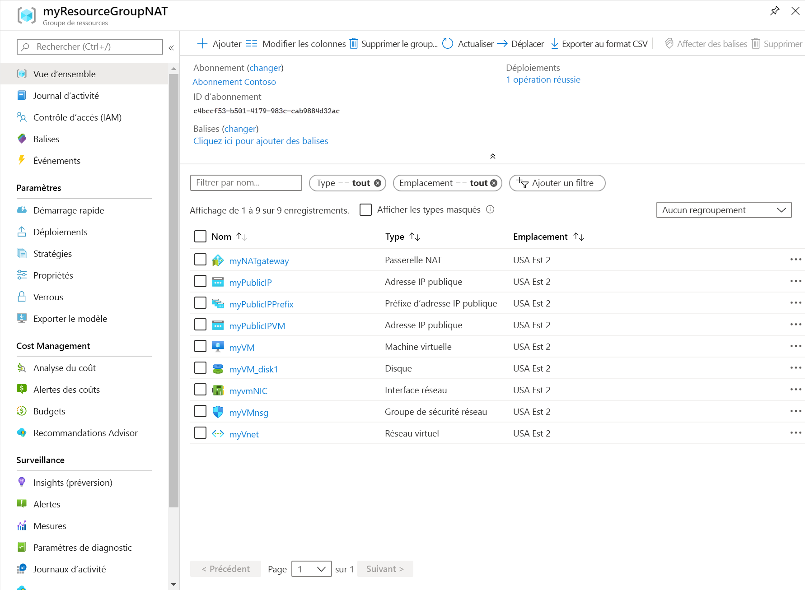

# <a name="create-a-nat-gateway---resource-manager-template"></a>Créer une passerelle NAT - Modèle Resource Manager

Commencez à utiliser un service NAT de réseau virtuel à l’aide d’un modèle Azure Resource Manager.  Ce modèle déploie un réseau virtuel, une ressource de passerelle NAT et une machine virtuelle Ubuntu. La machine virtuelle Ubuntu est déployée sur un sous-réseau associé à la ressource de passerelle NAT.

[!INCLUDE [About Azure Resource Manager](../../includes/resource-manager-quickstart-introduction.md)]

Si vous n’avez pas d’abonnement Azure, créez un [compte gratuit](https://azure.microsoft.com/free/?WT.mc_id=A261C142F) avant de commencer.

## <a name="create-a-nat-gateway-and-supporting-resources"></a>Créer une passerelle NAT et les ressources de support

Ce modèle est configuré pour créer les éléments suivants : 

* Réseau virtuel 
* Ressource de passerelle NAT
* Machine virtuelle Ubuntu

La machine virtuelle Ubuntu est déployée sur un sous-réseau associé à la ressource de passerelle NAT.

### <a name="review-the-template"></a>Vérifier le modèle

Le modèle utilisé dans ce guide de démarrage rapide est tiré des [modèles de démarrage rapide Azure](https://raw.githubusercontent.com/Azure/azure-quickstart-templates/master/101-nat-gateway-1-vm/azuredeploy.json).

:::code language="json" source="~/quickstart-templates/101-nat-gateway-1-vm/azuredeploy.json" range="1-335" highlight="256-282":::

Neuf ressources Azure sont définies dans le modèle :

**Microsoft.Network**

* **[Microsoft.Network/natGateways](https://docs.microsoft.com/azure/templates/microsoft.network/natgateways)**  : crée une ressource de passerelle NAT.

* **[Microsoft.Network/networkSecurityGroups](https://docs.microsoft.com/azure/templates/microsoft.network/networksecuritygroups)**  : Crée un groupe de sécurité réseau.

    * **[Microsoft.Network/networkSecurityGroups/securityRules](https://docs.microsoft.com/azure/templates/microsoft.network/networksecuritygroups/securityrules)**  : crée une règle de sécurité.

* **[Microsoft.Network/publicIPAddresses](https://docs.microsoft.com/azure/templates/microsoft.network/publicipaddresses)**  : Crée une adresse IP publique.

* **[Microsoft.Network/publicIPPrefixes](https://docs.microsoft.com/azure/templates/microsoft.network/publicipprefixes)**  : crée un préfixe d’adresse IP publique.

* **[Microsoft.Network/virtualNetworks](https://docs.microsoft.com/azure/templates/microsoft.network/virtualnetworks)**  : Créer un réseau virtuel.

    * **[Microsoft.Network/virtualNetworks/subnets](https://docs.microsoft.com/azure/templates/microsoft.network/virtualnetworks/subnets)**  : crée un sous-réseau de réseau virtuel.

* **[Microsoft.Network/networkinterfaces](https://docs.microsoft.com/azure/templates/microsoft.network/networkinterfaces)**  : Crée une interface réseau.

**Microsoft.Compute**

* **[Microsoft.Compute/virtualMachines](https://docs.microsoft.com/azure/templates/Microsoft.Compute/virtualMachines)**  : Crée une machine virtuelle.

### <a name="deploy-the-template"></a>Déployer le modèle

**Azure CLI**

```azurecli-interactive
read -p "Enter the location (i.e. westcentralus): " location
resourceGroupName="myResourceGroupNAT"
templateUri="https://raw.githubusercontent.com/Azure/azure-quickstart-templates/master/101-nat-gateway-1-vm/azuredeploy.json" 

az group create \
--name $resourceGroupName \
--location $location

az group deployment create \
--resource-group $resourceGroupName \
--template-uri  $templateUri
```

**Azure PowerShell**

```azurepowershell-interactive
$location = Read-Host -Prompt "Enter the location (i.e. westcentralus)"
$templateUri = "https://raw.githubusercontent.com/Azure/azure-quickstart-templates/master/101-nat-gateway-1-vm/azuredeploy.json"

$resourceGroupName = "myResourceGroupNAT"

New-AzResourceGroup -Name $resourceGroupName -Location $location
New-AzResourceGroupDeployment -ResourceGroupName $resourceGroupName -TemplateUri $templateUri
```

**Azure portal**

[](https://portal.azure.com/#create/Microsoft.Template/uri/https%3A%2F%2Fraw.githubusercontent.com%2FAzure%2Fazure-quickstart-templates%2Fmaster%2F101-nat-gateway-1-vm%2Fazuredeploy.json)

## <a name="review-deployed-resources"></a>Vérifier les ressources déployées

1. Connectez-vous au [portail Azure](https://portal.azure.com).

2. Sélectionnez **Groupes de ressources** dans le volet gauche.

3. Sélectionnez le groupe de ressources que vous avez créé dans la section précédente. Le nom du groupe de ressources par défaut est **myResourceGroupNAT**.

4. Vérifiez que les ressources suivantes ont été créées dans le groupe de ressources :

    

## <a name="clean-up-resources"></a>Nettoyer les ressources

**Azure CLI**

Quand vous n’en avez plus besoin, utilisez la commande [az group delete](/cli/azure/group#az-group-delete) pour supprimer le groupe de ressources et toutes les ressources qu’il contient.

```azurecli-interactive 
  az group delete \
    --name myResourceGroupNAT
```

**Azure PowerShell**

Quand vous n’en avez plus besoin, vous pouvez utiliser la commande [Remove-AzResourceGroup](https://docs.microsoft.com/powershell/module/az.resources/remove-azresourcegroup?view=latest) pour supprimer le groupe de ressources et toutes les ressources qu’il contient.

```azurepowershell-interactive 
Remove-AzResourceGroup -Name myResourceGroupNAT
```

**Azure portal**

Lorsque vous n’en avez plus besoin, supprimez le groupe de ressources, la passerelle NAT et toutes les ressources associées. Sélectionnez le groupe de ressources **myResourceGroupNAT** qui contient la passerelle NAT, puis sélectionnez **Supprimer**.

## <a name="next-steps"></a>Étapes suivantes

Dans le cadre de ce guide de démarrage rapide, vous avez créé les éléments suivants :

* Ressource de passerelle NAT
* Réseau virtuel
* Machine virtuelle Ubuntu

La machine virtuelle est déployée sur un sous-réseau de réseau virtuel associé à la passerelle NAT. 

Pour en savoir plus sur le service NAT de réseau virtuel et Azure Resource Manager, consultez les articles ci-dessous.

* Lisez la [vue d’ensemble du service NAT de réseau virtuel](nat-overview.md).
* Découvrez la [ressource de passerelle NAT](nat-gateway-resource.md).
* En savoir plus sur [Azure Resource Manager](../azure-resource-manager/management/overview.md)
