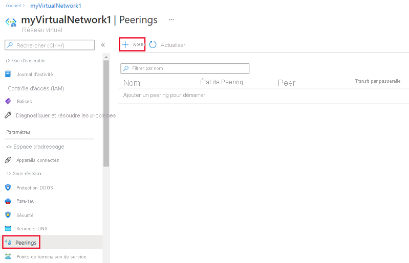
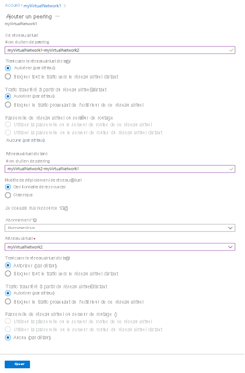

# <a name="tutorial-connect-virtual-networks-with-virtual-network-peering-using-the-azure-portal"></a>Tutoriel : Connecter des réseaux virtuels à l’aide du peering de réseaux virtuels en utilisant le portail Azure

Vous pouvez connecter des réseaux virtuels entre eux à l’aide du peering de réseaux virtuels. Ces réseaux virtuels peuvent appartenir à la même région ou à des régions différentes (connexion également appelée Global VNet Peering). Une fois que les deux réseaux virtuels sont appairés, leurs ressources peuvent communiquer entre elles avec les mêmes bande passante et latence, comme si elles se trouvaient sur le même réseau virtuel. Dans ce tutoriel, vous allez apprendre à :

> [!div class="checklist"]
> * Créer deux réseaux virtuels
> * Connecter deux réseaux virtuels à l’aide du peering de réseaux virtuels
> * Déployer une machine virtuelle sur chaque réseau virtuel
> * Établir une communication entre les machines virtuelles

Si vous préférez, vous pouvez suivre ce tutoriel en utilisant [Azure CLI](tutorial-connect-virtual-networks-cli.md) ou [Azure PowerShell](tutorial-connect-virtual-networks-powershell.md).

Si vous n’avez pas d’abonnement Azure, créez un [compte gratuit](https://azure.microsoft.com/free/?WT.mc_id=A261C142F) avant de commencer.

## <a name="log-in-to-azure"></a>Connexion à Azure 

Connectez-vous au portail Azure sur https://portal.azure.com.

## <a name="create-virtual-networks"></a>Créer des réseaux virtuels

1. Dans le portail Azure, sélectionnez **Créer une ressource**.
2. Sélectionnez **Mise en réseau**, puis **Réseau virtuel**.
3. Sous l’onglet **Bases**, entrez ou sélectionnez les informations suivantes, puis acceptez les valeurs par défaut pour les autres paramètres :

    |Paramètre|Valeur|
    |---|---|
    |Subscription| Sélectionnez votre abonnement.|
    |Resource group| Sélectionnez **Créer** et entrez *myResourceGroup*.|
    |Région| Sélectionnez **USA Est**.|
    |Name|myVirtualNetwork1|

4. Sous l’onglet **Adresses IP**, entrez 10.0.0.0/16 dans le champ **Espace d’adressage**. Cliquez sur le bouton **Ajouter un sous-réseau** situé dessous, puis entrez *Subnet1* sous **Nom du sous-réseau** et 10.0.0.0/24 sous **Plage d’adresses de sous-réseau**.
5. Sélectionnez **Vérifier + créer**, puis sélectionnez **Créer**.
   
5. Effectuez à nouveau les étapes 1 à 5, avec les modifications suivantes :

    |Paramètre|Valeur|
    |---|---|
    |Name|myVirtualNetwork2|
    |Espace d’adressage|10.1.0.0/16|
    |Resource group| Sélectionnez **Utiliser l’existant**, puis **myResourceGroup**.|
    |Nom du sous-réseau | Sous-réseau2|
    |Plage d’adresses de sous-réseau|10.1.0.0/24|

## <a name="peer-virtual-networks"></a>Appairer des réseaux virtuels

1. Dans la zone de recherche en haut du portail Azure, commencez à taper *MyVirtualNetwork1*. Quand la mention **myVirtualNetwork1** apparaît dans les résultats de recherche, sélectionnez-la.
2. Sélectionnez **Peerings** sous **Paramètres**, puis sélectionnez **Ajouter**, comme indiqué dans l’image suivante :

    

3. Entrez ou sélectionnez les informations suivantes, acceptez les valeurs par défaut pour les autres paramètres, puis cliquez sur **OK**.

    |Paramètre|Valeur|
    |---|---|
    |Nom du peering de myVirtualNetwork1 avec un réseau virtuel distant|myVirtualNetwork1-myVirtualNetwork2 : Quand la page se charge pour la première fois, l’expression « réseau virtuel distant » s’affiche ici. Une fois que vous avez choisi le réseau virtuel distant, l’expression « réseau virtuel distant » est remplacée par le nom du réseau virtuel distant.|
    |Subscription| Sélectionnez votre abonnement.|
    |Réseau virtuel|myVirtualNetwork2 : Pour sélectionner le réseau virtuel *myVirtualNetwork2*, sélectionnez **Réseau virtuel**, puis **myVirtualNetwork2 (myResourceGroup)** . Vous pouvez sélectionner un réseau virtuel figurant dans la même région ou dans une région différente.|
    |Nom du peering entre myVirtualNetwork2 et myVirtualNetwork1|myVirtualNetwork2-myVirtualNetwork1|

    

    L’**ÉTAT DE PEERING** est *Connecté*, comme indiqué dans l’image suivante :

    

    Si vous ne voyez pas l’état, actualisez votre navigateur.

## <a name="create-virtual-machines"></a>Créer des machines virtuelles

Créez une machine virtuelle sur chaque réseau virtuel afin de pouvoir établir une communication entre elles dans une étape ultérieure.

### <a name="create-the-first-vm"></a>Créer la première machine virtuelle

1. Dans le portail Azure, sélectionnez **Créer une ressource**.
2. Sélectionnez **Compute**, puis **Windows Server 2016 Datacenter**. Vous pouvez sélectionner différents systèmes d’exploitation, mais les étapes restantes partent du principe que vous avez sélectionné **Windows Server 2016 Datacenter**. 
3. Entrez ou sélectionnez les informations suivantes pour **De base**, acceptez les valeurs par défaut pour les autres paramètres, puis choisissez **Créer** :

    |Paramètre|Valeur|
    |---|---|
    |Resource group| Sélectionnez **Utiliser l’existant**, puis **myResourceGroup**.|
    |Name|myVm1|
    |Location| Sélectionnez **USA Est**.|
    |Nom d'utilisateur| Entrez un nom d’utilisateur de votre choix.|
    |Mot de passe| Entrez un mot de passe de votre choix. Le mot de passe doit contenir au moins 12 caractères et satisfaire aux [exigences de complexité définies](../virtual-machines/windows/faq.md?toc=%2fazure%2fvirtual-network%2ftoc.json#what-are-the-password-requirements-when-creating-a-vm).|
   
4. Sélectionnez une taille de machine virtuelle sous l’option **Taille**.
5. Sélectionnez les valeurs suivantes sous **Réseaux** :

    |Paramètre|Valeur|
    |---|---|
    |Réseau virtuel| myVirtualNetwork1 : S’il n’est pas déjà sélectionné, sélectionnez **Réseau virtuel**, puis **myVirtualNetwork1**.|
    |Subnet| Subnet1 : S’il n’est pas déjà sélectionné, sélectionnez **Sous-réseau**, puis sélectionnez **Subnet1**.|
   
6. Sélectionnez **Mise en réseau**. Choisissez **Autoriser les ports sélectionnés** sous l’option **Ports d’entrée publics**. Choisissez **RDP** sous l’option **Sélectionner des ports d’entrée** située dessous. 

7. Sélectionnez le bouton **Vérifier + créer**  dans l’angle inférieur gauche pour démarrer le déploiement de la machine virtuelle.

### <a name="create-the-second-vm"></a>Créer la seconde machine virtuelle

Effectuez à nouveau les étapes 1 à 6, avec les modifications suivantes :

|Paramètre|Valeur|
|---|---|
|Name | myVm2|
|Réseau virtuel | myVirtualNetwork2|

La création des machines virtuelles peut prendre plusieurs minutes. Attendez que les deux machines virtuelles aient été créées avant de passer aux étapes restantes.

## <a name="communicate-between-vms"></a>Établir une communication entre les machines virtuelles

1. Dans la zone de *recherche* en haut du portail, commencez à taper *myVm1*. Quand **myVm1** apparaît dans les résultats de la recherche, sélectionnez-la.
2. Créez une connexion Bureau à distance avec la machine virtuelle *myVm1* en sélectionnant **Connecter**, comme indiqué dans l’image suivante :

      

3. Pour vous connecter à la machine virtuelle, ouvrez le fichier RDP téléchargé. Si vous y êtes invité, sélectionnez **Connexion**.
4. Entrez le nom d’utilisateur et le mot de passe spécifiés lors de la création de la machine virtuelle (il se peut que vous deviez choisir **Plus de choix**, puis **Utiliser un compte différent** pour spécifier les informations d’identification que vous avez entrées lors de la création de la machine virtuelle), puis sélectionnez **OK**.
5. Un avertissement de certificat peut s’afficher pendant le processus de connexion. Sélectionnez**Oui** pour poursuivre le processus de connexion.
6. Dans une étape ultérieure, un test ping sera utilisé pour communiquer avec la machine virtuelle *myVm2* depuis la machine virtuelle *myVm1*. Le test ping utilise le protocole ICMP, qui est interdit par le Pare-feu Windows par défaut. Sur la machine virtuelle *myVm1*, autorisez ICMP à travers le pare-feu Windows afin de pouvoir effectuer un test ping pour cette machine virtuelle à partir de *myVm2* lors d’une étape ultérieure, en utilisant PowerShell :

    ```powershell
    New-NetFirewallRule –DisplayName "Allow ICMPv4-In" –Protocol ICMPv4
    ```
    
    Bien que ce test ping soit utilisé pour établir une communication entre les machines virtuelles, il n’est pas recommandé d’autoriser le protocole IMCP via le pare-feu Windows lors de déploiements de production.

7. Pour établir une connexion avec la machine virtuelle *myVm2*, entrez la commande suivante à partir d’une invite de commandes sur la machine virtuelle *myVm1* :

    ```
    mstsc /v:10.1.0.4
    ```
    
8. Étant donné que vous avez activé la commande ping sur *myVm1*, vous pouvez désormais y effectuer un test ping par adresse IP :

    ```
    ping 10.0.0.4
    ```
    
9. Déconnectez vos sessions RDP sur *myVm1* et *myVm2*.

## <a name="clean-up-resources"></a>Nettoyer les ressources

Quand vous n’avez plus besoin du groupe de ressources, supprimez-le ainsi que toutes les ressources qu’il contient : 

1. Entrez *myResourceGroup* dans le champ **Recherche** en haut du portail. Quand **myResourceGroup** apparaît dans les résultats de la recherche, sélectionnez-le.
2. Sélectionnez **Supprimer le groupe de ressources**.
3. Entrez *myResourceGroup* dans **TAPER NOM DU GROUPE DE RESSOURCES :** puis sélectionnez **Supprimer**.

## <a name="next-steps"></a>Étapes suivantes

Dans ce tutoriel, vous avez appris à connecter deux réseaux situés dans la même région Azure à l’aide du peering de réseaux virtuels. Vous pouvez également appairer des réseaux virtuels situés dans des [régions différentes](virtual-network-manage-peering.md#cross-region) et dans des [abonnements Azure différents](create-peering-different-subscriptions.md#portal). Vous pouvez aussi créer des [conceptions réseau hub-and-spoke](/azure/architecture/reference-architectures/hybrid-networking/hub-spoke?toc=%2fazure%2fvirtual-network%2ftoc.json#vnet-peering) avec le peering. Pour en savoir plus sur le peering de réseaux virtuels, consultez [Aperçu de présentation du peering de réseaux virtuels](virtual-network-peering-overview.md) et [Gérer les peerings de réseau virtuels](virtual-network-manage-peering.md).

Pour connecter votre propre ordinateur à un réseau virtuel via un VPN et interagir avec des ressources d’un réseau virtuel ou de réseaux virtuels appairés, consultez [Connecter votre ordinateur à un réseau virtuel](../vpn-gateway/vpn-gateway-howto-point-to-site-resource-manager-portal.md?toc=%2fazure%2fvirtual-network%2ftoc.json).
