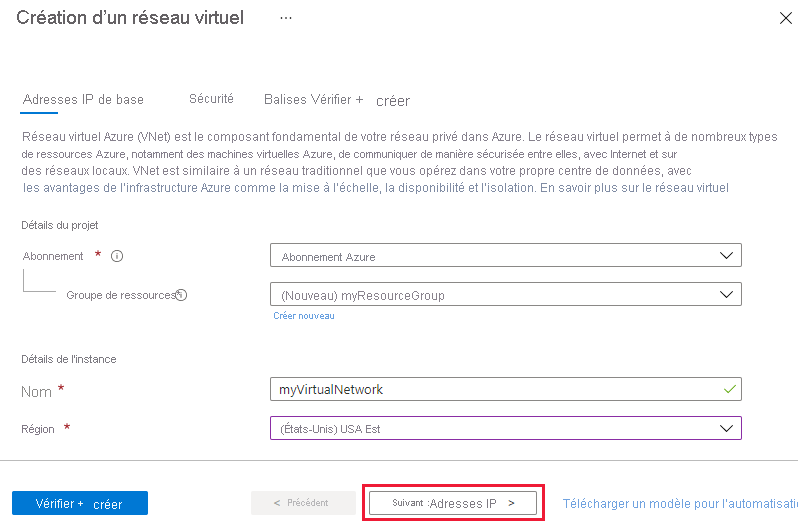

# <a name="tutorial-restrict-network-access-to-paas-resources-with-virtual-network-service-endpoints-using-the-azure-portal"></a>Tutoriel : Restreindre l’accès réseau aux ressources PaaS avec des points de terminaison de service de réseau virtuel en utilisant le portail Azure

Les points de terminaison de service de réseau virtuel permettent de restreindre l’accès réseau à certaines ressources du service Azure en n’autorisant leur accès qu’à partir d’un sous-réseau du réseau virtuel. Vous pouvez également supprimer l’accès Internet aux ressources. Les points de terminaison de service fournissent une connexion directe entre votre réseau virtuel et les services Azure pris en charge, ce qui vous permet d’utiliser l’espace d’adressage privé de votre réseau virtuel pour accéder aux services Azure. Le trafic destiné aux ressources Azure via les points de terminaison de service reste toujours sur le serveur principal de Microsoft Azure. Dans ce tutoriel, vous allez apprendre à :

> [!div class="checklist"]
> * Créer un réseau virtuel avec un sous-réseau
> * Ajouter un sous-réseau et activer un point de terminaison de service
> * Créer une ressource Azure et autoriser l’accès réseau à cette ressource uniquement à partir d’un sous-réseau
> * Déployer une machine virtuelle sur chaque sous-réseau
> * Vérifier l’accès à une ressource à partir d’un sous-réseau
> * Vérifier que l’accès à une ressource est refusé à partir d’un sous-réseau et d’Internet

Si vous préférez, vous pouvez suivre ce tutoriel en utilisant [Azure CLI](tutorial-restrict-network-access-to-resources-cli.md) ou [Azure PowerShell](tutorial-restrict-network-access-to-resources-powershell.md).

Si vous n’avez pas d’abonnement Azure, créez un [compte gratuit](https://azure.microsoft.com/free/?WT.mc_id=A261C142F) avant de commencer.

## <a name="log-in-to-azure"></a>Connexion à Azure

Connectez-vous au portail Azure sur https://portal.azure.com.

## <a name="create-a-virtual-network"></a>Créez un réseau virtuel

1. Sélectionnez **+ Créer une ressource** en haut à gauche du portail Azure.
2. Sélectionnez **Mise en réseau**, puis **Réseaux virtuels**.
3. Cliquez sur **+ Ajouter** et entrez les informations suivantes : 

   |Paramètre|Valeur|
   |----|----|
   |Abonnement| Sélectionnez votre abonnement|
   |Resource group | Sélectionnez **Créer** et entrez *myResourceGroup*.|
   |Nom| Entrez *myVirtualNetwork* |
   |Région| Sélectionnez **(États-Unis) USA Est** |

   

4. Cliquez sur **Suivant : Adresses IP >**
   
   |Paramètre|Valeur|
   |----|----|
   |Espace IPv4Address| Laissez la valeur par défaut |
   |Nom du sous-réseau| Cliquez sur **default** et remplacez le nom « default » par « Public »|
   |Plage d’adresses de sous-réseau| Laissez la valeur par défaut|

5. Cliquez sur **Suivant : Sécurité >** 
   
   |Paramètre|Valeur|
   |----|----|   
   |BastionHost| Désactiver|
   |Protection DDoS| Désactiver|
   |Pare-feu| Désactiver|

6. Lorsque vous avez terminé, cliquez sur **Examiner et créer**.
7. Si les contrôles de validation réussissent, cliquez sur **Créer**.
8. Attendez que le déploiement se termine, puis cliquez sur **Accéder à la ressource** ou passez à la section suivante. 

## <a name="enable-a-service-endpoint"></a>Activer un point de terminaison de service

Les points de terminaison de service sont activés par service, par sous-réseau. Pour créer un sous-réseau et activer un point de terminaison de service pour le sous-réseau :

1. Si vous n’êtes pas encore dans la page des ressources du réseau virtuel, vous pouvez rechercher le réseau nouvellement créé dans la zone **Rechercher dans les ressources, services et documents** en haut du portail, entrer *myVirtualNetwork* et le sélectionner dans la liste.
2. Dans le menu **Paramètres** (gauche), sélectionnez **Sous-réseaux** puis **+ Sous-réseau**, comme illustré ci-dessous :

     

3. Sous **Ajouter un sous-réseau**, sélectionnez ou saisissez les informations suivantes, puis sélectionnez **OK** :

    |Paramètre|Valeur|
    |----|----|
    |Name| Privé |
    |Plage d’adresses| Laissez la valeur par défaut|
    |Points de terminaison de service| Sélectionnez **Microsoft.Storage**|
    |Stratégies de points de terminaison de service | Laissez la valeur 0 par défaut |

> [!CAUTION]
> Avant d’activer un point de terminaison de service pour un sous-réseau existant qui contient des ressources, consultez [Modifier les paramètres de sous-réseau](virtual-network-manage-subnet.md#change-subnet-settings).

4. Cliquez sur **Enregistrer**, puis fermez la fenêtre Sous-réseau à droite. Le sous-réseau nouvellement créé doit apparaître dans la liste.

## <a name="restrict-network-access-for-a-subnet"></a>Restreindre l’accès réseau d’un sous-réseau

Par défaut, toutes les instances de machines virtuelles d’un sous-réseau peuvent communiquer avec l’ensemble des ressources. Vous pouvez limiter les communications vers et à partir de toutes les ressources d’un sous-réseau par la création d’un groupe de sécurité réseau et son association au sous-réseau :

1. En haut à gauche du portail Azure, sélectionnez **Tous les services**.
2. Sélectionnez **Mise en réseau**, puis sélectionnez (ou recherchez) **Groupes de sécurité réseau**.
3. Dans la page **Groupes de sécurité réseau**, cliquez sur **+ Ajouter**.
4. Entrez les informations ci-après 

    |Paramètre|Valeur|
    |----|----|
    |Abonnement| Sélectionnez votre abonnement|
    |Resource group | Sélectionnez *myResourceGroup* dans la liste|
    |Nom| Entrez **myNsgPrivate** |
    |Emplacement| Sélectionnez **USA Est**. |

5. Cliquez sur **Vérifier + créer** et, lorsque le contrôle de validation est réussi, cliquez sur **Créer**.
6. Une fois le groupe de sécurité réseau créé, cliquez sur **Accéder à la ressource** ou recherchez *myNsgPrivate*.
7. Sous **Paramètres** à gauche, sélectionnez **Règles de sécurité de trafic sortant**.
8. Sélectionnez **Ajouter**.
9. Créer une règle qui autorise les communications sortantes vers le service Stockage Azure. Saisissez ou sélectionnez les informations suivantes, puis sélectionnez **Ajouter** :

    |Paramètre|Valeur|
    |----|----|
    |Source| Sélectionnez **VirtualNetwork** |
    |Source port ranges| * |
    |Destination | Sélectionnez **Service Tag** (Identification)|
    |Identification de destination | Sélectionnez **Stockage**|
    |Plages de ports de destination| Laissez la valeur *8080* par défaut |
    |Protocol|Quelconque|
    |Action|Allow|
    |Priorité|100|
    |Nom|Renommez avec **Allow-Storage-All**|

10. Créer une règle de sécurité de trafic sortant qui refuse les communications vers Internet. Cette règle qui permet la communication Internet sortante se substitue à une règle par défaut dans tous les groupes de sécurité réseau. Répétez les étapes 6 à 9 ci-dessus en utilisant les valeurs suivantes :

    |Paramètre|Valeur|
    |----|----|
    |Source| Sélectionnez **VirtualNetwork** |
    |Source port ranges| * |
    |Destination | Sélectionnez **Service Tag** (Identification)|
    |Identification de destination| Sélectionnez **Internet**|
    |Plages de ports de destination| * |
    |Protocol|Quelconque|
    |Action|**Modifiez la valeur par défaut en spécifiant *Refuser*** |
    |Priority|110|
    |Name|Remplacez par *Deny-Internet-All*|

11. Créez une *règle de sécurité de trafic entrant* qui autorise le trafic du protocole RDP (Remote Desktop Protocol) vers le sous-réseau en provenance de n’importe quel endroit. La règle remplace une règle de sécurité par défaut qui refuse tout le trafic entrant provenant d’Internet. Les connexions Bureau à distance sont autorisées sur le sous-réseau afin que la connectivité puisse être testée dans une étape ultérieure. 
12. Sous **Paramètres**, sélectionnez **Règles de sécurité de trafic entrant**.
13. Sélectionnez **+ Ajouter** et utilisez les valeurs suivantes :

    |Paramètre|Valeur|
    |----|----|
    |Source| Quelconque |
    |Source port ranges| * |
    |Destination | Sélectionnez **VirtualNetwork**|
    |Plages de ports de destination| Remplacez par *3389* |
    |Protocol|Quelconque|
    |Action|Allow|
    |Priority|120|
    |Name|Remplacez par *Allow-RDP-All*|

   >[!WARNING] 
   > Le port RDP 3389 est exposé à Internet. Ceci est recommandé uniquement pour les tests. Pour *Environnements de production*, nous vous recommandons d’utiliser une connexion VPN ou privée.

1.  Sous **Paramètres**, sélectionnez **Sous-réseaux**.
2.  Cliquez sur **+ Associer**.
3.  Sous **Réseau virtuel**, sélectionnez **myVirtualNetwork**.
4.  Sous **Sous-réseau**, sélectionnez **Privé** puis **Ok**.

## <a name="restrict-network-access-to-a-resource"></a>Restreindre l’accès réseau à une ressource

Les étapes nécessaires pour restreindre l’accès réseau aux ressources créées par le biais des services Azure, qui sont activées pour les points de terminaison varient d’un service à l’autre. Pour connaître les étapes à suivre, consultez la documentation relative à chacun des services. La suite de ce didacticiel comprend des étapes permettant de restreindre, par exemple, l’accès réseau pour un compte Stockage Azure.

### <a name="create-a-storage-account"></a>Créez un compte de stockage.

1. Sélectionnez **+ Créer une ressource** en haut à gauche du portail Azure.
2. Entrez « Compte de stockage » dans la barre de recherche, puis sélectionnez-le dans le menu déroulant.
3. Cliquez sur **+ Ajouter**.
4. Entrez les informations suivantes :

    |Paramètre|Valeur|
    |----|----|
    |Abonnement| Sélectionnez votre abonnement|
    |Resource group| Sélectionner *myResourceGroup*|
    |Nom du compte de stockage| Entrez un nom qui n’existe dans aucun autre emplacement Azure. Le nom doit comprendre entre 3 et 24 caractères, correspondant à des chiffres et à des lettres en minuscules.|
    |Emplacement| Sélectionnez **(États-Unis) USA Est** |
    |Performances|Standard|
    |Type de compte| StorageV2 (v2 universel)|
    |Réplication| Stockage localement redondant (LRS)|

5. Sélectionnez **Créer + vérifier** et, lorsque les contrôles de validation ont réussi, cliquez sur **Créer**. 

>[!NOTE] 
> Le déploiement peut prendre quelques minutes.

6. Une fois le compte de stockage créé, cliquez sur **Accéder à la ressource**.

### <a name="create-a-file-share-in-the-storage-account"></a>Créer un partage de fichiers dans le compte de stockage

1. Accédez à la page Vue d’ensemble de votre compte de stockage.
2. Sélectionnez l’icône d’application **Partages de fichiers**, puis cliquez sur **+ Partage de fichiers**.

    |Paramètre|Valeur|
    |----|----|
    |Nom| my-file-share|
    |Quota| « Définir sur la valeur maximale » |

    

3. Cliquez sur **Créer**.
4. Le partage de fichiers doit s’afficher dans la fenêtre Azure ; sinon, cliquez sur **Actualiser**.

### <a name="restrict-network-access-to-a-subnet"></a>Restreindre l’accès réseau à un sous-réseau

Par défaut, les comptes de stockage acceptent les connexions réseau provenant des clients de n’importe quel réseau, y compris Internet. Vous pouvez limiter l’accès réseau à partir d’Internet et de tous les autres sous-réseaux de tous les réseaux virtuels (à l’exception du sous-réseau *Privé* du réseau virtuel *myVirtualNetwork*). Pour limiter l’accès réseau à un sous-réseau :

1. Sous **Paramètres** pour votre compte de stockage (nom unique), sélectionnez **Mise en réseau**.
2. Sélectionnez **Réseaux sélectionnés**.
3. Sélectionnez **+ Ajouter un réseau virtuel existant**.
4. Sous **Ajouter des réseaux**, sélectionnez les valeurs suivantes puis **Ajouter** :

    |Paramètre|Valeur|
    |----|----|
    |Abonnement| Sélectionnez votre abonnement|
    |Réseaux virtuels| **myVirtualNetwork**|
    |Sous-réseaux| **Privé**|

    

5. Cliquez sur **Ajouter**, puis cliquez immédiatement sur l’icône **Enregistrer** pour enregistrer les modifications.
6. Sous **Paramètres** pour le compte de stockage, sélectionnez **Clés d’accès**, comme illustré dans l’image suivante :

      

7. Cliquez sur **Afficher les clés** et notez les valeurs **Clé**, car vous devrez entrer manuellement key1 dans une étape ultérieure lors du mappage du partage de fichiers à une lettre de lecteur dans une machine virtuelle.

## <a name="create-virtual-machines"></a>Créer des machines virtuelles

Pour tester l’accès réseau à un compte de stockage, déployez une machine virtuelle sur chaque sous-réseau.

### <a name="create-the-first-virtual-machine"></a>Créer la première machine virtuelle

1. Dans la barre « Rechercher des ressources . . ." , recherchez **Machines virtuelles**.
2. Sélectionnez **+ Ajouter > Machine virtuelle**. 
3. Entrez les informations suivantes :

   |Paramètre|Valeur|
   |----|----|
   |Abonnement| Sélectionnez votre abonnement|
   |Resource group| Sélectionnez **myResourceGroup, qui a été créé précédemment|
   |Nom de la machine virtuelle| Entrez *myVmPublic*|
   |Région | (États-Unis) USA Est
   |Options de disponibilité| Zone de disponibilité|
   |Zone de disponibilité | 1 |
   |Image | Windows Server 2019 Datacenter – Gen 1 |
   |Taille | Sélectionnez la taille d’instance de machine virtuelle que vous souhaitez utiliser |
   |Nom d’utilisateur|Entrez un nom d’utilisateur de votre choix.|
   |Mot de passe| Entrez un mot de passe de votre choix. Le mot de passe doit contenir au moins 12 caractères et satisfaire aux [exigences de complexité définies](../virtual-machines/windows/faq.md?toc=%2fazure%2fvirtual-network%2ftoc.json#what-are-the-password-requirements-when-creating-a-vm).|
   |Aucun port d’entrée public | Autoriser les ports sélectionnés |
   |Sélectionner des ports d’entrée | Conservez le paramètre par défaut *RDP (3389)* |

   
  
4. Sélectionnez l’onglet **Mise en réseau**, puis sélectionnez **myVirtualNetwork**. 
5. Sélectionnez le sous-réseau *Public*.
6. Sous **Groupe de sécurité réseau de la carte réseau**, sélectionnez **Avancé**. Le portail crée automatiquement pour vous un groupe de sécurité réseau qui autorise le port 3389, qui devra être ouvert pour vous connecter à la machine virtuelle dans une étape ultérieure. 

   

7. Sélectionnez **Examiner et créer**, puis **Créer** et attendez la fin du déploiement.
8. Cliquez sur **Accéder à la ressource** ou ouvrez la page **Accueil > Machines virtuelles**, puis sélectionnez la machine virtuelle que vous venez de créer, *myVmPublic*, qui doit être démarrée.

### <a name="create-the-second-virtual-machine"></a>Créer la deuxième machine virtuelle

1. Répétez les étapes 1 à 8, mais à l’étape 3, nommez la machine virtuelle *myVmPrivate* et définissez **Port entrant public** sur « Aucun ». 
2. À l’étape 4-5, sélectionnez le sous-réseau **Privé**.

>[!NOTE]
> Les paramètres **Groupe de sécurité réseau de la carte réseau** et **Ports entrants publics** doivent refléter l’image indiquée ci-dessous, y compris la fenêtre de confirmation bleue indiquant : « tout le trafic Internet public sera bloqué par défaut ».

   

3. Sélectionnez **Examiner et créer**, puis **Créer** et attendez la fin du déploiement. 

>[!WARNING]
> Ne passez à l’étape suivante que lorsque le déploiement sera terminé.

4. Attendez la fenêtre de confirmation affichée ci-dessous et cliquez sur **Accéder à la ressource**.

   

## <a name="confirm-access-to-storage-account"></a>Vérifier l’accès au compte de stockage

1. Une fois la machine virtuelle *myVmPrivate* créée, cliquez sur **Accéder à la ressource**. 
2. Connectez-vous à la machine virtuelle en sélectionnant **Connexion > RDP**.
3. Une fois que vous avez sélectionné le bouton **Connexion**, un fichier .rdp (Remote Desktop Protocol) est créé. Cliquez sur **Télécharger le fichier RDP** pour télécharger le fichier sur votre ordinateur.  
4. Ouvrez le fichier .rdp téléchargé. Si vous y êtes invité, sélectionnez **Connexion**. Entrez le nom d’utilisateur et le mot de passe spécifiés lors de la création de la machine virtuelle. Vous devrez peut-être sélectionner **Plus de choix** puis **Utiliser un autre compte** pour spécifier les informations d’identification que vous avez entrées lorsque vous avez créé la machine virtuelle. Pour le champ d’adresse e-mail, entrez les informations d’identification « Compte d’administrateur : nom d’utilisateur » que vous avez spécifiées précédemment. 
5. Sélectionnez **OK**.
6. Un avertissement de certificat peut s’afficher pendant le processus de connexion. Si vous recevez l’avertissement, sélectionnez **Oui** ou **Continuer** pour poursuivre le processus de connexion. Vous devez voir la machine virtuelle démarrer comme ci-dessous :

   

7. Dans la fenêtre de la machine virtuelle, ouvrez une instance de l’interface CLI PowerShell.
8. Utilisez le script ci-dessous pour mapper le partage de fichiers Azure au lecteur Z à l’aide de PowerShell. Avant d’exécuter les commandes qui suivent, remplacez `<storage-account-key>` et les deux champs `<storage-account-name>` par les valeurs que vous avez fournies précédemment dans [Créer un compte de stockage](#create-a-storage-account).

   ```powershell
   $acctKey = ConvertTo-SecureString -String "<storage-account-key>" -AsPlainText -Force
   $credential = New-Object System.Management.Automation.PSCredential -ArgumentList "Azure\<storage-account-name>", $acctKey
   New-PSDrive -Name Z -PSProvider FileSystem -Root "\\<storage-account-name>.file.core.windows.net\my-file-share" -Credential $credential
   ```

   PowerShell retourne un résultat semblable à l’exemple suivant :

   ```powershell
   Name           Used (GB)     Free (GB) Provider      Root
   ----           ---------     --------- --------      ----
   Z                                      FileSystem    \\vnt.file.core.windows.net\my-f...
   ```

   Le partage de fichiers Azure est correctement mappé au lecteur Z.

9.   Fermez les sessions Bureau à distance sur la machine virtuelle *myVmPrivate*.

## <a name="confirm-access-is-denied-to-storage-account"></a>Vérifier que l’accès au compte de stockage est refusé

1. Entrez *myVmPublic* dans le champ **Rechercher des ressources, services et documents** en haut du portail.
2. Quand **myVmPublic** apparaît dans les résultats de la recherche, sélectionnez cette entrée.
3. Répétez les étapes 1 à 8 ci-dessus dans [Vérifier l’accès au compte de stockage](#confirm-access-to-storage-account) pour la machine virtuelle *myVmPublic*.

   Après un court délai d’attente, vous recevez une erreur `New-PSDrive : Access is denied`. L’accès est refusé car la machine virtuelle *myVmPublic* est déployée sur le sous-réseau *Public*. Le sous-réseau *Public* ne dispose d’aucun point de terminaison de service activé pour le Stockage Azure. Le compte de stockage permet uniquement l’accès à partir du sous-réseau *Private* et non au sous-réseau *Public*.

4. Fermez les sessions Bureau à distance sur la machine virtuelle *myVmPublic*.
5. De retour dans le portail Azure, accédez au compte de stockage nommé de manière unique que vous avez créé précédemment.
6. Sous Service de fichiers, sélectionnez **Partages de fichiers** et le nom *my-file-share* créé précédemment.
7. Vous devriez obtenir le message d’erreur suivant :

   
   
>[!NOTE] 
> L’accès est refusé, car votre ordinateur ne se trouve pas dans le sous-réseau *Private* du réseau virtuel *MyVirtualNetwork*.

## <a name="clean-up-resources"></a>Nettoyer les ressources

Quand vous n’avez plus besoin du groupe de ressources, supprimez-le ainsi que toutes les ressources qu’il contient :

1. Entrez *myResourceGroup* dans le champ **Recherche** en haut du portail. Quand **myResourceGroup** apparaît dans les résultats de la recherche, sélectionnez-le.
2. Sélectionnez **Supprimer le groupe de ressources**.
3. Entrez *myResourceGroup* dans **TAPER NOM DU GROUPE DE RESSOURCES :** puis sélectionnez **Supprimer**.

## <a name="next-steps"></a>Étapes suivantes

Dans ce tutoriel, vous avez activé un point de terminaison de service pour un sous-réseau de réseau virtuel. Vous avez vu que les points de terminaison de service peuvent être activés pour les ressources déployées à partir de différents services Azure. Vous avez créé un compte Stockage Azure et un accès réseau à ce compte de stockage, limité aux ressources du sous-réseau du réseau virtuel. Pour en savoir plus sur les points de terminaison de service, consultez [Points de terminaison de service de réseau virtuel](virtual-network-service-endpoints-overview.md) et [Ajouter, modifier ou supprimer un sous-réseau de réseau virtuel](virtual-network-manage-subnet.md).

Si votre compte comporte plusieurs réseaux virtuels, vous pouvez relier deux réseaux virtuels pour que les ressources de chaque réseau virtuel puissent communiquer entre elles. Pour savoir comment connecter des réseaux virtuels, passez au didacticiel suivant.

> [!div class="nextstepaction"]
> [Connecter des réseaux virtuels](./tutorial-connect-virtual-networks-portal.md)
