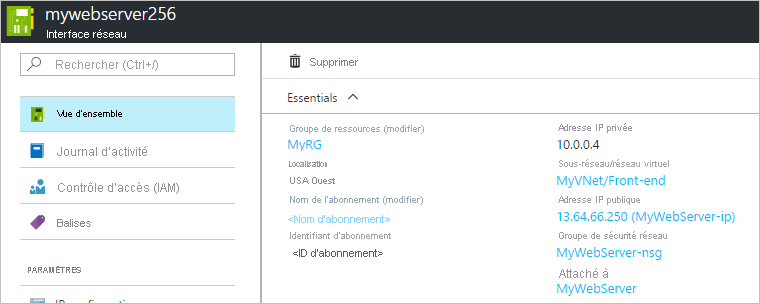

# Créer, modifier ou supprimer une interface réseau

Découvrez comment créer, paramétrer et supprimer une interface réseau. Une interface réseau permet à une machine virtuelle Azure de communiquer avec des ressources Internet, Azure et locales. Lorsque vous créez une machine virtuelle par le biais du portail Azure, ce dernier crée pour vous une interface réseau avec des paramètres par défaut. Mais vous pouvez créer des interfaces réseau avec des paramètres personnalisés et ajouter une ou plusieurs interfaces réseau sur une machine virtuelle lors de sa création. Vous pouvez également modifier les paramètres d’interface réseau par défaut d’une interface réseau existante. Cet article explique comment créer une interface réseau avec des paramètres personnalisés, modifier les paramètres d’une interface réseau (par exemple, l’attribution d’un filtre réseau pour les groupes de sécurité réseau, l’attribution d’un sous-réseau, les paramètres de serveur DNS et le transfert IP) ainsi que supprimer une interface réseau.

Si vous avez besoin d’ajouter, de modifier ou de supprimer des adresses IP pour une interface réseau, consultez la section sur la [gestion des adresses IP](virtual-network-network-interface-addresses.md). Si vous devez ajouter ou supprimer des interfaces réseau sur des machines virtuelles, lisez l’article [Ajouter ou supprimer des interfaces réseau](virtual-network-network-interface-vm.md).

## Avant de commencer

[!INCLUDE [updated-for-az](../../includes/updated-for-az.md)]

Avant de suivre les étapes décrites dans les sections de cet article, accomplissez les tâches suivantes :

- Si vous n’avez pas encore de compte, inscrivez-vous pour bénéficier d’un [essai gratuit](https://azure.microsoft.com/free).
- Si vous utilisez le portail, ouvrez https://portal.azure.com, puis connectez-vous avec votre compte Azure.
- Si vous utilisez des commandes PowerShell pour accomplir les tâches décrites dans cet article, exécutez-les dans l’[Azure Cloud Shell](https://shell.azure.com/powershell), ou en exécutant PowerShell à partir de votre ordinateur. Azure Cloud Shell est un interpréteur de commandes interactif et gratuit que vous pouvez utiliser pour exécuter les étapes de cet article. Il contient des outils Azure courants préinstallés et configurés pour être utilisés avec votre compte. Ce didacticiel requiert le module Azure PowerShell version 1.0.0 ou version ultérieure. Exécutez `Get-Module -ListAvailable Az` pour rechercher la version installée. Si vous devez effectuer une mise à niveau, consultez [Installer le module Azure PowerShell](/powershell/azure/install-az-ps). Si vous exécutez PowerShell en local, vous devez également lancer `Connect-AzAccount` pour créer une connexion avec Azure.
- Si vous utilisez des commandes de l’interface de ligne de commande (CLI) Azure pour accomplir les tâches décrites dans cet article, exécutez les commandes dans [Azure Cloud Shell](https://shell.azure.com/bash) ou en exécutant Azure CLI sur votre ordinateur. Ce tutoriel requiert Azure CLI version 2.0.28 ou ultérieure. Exécutez `az --version` pour rechercher la version installée. Si vous devez installer ou mettre à niveau, voir [Installer Azure CLI](/cli/azure/install-azure-cli). Si vous exécutez Azure CLI localement, vous devez également exécuter `az login` pour créer une connexion avec Azure.

Le compte auquel vous vous connectez, ou avec lequel vous vous connectez à Azure, doit avoir le rôle [contributeur réseau](../role-based-access-control/built-in-roles.md?toc=%2fazure%2fvirtual-network%2ftoc.json#network-contributor) ou un [rôle personnalisé](../role-based-access-control/custom-roles.md?toc=%2fazure%2fvirtual-network%2ftoc.json) disposant des autorisations appropriées, listées dans [Autorisations](#permissions).

## Créer une interface réseau

Lorsque vous créez une machine virtuelle par le biais du portail Azure, ce dernier crée pour vous une interface réseau avec des paramètres par défaut. Si vous préférez spécifier vous-même tous les paramètres de votre interface réseau, vous pouvez créer une interface réseau avec des paramètres personnalisés, puis l’attacher à une machine virtuelle lors de la création de cette dernière (à l’aide de PowerShell ou d’Azure CLI). Vous pouvez également créer une interface réseau et l’ajouter à une machine virtuelle existante (à l’aide de PowerShell ou d’Azure CLI). Pour savoir comment créer une machine virtuelle avec une interface réseau existante, ou comment ajouter ou supprimer des interfaces réseau sur des machines virtuelles existantes, consultez l’article [Ajouter ou supprimer des interfaces réseau](virtual-network-network-interface-vm.md). Avant de créer une interface réseau, vous devez disposer d’un [réseau virtuel](manage-virtual-network.md) dans les mêmes emplacement et abonnement que ceux dans lesquels vous créez l’interface.

1. Dans la zone qui contient le texte *Rechercher des ressources* en haut du portail Azure, saisissez *interfaces réseau*. Lorsque la mention **interfaces réseau** apparaît dans les résultats de recherche, sélectionnez-la.
2. Sélectionnez **+ Ajouter** sous **Interfaces réseau**.
3. Entrez ou sélectionnez des valeurs pour les paramètres suivants, puis cliquez sur **Créer** :

    |Paramètre|Requis ?|Détails|
    |---|---|---|
    |Nom|Oui|Le nom doit être unique au sein du groupe de ressources que vous avez sélectionné. Au fil du temps, vous accumulerez probablement plusieurs interfaces réseau dans votre abonnement Azure. Pour obtenir des suggestions lors de la création d’une convention d’affectation de noms et ainsi faciliter la gestion de plusieurs interfaces réseau, consultez [Conventions d’affectation de noms](/azure/cloud-adoption-framework/ready/azure-best-practices/naming-and-tagging#resource-naming). Il est impossible de modifier le nom une fois que l’interface réseau a été créée.|
    |Réseau virtuel|Oui|Sélectionnez le réseau virtuel pour l’interface réseau. Vous pouvez uniquement attribuer une interface réseau à un réseau virtuel qui existe dans le même abonnement et le même emplacement que l’interface réseau. Après la création d’une interface réseau, vous ne pouvez pas modifier le réseau virtuel auquel elle est assignée. La machine virtuelle à laquelle vous ajoutez l’interface réseau doit également exister dans le même emplacement et le même abonnement que l’interface réseau.|
    |Subnet|Oui|Sélectionnez un sous-réseau dans le réseau virtuel que vous avez sélectionné. Vous pouvez modifier le sous-réseau auquel l’interface réseau est assignée après sa création.|
    |Affectation d’adresses IP privées|Oui| Dans ce paramètre, vous choisissez la méthode d’affectation de l’adresse IPv4. Choisissez parmi les méthodes d’affectation suivantes : **Dynamique :** quand vous sélectionnez cette option, Azure affecte automatiquement une adresse disponible de l’espace d’adressage du sous-réseau sélectionné. **Statique :** quand vous sélectionnez cette option, vous devez affecter manuellement une adresse IP disponible de l’espace d’adressage du sous-réseau sélectionné. Les adresses statiques et dynamiques ne changent que si vous les modifiez ou si l’interface réseau est supprimée. Vous pouvez modifier la méthode d’affectation après la création de l’interface réseau. Le serveur DHCP Azure assigne cette adresse à l’interface réseau au sein du système d’exploitation de la machine virtuelle.|
    |Groupe de sécurité réseau|Non | Conservez la valeur **Aucune**, puis sélectionnez un [groupe de sécurité réseau](./network-security-groups-overview.md) ou [créez un groupe de sécurité réseau](tutorial-filter-network-traffic.md). Les groupes de sécurité réseau vous permettent de filtrer le trafic réseau entrant et sortant d’une interface réseau. Vous pouvez appliquer zéro ou un groupe de sécurité réseau à une interface réseau. Zéro ou un groupe de sécurité réseau peut également être appliqué au sous-réseau auquel l’interface réseau est assignée. Lorsqu’un groupe de sécurité réseau est appliqué à une interface réseau et au sous-réseau auquel l’interface réseau est assignée, des résultats inattendus peuvent se produire. Pour résoudre les problèmes relatifs aux groupes de sécurité réseau appliqués aux interfaces réseau et aux sous-réseaux, consultez l’article [Résoudre les problèmes relatifs aux groupes de sécurité réseau](diagnose-network-traffic-filter-problem.md).|
    |Abonnement|Oui|Sélectionnez l’un de vos [abonnements](../azure-glossary-cloud-terminology.md?toc=%2fazure%2fvirtual-network%2ftoc.json#subscription) Azure. La machine virtuelle à laquelle vous attachez une interface réseau et le réseau virtuel auquel vous la connectez doivent être dans le même abonnement.|
    |Adresse IP privée (IPv6)|Non | Si vous cochez cette case, une adresse IPv6 est assignée à l’interface réseau, en plus de l’adresse IPv4 assignée à l’interface réseau. Consultez la section IPv6 de cet article pour obtenir des informations importantes sur l’utilisation du protocole IPv6 avec des interfaces réseau. Vous ne pouvez pas sélectionner de méthode d’attribution pour l’adresse IPv6. Si vous choisissez d’assigner une adresse IPv6, c’est la méthode dynamique qui est sélectionnée.
    |Nom IPv6 (apparaît uniquement lorsque la case **Adresse IP privée (IPv6)** est cochée) |Oui, si la case **Adresse IP privée (IPv6)** est cochée.| Ce nom est assigné à une configuration IP secondaire pour l’interface réseau. Pour en savoir plus sur les configurations IP, consultez la section [Afficher les paramètres d’interface réseau](#view-network-interface-settings).|
    |Resource group|Oui|Sélectionnez un [groupe de ressources](../azure-glossary-cloud-terminology.md?toc=%2fazure%2fvirtual-network%2ftoc.json#resource-group) ou créez-en un. Une interface réseau peut se trouver ou non dans le même groupe de ressources que celui de la machine virtuelle à laquelle vous l’attachez ou du réseau virtuel auquel vous la connectez.|
    |Emplacement|Oui|La machine virtuelle à laquelle vous attachez une interface réseau et le réseau virtuel auquel vous la connectez doivent être dans le même [emplacement](https://azure.microsoft.com/regions), également appelé région.|

Le portail ne permet pas d’assigner une adresse IP publique à l’interface réseau lorsque vous la créez, bien qu’il crée une adresse IP publique et l’assigne à une interface réseau lorsque vous créez une machine virtuelle à l’aide du portail. Pour savoir comment ajouter une adresse IP publique à l’interface réseau après sa création, consultez l’article [Ajouter, modifier ou supprimer des adresses IP](virtual-network-network-interface-addresses.md). Si vous souhaitez créer une interface réseau avec une adresse IP publique, vous devez utiliser l’interface de ligne de commande ou PowerShell pour la créer.

Le portail ne permet pas d’affecter l’interface réseau aux groupes de sécurité d’application lors de la création de l’interface réseau, contrairement à Azure CLI et à PowerShell. Vous pouvez attribuer une interface réseau existante à un groupe de sécurité d’application à l’aide du portail, tant que l’interface réseau est attachée à une machine virtuelle. Pour savoir comment attribuer une interface réseau à un groupe de sécurité d’application, consultez [Ajouter ou supprimer une interface réseau dans un groupe de sécurité d’application](#add-to-or-remove-from-application-security-groups).

>[!Note]
> Azure attribue une adresse MAC à l’interface réseau une fois que l’interface réseau est attachée à une machine virtuelle et que la machine virtuelle est démarrée pour la première fois. Vous ne pouvez pas spécifier l’adresse MAC qu’Azure assigne à l’interface réseau. L’adresse MAC reste assignée à l’interface réseau jusqu’à ce que l’interface réseau soit supprimée ou que l’adresse IP privée assignée à la configuration IP principale de l’interface réseau principale soit modifiée. Pour en savoir plus sur les adresses IP et les configurations IP, consultez [Ajouter, modifier ou supprimer des adresses IP](virtual-network-network-interface-addresses.md).

**Commandes**

|Outil|Commande|
|---|---|
|Interface de ligne de commande|[az network nic create](/cli/azure/network/nic)|
|PowerShell|[New-AzNetworkInterface](/powershell/module/az.network/new-aznetworkinterface)|

## Afficher les paramètres d’interface réseau

Vous pouvez afficher et modifier la plupart des paramètres d’une interface réseau après sa création. Le portail n’affiche pas le suffixe DNS ou l’appartenance aux groupes de sécurité d’application pour l’interface réseau. Pour voir le suffixe DNS et l’appartenance aux groupes de sécurité d’application, exécutez les [commandes](#view-settings-commands) PowerShell ou Azure CLI.

1. Dans la zone qui contient le texte *Rechercher des ressources* en haut du portail Azure, saisissez *interfaces réseau*. Lorsque la mention **interfaces réseau** apparaît dans les résultats de recherche, sélectionnez-la.
2. Sélectionnez l’interface réseau que vous souhaitez consulter ou modifiez les paramètres dans la liste.
3. Les éléments suivants sont répertoriés pour l’interface réseau sélectionnée :
   - **Vue d’ensemble :** fournit des informations sur l’interface réseau, comme les adresses IP assignées, le réseau virtuel/sous-réseau auquel l’interface réseau est assignée, et la machine virtuelle à laquelle l’interface réseau est attachée (le cas échéant). L’illustration suivante montre les paramètres de vue d’ensemble d’une interface réseau nommée **mywebserver256** : 

     Vous pouvez déplacer une interface réseau vers un autre groupe de ressources ou abonnement en cliquant sur (**changer**) en regard du **Groupe de ressources** ou du **Nom d’abonnement**. Si vous déplacez l’interface réseau vers un nouvel abonnement, vous devez également déplacer toutes les ressources liées à cette interface réseau. Par exemple, si l’interface réseau est attachée à une machine virtuelle, vous devez également déplacer la machine virtuelle et les autres ressources relatives à la machine virtuelle. Pour déplacer une interface réseau, consultez l’article [Déplacer des ressources vers un nouveau groupe de ressources ou un nouvel abonnement](../azure-resource-manager/management/move-resource-group-and-subscription.md?toc=%2fazure%2fvirtual-network%2ftoc.json#use-the-portal). Cet article répertorie les conditions préalables et explique comment déplacer des ressources à l’aide du portail Azure, de PowerShell ou d’Azure CLI.
   - **Configurations IP :** les adresses IPv4 et IPv6 publiques et privées, assignées à des configurations IP, sont listées ici. Si une adresse IPv6 est assignée à une configuration IP, l’adresse n’est pas affichée. Pour en savoir plus sur les configurations IP et pour apprendre à ajouter et supprimer des adresses IP, consultez l’article [Configurer des adresses IP pour une interface réseau Azure](virtual-network-network-interface-addresses.md). Le transfert IP et l’affectation de sous-réseau sont également configurés dans cette section. Pour en savoir plus sur ces paramètres, lisez les sections [Activer et désactiver le transfert IP](#enable-or-disable-ip-forwarding) et [Modifier l’affectation de sous-réseau](#change-subnet-assignment) de cet article.
   - **Serveurs DNS :** vous pouvez spécifier à quel serveur DNS une interface réseau est assignée par le biais des serveurs DHCP Azure. L’interface réseau peut hériter du paramètre provenant du réseau virtuel auquel l’interface réseau est assignée, ou présenter un paramètre personnalisé pour remplacer le paramètre du réseau virtuel auquel elle est assignée. Pour modifier le contenu affiché, consultez la section [Modifier les serveurs DNS](#change-dns-servers).
   - **Groupe de sécurité réseau :** indique le groupe de sécurité réseau (éventuel) associé à l’interface réseau. Un groupe de sécurité réseau contient des règles entrantes et sortantes pour filtrer le trafic réseau transitant par l’interface réseau. Si un groupe de sécurité réseau est associé à l’interface réseau, le nom du groupe de sécurité réseau associé s’affiche. Pour modifier ce qui est affiché, consultez [Associer ou dissocier un groupe de sécurité réseau](#associate-or-dissociate-a-network-security-group).
   - **Propriétés :** affiche des paramètres clés concernant l’interface réseau, dont son adresse MAC (vide si l’interface réseau n’est pas attachée à une machine virtuelle), ainsi que l’abonnement dans lequel elle existe.
   - **Obtenir les règles de sécurité effectives :**  les règles de sécurité sont listées si l’interface réseau est attachée à une machine virtuelle en cours d’exécution, tandis qu’un groupe de sécurité réseau est associé à l’interface réseau et/ou au sous-réseau auquel il est assigné. Pour en savoir plus sur ce qui est affiché, consultez [Voir les règles de sécurité effectives](#view-effective-security-rules). Pour en savoir plus sur les groupes de sécurité réseau, consultez [Groupes de sécurité réseau](./network-security-groups-overview.md).
   - **Obtenir les routages effectifs :** les routes sont listées si l’interface réseau est attachée à une machine virtuelle en cours d’exécution. Les itinéraires sont une combinaison d’itinéraires par défaut d’Azure, d’itinéraires définis par l’utilisateur et de tous les itinéraires BGP existants pour le sous-réseau auquel l’interface réseau est assignée. Pour en savoir plus sur ce qui est affiché, consultez [Voir les itinéraires effectifs](#view-effective-routes). Pour plus d’informations sur les itinéraires par défaut Azure et les itinéraires définis par l’utilisateur, consultez [Vue d’ensemble du routage](virtual-networks-udr-overview.md).
Paramètres courants d’Azure Resource Manager : Pour en savoir plus sur les paramètres courants d’Azure Resource Manager, consultez les articles [Journal d’activité](../azure-monitor/essentials/platform-logs-overview.md), [Contrôle d’accès (IAM)](../role-based-access-control/overview.md), [Balises](../azure-resource-manager/management/tag-resources.md?toc=%2fazure%2fvirtual-network%2ftoc.json), [Verrous](../azure-resource-manager/management/lock-resources.md?toc=%2fazure%2fvirtual-network%2ftoc.json) et [Script Automation](../azure-resource-manager/templates/export-template-portal.md).

**Commandes**

Si une adresse IPv6 est assignée à une interface réseau, la sortie PowerShell retourne le fait que l’adresse est assignée, mais elle ne retourne pas l’adresse assignée. De même, l’interface CLI retourne le fait que l’adresse est assignée, mais elle retourne *Null* pour la sortie de l’adresse.

|Outil|Commande|
|---|---|
|Interface de ligne de commande|[az network nic list](/cli/azure/network/nic) pour afficher les interfaces réseau dans l’abonnement ; [az network nic show](/cli/azure/network/nic) pour afficher les paramètres d’une interface réseau|
|PowerShell|[Get-AzNetworkInterface](/powershell/module/az.network/get-aznetworkinterface) pour afficher les interfaces réseau dans l’abonnement ou afficher les paramètres d’une interface réseau|

## Modifier les serveurs DNS

Le serveur DHCP Azure assigne le serveur DNS à l’interface réseau au sein du système d’exploitation de la machine virtuelle. Le serveur DNS assigné correspond au paramètre de serveur DNS d’une interface réseau. Pour en savoir plus sur les paramètres de résolution de noms d’une interface réseau, consultez [Résolution de noms pour les machines virtuelles et les instances de rôle](virtual-networks-name-resolution-for-vms-and-role-instances.md). L’interface réseau peut hériter les paramètres du réseau virtuel, ou utiliser ses propres paramètres uniques qui remplacent le paramètre pour le réseau virtuel.

1. Dans la zone qui contient le texte *Rechercher des ressources* en haut du portail Azure, saisissez *interfaces réseau*. Lorsque la mention **interfaces réseau** apparaît dans les résultats de recherche, sélectionnez-la.
2. Sélectionnez l’interface réseau pour laquelle vous souhaitez modifier un serveur DNS dans la liste.
3. Sous **PARAMÈTRES**, sélectionnez **Serveurs DNS**.
4. Sélectionnez l’une des valeurs suivantes :
   - **Hériter de VNet** : choisissez cette option afin d’hériter le paramètre de serveur DNS défini pour le réseau virtuel auquel l’interface réseau est assignée. Au niveau du réseau virtuel, soit un serveur DNS personnalisé, soit le serveur DNS fourni par Azure est défini. Le serveur DNS fourni par Azure peut résoudre les noms d’hôtes pour les ressources assignées au même réseau virtuel. Le nom de domaine complet doit être utilisé pour résoudre les ressources assignées à différents réseaux virtuels.
   - **Personnalisé** : vous pouvez configurer votre propre serveur DNS pour résoudre les noms sur plusieurs réseaux virtuels. Entrez l’adresse IP du serveur que vous souhaitez utiliser comme serveur DNS. L’adresse de serveur DNS que vous spécifiez est assignée uniquement à cette interface réseau et remplace tout paramètre DNS du réseau virtuel auquel l’interface réseau est assignée.
     >[!Note]
     >Si la machine virtuelle utilise une carte réseau faisant partie d’un groupe à haute disponibilité, tous les serveurs DNS spécifiés pour chacune des machines virtuelles à partir de toutes les cartes réseau appartenant au groupe à haute disponibilité seront hérités.
5. Sélectionnez **Enregistrer**.

**Commandes**

|Outil|Commande|
|---|---|
|Interface de ligne de commande|[az network nic update](/cli/azure/network/nic)|
|PowerShell|[Set-AzNetworkInterface](/powershell/module/az.network/set-aznetworkinterface)|

## Activer et désactiver le transfert IP

Le transfert IP permet à la machine virtuelle à laquelle une interface réseau est attachée de :
- Recevoir le trafic réseau qui n’est pas destiné à l’une des adresses IP assignées à l’une des configurations IP assignées à l’interface réseau.
- Envoyer le trafic réseau avec une adresse IP source différente de celle assignée à l’une des configurations IP d’une interface réseau.

Le paramètre doit être activé pour chaque interface réseau attachée à la machine virtuelle qui reçoit le trafic que la machine virtuelle doit transférer. Une machine virtuelle peut transférer le trafic, qu’une ou plusieurs interfaces réseau y soient attachées. Bien que le transfert IP soit un paramètre Azure, la machine virtuelle doit également exécuter une application capable de transférer le trafic, comme une application de pare-feu, d’optimisation WAN et d’équilibrage de charge. Lorsqu’une machine virtuelle exécute des applications réseau, la machine virtuelle est communément appelée appliance virtuelle réseau. Vous pouvez afficher une liste d’appliances virtuelles réseau prêtes au déploiement sur la [Place de marché Azure](https://azuremarketplace.microsoft.com/marketplace/apps/category/networking?page=1&subcategories=appliances). Le transfert IP est généralement utilisé avec les routages définis par l’utilisateur. Pour en savoir plus sur les itinéraires définis par l’utilisateur, consultez [Itinéraires définis par l’utilisateur](virtual-networks-udr-overview.md).

1. Dans la zone qui contient le texte *Rechercher des ressources* en haut du portail Azure, saisissez *interfaces réseau*. Lorsque la mention **interfaces réseau** apparaît dans les résultats de recherche, sélectionnez-la.
2. Sélectionnez l’interface réseau pour laquelle vous voulez activer ou désactiver le transfert IP.
3. Sous **PARAMÈTRES**, sélectionnez **Configurations IP**.
4. Cliquez sur **Activé** ou **Désactivé** (paramètre par défaut) pour modifier le paramètre.
5. Sélectionnez **Enregistrer**.

**Commandes**

|Outil|Commande|
|---|---|
|Interface de ligne de commande|[az network nic update](/cli/azure/network/nic)|
|PowerShell|[Set-AzNetworkInterface](/powershell/module/az.network/set-aznetworkinterface)|

## Modifier l’affectation de sous-réseau

Vous pouvez modifier le sous-réseau, mais pas le réseau virtuel auquel une interface réseau est assignée.

1. Dans la zone qui contient le texte *Rechercher des ressources* en haut du portail Azure, saisissez *interfaces réseau*. Lorsque la mention **interfaces réseau** apparaît dans les résultats de recherche, sélectionnez-la.
2. Sélectionnez l’interface réseau pour laquelle vous souhaitez modifier l’affectation de sous-réseau.
3. Sous **PARAMÈTRES**, sélectionnez **Configurations IP**. Si des adresses IP privées affectées à des configurations IP répertoriées sont assorties de la mention **(Statique)** , vous devez modifier la méthode d’affectation d’adresse IP en dynamique en procédant comme suit. Toutes les adresses IP privées doivent être assignées à l’aide de la méthode d’affectation dynamique afin de modifier l’affectation de sous-réseau pour l’interface réseau. Si les adresses sont affectées à l’aide de la méthode dynamique, passez à l’étape cinq. Si des adresses IPv4 sont assignées à l’aide de la méthode d’affectation statique, procédez comme suit pour basculer vers la méthode d’affectation dynamique :
   - Cliquez sur la configuration IP pour laquelle vous souhaitez modifier la méthode d’affectation d’adresse IPv4 dans la liste des configurations IP.
   - Sélectionnez **Dynamique** pour la méthode d’**Affectation** de l’adresse IP privée. Vous ne pouvez pas assigner d’adresse IPv6 avec la méthode d’affectation statique.
   - Sélectionnez **Enregistrer**.
4. Sélectionnez le sous-réseau auquel vous souhaitez connecter l’interface réseau à partir de la liste déroulante **Sous-réseau**.
5. Sélectionnez **Enregistrer**. De nouvelles adresses dynamiques sont affectées à partir de la plage d’adresses de sous-réseau pour le nouveau sous-réseau. Après avoir assigné l’interface réseau à un nouveau sous-réseau, vous pouvez assigner une adresse IPv4 statique à partir de la nouvelle plage d’adresses de sous-réseau si vous le souhaitez. Pour en savoir plus sur l’ajout, la modification et la suppression d’adresses IP concernant une interface réseau, consultez [Ajouter, modifier ou supprimer des adresses IP](virtual-network-network-interface-addresses.md).

**Commandes**

|Outil|Commande|
|---|---|
|Interface de ligne de commande|[az network nic ip-config update](/cli/azure/network/nic/ip-config)|
|PowerShell|[Set-AzNetworkInterfaceIpConfig](/powershell/module/az.network/set-aznetworkinterfaceipconfig)|

## Ajouter une interface aux groupes de sécurité d’application ou la supprimer de ces derniers

Vous ne pouvez ajouter ou supprimer une interface réseau dans un groupe de sécurité d’application à l’aide du portail que si l’interface réseau est attachée à une machine virtuelle. Vous pouvez utiliser PowerShell ou Azure CLI pour ajouter ou supprimer une interface réseau dans un groupe de sécurité d’application, que l’interface réseau soit attachée ou non à une machine virtuelle. Apprenez-en davantage sur les [groupes de sécurité d’application](./network-security-groups-overview.md#application-security-groups) et sur la création d’un [groupe de sécurité d’application](manage-network-security-group.md).

1. Dans la zone *Rechercher parmi les ressources, services et documents* en haut du portail, commencez à taper le nom d’une machine virtuelle qui a une interface réseau que vous souhaitez ajouter ou supprimer dans un groupe de sécurité d’application. Quand le nom de votre machine virtuelle apparaît dans les résultats de la recherche, sélectionnez-le.
2. Sous **PARAMÈTRES**, sélectionnez **Mise en réseau**.  Sélectionnez **Groupes de sécurité d’application**, puis **Configurer les groupes de sécurité d’application**, choisissez les groupes de sécurité d’application auxquels vous souhaitez ajouter l’interface réseau ou désélectionnez les groupes de sécurité d’application dont vous souhaitez supprimer l’interface réseau, puis sélectionnez **Enregistrer**. Seules les interfaces réseau qui existent dans le même réseau virtuel peuvent être ajoutées au même groupe de sécurité d’application. Le groupe de sécurité d’application doit exister dans le même emplacement que l’interface réseau.

**Commandes**

|Outil|Commande|
|---|---|
|Interface de ligne de commande|[az network nic update](/cli/azure/network/nic)|
|PowerShell|[Set-AzNetworkInterface](/powershell/module/az.network/set-aznetworkinterface)|

## Associer ou dissocier un groupe de sécurité réseau

1. Dans la zone de recherche située en haut du portail, entrez *interfaces réseau*. Lorsque la mention **interfaces réseau** apparaît dans les résultats de recherche, sélectionnez-la.
2. Dans la liste, sélectionnez l’interface réseau à laquelle vous souhaitez associer un groupe de sécurité réseau ou dont vous souhaitez dissocier un groupe de sécurité réseau.
3. Sous **PARAMÈTRES**, sélectionnez **Groupe de sécurité réseau**.
4. Sélectionnez **Modifier**.
5. Sélectionnez **Groupe de sécurité réseau**, puis sélectionnez le groupe de sécurité réseau que vous souhaitez associer à l’interface réseau, ou sélectionnez **Aucun** pour dissocier un groupe de sécurité réseau.
6. Sélectionnez **Enregistrer**.

**Commandes**

- Azure CLI : [az network nic update](/cli/azure/network/nic#az-network-nic-update)
- PowerShell : [Set-AzNetworkInterface](/powershell/module/az.network/set-aznetworkinterface)

## Supprimer une interface réseau

Vous pouvez supprimer une interface réseau tant qu’elle n’est pas attachée à une machine virtuelle. Si une interface réseau est attachée à une machine virtuelle, vous devez d’abord placer la machine virtuelle en état Arrêté (libéré), puis détacher l’interface réseau de la machine virtuelle. Pour détacher une interface réseau d’une machine virtuelle, procédez de la manière décrite dans la section [Supprimer une interface réseau d’une machine virtuelle](virtual-network-network-interface-vm.md#remove-a-network-interface-from-a-vm). Toutefois, vous ne pouvez pas détacher une interface réseau d’une machine virtuelle s’il s’agit de la seule interface réseau attachée à cette machine. Une machine virtuelle doit toujours être associée à au moins une interface réseau. La suppression d’une machine virtuelle détache toutes les interfaces réseau attachées, mais elle ne supprime pas les interfaces réseau.

1. Dans la zone qui contient le texte *Rechercher des ressources* en haut du portail Azure, saisissez *interfaces réseau*. Lorsque la mention **interfaces réseau** apparaît dans les résultats de recherche, sélectionnez-la.
2. Sélectionnez dans la liste l’interface réseau que vous souhaitez supprimer.
3. Sous **Vue d’ensemble**, sélectionnez **Supprimer**.
4. Cliquez sur **Oui** pour confirmer la suppression de l’interface réseau.

Lorsque vous supprimez une interface réseau, toutes les adresses MAC ou IP qui lui sont assignées sont libérées.

**Commandes**

|Outil|Commande|
|---|---|
|Interface de ligne de commande|[az network nic delete](/cli/azure/network/nic)|
|PowerShell|[Remove-AzNetworkInterface](/powershell/module/az.network/remove-aznetworkinterface)|

## Résoudre les problèmes de connectivité

Si vous ne parvenez pas à communiquer vers ou à partir d’une machine virtuelle, le problème peut être dû à des itinéraires ou règles de sécurité de groupe de sécurité réseau effectifs liés à une interface réseau. Vous disposez des options suivantes pour essayer de résoudre le problème :

### Voir les règles de sécurité effectives

Les règles de sécurité effectives pour chaque interface réseau attachée à une machine virtuelle sont une combinaison des règles que vous avez créées dans un groupe de sécurité réseau et des [règles de sécurité par défaut](./network-security-groups-overview.md#default-security-rules). Comprendre les règles de sécurité effectives liées à une interface réseau peut vous aider à déterminer la raison pour laquelle vous ne parvenez pas à communiquer vers ou à partir d’une machine virtuelle. Vous pouvez voir les règles effectives pour toute interface réseau attachée à une machine virtuelle en cours d’exécution.

1. Dans la zone de recherche située en haut du portail, entrez le nom d’une machine virtuelle dont vous souhaitez voir les règles de sécurité effectives. Si vous ne connaissez pas le nom de la machine virtuelle, entrez *machines virtuelles* dans la zone de recherche. Quand la mention **Machines virtuelles** apparaît dans les résultats de recherche, sélectionnez-la, puis choisissez une machine virtuelle dans la liste.
2. Sous **PARAMÈTRES**, sélectionnez **Mise en réseau**.
3. Sélectionnez le nom d’une interface réseau.
4. Sous **SUPPORT + DÉPANNAGE**, sélectionnez **Règles de sécurité effectives**.
5. Passez en revue la liste des règles de sécurité effectives pour déterminer si les règles appropriées existent pour vos communications entrante et sortante requises. Découvrez-en plus sur le contenu de la liste dans [Vue d’ensemble des groupes de sécurité réseau](./network-security-groups-overview.md).

La fonctionnalité de vérification du flux IP d’Azure Network Watcher peut également vous aider à déterminer si des règles de sécurité empêchent la communication entre une machine virtuelle et un point de terminaison. Pour plus d’informations, consultez [Vérification du flux IP](../network-watcher/diagnose-vm-network-traffic-filtering-problem.md?toc=%2fazure%2fvirtual-network%2ftoc.json).

**Commandes**

- Azure CLI : [az network nic list-effective-nsg](/cli/azure/network/nic#az-network-nic-list-effective-nsg)
- PowerShell : [Get-AzEffectiveNetworkSecurityGroup](/powershell/module/az.network/get-azeffectivenetworksecuritygroup)

### Afficher les itinéraires effectifs

Les itinéraires effectifs pour les interfaces réseau attachées à une machine virtuelle sont une combinaison des itinéraires par défaut, de tout itinéraire que vous avez créé et de tout itinéraire propagé à partir de réseaux locaux via le protocole BGP à travers une passerelle de réseau virtuel Azure. Comprendre les itinéraires de sécurité effectifs liés à une interface réseau peut vous aider à déterminer la raison pour laquelle vous ne parvenez pas à communiquer vers ou à partir d’une machine virtuelle. Vous pouvez afficher les itinéraires effectifs pour toute interface réseau attachée à une machine virtuelle en cours d’exécution.

1. Dans la zone de recherche située en haut du portail, entrez le nom d’une machine virtuelle dont vous souhaitez voir les règles de sécurité effectives. Si vous ne connaissez pas le nom de la machine virtuelle, entrez *machines virtuelles* dans la zone de recherche. Quand la mention **Machines virtuelles** apparaît dans les résultats de recherche, sélectionnez-la, puis choisissez une machine virtuelle dans la liste.
2. Sous **PARAMÈTRES**, sélectionnez **Mise en réseau**.
3. Sélectionnez le nom d’une interface réseau.
4. Sous **SUPPORT + DÉPANNAGE**, cliquez sur **Routages effectifs**.
5. Passez en revue la liste des itinéraires effectifs pour déterminer si les itinéraires appropriés existent pour vos communications entrante et sortante requises. Pour en savoir plus sur le contenu de la liste, consultez [Vue d’ensemble du routage](virtual-networks-udr-overview.md).

La fonctionnalité de tronçon suivant d’Azure Network Watcher peut également vous aider à déterminer si des itinéraires empêchent la communication entre une machine virtuelle et un point de terminaison. Pour plus d’informations, consultez [Tronçon suivant](../network-watcher/diagnose-vm-network-routing-problem.md?toc=%2fazure%2fvirtual-network%2ftoc.json).

**Commandes**

- Azure CLI : [az network nic show-effective-route-table](/cli/azure/network/nic#az-network-nic-show-effective-route-table)
- PowerShell : [Get-AzEffectiveRouteTable](/powershell/module/az.network/get-azeffectiveroutetable)

## Autorisations

Pour effectuer des tâches sur des interfaces réseau, votre compte doit posséder le rôle de [contributeur de réseaux](../role-based-access-control/built-in-roles.md?toc=%2fazure%2fvirtual-network%2ftoc.json#network-contributor) ou un rôle [personnalisé](../role-based-access-control/custom-roles.md?toc=%2fazure%2fvirtual-network%2ftoc.json) disposant des autorisations appropriées qui sont répertoriées dans le tableau suivant :

| Action                                                                     | Nom                                                      |
| ---------                                                                  | -------------                                             |
| Microsoft.Network/networkInterfaces/read                                   | Obtenir l’interface réseau                                     |
| Microsoft.Network/networkInterfaces/write                                  | Création ou mise à jour d’une interface réseau                        |
| Microsoft.Network/networkInterfaces/join/action                            | Joindre une interface réseau à une machine virtuelle           |
| Microsoft.Network/networkInterfaces/delete                                 | Supprimer une interface réseau                                  |
| Microsoft.Network/networkInterfaces/joinViaPrivateIp/action                | Joindre une ressource à une interface réseau via...     |
| Microsoft.Network/networkInterfaces/effectiveRouteTable/action             | Obtenir une table de routage effective d’interface réseau               |
| Microsoft.Network/networkInterfaces/effectiveNetworkSecurityGroups/action  | Obtenir des groupes de sécurité avec une règle effective sur les interfaces réseau           |
| Microsoft.Network/networkInterfaces/loadBalancers/read                     | Obtenir des équilibreurs de charge d’interface réseau                      |
| Microsoft.Network/networkInterfaces/serviceAssociations/read               | Obtenir une association de service                                   |
| Microsoft.Network/networkInterfaces/serviceAssociations/write              | Créer ou mettre à jour d’une association de service                    |
| Microsoft.Network/networkInterfaces/serviceAssociations/delete             | Supprimer une association de service                                |
| Microsoft.Network/networkInterfaces/serviceAssociations/validate/action    | Valider l’association de service                              |
| Microsoft.Network/networkInterfaces/ipconfigurations/read                  | Obtenir la configuration IP de l’interface réseau                    |

## Étapes suivantes

- Créer une machine virtuelle avec plusieurs cartes réseau à l’aide [d’Azure CLI](../virtual-machines/linux/multiple-nics.md?toc=%2fazure%2fvirtual-network%2ftoc.json) ou de [PowerShell](../virtual-machines/windows/multiple-nics.md?toc=%2fazure%2fvirtual-network%2ftoc.json)
- Créer une machine virtuelle à carte réseau unique avec plusieurs adresses IPv4 avec [Azure CLI](virtual-network-multiple-ip-addresses-cli.md) ou [PowerShell](virtual-network-multiple-ip-addresses-powershell.md)
- Créer une machine virtuelle à carte réseau unique avec une adresse IPv6 privée (derrière Azure Load Balancer) à l’aide [d’Azure CLI](../load-balancer/load-balancer-ipv6-internet-cli.md?toc=%2fazure%2fvirtual-network%2ftoc.json), de [PowerShell](../load-balancer/load-balancer-ipv6-internet-ps.md?toc=%2fazure%2fvirtual-network%2ftoc.json), ou d’un [modèle Azure Resource Manager](../load-balancer/load-balancer-ipv6-internet-template.md?toc=%2fazure%2fvirtual-network%2ftoc.json)
- Créer une interface réseau avec les exemples de scripts [PowerShell](powershell-samples.md) ou [Azure CLI](cli-samples.md), ou à l’aide des[modèles Azure Resource Manager](template-samples.md)
- Créer et attribuer des [définitions Azure Policy](./policy-reference.md) pour les réseaux virtuels