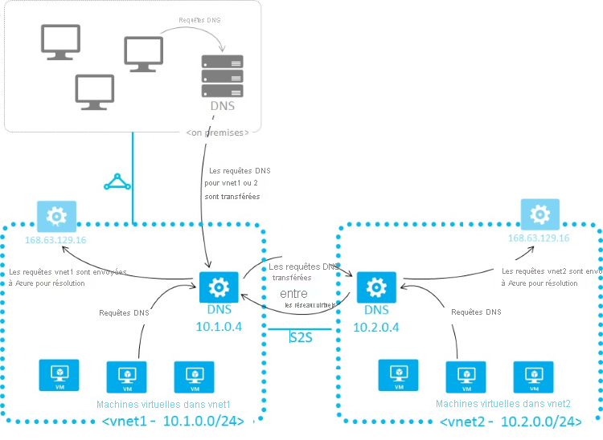

# <a name="name-resolution-for-resources-in-azure-virtual-networks"></a>Résolution de noms des ressources dans les réseaux virtuels Azure

Selon la manière dont vous utilisez Azure pour héberger les solutions IaaS, PaaS et les solutions hybrides, vous pouvez être amené à configurer les machines virtuelles et d’autres ressources déployées sur un réseau virtuel pour qu’elles communiquent entre elles. Même si vous pouvez activer la communication par le biais d’adresses IP, il est bien plus simple d’utiliser des noms dont vous vous souviendrez facilement et qui ne seront pas modifiés. 

Quand des ressources déployées sur des réseaux virtuels doivent résoudre des noms de domaine en adresses IP internes, elles peuvent utiliser l’une des trois méthodes suivantes :

* [Azure DNS Private Zones](../dns/private-dns-overview.md)
* [Résolution de noms dans Azure](#azure-provided-name-resolution)
* [Résolution de noms à l’aide de votre propre serveur DNS](#name-resolution-that-uses-your-own-dns-server) (qui peut rediriger les requêtes vers les serveurs DNS fournis par Azure)

Le type de résolution de noms que vous utilisez dépend de la manière dont vos ressources doivent communiquer entre elles. Le tableau suivant montre des scénarios et les solutions de résolution de noms correspondantes :

> [!NOTE]
> Azure DNS Private Zones constitue la solution par défaut et vous offre la flexibilité nécessaire pour gérer vos enregistrements et zones DNS. Pour plus d’informations, consultez [Utilisation d’Azure DNS pour les domaines privés](../dns/private-dns-overview.md).

> [!NOTE]
> Si vous utilisez le service DNS fourni par Azure, le suffixe DNS approprié est appliqué automatiquement à vos machines virtuelles. Pour toutes les autres options, vous devez utiliser des noms de domaine complets (FQDN) ou appliquer manuellement le suffixe DNS approprié à vos machines virtuelles.

| **Scénario** | **Solution** | **Suffixe DNS** |
| --- | --- | --- |
| Résolution de noms entre des machines virtuelles situées dans le même réseau virtuel, ou entre des instances de rôle Azure Cloud Services situées dans le même service cloud. | [Zones privées Azure DNS](../dns/private-dns-overview.md) ou [résolution de noms fournie par Azure](#azure-provided-name-resolution) |Nom d’hôte ou nom de domaine complet |
| Résolution de noms entre des machines virtuelles situées dans différents réseaux virtuels ou entre des instances de rôle situées dans différents services cloud. |[Zones privées Azure DNS](../dns/private-dns-overview.md) ou serveurs DNS gérés par le client qui transfèrent les requêtes entre les réseaux virtuels pour une résolution par Azure (proxy DNS). Consultez [Résolution de noms à l’aide de votre propre serveur DNS](#name-resolution-that-uses-your-own-dns-server). |Nom de domaine complet uniquement |
| Résolution de noms à partir d’Azure App Service (application web, fonction ou Bot) à l’aide de l’intégration au réseau virtuel pour les instances de rôle ou machines virtuelles dans le même réseau virtuel. |Serveurs DNS gérés par le client qui transfèrent les requêtes entre les réseaux virtuels pour une résolution par Azure (proxy DNS). Consultez [Résolution de noms à l’aide de votre propre serveur DNS](#name-resolution-that-uses-your-own-dns-server). |Nom de domaine complet uniquement |
| Résolution de noms à partir d’App Service Web Apps vers des machines virtuelles dans le même réseau virtuel. |Serveurs DNS gérés par le client qui transfèrent les requêtes entre les réseaux virtuels pour une résolution par Azure (proxy DNS). Consultez [Résolution de noms à l’aide de votre propre serveur DNS](#name-resolution-that-uses-your-own-dns-server). |Nom de domaine complet uniquement |
| Résolution de noms à partir d’App Service Web Apps dans un réseau virtuel vers des machines virtuelles situées dans un réseau virtuel différent. |Serveurs DNS gérés par le client qui transfèrent les requêtes entre les réseaux virtuels pour une résolution par Azure (proxy DNS). Consultez [Résolution de noms à l’aide de votre propre serveur DNS](#name-resolution-that-uses-your-own-dns-server). |Nom de domaine complet uniquement |
| Résolution des noms de service et d’ordinateur locaux à partir des machines virtuelles ou des instances de rôle dans Azure. |Serveurs DNS gérés par le client (par exemple, contrôleur de domaine local, contrôleur de domaine en lecture seule local ou serveur DNS secondaire synchronisé via des transferts de zone). Consultez [Résolution de noms à l’aide de votre propre serveur DNS](#name-resolution-that-uses-your-own-dns-server). |Nom de domaine complet uniquement |
| Résolution de noms d’hôte Azure à partir d’ordinateurs locaux. |Transférer les requêtes vers un serveur proxy DNS géré par le client dans le réseau virtuel correspondant ; le serveur proxy transfère les requêtes vers Azure en vue de la résolution. Consultez [Résolution de noms à l’aide de votre propre serveur DNS](#name-resolution-that-uses-your-own-dns-server). |Nom de domaine complet uniquement |
| DNS inversé pour les adresses IP internes. |[Azure DNS Private Zones](../dns/private-dns-overview.md) ou [résolution de noms fournie par Azure](#azure-provided-name-resolution) ou [résolution de noms à l’aide de votre propre serveur DNS](#name-resolution-that-uses-your-own-dns-server). |Non applicable |
| Résolution de noms entre des machines virtuelles ou instances de rôle situées dans différents services cloud, et non dans un réseau virtuel. |Non applicable. La connectivité entre des machines virtuelles et des instances de rôle de différents services cloud n’est pas prise en charge en dehors d’un réseau virtuel. |Non applicable|

## <a name="azure-provided-name-resolution"></a>Résolution de noms dans Azure

La résolution de noms fournie par Azure fournit uniquement les fonctionnalités DNS de base faisant autorité. Si vous utilisez cette option, les noms et les enregistrements des zones DNS sont gérés automatiquement par Azure et vous ne pouvez pas contrôler les noms des zones DNS ni le cycle de vie des enregistrements DNS. Si vous avez besoin d’une solution DNS complète pour vos réseaux virtuels, vous devez utiliser [Azure DNS Private Zones](../dns/private-dns-overview.md) ou des [serveurs DNS gérés par le client](#name-resolution-that-uses-your-own-dns-server).

Avec la résolution des noms DNS publics, Azure fournit la résolution de noms interne pour les machines virtuelles et les instances de rôle qui résident dans le même réseau virtuel ou service cloud. Les machines virtuelles et les instances d’un service cloud partagent le même suffixe DNS ; le nom d’hôte est donc suffisant. Toutefois, dans les réseaux virtuels déployés à l’aide du modèle de déploiement classique, les différents services cloud n’ont pas le même suffixe DNS. Dans ce cas, vous avez besoin du nom de domaine complet pour résoudre les noms des différents services cloud. Dans les réseaux virtuels déployés à l’aide du modèle de déploiement Azure Resource Manager, le suffixe DNS est le même sur toutes les machines virtuelles d’un réseau virtuel, si bien que le nom de domaine complet n’est pas nécessaire. Vous pouvez affecter des noms DNS aux machines virtuelles et aux interfaces réseau. Bien que la résolution de noms fournie par Azure ne nécessite aucune configuration, elle ne convient pas à l’ensemble des scénarios de déploiement, comme expliqué dans le tableau précédent.

> [!NOTE]
> Quand vous utilisez des rôles de travail et web de services cloud, vous pouvez également accéder aux adresses IP internes des instances de rôle à l’aide de l’API REST de gestion des services Azure. Pour plus d’informations, consultez [Référence de l’API REST de gestion des services](https://msdn.microsoft.com/library/azure/ee460799.aspx). L’adresse est basée sur le nom de rôle et le numéro d’instance. 
>

### <a name="features"></a>Fonctionnalités

La résolution de noms fournie par Azure présente les avantages suivants :
* Simplicité d’utilisation. Aucune configuration n'est requise.
* Haute disponibilité : Vous n’avez pas besoin de créer et de gérer les clusters de vos propres serveurs DNS.
* Vous pouvez utiliser le service conjointement à vos propres serveurs DNS pour résoudre les noms d’hôte locaux et Azure.
* Vous pouvez utiliser la résolution de noms entre les machines virtuelles et les instances de rôle du même service cloud, sans qu’un nom de domaine complet soit nécessaire.
* Vous pouvez utiliser la résolution de noms entre les machines virtuelles des réseaux virtuels qui utilisent le modèle de déploiement Azure Resource Manager, sans qu’un nom de domaine complet ne soit nécessaire. Les réseaux virtuels du modèle de déploiement classique nécessitent un nom de domaine complet lors de la résolution de noms dans des services cloud différents. 
* Vous pouvez utiliser des noms d’hôte qui décrivent vos déploiements de façon plus appropriée, au lieu de noms générés automatiquement.

### <a name="considerations"></a>Considérations

Éléments à prendre en considération quand vous utilisez la résolution de noms fournie par Azure :
* Le suffixe DNS créé par Azure ne peut pas être modifié.
* La recherche DNS est étendue à un réseau virtuel. Les noms DNS créés pour un réseau virtuel ne peuvent pas être résolus à partir d’autres réseaux virtuels.
* Vous ne pouvez pas enregistrer manuellement vos propres enregistrements.
* WINS et NetBIOS ne sont pas pris en charge. Vous ne pouvez pas voir vos machines virtuelles dans l’Explorateur Windows.
* Les noms d’hôte doivent être compatibles avec DNS. Les noms doivent comporter uniquement les caractères 0-9, a-z et « - », et ils ne peuvent pas commencer ou se terminer par « - ».
* Le trafic de requêtes DNS est limité pour chaque machine virtuelle. Cette limitation ne devrait pas avoir d’incidence sur la plupart des applications. Si la limitation de requêtes est respectée, assurez-vous que la mise en cache côté client est activée. Pour plus d’informations, consultez [Configuration du client DNS](#dns-client-configuration).
* Seules les machines virtuelles des 180 premiers services cloud sont inscrites pour chaque réseau virtuel dans un modèle de déploiement classique. Cette limite ne s’applique pas aux réseaux virtuels d’Azure Resource Manager.
* Adresse IP d’Azure DNS : 168.63.129.16. Il s’agit d’une adresse IP statique qui ne change pas.

### <a name="reverse-dns-considerations"></a>Considérations relatives au DNS inversé
Le DNS inversé est pris en charge dans tous les réseaux virtuels basés sur ARM. Vous pouvez émettre des requêtes DNS inverses (requêtes PTR) pour mapper les adresses IP des machines virtuelles aux noms de domaine complets des machines virtuelles.
* Toutes les requêtes PTR visant à obtenir les adresses IP de machines virtuelles retournent des noms de domaine complets de la forme \[vmname\].internal.cloudapp.net
* La recherche directe sur des noms de domaine complets de la forme \[vmname\].internal.cloudapp.net est résolue en adresse IP affectée à la machine virtuelle.
* Si le réseau virtuel est lié à [Azure DNS Private Zones](../dns/private-dns-overview.md) en tant que réseau virtuel d’inscription, les requêtes DNS inverses retournent deux enregistrements. L’un des enregistrements se présente sous la forme \[vmname\].[privatednszonename] et l’autre sous la forme \[vmname\].internal.cloudapp.net
* L’étendue de la recherche DNS inverse est limitée à un réseau virtuel donné, même s’il est appairé à d’autres réseaux virtuels. Les requêtes DNS inverses (requêtes PTR) pour les adresses IP des machines virtuelles situées dans des réseaux virtuels appairés retournent NXDOMAIN.

> [!NOTE]
> Si vous souhaitez que la recherche DNS inverse s’étende sur le réseau virtuel, vous pouvez créer une zone de recherche inverse (in-addr.arpa) [Azure DNS Private Zones](../dns/private-dns-overview.md) et la lier à plusieurs réseaux virtuels. Toutefois, vous devez gérer manuellement les enregistrements DNS inverses pour les machines virtuelles.
>


## <a name="dns-client-configuration"></a>Configuration du client DNS

Cette section aborde la mise en cache côté client et les nouvelles tentatives côté client.

### <a name="client-side-caching"></a>Mise en cache côté client

Les requêtes DNS n’ont pas toutes besoin d’être envoyées sur le réseau. La mise en cache côté client permet de réduire la latence et d’améliorer la résilience aux problèmes réseau en résolvant les requêtes DNS récurrentes à partir d’un cache local. Les enregistrements DNS ont une durée de vie qui permet au cache de les stocker aussi longtemps que possible sans impacter leur fraîcheur. Pour cette raison, la mise en cache côté client convient à la plupart des situations.

Le client DNS Windows par défaut comprend un cache DNS intégré. Certaines distributions Linux n’incluent pas la mise en cache par défaut. Si vous ne disposez pas déjà d’un cache local, ajoutez un cache DNS à chaque machine virtuelle Linux.

Il existe plusieurs packages de mise en cache DNS différents (par exemple, dnsmasq). Voici les étapes nécessaires à l’installation de dnsmasq sur les distributions les plus courantes :

* **Ubuntu (utilise resolvconf)** :
  * Installez le package dnsmasq avec `sudo apt-get install dnsmasq`.
* **SUSE (utilise netconf)** :
  * Installez le package dnsmasq avec `sudo zypper install dnsmasq`.
  * Activez le service dnsmasq avec `systemctl enable dnsmasq.service`. 
  * Démarrez le service dnsmasq avec `systemctl start dnsmasq.service`. 
  * Modifiez **/etc/sysconfig/network/config** et remplacez *NETCONFIG_DNS_FORWARDER=""* par *dnsmasq*.
  * Mettez à jour resolv.conf avec `netconfig update` pour définir le cache en tant que programme de résolution DNS local.
* **CentOS (utilise NetworkManager)** :
  * Installez le package dnsmasq avec `sudo yum install dnsmasq`.
  * Activez le service dnsmasq avec `systemctl enable dnsmasq.service`.
  * Démarrez le service dnsmasq avec `systemctl start dnsmasq.service`.
  * Ajoutez *prepend domain-name-servers 127.0.0.1;* à **/etc/dhclient-eth0.conf**.
  * Redémarrez le service réseau avec `service network restart` pour définir le cache en tant que programme de résolution DNS local.

> [!NOTE]
> Le package dnsmasq constitue l’un des nombreux caches DNS disponibles pour Linux. Avant de l’utiliser, vérifiez son adéquation à vos besoins et vérifiez qu’aucun autre cache n’est installé.

    
### <a name="client-side-retries"></a>Nouvelles tentatives côté client

DNS est principalement un protocole UDP. Comme le protocole UDP ne garantit pas la remise des messages, la logique de nouvelle tentative est gérée dans le protocole DNS. Chaque client DNS (système d’exploitation) peut appliquer une logique de nouvelle tentative différente selon la préférence de son créateur :

* Les systèmes d’exploitation Windows effectuent une nouvelle tentative après une seconde, puis à nouveau après deux secondes, quatre secondes et encore quatre secondes. 
* La configuration Linux par défaut effectue une nouvelle tentative après cinq secondes. Il est recommandé de configurer cinq nouvelles tentatives effectuées à une seconde d’intervalle.

Vérifiez les paramètres actuels sur une machine virtuelle Linux avec `cat /etc/resolv.conf`. Examinez la ligne *options*, par exemple :

```bash
options timeout:1 attempts:5
```

Le fichier resolv.conf est généralement généré automatiquement et ne doit pas être modifié. Les étapes spécifiques pour l’ajout de la ligne *options* varient selon la distribution :

* **Ubuntu** (utilise resolvconf) :
  1. ajoutez la ligne *options* à **/etc/resolvconf/resolv.conf.d/tail**.
  2. Exécutez `resolvconf -u` pour effectuer la mise à jour.
* **SUSE** (utilise netconf) :
  1. Ajoutez *timeout:1 attempts:5* au paramètre **NETCONFIG_DNS_RESOLVER_OPTIONS=""** dans **/etc/sysconfig/network/config**.
  2. Exécutez `netconfig update` pour effectuer la mise à jour.
* **CentOS (utilise NetworkManager)** :
  1. Ajoutez *echo "options timeout:1 attempts:5"* à **/etc/NetworkManager/dispatcher.d/11-dhclient**.
  2. Mettez à jour avec `service network restart`.

## <a name="name-resolution-that-uses-your-own-dns-server"></a>Résolution de noms utilisant votre propre serveur DNS

Cette section traite des machines virtuelles, des instances de rôle et des applications web.

### <a name="vms-and-role-instances"></a>Machines virtuelles et instances de rôle

Il peut arriver que vous ayez besoin d’autres fonctionnalités que celles fournies par Azure pour la résolution de noms. Par exemple, vous devrez peut-être utiliser des domaines Microsoft Windows Server Active Directory pour résoudre les noms DNS entre des réseaux virtuels. Dans le cadre de ces scénarios, Azure vous permet d’utiliser vos propres serveurs DNS.

Les serveurs DNS d’un réseau virtuel peuvent transférer des requêtes DNS vers le programme de résolution récursive dans Azure. Cela vous permet de résoudre les noms d’hôte au sein de ce réseau virtuel. Par exemple, un contrôleur de domaine exécuté dans Azure peut répondre aux requêtes DNS concernant ses domaines et transférer toutes les autres requêtes vers Azure. Le transfert des requêtes permet aux machines virtuelles de voir vos ressources locales (par le biais du contrôleur de domaine) et les noms d’hôte fournis par Azure (par le biais du redirecteur). Les programmes de résolution récursive d’Azure sont accessibles via l’adresse IP virtuelle 168.63.129.16.

Le transfert DNS permet aussi la résolution DNS entre réseaux virtuels et permet à vos machines locales de résoudre les noms d’hôte fournis par Azure. Pour résoudre le nom d’hôte d’une machine virtuelle, la machine virtuelle du serveur DNS doit résider dans le même réseau virtuel et être configurée pour rediriger les requêtes de nom d’hôte vers Azure. Comme le suffixe DNS est différent dans chaque réseau virtuel, vous pouvez utiliser des règles de redirection conditionnelles pour envoyer les requêtes DNS au réseau virtuel approprié en vue de la résolution. L’image suivante montre deux réseaux virtuels et un réseau local effectuant une résolution DNS entre réseaux virtuels à l’aide de cette méthode. Un exemple de redirecteur DNS est disponible dans la [Galerie de modèles de démarrage rapide Azure](https://azure.microsoft.com/documentation/templates/301-dns-forwarder/) et sur [GitHub](https://github.com/Azure/azure-quickstart-templates/tree/master/301-dns-forwarder).

> [!NOTE]
> Une instance de rôle peut résoudre les noms des machines virtuelles appartenant au même réseau virtuel. Pour cela, elle utilise le nom de domaine complet, qui est constitué du nom d’hôte de la machine virtuelle et du suffixe DNS **internal.cloudapp.net**. Toutefois, dans ce cas, la résolution de noms réussit uniquement si l’instance de rôle a le nom de la machine virtuelle défini dans le [Schéma Rôle (fichier .cscfg)](https://msdn.microsoft.com/library/azure/jj156212.aspx).
> `<Role name="<role-name>" vmName="<vm-name>">`
>
> Les instances de rôle qui doivent effectuer une résolution de noms des machines virtuelles dans un autre réseau virtuel (nom de domaine complet utilisant le suffixe **internal.cloudapp.net**) doivent le faire à l’aide de la méthode décrite dans cette section, c’est-à-dire, en transférant les serveurs DNS personnalisés entre les deux réseaux virtuels.
>



Lorsque vous utilisez la résolution de noms fournie par Azure, le protocole DHCP d’Azure fournit un suffixe DNS interne ( **.internal.cloudapp.net**) à chaque machine virtuelle. Ce suffixe permet d’effectuer la résolution des noms d’hôte, car les enregistrements de noms d’hôte se trouvent dans la zone **internal.cloudapp.net**. Quand vous utilisez votre propre solution de résolution de noms, ce suffixe n’est pas fourni aux machines virtuelles, car il interfère avec d’autres architectures DNS (comme dans les scénarios avec jointure de domaine). Au lieu de cela, Azure fournit un espace réservé non fonctionnel (*reddog.microsoft.com*).

Si nécessaire, vous pouvez déterminer le suffixe DNS interne à l’aide de PowerShell ou de l’API :

* Pour les réseaux virtuels des modèles de déploiement Azure Resource Manager, le suffixe est disponible via [l’API REST d’interface réseau](https://docs.microsoft.com/rest/api/virtualnetwork/networkinterfaces), la cmdlet PowerShell [Get-AzNetworkInterface](/powershell/module/az.network/get-aznetworkinterface) et la commande [az network nic show](/cli/azure/network/nic#az-network-nic-show) Azure CLI.
* Dans les modèles de déploiement classiques, le suffixe est disponible via l’appel de [l’API Get Deployment](https://msdn.microsoft.com/library/azure/ee460804.aspx) ou l’applet de commande [Get-AzureVM -Debug](/powershell/module/servicemanagement/azure/get-azurevm).

Si la redirection des requêtes vers Azure ne suffit pas, vous devez fournir votre propre solution DNS. Votre solution DNS doit :

* Fournir la résolution de noms d’hôte appropriée, via [DDNS](virtual-networks-name-resolution-ddns.md) par exemple. Si vous utilisez DDNS, il peut être nécessaire de désactiver le nettoyage des enregistrements DNS. Les baux DHCP d’Azure sont longs et le nettoyage peut supprimer prématurément des enregistrements DNS. 
* Fournir la résolution récursive appropriée pour permettre la résolution de noms de domaines externes.
* Être accessible (TCP et UDP sur le port 53) à partir des clients dont elle traite les demandes et être en mesure d’accéder à Internet.
* Être protégée contre tout accès à partir d’Internet, pour atténuer les menaces posées par les agents externes.

> [!NOTE]
> Pour de meilleures performances, lorsque vous utilisez des machines virtuelles Azure en tant que serveurs DNS, le protocole IPv6 doit être désactivé. Une [adresse IP publique](virtual-network-public-ip-address.md) doit être attribuée à chaque machine virtuelle de serveur DNS. 
> 

### <a name="web-apps"></a>les applications web
Supposons que vous ayez besoin d’effectuer la résolution des noms entre votre application web créée à l’aide d’App Service, et liée à un réseau virtuel, et les machines virtuelles du même réseau virtuel. Après avoir configuré un serveur DNS personnalisé comprenant un redirecteur DNS qui transfère les requêtes vers Azure (adresse IP virtuelle : 168.63.129.16), procédez aux étapes suivantes :
1. Activez l’intégration de réseau virtuel pour votre application web, si ce n’est pas déjà fait, comme décrit dans [Intégrer une application à un réseau virtuel Azure](../app-service/web-sites-integrate-with-vnet.md?toc=%2fazure%2fvirtual-network%2ftoc.json).
2. Dans le portail Azure, pour le plan App Service qui héberge l’application web, sélectionnez **Synchroniser le réseau** sous **Mise en réseau**, **Intégration du réseau virtuel**.

    

Si vous devez effectuer une résolution de noms à partir de votre application web créée à l’aide d’App Service, liée à un réseau virtuel, vers des machines virtuelles dans un autre réseau virtuel, vous devez utiliser des serveurs DNS personnalisés sur les deux réseaux virtuels, comme suit :

* Configurez un serveur DNS dans votre réseau virtuel cible, sur une machine virtuelle qui peut également transférer les requêtes vers le programme de résolution récursive d’Azure (adresse IP virtuelle : 168.63.129.16). Un exemple de redirecteur DNS est disponible dans la [Galerie de modèles de démarrage rapide Azure](https://azure.microsoft.com/documentation/templates/301-dns-forwarder) et sur [GitHub](https://github.com/Azure/azure-quickstart-templates/tree/master/301-dns-forwarder). 
* Configurez un redirecteur DNS dans le réseau virtuel source sur une machine virtuelle. Configurez ce redirecteur DNS pour transférer les requêtes au serveur DNS dans votre réseau virtuel cible.
* Configurez votre serveur DNS source dans les paramètres de votre réseau virtuel source.
* Activez l’intégration de réseau virtuel pour votre application web afin de créer un lien vers le réseau virtuel source, en suivant les instructions de l’article [Intégrer une application à un réseau virtuel Azure](../app-service/web-sites-integrate-with-vnet.md?toc=%2fazure%2fvirtual-network%2ftoc.json).
* Dans le portail Azure, pour le plan App Service qui héberge l’application web, sélectionnez **Synchroniser le réseau** sous **Mise en réseau**, **Intégration du réseau virtuel**.

## <a name="specify-dns-servers"></a>Spécifier les serveurs DNS
Lorsque vous utilisez vos propres serveurs DNS, Azure offre la possibilité de spécifier plusieurs serveurs DNS par réseau virtuel. Vous pouvez également spécifier plusieurs serveurs DNS par interface réseau (pour Azure Resource Manager) ou par service cloud (pour le modèle de déploiement classique). Les serveurs DNS spécifiés pour une interface réseau ou un service cloud ont la priorité sur les serveurs DNS spécifiés pour le réseau virtuel.

> [!NOTE]
> Les propriétés d’une connexion réseau, telles que les adresses IP des serveurs DNS, ne doivent pas être modifiées directement dans les machines virtuelles. En effet, ces propriétés risquent d’être effacées pendant la réparation du service, lors du remplacement de la carte réseau virtuelle. Cela s’applique pour les machines virtuelles Windows et Linux.

Quand vous utilisez le modèle de déploiement Azure Resource Manager, vous pouvez spécifier des serveurs DNS pour un réseau virtuel et une interface réseau. Pour plus d’informations, consultez [Gérer un réseau virtuel](manage-virtual-network.md) et [Gérer une interface réseau](virtual-network-network-interface.md).

> [!NOTE]
> Si vous choisissez un serveur DNS personnalisé pour votre réseau virtuel, vous devez spécifier au moins une adresse d’IP de serveur DNS, à défaut de quoi, le réseau virtuel ignorera la configuration et utilisera le DNS fourni par Azure.

Si vous utilisez le modèle de déploiement classique, vous pouvez spécifier des serveurs DNS pour le réseau virtuel dans le portail Azure ou dans le [fichier Configuration réseau](https://msdn.microsoft.com/library/azure/jj157100). Pour les services cloud, vous pouvez spécifier des serveurs DNS via le [fichier Configuration du service](https://msdn.microsoft.com/library/azure/ee758710) ou via PowerShell avec [New-AzureVM](/powershell/module/servicemanagement/azure/new-azurevm).

> [!NOTE]
> Si vous modifiez les paramètres DNS d’un réseau virtuel ou d’une machine virtuelle déjà déployée, pour que les nouveaux paramètres DNS prennent effet, vous devez effectuer un renouvellement de bail DHCP sur toutes les machines virtuelles affectées dans le réseau virtuel. Pour les machines virtuelles exécutant le système d’exploitation Windows, vous pouvez taper `ipconfig /renew` directement sur la machine virtuelle. Les étapes varient selon le système d’exploitation. Consultez la documentation relative à votre type de système d’exploitation.

## <a name="next-steps"></a>Étapes suivantes

Modèle de déploiement Azure Resource Manager :

* [Gérer un réseau virtuel](manage-virtual-network.md)
* [Gérer une interface réseau](virtual-network-network-interface.md)

Modèle de déploiement classique :

* [Schéma de configuration de service Microsoft Azure](https://msdn.microsoft.com/library/azure/ee758710)
* [Schéma de configuration du réseau virtuel](https://msdn.microsoft.com/library/azure/jj157100)
* [Configurer un réseau virtuel à l’aide d’un fichier de configuration réseau](virtual-networks-using-network-configuration-file.md)
