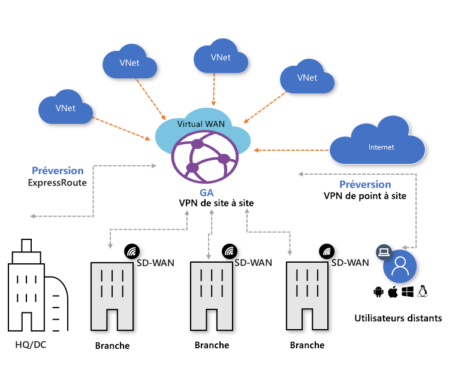
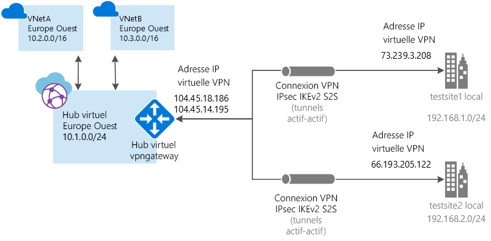

# À propos d'Azure Virtual WAN

Azure Virtual WAN est un service réseau qui combine un grand nombre de fonctionnalités réseau, de sécurité et de routage pour fournir une interface opérationnelle unique. Ces fonctionnalités sont les suivantes : connectivité de branche (via une automatisation de la connectivité à partir d’appareils partenaires d’Azure Virtual WAN, tels que SD-WAN ou un CPE VPN), connectivité VPN site à site, connectivité VPN d’utilisateurs distants (point à site), connectivité privée (ExpressRoute), connectivité intra-cloud (connectivité transitive pour les réseaux virtuels), interconnectivité ExpressRoute de VPN, routage, Pare-feu Azure, chiffrement de connexion privée, etc. Il n’est pas nécessaire d’avoir tous ces cas d’usage pour commencer à utiliser Virtual WAN. Vous pouvez simplement commencer avec un seul cas d’usage et ajuster votre réseau au fur et à mesure de son évolution. Virtual WAN repose sur une architecture hub-and-spoke avec des fonctionnalités de mise à l’échelle et de performances intégrées pour les branches (appareils VPN/SD-WAN), les utilisateurs (clients Azure VPN, openVPN ou IKEv2), les circuits ExpressRoute et les réseaux virtuels. Il offre une [architecture de réseau de transit global](virtual-wan-global-transit-network-architecture.md) où le « hub » du réseau hébergé sur le cloud permet une connectivité transitive entre les points de terminaison qui peut être répartie sur différents types de « rayons » (spoke).

Les régions Azure servent de hubs auxquels vous pouvez vous connecter. Tous les hubs sont connectés selon un maillage complet dans un réseau étendu virtuel standard, ce qui permet à l’utilisateur d’utiliser facilement le réseau principal Microsoft pour se connecter à n’importe quel spoke. Pour la connectivité entre membres spokes avec des appareils SD-WAN/VPN, les utilisateurs peuvent soit la configurer manuellement dans Azure Virtual WAN, soit utiliser la solution de partenaire CPE Virtual WAN (SD-WAN/VPN) pour configurer la connectivité à Azure. Nous disposons d’une liste de partenaires qui prennent en charge l’automatisation de la connectivité (c’est-à-dire la capacité d’exporter les informations relatives à l’appareil dans Azure, de télécharger la configuration Azure et d’établir la connectivité) avec Azure Virtual WAN. Pour plus d’informations sur les emplacements, consultez l’article [Partenaires et emplacements Virtual WAN](virtual-wan-locations-partners.md). 

Cet article fournit un aperçu rapide de la connectivité réseau dans Azure Virtual WAN. Le WAN virtuel offre les avantages suivants :

* **Solutions de connectivité intégrée dans une topologie Hub-and-Spoke :** Automatisez la configuration et la connectivité site à site entre les sites locaux et un hub Azure.
* **Installation et configuration de spokes automatisés :** Connectez vos charges de travail et vos réseaux virtuels au hub Azure sans interruption.
* **Résolution de problèmes intuitive :** Vous pouvez voir le flux de bout en bout au sein d’Azure et utiliser ces informations pour prendre les mesures nécessaires.

## WAN virtuels De base et Standard

Il existe deux types de réseaux étendus (WAN) : De base et Standard. Le tableau suivant présente les configurations disponibles pour chaque type.

[!INCLUDE [Basic and Standard SKUs](../../includes/virtual-wan-standard-basic-include.md)]

Pour connaître la procédure de mise à niveau d'un WAN virtuel, consultez [Procéder à la mise à niveau d'un WAN virtuel De base vers le niveau Standard](upgrade-virtual-wan.md).

## Architecture

Pour plus d’informations sur l’architecture du WAN virtuel et sur la migration vers un WAN virtuel, consultez les articles suivants :

* [Architecture du WAN virtuel](migrate-from-hub-spoke-topology.md)
* [Architecture du réseau de transit global](virtual-wan-global-transit-network-architecture.md)

## Ressources du WAN virtuel

Pour configurer un WAN virtuel de bout en bout, vous devez créer les ressources suivantes :

* **virtualWAN :** La ressource virtualWAN représente une superposition virtuelle de votre réseau Azure et est une collection de plusieurs ressources. Elle contient des liens vers tous les hubs virtuels que vous souhaitez faire figurer dans le WAN virtuel. Les ressources du WAN virtuel sont isolées les unes des autres et ne peuvent pas contenir de hub commun. Les hubs virtuels d'un WAN virtuel ne communiquent pas entre eux.

* **Hub :** Un hub virtuel est un réseau virtuel géré par Microsoft. Le hub contient différents points de terminaison de service pour activer la connectivité. À partir de votre réseau local (vpnsite), vous pouvez vous connecter à une passerelle VPN à l'intérieur du hub virtuel, connecter des circuits ExpressRoute à un hub virtuel, ou même connecter des utilisateurs mobiles à une passerelle point à site dans le hub virtuel. Le hub est le cœur de votre réseau au sein d’une région spécifique. Il ne peut exister qu’un seul hub par région Azure.

  Une passerelle de hub virtuel est différente d’une passerelle de réseau virtuel que vous utilisez pour les services ExpressRoute et Passerelle VPN. Par exemple, quand vous utilisez Virtual WAN, vous ne créez pas de connexion site à site directe entre votre site local et votre réseau virtuel. Au lieu de cela, vous établissez une connexion site à site avec le hub. Le trafic passe toujours par la passerelle du hub. Cela signifie que vos réseaux virtuels n’ont pas besoin d’avoir leur propre passerelle de réseau virtuel. Le WAN virtuel simplifie la mise à l’échelle de vos réseaux virtuels via le hub virtuel et la passerelle de hub virtuel.

* **Connexion entre hub et réseau virtuel :** La ressource Connexion entre hub et réseau virtuel permet de connecter facilement le hub à votre réseau virtuel.

* **(Préversion) Connexion hub à hub** - Dans un WAN virtuel, les hubs sont tous connectés les uns aux autres. Cela signifie qu'une branche, un utilisateur ou un réseau virtuel connecté à un hub local peut communiquer avec une autre branche ou un autre réseau virtuel en utilisant l'intégralité de l'architecture maillée des hubs connectés. Vous pouvez également connecter des réseaux virtuels au sein d'un hub transitant par le hub virtuel, ainsi que des réseaux virtuels inter-hub, en utilisant l'infrastructure connectée hub à hub.

* **Table de routage de hub :**  Vous pouvez créer une route de hub virtuel et l’appliquer à la table de routage de hub virtuel. Vous pouvez appliquer plusieurs itinéraires à la table de routage du hub virtuel.

**Ressources Virtual WAN supplémentaires**

  * **Site :** Cette ressource est utilisée pour les connexions site à site uniquement. La ressource de site est **vpnsite**. Elle représente votre périphérique VPN local et ses paramètres. En faisant appel à un partenaire de WAN virtuel, vous disposez d’une solution intégrée pour exporter automatiquement ces informations vers Azure.

## Types de connectivité

Virtual WAN permet les types de connectivité suivants : VPN site à site, VPN utilisateur (point à site) et ExpressRoute.

### Connexion VPN site à site

Lorsque vous créez une connexion Virtual WAN site à site, vous pouvez travailler avec un partenaire disponible. Si vous ne voulez pas utiliser de partenaire, vous pouvez configurer manuellement la connexion. Pour plus d’informations, consultez [Créer une connexion site à site à l’aide de Virtual WAN](virtual-wan-site-to-site-portal.md).

#### Workflow des partenaires Virtual WAN

Quand vous travaillez avec un partenaire Virtual WAN, le workflow est le suivant :

1. Le contrôleur de l’appareil de branche (VPN/SDWAN) est authentifié pour exporter des informations orientées Site vers Azure à l’aide d’un [principal de service Azure](../active-directory/develop/howto-create-service-principal-portal.md).
2. Le contrôleur de l’appareil de branche (VPN/SDWAN) obtient la configuration de la connectivité Azure et met à jour l’appareil local. Cela permet d’automatiser le téléchargement, la modification et la mise à jour de la configuration sur le périphérique VPN local.
3. Une fois que l’appareil possède la bonne configuration Azure, une connexion de site à site (deux tunnels actifs) est établie avec le WAN Azure. Azure prend en charge IKEv1 et IKEv2. La prise en charge du protocole BGP est facultative.

#### Partenaires pour les connexions Virtual WAN site à site

Pour obtenir la liste des partenaires et des emplacements disponibles, consultez l’article [Partenaires et emplacements Virtual WAN](virtual-wan-locations-partners.md).

### Connexions VPN utilisateur (point à site)

Vous pouvez vous connecter à vos ressources Azure via une connexion IPsec/IKE (IKEv2) ou OpenVPN. Pour utiliser ce type de connexion, un client VPN doit être configuré sur l'ordinateur client. Pour plus d'informations, consultez [Créer une connexion point à site](virtual-wan-point-to-site-portal.md).

### Connexions ExpressRoute
ExpressRoute vous permet de connecter votre réseau local à Azure via une connexion privée. Pour établir la connexion, consultez [Créer une connexion ExpressRoute à l’aide de Virtual WAN](virtual-wan-expressroute-portal.md).

## Emplacements

Pour plus d’informations sur les emplacements, consultez l’article [Partenaires et emplacements Virtual WAN](virtual-wan-locations-partners.md).

## Forum Aux Questions

[!INCLUDE [Virtual WAN FAQ](../../includes/virtual-wan-faq-include.md)]

## Étapes suivantes

[Créer une connexion site à site à l’aide de Virtual WAN](virtual-wan-site-to-site-portal.md)
