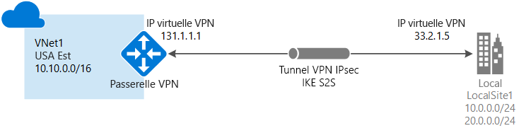
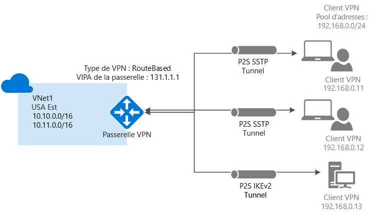
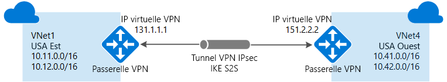
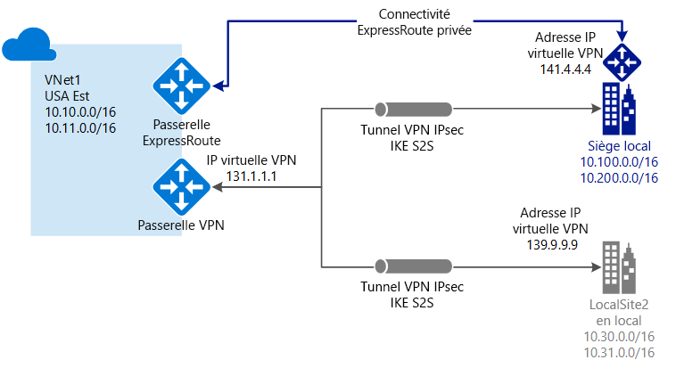

# Qu’est-ce qu’une passerelle VPN ?

Une passerelle VPN est un type spécifique de passerelle de réseau virtuel qui est utilisé pour envoyer du trafic chiffré entre un réseau virtuel Azure et un emplacement sur site via l’Internet public. Vous pouvez également utiliser des passerelles VPN pour envoyer du trafic chiffré entre les réseaux virtuels Azure sur le réseau Microsoft. Chaque réseau virtuel ne peut posséder qu’une seule passerelle VPN. Toutefois, vous pouvez créer plusieurs connexions à la même passerelle VPN. Lorsque vous créez plusieurs connexions à la même passerelle VPN, tous les tunnels VPN partagent la bande passante de passerelle disponible.

## Qu’est-ce qu’une passerelle de réseau virtuel ?

Une passerelle de réseau virtuel est composée de deux machines virtuelles ou plus déployées sur un sous-réseau spécifique que vous créez, appelé *sous-réseau de la passerelle*. Les machines virtuelles de passerelle de réseau virtuel contiennent des tables de routage et exécutent des services de passerelle spécifiques. Ces machines virtuelles sont créées lorsque vous créez la passerelle de réseau virtuel. Vous ne pouvez pas configurer directement les machines virtuelles qui font partie de la passerelle de réseau virtuel.

Un des paramètres que vous configurez pour une passerelle de réseau virtuel est le type de passerelle. Le type de passerelle spécifie la manière dont la passerelle de réseau virtuel est utilisée et les actions qu’elle exécute. Le type de passerelle « VPN » spécifie que le type de passerelle de réseau virtuel créé est une passerelle VPN, plutôt qu’une passerelle ExpressRoute. Un réseau virtuel peut avoir deux passerelles de réseau virtuel : une passerelle VPN et une passerelle ExpressRoute, comme c’est le cas avec les configurations de connexions [coexistantes](#coexisting). Pour plus d’informations, consultez [Types de passerelle](vpn-gateway-about-vpn-gateway-settings.md#gwtype).

Des passerelles VPN peuvent être déployées dans des zones de disponibilité Azure. Cela apporte de la résilience, de l’extensibilité et une plus grande disponibilité aux passerelles de réseau virtuel. Le déploiement de passerelles dans les zones de disponibilité Azure sépare les passerelles physiquement et logiquement au sein d’une région, tout en protégeant votre connectivité de réseau local à Azure à partir d’échecs au niveau de la zone. Voir [À propos des passerelles de réseau virtuel redondantes interzone dans les Zones de disponibilité Azure](about-zone-redundant-vnet-gateways.md)

La création d’une passerelle de réseau virtuel peut prendre jusqu’à 45 minutes. Lors de la création d’une passerelle de réseau virtuel, les machines virtuelles de passerelle sont déployées sur le sous-réseau de la passerelle et configurées avec les paramètres que vous spécifiez. Après avoir créé une passerelle VPN, vous pouvez créer une connexion de tunnel IPsec/IKE VPN entre cette passerelle VPN et une autre (de réseau virtuel à réseau virtuel), ou créer une connexion de tunnel IPsec/IKE VPN intersite entre la passerelle VPN et un périphérique VPN local (de site à site). Vous pouvez également créer une connexion VPN de point à site (VPN sur OpenVPN, IKEv2 ou SSTP), ce qui vous permet de vous connecter à votre réseau virtuel à partir d’un emplacement distant, par exemple une salle de conférence ou votre domicile.

## Configuration d’une passerelle VPN

Une connexion par passerelle VPN s’appuie sur plusieurs ressources qui sont configurées avec des paramètres spécifiques. La plupart des ressources peuvent être configurées séparément, mais certaines d’entre elles doivent être configurées dans un certain ordre.

### Paramètres

Les paramètres que vous avez choisis pour chaque ressource sont essentiels à la création d’une connexion réussie. Pour plus d’informations sur les ressources et paramètres spécifiques pour la passerelle VPN, consultez [À propos des paramètres de passerelle VPN](vpn-gateway-about-vpn-gateway-settings.md). L’article contient des informations pour vous aider à comprendre les types de passerelle, les références SKU des passerelles, les types de VPN, les types de connexion, les sous-réseaux de passerelle, les passerelles de réseau local et divers autres paramètres de ressource que vous pouvez vouloir prendre en compte.

### Outils de déploiement

Vous pouvez commencer par créer et configurer des ressources à l’aide de l’un des outils de configuration, comme le portail Azure. Vous pouvez décider de passer à un autre outil, tel que PowerShell, pour configurer des ressources supplémentaires ou pour modifier les ressources existantes, le cas échéant. Il n’est pour le moment pas possible de configurer toutes les ressources et tous les paramètres des ressources dans le portail Azure. Les instructions fournies dans les articles dédiés à chaque topologie de connexion indiquent si un outil de configuration spécifique est requis. 

### Modèle de déploiement

Il existe actuellement deux modèles de déploiement pour Azure. Lorsque vous configurez votre passerelle VPN, les étapes à suivre varient en fonction du modèle de déploiement que vous avez utilisé pour créer votre réseau virtuel. Par exemple, si vous avez créé votre réseau virtuel à l’aide du modèle de déploiement classique, vous utilisez les recommandations et les instructions pour le modèle de déploiement classique afin de créer et configurer les paramètres de votre passerelle VPN. Pour plus d’informations sur les modèles de déploiement, voir [Comprendre les modèles de déploiement Resource Manager et de déploiement classique](../azure-resource-manager/resource-manager-deployment-model.md).

### Tableau de planification

Le tableau suivant peut vous aider à déterminer la meilleure option de connectivité pour votre solution.

[!INCLUDE [cross-premises](../../includes/vpn-gateway-cross-premises-include.md)]

## SKU de passerelle

Lorsque vous créez une passerelle de réseau virtuel, vous spécifiez la référence SKU de passerelle que vous voulez utiliser. Sélectionnez la référence SKU qui répond à vos besoins en fonction des types de charges de travail, des débits, des fonctionnalités et des contrats de niveau de service.

* Pour plus d’informations sur les références SKU de passerelle, notamment les fonctionnalités prises en charge, la production et le développement-test, et les étapes de configuration, consultez l’article [Paramètres de la passerelle VPN - Références SKU de passerelle](vpn-gateway-about-vpn-gateway-settings.md#gwsku).
* Pour plus d’informations sur les références SKU héritées, consultez [Utilisation de références SKU héritées](vpn-gateway-about-skus-legacy.md).

### Références SKU de passerelle par tunnel, connexion et débit

[!INCLUDE [Aggregated throughput by SKU](../../includes/vpn-gateway-table-gwtype-aggtput-include.md)]

## Diagrammes de topologie de connexion

Il est important de savoir qu’il existe différentes configurations disponibles pour les connexions aux passerelles VPN. Vous devez déterminer la configuration qui correspond le mieux à vos besoins. Dans les sections ci-dessous, vous pouvez afficher des informations et des diagrammes de topologie sur les connexions de passerelle VPN suivantes : Les sections ci-après contiennent des tableaux répertoriant les éléments suivants :

* Modèle de déploiement disponible
* Outils de configuration disponibles
* Liens vous redirigeant directement vers un article, si disponibles

Utilisez les graphiques et les descriptions pour sélectionner la topologie de connexion répondant à vos besoins. Le graphique présente les principales topologies de base, mais il est possible de créer des configurations plus complexes à l’aide des diagrammes.

## Site à site et multi-sites (tunnel VPN IPsec/IKE)

### Site à site

Une connexion par passerelle VPN site à site (S2S) est une connexion via un tunnel VPN IPsec/IKE (IKEv1 ou IKEv2). Les connexions S2S peuvent être utilisées pour les configurations hybrides et entre différents locaux. Une connexion site à site nécessite un appareil VPN local auquel est assignée une adresse IP publique. Pour plus d’informations sur la sélection d’un périphérique VPN, consultez [VPN Gateway FAQ - VPN devices](vpn-gateway-vpn-faq.md#s2s) (FAQ sur la passerelle VPN - Périphériques VPN).

### Multi-sites

Ce type de connexion est une variante de la connexion site à site. Vous créez plusieurs connexions VPN à partir de votre passerelle de réseau virtuel, généralement en vous connectant à plusieurs sites locaux. Lorsque vous travaillez avec plusieurs connexions, vous devez utiliser un type de VPN basé sur l’itinéraire (équivalent d’une passerelle dynamique pour les réseaux virtuels classiques). Chaque réseau virtuel ne pouvant disposer que d’une seule passerelle de réseau virtuel, toutes les connexions passant par la passerelle partagent la bande passante disponible. Ce type de connexion est souvent appelé connexion « multi-sites ».

### Modèles et méthodes de déploiement pour les connexions site à site et multi-sites

[!INCLUDE [site-to-site and multi-site table](../../includes/vpn-gateway-table-site-to-site-include.md)]

## VPN de point à site

Une connexion par passerelle VPN point à site (P2S) vous permet de créer une connexion sécurisée à votre réseau virtuel à partir d’un ordinateur de client individuel. Une connexion P2S est établie en étant démarrée à partir de l’ordinateur client. Cette solution est utile pour les télétravailleurs souhaitant se connecter à un réseau virtuel à partir d’un emplacement distant, comme depuis leur domicile ou pendant une conférence. De même, l’utilisation d’un VPN P2S est une solution utile qui constitue une alternative au VPN Site à Site (S2S) lorsqu’un nombre restreint de clients doit se connecter à un réseau virtuel.

Contrairement aux connexions S2S, les connexions P2S ne nécessitent pas d’adresse IP publique locale ni de périphérique VPN. Les connexions P2S peuvent être utilisées avec des connexions S2S via la même passerelle VPN, dans la mesure où toutes les exigences de configuration des deux types de connexion sont compatibles. Pour plus d’informations sur les connexions point à site, consultez [À propos des VPN point à site](point-to-site-about.md).

### Méthodes et modèles de déploiement pour les connexions P2S

[!INCLUDE [vpn-gateway-table-site-to-site](../../includes/vpn-gateway-table-point-to-site-include.md)]

## Connexions de réseau virtuel à réseau virtuel (tunnel VPN IPsec/IKE)

La connexion entre deux réseaux virtuels est semblable à la connexion d’un réseau virtuel à un emplacement de site local. Les deux types de connectivité font appel à une passerelle VPN pour offrir un tunnel sécurisé utilisant Ipsec/IKE. Vous pouvez même combiner une communication de réseau virtuel à réseau virtuel avec des configurations de connexion multi-sites. Vous établissez ainsi des topologies réseau qui combinent une connectivité entre différents locaux et une connectivité entre différents réseaux virtuels.

Les réseaux virtuels que vous connectez peuvent être situés :

* dans la même région ou dans des régions différentes
* dans le même abonnement ou dans des abonnements différents 
* dans le même modèle de déploiement ou dans des modèles de déploiement différents

### Connexions entre modèles de déploiement

Azure propose actuellement deux modèles de déploiement : le modèle classique et le modèle Resource Manager. Si vous utilisez Azure depuis un certain temps, vous avez probablement des machines virtuelles et des rôles d’instance Azure exécutés dans un réseau virtuel classique. Il est possible que vos nouvelles machines virtuelles et instances de rôle s’exécutent dans un réseau virtuel créé dans Resource Manager. Vous pouvez créer une connexion entre les réseaux virtuels pour permettre aux ressources dans un réseau virtuel de communiquer directement avec les ressources d’un autre réseau virtuel.

### Peering de réseaux virtuels

Vous pouvez utiliser le peering de réseau virtuel pour créer votre connexion, tant que votre réseau virtuel répond à certaines exigences. Le peering de réseau virtuel n’utilise pas de passerelle de réseau virtuel. Pour plus d’informations, consultez l’article [Peering de réseaux virtuels](../virtual-network/virtual-network-peering-overview.md).

### Modèles et méthodes de déploiement pour les connexions de réseau virtuel à réseau virtuel

[!INCLUDE [vpn-gateway-table-vnet-to-vnet](../../includes/vpn-gateway-table-vnet-to-vnet-include.md)]

## ExpressRoute (connexion privée)

ExpressRoute vous permet d’étendre vos réseaux locaux au cloud de Microsoft via une connexion privée assurée par un fournisseur de connectivité. Grâce à ExpressRoute, vous pouvez établir des connexions aux services de cloud computing Microsoft, comme Microsoft Azure, Office 365 et CRM Online. La connectivité peut provenir d'un réseau universel (IP VPN), d’un réseau Ethernet point à point ou d’une interconnexion virtuelle via un fournisseur de connectivité dans un centre de colocalisation.

Les connexions ExpressRoute ne sont pas établies par le biais de l'Internet public. Elles offrent ainsi de meilleurs niveaux de fiabilité, de rapidité, de latence et de sécurité que les connexions classiques sur Internet.

Une connexion ExpressRoute utilise une passerelle de réseau virtuel dans le cadre de sa configuration requise. Dans une connexion ExpressRoute, la passerelle de réseau virtuel est configurée avec le type de passerelle « ExpressRoute » plutôt que « Vpn ». Alors que le trafic qui transite sur un circuit ExpressRoute n’est pas chiffré par défaut, il est possible de créer une solution qui vous permet d’envoyer le trafic chiffré sur un circuit ExpressRoute. Pour plus d’informations sur ExpressRoute, consultez [Présentation technique d’ExpressRoute](../expressroute/expressroute-introduction.md).

## Coexistence de connexions ExpressRoute et de site à site

ExpressRoute est une connexion directe et privée aux services Microsoft, notamment à Azure, à partir de votre WAN, qui ne passe pas par l’Internet public. Le trafic VPN de site à site transite via l’Internet public tout en étant chiffré. La possibilité de configurer des connexions VPN de site à site et ExpressRoute pour le même réseau virtuel présente plusieurs avantages.

Vous pouvez configurer un VPN de site à site comme un chemin d’accès de basculement sécurisé pour ExpressRoute, ou utiliser des VPN de site à site pour vous connecter à des sites qui ne font pas partie de votre réseau, mais qui sont connectés via ExpressRoute. Notez que cette configuration nécessite deux passerelles de réseau virtuel pour un même réseau virtuel, une de type « Vpn », et l’autre de type « ExpressRoute ».

### Coexistence des méthodes et modèles de déploiement pour les connexions S2S et ExpressRoute

[!INCLUDE [vpn-gateway-table-coexist](../../includes/vpn-gateway-table-coexist-include.md)]

## Tarifs

[!INCLUDE [vpn-gateway-about-pricing-include](../../includes/vpn-gateway-about-pricing-include.md)]

Pour plus d’informations sur les références de passerelle pour la passerelle VPN, consultez [Références (SKU) de passerelle](vpn-gateway-about-vpn-gateway-settings.md#gwsku).

## Forum Aux Questions

Pour les questions fréquemment posées sur la passerelle VPN, consultez le [Forum aux questions sur la passerelle VPN](vpn-gateway-vpn-faq.md).

## Étapes suivantes

- Pour plus d’informations, consultez la [FAQ sur la passerelle VPN](vpn-gateway-vpn-faq.md).
- Consultez les [Limites du service et de l’abonnement](../azure-subscription-service-limits.md#networking-limits).
- Découvrez certaines des autres [fonctionnalités de réseau](../networking/networking-overview.md) clés d’Azure.
