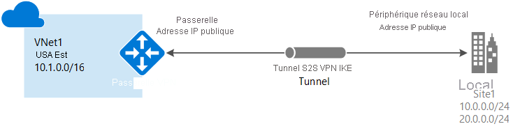

# Création d’une connexion de site à site dans le portail Azure

Cet article vous explique comment utiliser le portail Azure pour créer une connexion de passerelle VPN de site à site à partir de votre réseau local vers le réseau virtuel. Les étapes mentionnées dans cet article s’appliquent au modèle de déploiement Resource Manager. Vous pouvez également créer cette configuration à l’aide d’un autre outil ou modèle de déploiement en sélectionnant une option différente dans la liste suivante :

> [!div class="op_single_selector"]
> * [Azure portal](vpn-gateway-howto-site-to-site-resource-manager-portal.md)
> * [PowerShell](vpn-gateway-create-site-to-site-rm-powershell.md)
> * [INTERFACE DE LIGNE DE COMMANDE](vpn-gateway-howto-site-to-site-resource-manager-cli.md)
> * [Portail Azure (classique)](vpn-gateway-howto-site-to-site-classic-portal.md)
> 
>

Une connexion de passerelle VPN de site à site permet de connecter votre réseau local à un réseau virtuel Azure via un tunnel VPN IPsec/IKE (IKEv1 ou IKEv2). Ce type de connexion requiert un périphérique VPN local disposant d’une adresse IP publique exposée en externe. Pour plus d’informations sur les passerelles VPN, consultez l’article [À propos de la passerelle VPN](vpn-gateway-about-vpngateways.md).

## Avant de commencer

Vérifiez que vous disposez des éléments ci-dessous avant de commencer votre configuration :

* Veillez à disposer d’un périphérique VPN compatible et à être entouré d’une personne en mesure de le configurer. Pour plus d’informations sur les périphériques VPN compatibles et la configuration de votre périphérique, consultez l’article [À propos des périphériques VPN](vpn-gateway-about-vpn-devices.md).
* Vérifiez que vous disposez d’une adresse IPv4 publique exposée en externe pour votre périphérique VPN.
* Si vous ne maîtrisez pas les plages d’adresses IP situées dans votre configuration de réseau local, vous devez contacter une personne en mesure de vous aider. Lorsque vous créez cette configuration, vous devez spécifier les préfixes des plages d’adresses IP qu’Azure acheminera vers votre emplacement local. Aucun des sous-réseaux de votre réseau local ne peut chevaucher les sous-réseaux du réseau virtuel auquel vous souhaitez vous connecter. 

### Exemples de valeurs

Nous utilisons les valeurs suivantes dans les exemples de cet article. Vous pouvez utiliser ces valeurs pour créer un environnement de test ou vous y référer pour mieux comprendre les exemples de cet article. Pour plus d’informations sur les paramètres de la passerelle VPN, voir [À propos des paramètres de la passerelle VPN](vpn-gateway-about-vpn-gateway-settings.md).

* **Nom du réseau virtuel :** VNet1
* **Espace d’adressage :** 10.1.0.0/16
* **Abonnement :** abonnement à utiliser
* **Groupe de ressources :** TestRG1
* **Région :** USA Est
* **Sous-réseau :** FrontEnd : 10.1.0.0/24 ; BackEnd : 10.1.1.0/24 (facultatif pour cet exercice)
* **Plage d’adresses du sous-réseau de passerelle :** 10.1.255.0/27
* **Nom de passerelle de réseau virtuel :** VNet1GW
* **Adresse IP publique :** VNet1GWpip
* **Type de VPN :** basé sur la route
* **Type de connexion :** Site à site (IPsec)
* **Type de passerelle :** VPN
* **Nom de passerelle de réseau local :** Site1
* **Nom de la connexion :** VNet1toSite1
* **Clé partagée :** pour cet exemple, nous utilisons abc123. Toutefois, vous pouvez utiliser n’importe quelle valeur compatible avec votre matériel VPN. L’important est que les valeurs soient les mêmes de part et d’autre de la connexion.

## 1. Créez un réseau virtuel

[!INCLUDE [Create a virtual network](../../includes/vpn-gateway-basic-vnet-rm-portal-include.md)]

## 2. Créer la passerelle VPN

Dans cette étape, vous créez la passerelle de réseau virtuel de votre réseau virtuel. La création d’une passerelle nécessite généralement au moins 45 minutes, selon la référence SKU de passerelle sélectionnée.

[!INCLUDE [About gateway subnets](../../includes/vpn-gateway-about-gwsubnet-portal-include.md)]

### Exemples de paramètres

* **Détails de l’instance > Région :** USA Est
* **Réseau virtuel > Réseau virtuel :** VNet1
* **Détails de l’instance > Nom :** VNet1GW
* **Détails de l’instance > Type de passerelle :** VPN
* **Détails de l’instance > Type de VPN :** basé sur la route
* **Réseau virtuel > Plage d’adresses de sous-réseau de passerelle :** 10.1.255.0/27
* **Adresse IP publique > Nom de l’adresse IP publique :** VNet1GWpip

[!INCLUDE [Create a vpn gateway](../../includes/vpn-gateway-add-gw-rm-portal-include.md)]

[!INCLUDE [NSG warning](../../includes/vpn-gateway-no-nsg-include.md)]

## 3. Créer la passerelle de réseau local

La passerelle réseau locale est un objet spécifique qui représente votre emplacement local (le site) à des fins de routage. Donnez au site un nom auquel Azure pourra se référer, puis spécifiez l’adresse IP du périphérique VPN local vers lequel vous allez créer une connexion. Spécifiez également les préfixes d’adresses IP qui seront acheminés via la passerelle VPN vers le périphérique VPN. Les préfixes d’adresses que vous spécifiez sont les préfixes situés sur votre réseau local. En cas de modification du réseau ou si vous devez modifier l’adresse IP publique de l’appareil VPN, il est simple de mettre à jour les valeurs ultérieurement.

**Exemples de valeurs**

* **Nom :** Site1
* **Groupe de ressources :** TestRG1
* **Emplacement :** USA Est

[!INCLUDE [Add a local network gateway](../../includes/vpn-gateway-add-local-network-gateway-portal-include.md)]

## 4. Configuration de votre périphérique VPN

Les connexions site à site vers un réseau local nécessitent un périphérique VPN. Dans cette étape, vous configurez votre périphérique VPN. Pour configurer votre périphérique VPN, vous avez besoin des éléments suivants :

- Une clé partagée. Il s’agit de la clé partagée spécifiée lors de la création de la connexion VPN de site à site. Dans nos exemples, nous utilisons une clé partagée basique. Nous vous conseillons de générer une clé plus complexe.
- L’adresse IP publique de votre passerelle de réseau virtuel. Vous pouvez afficher l’adresse IP publique à l’aide du portail Azure, de PowerShell ou de l’interface de ligne de commande. Pour rechercher l’adresse IP publique de votre passerelle VPN à l’aide du portail Azure, accédez à **Passerelles de réseau virtuel**, puis cliquez sur le nom de votre passerelle.

[!INCLUDE [Configure a VPN device](../../includes/vpn-gateway-configure-vpn-device-include.md)]

## 5. Créer la connexion VPN

Créez la connexion VPN de site à site entre votre passerelle de réseau virtuel et votre périphérique VPN local.

[!INCLUDE [Add a site-to-site connection](../../includes/vpn-gateway-add-site-to-site-connection-portal-include.md)]

## 6. Vérifier la connexion VPN

[!INCLUDE [Verify the connection](../../includes/vpn-gateway-verify-connection-portal-include.md)]

## Se connecter à une machine virtuelle

[!INCLUDE [Connect to a VM](../../includes/vpn-gateway-connect-vm-s2s-include.md)]

## Réinitialisation d’une passerelle VPN

La réinitialisation d’une passerelle VPN Azure est utile si vous perdez la connectivité VPN entre différents locaux sur un ou plusieurs tunnels VPN de site à site. Dans ce cas, vos périphériques VPN sur site fonctionnent tous correctement, mais ils ne sont pas en mesure d’établir des tunnels IPsec avec les passerelles VPN Azure. Pour obtenir la procédure, consultez [Réinitialiser une passerelle VPN](vpn-gateway-resetgw-classic.md).

## Modification d’une référence SKU de passerelle (redimensionnement d’une passerelle)

Pour obtenir la procédure permettant de modifier une référence SKU de passerelle, consultez [À propos des paramètres de configuration de la passerelle VPN](vpn-gateway-about-vpn-gateway-settings.md#gwsku).

## Ajout d’une connexion supplémentaire à une passerelle VPN

Vous pouvez ajouter des connexions supplémentaires, à condition que les espaces d’adressage des connexions ne se chevauchent pas.

1. Pour ajouter une connexion supplémentaire, accédez à la passerelle VPN, puis cliquez sur **Connexions** pour ouvrir la page correspondante.
2. Cliquez sur **+Ajouter** pour ajouter votre connexion. Définissez le type de connexion sur Réseau virtuel à réseau virtuel (pour une connexion à une autre passerelle de réseau virtuel) ou sur Site à site, selon vos besoins.
3. Si vous voulez ajouter une connexion Site à site et que vous n’avez pas encore créé de passerelle de réseau local pour le site auquel vous souhaitez vous connecter, vous pouvez en créer une.
4. Spécifiez la clé partagée à utiliser, puis cliquez sur **OK** pour créer la connexion.

## Étapes suivantes

* Pour plus d’informations sur le protocole BGP, consultez les articles [Vue d’ensemble du protocole BGP](vpn-gateway-bgp-overview.md) et [Comment configurer BGP](vpn-gateway-bgp-resource-manager-ps.md).
* Pour plus d’informations sur le tunneling forcé, consultez [À propos du tunneling forcé](vpn-gateway-forced-tunneling-rm.md).
* Pour plus d’informations sur les connexions haut actif-actif, consultez [Configuration haute disponibilité pour la connectivité entre les réseaux locaux et la connectivité entre deux réseaux virtuels](vpn-gateway-highlyavailable.md).
* Pour savoir comment limiter le trafic réseau aux ressources d’un réseau virtuel, consultez [Sécurité du réseau](../virtual-network/security-overview.md).
* Pour plus d’informations sur la façon dont Azure achemine le trafic entre les ressources Azure, locales et Internet, consultez [Routage du trafic de réseau virtuel](../virtual-network/virtual-networks-udr-overview.md).
* Pour plus d’informations sur la création d’une connexion VPN de site à site à l’aide d’un modèle Azure Resource Manager, consultez [Créer une connexion VPN de site à site](https://azure.microsoft.com/resources/templates/101-site-to-site-vpn-create/).
* Pour plus d’informations sur la création d’une connexion VPN de réseau virtuel à réseau virtuel à l’aide d’un modèle Azure Resource Manager, consultez [Déployer une géo-réplication HBase](https://azure.microsoft.com/resources/templates/101-hdinsight-hbase-replication-geo/).
