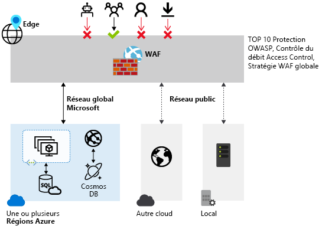
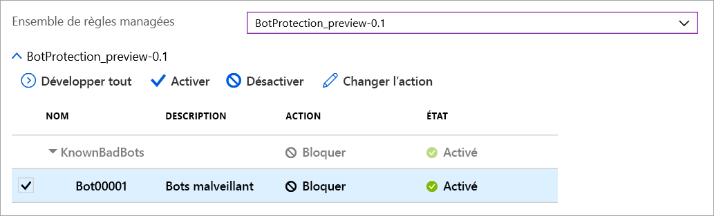

# Pare-feu d’applications web Azure sur Azure Front Door

Le pare-feu d’applications web (WAF) Azure sur Azure Front Door offre une protection centralisée à vos applications web. WAF protège vos services web contre les vulnérabilités et les attaques courantes. Il assure la haute disponibilité de votre service pour vos utilisateurs et vous aide à répondre aux exigences de conformité.

La solution WAF sur Front Door est mondiale et centralisée. Il est déployé sur les sites de périphérie du réseau Azure dans le monde entier. Les applications web compatibles WAF inspectent chaque demande entrante fournie par Front Door à la périphérie du réseau. 

WAF empêche les attaques malveillantes proches des sources d’attaque avant qu’elles entrent dans votre réseau virtuel. Vous bénéficiez d’une protection globale à grande échelle sans sacrifier les performances. Une stratégie WAF est facile à lier à un profil Front Door dans votre abonnement. De nouvelles règles peuvent être déployées en quelques minutes : vous pouvez donc répondre rapidement aux modèles de menaces changeants.

## Stratégie et règles WAF

Vous pouvez configurer une stratégie WAF et l’associer à un ou plusieurs front-ends Front Door pour la protection. Une stratégie WAF se compose de deux types de règles de sécurité :

- des règles personnalisées créées par le client ;

- des ensembles de règles managées qui rassemblent les règles préconfigurées managées par Azure.

Quand ces deux types de règles sont utilisés conjointement, les règles personnalisées sont appliquées avant celles d’un ensemble de règles managées. Une règle est constituée d’une condition de correspondance, d’une priorité et d’une action. Les types d’actions pris en charge sont : AUTORISER, BLOQUER, JOURNALISER et REDIRIGER. Vous pouvez créer une stratégie entièrement personnalisée qui répond aux exigences de protection spécifiques de votre application en combinant des règles personnalisées et des règles managées.

Les règles d’une stratégie sont traitées selon un ordre de priorité. La priorité est représentée par un entier unique qui définit l’ordre des règles à traiter. Plus la valeur entière est petite, plus la priorité est élevée ; les règles ayant des valeurs inférieures sont évaluées avant les règles ayant des valeurs plus élevées. Une fois qu'une correspondance de règle est trouvée, l’action associée définie dans la règle est appliquée à la requête. Une fois qu’une telle correspondance est traitée, aucune autre règle avec une priorité inférieure n’est traitée.

Une application web fournie par Front Door peut être associée à une seule stratégie WAF. Toutefois, il n’est pas obligatoire d’associer une stratégie WAF dans une configuration Front Door. Si une stratégie WAF est présente, elle est répliquée sur tous nos emplacements de périphérie pour garantir des stratégies de sécurité cohérentes à travers le monde.

## Modes WAF

Une stratégie WAF peut être configurée pour s’exécuter dans les deux modes suivants :

- **Mode Détection :** Quand il est exécuté en mode Détection, le pare-feu d’applications web n’entreprend pas d’autre action que la supervision et la journalisation de la requête et de la règle WAF correspondante dans les journaux WAF. Vous pouvez activer la journalisation des diagnostics pour Front Door. Quand vous utilisez le portail, accédez à la section **Diagnostics**.

- **Mode Prévention :** En mode Prévention, le pare-feu d’applications web entreprend l’action spécifiée si une demande correspond à une règle. Si une correspondance est trouvée, aucune autre règle avec une priorité inférieure n’est évaluée. Toutes les requêtes mises en correspondance sont également enregistrées dans les journaux WAF.

## Actions WAF

Les clients de la solution WAF peuvent choisir d’exécuter l’une des actions disponibles quand une requête correspond aux conditions d’une règle :

- **Autoriser :**  la requête est transférée au back-end par le biais du pare-feu d'applications web. Aucune autre règle de priorité inférieure ne peut bloquer cette requête.
- **Bloquer :** la requête est bloquée et le pare-feu d'applications web envoie une réponse au client sans transférer la requête au back-end.
- **Journaliser :**  la requête est enregistrée dans les journaux WAF, puis le pare-feu d'applications web continue l’évaluation des règles de priorité inférieure.
- **Rediriger :** le pare-feu d'applications web redirige la requête vers l’URI spécifié. L’URI spécifié est un paramètre défini au niveau de la stratégie. Une fois l’URI configuré, toutes les requêtes associées à l’action **Rediriger** sont envoyées à cet URI.

## Règles WAF

Une stratégie WAF peut comporter deux types de règles de sécurité : des règles personnalisées, créées par le client, et des ensembles de règles managées, qui rassemblent les règles préconfigurées managées par Azure.

### Règles WAF personnalisées

Vous pouvez configurer des règles WAF personnalisées comme expliqué ci-dessous :

- **Listes d’adresses IP autorisées et bloquées :** Vous pouvez contrôler l’accès à vos applications web en fonction d’une liste d’adresses IP de clients ou de plages d’adresses IP. Les deux types d’adresses IPv4 et IPv6 sont pris en charge. Cette liste peut être configurée pour bloquer ou autoriser les requêtes dont l’adresse IP source correspond à l’une des adresses IP listées.

- **Contrôle d’accès en fonction de l’emplacement géographique :** Vous pouvez contrôler l’accès à vos applications web en fonction du code du pays qui est associé à l’adresse IP d’un client.

- **Contrôle d’accès en fonction des paramètres HTTP :** Vous pouvez baser des règles sur des correspondances de chaîne dans les paramètres de requête HTTP/HTTPS.  Par exemple, les chaînes de requête, les arguments POST, l’URI de la demande, l’en-tête de la demande et le corps de la demande.

- **Contrôle d’accès en fonction de la méthode de requête :** Vous basez les règles sur la méthode de requête HTTP de la demande. Par exemple, GET, PUT ou HEAD.

- **Contrainte de taille :** Vous pouvez baser les règles sur la longueur de parties spécifiques d’une requête, comme la chaîne de requête, l’URI ou le corps de la demande.

- **Règles de limitation du débit :** Une règle de contrôle du débit consiste à limiter un trafic élevé anormal en provenance de toute adresse IP de client. Vous pouvez configurer un seuil sur le nombre de requêtes web autorisées à partir d’une adresse IP cliente pendant une durée d’une minute. Cette règle est différente d’une règle personnalisée basée sur une liste d’adresses autorisées ou bloquées, qui autorise ou bloque toutes les requêtes provenant d’une adresse IP cliente. Des limitations de débit peuvent être combinées avec des conditions de correspondance supplémentaires, comme la mise en correspondance de paramètres HTTP/HTTPS pour un contrôle du débit plus précis.

### Ensembles de règles managées par Azure

Les ensembles de règles managées par Azure fournissent un moyen simple de déployer une solution de protection contre diverses menaces de sécurité courantes. Dans la mesure où ces ensembles de règles sont managées par Azure, les règles sont mises à jour comme il convient pour vous protéger contre les nouvelles signatures d’attaque. Disponible en préversion publique, l’ensemble de règles par défaut managées par Azure inclut des règles de protection contre les catégories de menaces suivantes :

- Scripts intersites (XSS)
- Attaques Java
- Inclusion de fichier local (LFI)
- Injection de code PHP
- Exécution de commande à distance
- Inclusion de fichier distant (RFI)
- Fixation de session
- Protection contre les injections de code SQL
- Attaquants de protocole

Le numéro de version de l’ensemble de règles par défaut s’incrémente quand de nouvelles signatures d’attaque sont ajoutées à l’ensemble de règles.
L’ensemble de règles par défaut est activé en mode Détection par défaut dans vos stratégies WAF. Vous pouvez activer ou désactiver des règles individuellement dans l’ensemble de règles par défaut en fonction des exigences propres à votre application. Vous pouvez également définir des actions spécifiques (AUTORISER/BLOQUER/REDIRIGER/JOURNALISER) pour chaque règle.

L’action par défaut est BLOQUER. De plus, des règles personnalisées peuvent être configurées dans la même stratégie WAF si vous souhaitez ignorer les règles préconfigurées de l’ensemble de règles par défaut.

Les règles personnalisées sont toujours appliquées avant l’évaluation des règles de l’ensemble de règles par défaut. Si une demande correspond à une règle personnalisée, l’action de la règle correspondante est appliquée. La demande est bloquée ou transmise au back-end. Aucune autre règle personnalisée ou les règles de l’ensemble de règles par défaut ne sont traitées. Vous pouvez aussi supprimer l’ensemble de règles par défaut de vos stratégies WAF.

### Ensemble de règles de protection des bots (préversion)

Vous pouvez activer un ensemble de règles de protection des bots managées afin d’effectuer des actions personnalisées sur les requêtes provenant de catégories de bots connues. 

Trois catégories de bots sont prises en charge : Mauvais, Bon et Inconnu. Les signatures de bot sont gérées et mises à jour dynamiquement par la plateforme WAF.

Les « mauvais » bots sont des bots provenant d’adresses IP malveillantes et des bots qui ont falsifié leur identité. Les adresses IP malveillantes proviennent du flux Microsoft Threat Intelligence et sont mises à jour toutes les heures. [Intelligent Security Graph](https://www.microsoft.com/security/operations/intelligence) alimente Microsoft Threat Intelligence et est utilisé par de nombreux services, notamment Azure Security Center.

Les Good Bots (Bons bots), incluent les moteurs de recherche validés. Les catégories « Inconnu » sont des groupes de bots supplémentaires qui se sont identifiés eux-mêmes comme bots. Par exemple, un analyseur de marché, des extracteurs de flux et des agents de collecte de données. 

Les bots inconnus sont classifiés via des agents utilisateur publiés sans validation supplémentaire. Vous pouvez définir des actions personnalisées pour bloquer, autoriser, journaliser ou rediriger pour les différentes types de bots.

> [!IMPORTANT]
> L’ensemble de règles de protection des bots, actuellement disponible en préversion publique, est fourni avec un contrat de niveau de service en préversion. Certaines fonctionnalités peuvent être limitées ou non prises en charge.  Consultez les [Conditions d’utilisation supplémentaires des préversions de Microsoft Azure](https://azure.microsoft.com/support/legal/preview-supplemental-terms/).

Si la protection des bots est activée, les demandes entrantes qui correspondent à des règles de bot sont journalisées dans le journal FrontdoorWebApplicationFirewallLog. Vous pouvez accéder aux journaux WAF à partir d’un compte de stockage, d’un hub d’événements ou de Log Analytics.

## Configuration

Vous pouvez configurer et déployer tous les types de règles WAF en utilisant le portail Azure, des API REST, des modèles Azure Resource Manager ou Azure PowerShell.

## Surveillance

La supervision de WAF pour Front Door est intégrée à Azure Monitor, ce qui vous permet de suivre les alertes et d’analyser facilement les tendances du trafic.

## Étapes suivantes

- En savoir plus sur [Pare-feu d’applications web sur Azure Application Gateway](../ag/ag-overview.md)