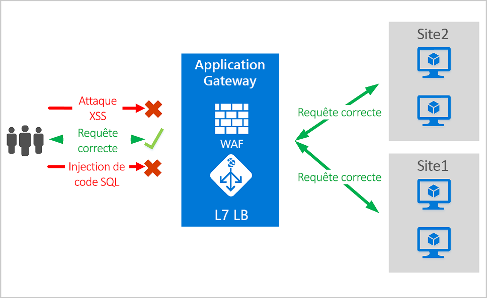
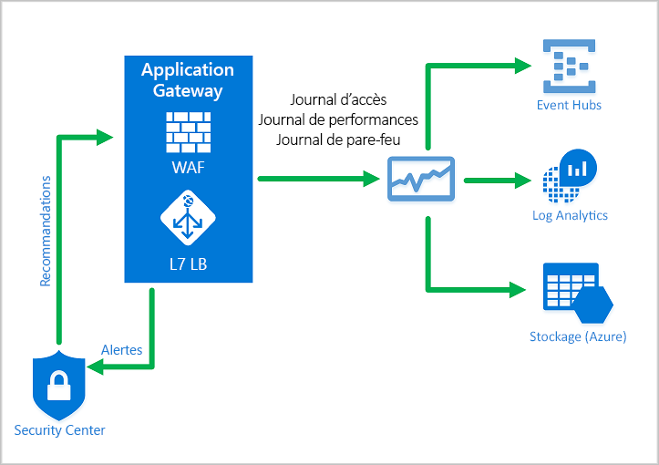
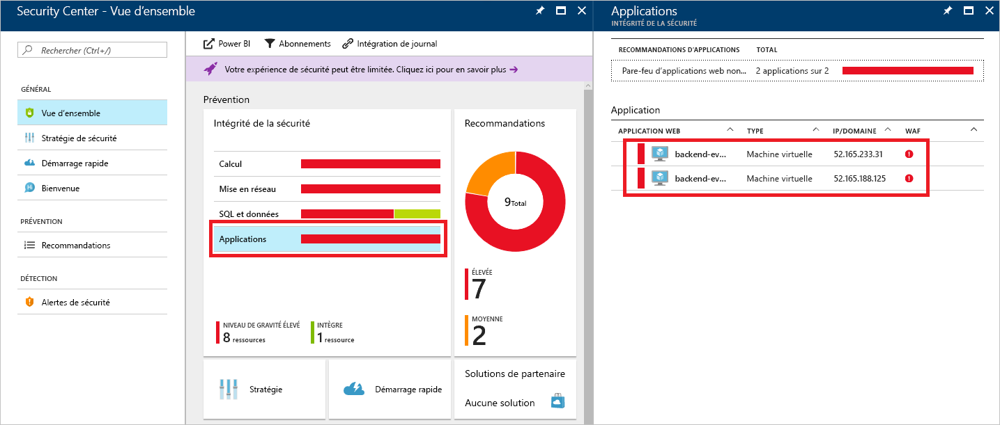
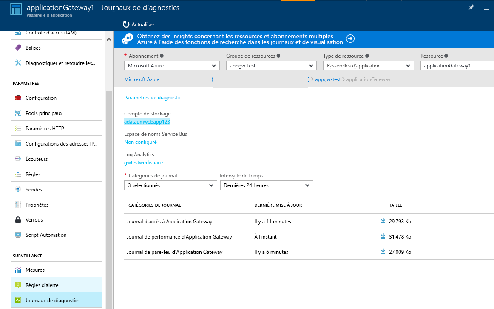

# <a name="azure-web-application-firewall-on-azure-application-gateway"></a>Pare-feu d’applications web Azure sur Azure Application Gateway

Le pare-feu d’applications web Azure (WAF) sur Azure Application Gateway fournit une protection centralisée de vos applications web contre des vulnérabilités et exploitations courantes. Les applications web sont de plus en plus visées par des attaques malveillantes qui exploitent des vulnérabilités connues. L’injection de code SQL et l’exécution de scripts de site à site font partie des attaques les plus courantes.

Le pare-feu d’applications web sur Application Gateway suit l’[ensemble de règles de base (CRS, Core Rule Set)](https://www.owasp.org/index.php/Category:OWASP_ModSecurity_Core_Rule_Set_Project) 3.1, 3.0 ou 2.2.9 d’OWASP (Open Web Application Security Project). Le pare-feu d’applications web se met automatiquement à jour pour inclure la protection contre les nouvelles vulnérabilités, sans aucune configuration supplémentaire requise. 

Toutes les fonctionnalités WAF répertoriées ci-dessous existent dans une stratégie WAF. Vous pouvez créer plusieurs stratégies, qui peuvent être associées à une passerelle d’application, à des écouteurs individuels ou à des règles de routage basées sur les chemins d’une passerelle d’application. De cette façon, vous pouvez avoir des stratégies distinctes pour chaque site derrière votre Application Gateway, si nécessaire. Pour plus d’informations sur les stratégies WAF, voir [Créer une stratégie de pare-feu d’applications web (WAF)](create-waf-policy-ag.md).

   > [!NOTE]
   > Les stratégies WAF par site et par URI sont en préversion publique. Cela signifie que cette fonctionnalité est soumise aux conditions d’utilisation supplémentaires de Microsoft. Pour plus d’informations, consultez [Conditions d’Utilisation Supplémentaires relatives aux Évaluations Microsoft Azure](https://azure.microsoft.com/support/legal/preview-supplemental-terms/).



Application Gateway fournit de nombreuses fonctionnalités de contrôleur de livraison d’applications (ADC). Elle offre une terminaison SSL, une affinité de session basée sur les cookies, une distribution de charge par tourniquet (round robin), un routage basé sur le contenu, la possibilité d’héberger plusieurs sites web et des améliorations de sécurité.

Les améliorations de sécurité de la passerelle d’application sont la gestion des stratégies SSL ainsi que la prise en charge du chiffrement SSL de bout en bout. La sécurité des applications est renforcée par l’intégration du pare-feu d’applications web dans Application Gateway. Cette combinaison protège vos applications web contre les vulnérabilités courantes. Elle fournit un emplacement central facile à configurer pour la gestion.

## <a name="benefits"></a>Avantages

Cette section décrit les principaux avantages qu’offre WAF sur App Gateway.

### <a name="protection"></a>Protection

* Protection de vos applications web contre les vulnérabilités et les attaques web sans modification du code principal.

* Protection simultanée de plusieurs applications web. Une instance d’Application Gateway peut héberger jusqu’à 40 sites web protégés par un pare-feu d’application web.

* Créer des stratégies WAF personnalisées pour différents sites derrière le même pare-feu d’applications web 

* Protéger vos applications web contre des bots malveillants avec l’ensemble de règles de réputation d’adresse IP (préversion)

### <a name="monitoring"></a>Surveillance

* Surveillez les attaques dirigées contre vos applications web à l’aide d’un journal WAF en temps réel. Ce journal est intégré avec [Azure Monitor](../../azure-monitor/overview.md) pour effectuer le suivi des alertes WAF et analyser facilement les tendances.

* Le pare-feu d’applications web est intégré avec Azure Security Center. Azure Security Center offre une vue centrale de l’état de sécurité de toutes vos ressources Azure.

### <a name="customization"></a>Personnalisation

* Personnalisez des règles et groupes de règles WAF pour les besoins de votre application et pour éliminer les faux positifs.

* Associez une stratégie WAF pour chaque site situé derrière votre WAF pour permettre une configuration spécifique du site

* Créez des règles personnalisées pour répondre aux besoins de votre application

## <a name="features"></a>Fonctionnalités

- Protection contre l’injection de code SQL.
- Protection contre l’exécution de scripts de site à site.
- Protection contre d’autres attaques web courantes comme l’injection de commande, les dissimulations de requêtes HTTP, la séparation de réponse HTTP et l’inclusion de fichier distant.
- Protection contre les violations de protocole HTTP.
- Protection contre les anomalies de protocole HTTP comme un agent-utilisateur hôte manquant et les en-têtes Accept.
- Protection contre les robots d’indexation et les scanneurs.
- Détection des erreurs de configuration d’application courantes (par exemple, Apache et IIS).
- Limites de taille de demande configurables avec seuils inférieur et supérieur.
- Des listes d’exclusion vous permettent d’omettre certains attributs de demande d’une évaluation de pare-feu d’applications web. À titre d’exemple courant, citons les jetons Active Directory insérés qui sont utilisés pour les champs d’authentification ou de mot de passe.
- Créez des règles personnalisées pour répondre aux besoins spécifiques de votre application.
- Géofiltrez le trafic pour autoriser ou bloquer l’accès de certains pays à vos applications. (préversion)
- Protégez vos applications des bots avec l’ensemble de règles d’atténuation des risques des bots. (préversion)

## <a name="waf-policy"></a>Stratégie WAF

Pour activer un pare-feu d’applications web sur une Application Gateway, vous devez créer une stratégie WAF. Il s’agit de la stratégie dans laquelle existent l’ensemble des règles managées, règles personnalisées, exclusions et autres personnalisations telles qu’une limite de chargement de fichier. 

### <a name="core-rule-sets"></a>Ensembles de règles de base

Application Gateway prend en charge trois ensembles de règles : CRS 3,1, CRS 3,0 et CRS 2.2.9. Ces règles protègent vos applications web contre les activités malveillantes.

Pour plus d’informations, voir [Règles et groupes de règles CRS de pare-feu d’applications web](application-gateway-crs-rulegroups-rules.md).

### <a name="custom-rules"></a>Règles personnalisées

Application Gateway prend également en charge des règles personnalisées. Les règles personnalisées vous permettent de créer vos propres règles évaluées pour chaque requête passant par WAF. Ces règles ont une priorité plus élevée que les autres règles des ensembles de règles gérés. Si un ensemble de conditions sont remplies, une action est entreprise pour autoriser ou bloquer. 

L’opérateur de géocorrespondance est désormais disponible en préversion publique pour les règles personnalisées. Pour plus d’informations, consultez [Règles personnalisées de géocorrespondance](custom-waf-rules-overview.md#geomatch-custom-rules-preview).

> [!NOTE]
> L’opérateur de géocorrespondance pour les règles personnalisées est actuellement disponible en préversion publique et il est fourni avec un contrat de niveau de service en préversion. Certaines fonctionnalités peuvent être limitées ou non prises en charge. Consultez les [Conditions d’utilisation supplémentaires des préversions de Microsoft Azure](https://azure.microsoft.com/support/legal/preview-supplemental-terms/).

Pour plus d’informations sur les règles personnalisées, consultez [Règles personnalisées pour Application Gateway](custom-waf-rules-overview.md).

### <a name="bot-mitigation-preview"></a>Atténuation de robot (préversion)

Un ensemble de règles de protection de bot managées peut être activé pour votre WAF afin de bloquer ou de journaliser des demandes provenant d’adresses IP malveillantes, à côté de l’ensemble de règles managé. Ces adresses IP proviennent du flux Microsoft Threat Intelligence. Intelligent Security Graph alimente l’intelligence des menaces Microsoft et est utilisé par de nombreux services, dont Azure Security Center.

> [!NOTE]
> Un ensemble de règles de protection bot, actuellement disponible en préversion publique, est fourni avec un contrat de niveau de service en préversion. Certaines fonctionnalités peuvent être limitées ou non prises en charge. Consultez les [Conditions d’utilisation supplémentaires des préversions de Microsoft Azure](https://azure.microsoft.com/support/legal/preview-supplemental-terms/).

Si la protection bot est activée, les demandes entrantes qui correspondent à des adresses IP clientes de bots malveillants sont consignées dans le journal du pare-feu. Vous trouverez des informations supplémentaires ci-dessous. Vous pouvez accéder aux journaux WAF à partir du compte de stockage, du hub d’événements ou de l’analytique des journaux d’activité. 

### <a name="waf-modes"></a>Modes WAF

Le pare-feu d’applications web d’Application Gateway peut être configuré pour s’exécuter dans les deux modes suivants :

* **Mode de détection** : Surveille et journalise toutes les alertes de menace. Vous activez l’enregistrement des diagnostics pour Application Gateway dans la section **Diagnostics**. Vous devez également vérifier que le journal WAF est sélectionné et activé. Le pare-feu d’applications web ne bloque pas les demandes entrantes quand il opère en mode de détection.
* **Mode de prévention** : Bloque les intrusions et les attaques détectées par les règles. L’attaquant reçoit une exception « 403 Accès non autorisé » et la connexion est fermée. Le mode de prévention enregistre de telles attaques dans les journaux WAF.

> [!NOTE]
> Il est recommandé d’exécuter un WAF récemment déployé en mode de détection pendant une brève période dans un environnement de production. Cela permet d’obtenir des [journaux de pare-feu](../../application-gateway/application-gateway-diagnostics.md#firewall-log) et de mettre à jour toutes les exceptions ou [règles personnalisées](./custom-waf-rules-overview.md) avant la transition vers le mode de prévention. Cela peut aider à réduire l’occurrence d’un trafic bloqué inattendu.

### <a name="anomaly-scoring-mode"></a>Mode de scoring d’anomalie

OWASP dispose de deux modes pour décider de bloquer ou non le trafic : le mode traditionnel et le mode de calcul de scoring d’anomalie.

En mode traditionnel, le trafic correspondant à une règle est considéré indépendamment de toute autre correspondance. Ce mode est facile à comprendre. Mais le manque d’informations sur le nombre de règles correspondant à une requête spécifique est une limitation. C’est ainsi que le mode de scoring d’anomalie a été introduit. C’est le mode par défaut pour 3 OWASP.*x*.

En mode de scoring d’anomalie, le trafic correspondant à une règle n’est pas immédiatement bloqué lorsque le pare-feu est en mode de prévention. Les règles ont un niveau de gravité spécifique : *Critique*, *Erreur*, *Avertissement* ou *Avis*. Ce niveau de gravité affecte à la demande une valeur numérique appelée le score d’anomalie. Par exemple, une correspondance de règle *Avertissement* ajoute 3 au score. Une correspondance de règle *Avertissement* ajoute 5.

|severity  |Valeur  |
|---------|---------|
|Critique     |5|
|Error        |4|
|Avertissement      |3|
|Avis       |2|

Le score d’anomalie doit atteindre le seuil de 5 pour que le trafic soit bloqué. Ainsi, une seule correspondance de règle *Critique* suffit pour que le pare-feu d’applications web d’Application Gateway bloque une demande, même en mode de prévention. Mais une correspondance de règle *Avertissement* augmente considérablement selon le score d’anomalie de 3, ce qui est insuffisant en soi pour bloquer le trafic.

> [!NOTE]
> Le message journalisé quand une règle de pare-feu d’applications web correspond au trafic inclut la valeur d’action « Bloqué ». Mais le trafic n’est en fait bloqué que pour un score d’anomalie de 5 ou supérieur.  

### <a name="waf-monitoring"></a>Surveillance du pare-feu d’applications web

Il est important de surveiller l’état de votre passerelle d’application. La surveillance de l’intégrité de votre WAF et des applications qu’il protège est prise en charge par l’intégration avec Azure Security Center, Azure Monitor et les journaux Azure Monitor.



#### <a name="azure-monitor"></a>Azure Monitor

Le journaux d’Application Gateway sont intégrés avec [Azure Monitor](../../azure-monitor/overview.md). Cela vous permet d’effectuer le suivi des informations de diagnostic, y compris des alertes et des journaux WAF. Vous pouvez accéder à cette fonctionnalité sous l’onglet **Diagnostics** dans la ressource Application Gateway du portail ou directement via Azure Monitor. Pour en savoir plus sur l’activation des journaux, voir [Diagnostics d’Application Gateway](../../application-gateway/application-gateway-diagnostics.md).

#### <a name="azure-security-center"></a>Azure Security Center

[Azure Security Center](../../security-center/security-center-intro.md) vous aide à vous empêcher, détecter et traiter les menaces. Il offre une visibilité et un contrôle accrus sur la sécurité de vos ressources Azure. Application Gateway est [intégré avec Azure Security Center](../../application-gateway/application-gateway-integration-security-center.md). Azure Security Center analyse votre environnement pour détecter les applications web non protégées. Il peut recommander au pare-feu d’applications web d’Application Gateway de protéger ces ressources vulnérables. Vous créez les pare-feux directement à partir de Security Center. Ces instances de pare-feu d’applications web sont intégrées avec Security Center. Elles envoient des alertes et des informations de contrôle d’intégrité au Security Center pour la génération de rapports.



#### <a name="azure-sentinel"></a>Azure Sentinel

Microsoft Azure Sentinel est une solution native cloud et évolutive de type SIEM (Security Information and Event Management) et SOAR (Security Orchestrated Automated Response). Azure Sentinel assure une analyse de sécurité intelligente et fournit des informations sur les menaces dans l’ensemble de l’entreprise. Elle constitue une solution unique pour la détection des alertes, la visibilité des menaces, la chasse proactive et la réponse face aux menaces.

Avec le classeur des événements de pare-feu WAF Azure intégré, vous pouvez avoir une vue d’ensemble des événements de sécurité sur votre pare-feu d’applications web. Ceci inclut les événements, les règles de correspondance et les règles bloquées ainsi que tout le reste de ce qui est consigné dans les journaux du pare-feu. Pour plus d’informations, consultez la section Journalisation ci-dessous. 


#### <a name="logging"></a>Journalisation

Le pare-feu d’applications web d’Application Gateway fournit des rapports détaillés sur chaque menace détectée. La journalisation est intégrée avec les journaux Azure Diagnostics. Les alertes sont enregistrées au format .json. Ces journaux d’activité peuvent être intégrés aux [journaux d’activité Azure Monitor](../../azure-monitor/insights/azure-networking-analytics.md).



```json
{
  "resourceId": "/SUBSCRIPTIONS/{subscriptionId}/RESOURCEGROUPS/{resourceGroupId}/PROVIDERS/MICROSOFT.NETWORK/APPLICATIONGATEWAYS/{appGatewayName}",
  "operationName": "ApplicationGatewayFirewall",
  "time": "2017-03-20T15:52:09.1494499Z",
  "category": "ApplicationGatewayFirewallLog",
  "properties": {
    {
      "instanceId": "ApplicationGatewayRole_IN_0",
      "clientIp": "52.161.109.145",
      "clientPort": "0",
      "requestUri": "/",
      "ruleSetType": "OWASP",
      "ruleSetVersion": "3.0",
      "ruleId": "920350",
      "ruleGroup": "920-PROTOCOL-ENFORCEMENT",
      "message": "Host header is a numeric IP address",
      "action": "Matched",
      "site": "Global",
      "details": {
        "message": "Warning. Pattern match \"^[\\\\d.:]+$\" at REQUEST_HEADERS:Host ....",
        "data": "127.0.0.1",
        "file": "rules/REQUEST-920-PROTOCOL-ENFORCEMENT.conf",
        "line": "791"
      },
      "hostname": "127.0.0.1",
      "transactionId": "16861477007022634343"
      "policyId": "/subscriptions/1496a758-b2ff-43ef-b738-8e9eb5161a86/resourceGroups/drewRG/providers/Microsoft.Network/ApplicationGatewayWebApplicationFirewallPolicies/globalWafPolicy",
      "policyScope": "Global",
      "policyScopeName": " Global "
    }
  }
} 

```

## <a name="application-gateway-waf-sku-pricing"></a>Tarification de la référence SKU Application Gateway WAF

Les modèles de tarification sont différents pour les références (SKU) WAF_v1 et WAF_v2. Pour en savoir plus, lisez la page [Tarification d’Application Gateway](https://azure.microsoft.com/pricing/details/application-gateway/). 

## <a name="next-steps"></a>Étapes suivantes

- Commencez par [Créer une règle WAF](create-waf-policy-ag.md)
- Découvrez plus d’informations sur les [règles managées de WAF](application-gateway-crs-rulegroups-rules.md)
- Découvrez plus d’informations sur les [règles personnalisées](custom-waf-rules-overview.md)
- Découvrez le [Pare-feu d’applications web sur Azure Front Door](../afds/afds-overview.md)

