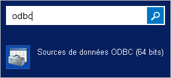
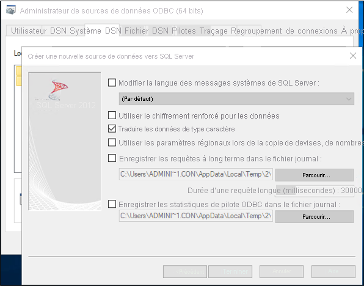
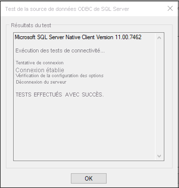
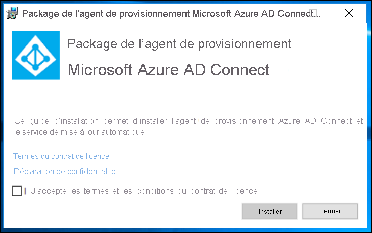
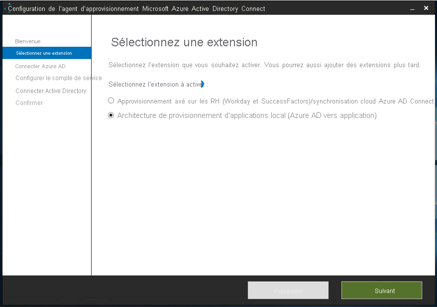
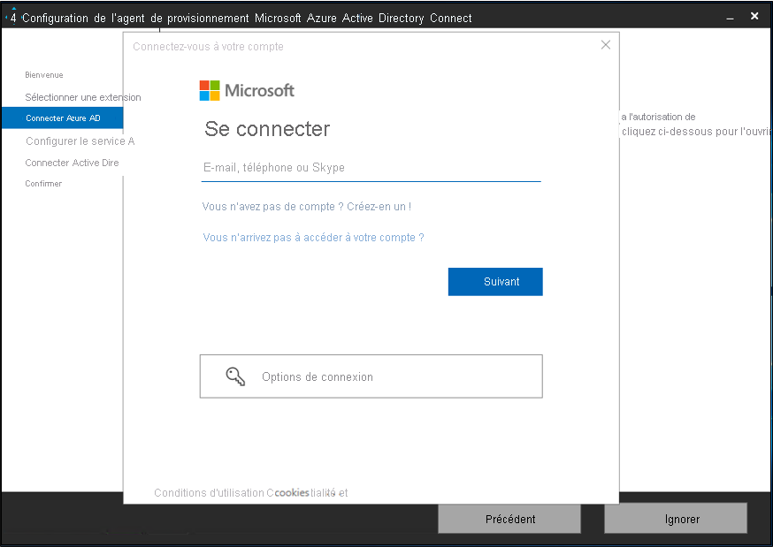

Ce document décrit les étapes à effectuer pour attribuer et désattribuer automatiquement des utilisateurs d’Azure Active Directory (Azure AD) dans une base de données SQL.  Il explique comment configurer et utiliser le connecteur SQL générique avec l’hôte de connecteur ECMA Azure AD. 
 
Pour découvrir les informations importantes sur ce que fait ce service, comment il fonctionne et consulter le forum aux questions, reportez-vous à l’article [Automatiser l’attribution et l’annulation de l’attribution des utilisateurs dans les applications SaaS avec Azure Active Directory](../articles/active-directory/app-provisioning/user-provisioning.md).

## <a name="prerequisites-for-the-azure-ad-ecma-connector-host"></a>Conditions préalables requises pour l’Hôte de connecteur ECMA Azure AD

>[!IMPORTANT]
> Actuellement, la préversion du provisionnement local n’est disponible que sur invitation. Pour demander l’accès à la fonctionnalité, utilisez le [formulaire de demande d’accès](https://aka.ms/onpremprovisioningpublicpreviewaccess). Nous allons ouvrir la préversion à un plus grand nombre de clients et de connecteurs au cours des prochains mois, car nous préparons la disponibilité générale.


### <a name="on-premises-prerequisites"></a>Conditions préalables locales

 - Système cible, tel qu’une base de données SQL, dans lequel les utilisateurs peuvent être créés, mis à jour et supprimés.
 - Connecteur ECMA 2.0 ou une version ultérieure pour ce système cible, qui prend en charge l’exportation, la récupération de schéma et éventuellement les opérations d’importation delta ou d’importation complètes. Si vous ne disposez pas de connecteur ECMA pendant la configuration, vous pouvez valider le flux de bout en bout si vous disposez d’une instance SQL Server dans votre environnement et que vous utilisez le connecteur SQL générique.
 - Ordinateur Windows Server 2016 ou version ultérieure disposant d’une adresse TCP/IP accessible via Internet, d’une connectivité au système cible et d’une connectivité sortante vers login.microsoftonline.com. Par exemple, une machine virtuelle Windows Server 2016 hébergée dans Azure IaaS ou derrière un proxy. Le serveur doit disposer d’au moins 3 Go de RAM.
 - Ordinateur avec .NET Framework 4.7.1.

Selon les options que vous sélectionnez, certains écrans de l’Assistant peuvent ne pas être disponibles et les informations peuvent être légèrement différentes. Pour les besoins de cette configuration, le type d’objet utilisé est « utilisateur ». Utilisez les informations ci-dessous pour vous guider dans votre configuration. 

#### <a name="supported-systems"></a>Systèmes pris en charge
* Microsoft SQL Server et Azure SQL
* IBM DB2 10.x
* IBM DB2 9.x
* Oracle 10 et 11g
* Oracle 12c et 18c
* MySQL 5.x

### <a name="cloud-requirements"></a>Conditions préalables requises du cloud

 - Locataire Azure AD avec Azure AD Premium P1 ou Premium P2 (ou EMS E3 ou E5). 
 
    [!INCLUDE [active-directory-p1-license.md](active-directory-p1-license.md)]
 - Rôle Administrateur hybride pour la configuration de l’agent d’approvisionnement et rôles Administrateur d’application ou Administrateur cloud pour la configuration de l’approvisionnement dans le Portail Azure.

## <a name="prepare-the-sample-database"></a>Préparer l’exemple de base de données
Sur un serveur exécutant SQL Server, exécutez le script SQL qui se trouve dans l’[Annexe A](#appendix-a). Ce script crée un exemple de base de données avec le nom CONTOSO. Il s’agit de la base de données dans laquelle vous allez provisionner les utilisateurs.


## <a name="create-the-dsn-connection-file"></a>Créer le fichier de connexion DSN
Le connecteur SQL générique est un fichier DSN permettant de se connecter au serveur SQL. Vous devez tout d’abord créer un fichier avec les informations de connexion ODBC.

 1. Démarrez l’utilitaire de gestion ODBC sur votre serveur.
     </br>
 2. Accédez à l’onglet **DSN de fichier** et sélectionnez **Ajouter**. 
     </br>
 3. Sélectionnez **SQL Server Native Client 11.0** et **Suivant**. 
     </br>
 4. Nommez le fichier, par exemple **GenericSQL**, et sélectionnez **Suivant**. 
     </br>
 5. Sélectionnez **Terminer**. 
     </br>
 6. Configurez maintenant la connexion. Entrez **APP1** comme nom du serveur, puis sélectionnez **Suivant**.
     </br>
 7. Conservez l’authentification Windows et sélectionnez **Suivant**.
     </br>
 8. Entrez le nom de l’exemple de base de données, à savoir **CONTOSO**.
     
 9. Conservez toutes les valeurs par défaut sur cet écran, et sélectionnez **Terminer**.
     </br>
 10. Pour vérifier que tout fonctionne comme prévu, sélectionnez **Tester la source de données**. 
     </br>
 11. Vérifiez que le test a réussi.
     </br>
 12. Sélectionnez **OK** deux fois. Fermez l’Administrateur de la source de données ODBC.


## <a name="download-install-and-configure-the-azure-ad-connect-provisioning-agent-package"></a>Télécharger, installer et configurer le package de l’agent d’attribution Azure AD Connect

 1. Connectez-vous au portail Azure.
 2. Accédez à **Applications d’entreprise** > **Ajouter une application**.
 3. Recherchez l’application **On-premises ECMA app** et ajoutez-la à l’image de votre locataire.
 4. Sélectionnez l’application **On-premises ECMA app** qui a été ajoutée.
 5. Sous **Démarrage**, dans la zone **3. Provisionner des comptes d’utilisateur**, sélectionnez **Bien démarrer**.
 6. En haut, sélectionnez **Modifier le provisionnement**.
 7. Sous **Connectivité locale**, téléchargez le programme d’installation de l’agent.
 8. Exécutez le programme d’installation d’approvisionnement Azure AD Connect **AADConnectProvisioningAgentSetup.msi**.
 9. Sur l’écran **Package Agent d’approvisionnement Microsoft Azure AD Connect**, acceptez les termes du contrat de licence et sélectionnez **Installer**.
     </br>
 10. Une fois cette opération terminée, l’Assistant Configuration démarre. Sélectionnez **Suivant**.
     </br>
 11. Sur l’écran **Sélectionner une extension**, sélectionnez **Approvisionnement d’applications locales (Azure AD à l’application)** . Sélectionnez **Suivant**.
     </br>
 12. Utilisez votre compte d’administrateur général pour vous connecter à Azure AD.
     </br>
 13. Sur l’écran **Agent configuration**, sélectionnez **Confirm**.
     </br>
 14. Une fois l’installation terminée, un message s’affiche au bas de l’Assistant. Sélectionnez **Quitter**.
     </br>
 15. Revenez au portail Azure sous l’application **On-premises ECMA app**, puis sous **Modifier le provisionnement**.
 16. Dans la page **Provisioning**, définissez le mode sur **Automatic**.
     </br>
 17. Dans la section **Connectivité locale**, sélectionnez l’agent que vous venez de déployer, puis **Assigner un ou des agents**.
     </br>
     >[!NOTE]
     >Après avoir ajouté l’agent, patientez 10 minutes que l’inscription se termine. Le test de connectivité ne fonctionne pas tant que l’inscription n’est pas terminée.
     >
     >Vous pouvez également forcer l’inscription de l’agent en redémarrant l’agent de provisionnement sur votre serveur. Accédez à votre serveur, recherchez **services** dans la barre de recherche Windows, identifiez **Azure AD Connect Provisioning Agent Service**, cliquez avec le bouton droit sur le service, puis redémarrez.

  
 ## <a name="configure-the-azure-ad-ecma-connector-host-certificate"></a>Configurer le certificat de l’Hôte de connecteur ECMA Azure AD
 1. Sur le Bureau, sélectionnez le raccourci ECMA.
 2. Après le démarrage de la configuration de l’hôte du connecteur ECMA, conservez le port par défaut **8585** et sélectionnez **Generate** pour générer un certificat. Le certificat généré automatiquement est auto-signé dans le cadre de la racine de confiance. Le réseau SAN correspond au nom d’hôte.
     
 3. Sélectionnez **Enregistrer**.

## <a name="create-a-generic-sql-connector"></a>Créer un connecteur SQL générique
 1. Sélectionnez le raccourci de l’hôte du connecteur ECMA sur le Bureau.
 2. Sélectionnez **Nouveau connecteur**.
     </br>
 3. Dans la page **Properties**, renseignez les zones avec les valeurs spécifiées dans le tableau qui suit l’image, puis sélectionnez **Next**.
     

     |Propriété|Valeur|
     |-----|-----|
     |Nom|SQL|
     |Minuteur de synchronisation automatique (minutes)|120|
     |Jeton secret|Entrez votre propre clé ici. Elle doit comporter 12 caractères au minimum.|
     |Extension DLL|Pour un connecteur SQL générique, sélectionnez **Microsoft.IAM.Connector.GenericSql.dll**.|
4. Dans la page **Connectivity**, renseignez les zones avec les valeurs spécifiées dans le tableau qui suit l’image, puis sélectionnez **Next**.
     </br>
     
     |Propriété|Description|
     |-----|-----|
     |Fichier DSN|Fichier de nom de source de données utilisé pour se connecter à l’instance SQL Server.|
     |User Name|Nom d’utilisateur d’une personne disposant de droits sur l’instance SQL Server. Il doit se présenter sous la forme de hostname\sqladminaccount pour les serveurs autonomes ou domain\sqladminaccount pour les serveurs membres du domaine.|
     |Mot de passe|Mot de passe du nom d’utilisateur venant d’être communiqués.|
     |DN est Ancre|À moins que votre environnement ne soit connu pour exiger ces paramètres, ne sélectionnez pas les cases **DN est Ancre** ni **Type d’exportation : remplacement de l’objet**.|
 5. Dans la page **Schema 1**, renseignez les zones avec les valeurs spécifiées dans le tableau qui suit l’image, puis sélectionnez **Next**.
     </br>

     |Propriété|Valeur|
     |-----|-----|
     |Méthode de détection du type d’objet|Valeur fixe|
     |Liste de valeurs fixes/Table/Vue/SP|Utilisateur|
 6. Dans la page **Schema 2**, renseignez les zones avec les valeurs spécifiées dans le tableau qui suit l’image, puis sélectionnez **Next**.
     </br>
 
     |Propriété|Valeur|
     |-----|-----|
     |Utilisateur : Détection d’attribut|Table de charge de travail|
     |Utilisateur : Table/Vue/SP|Employees|
 7. Dans la page **Schema 3**, renseignez les zones avec les valeurs spécifiées dans le tableau qui suit l’image, puis sélectionnez **Next**.
     

     |Propriété|Description|
     |-----|-----|
     |Select Anchor for :User|User:ContosoLogin|
     |Sélectionner l’attribut DN pour Utilisateur|AzureID|
8. Dans la page **Schema 4**, conservez les valeurs par défaut et sélectionnez **Next**.
     </br>
 9. Dans la page **General**, renseignez les zones et sélectionnez **Next**. Utilisez le tableau qui suit l’image pour obtenir des conseils concernant les différentes zones à renseigner.
     </br>
     
     |Propriété|Description|
     |-----|-----|
     |Format date/heure de la source de données|aaaa-MM-jj HH:mm:ss|
 10. Dans la page **Partitions**, sélectionnez **Next**.
     </br>
 11. Dans la page **Run Profiles**, laissez la case **Export** cochée. Cochez la case **Full import** et sélectionnez **Next**.
     </br>
     
     |Propriété|Description|
     |-----|-----|
     |Exporter|Profil d’exécution qui exportera les données vers SQL. Ce profil d’exécution est obligatoire.|
     |Importation intégrale|Profil d’exécution qui importera toutes les données des sources SQL spécifiées précédemment.|
     |Importation différentielle|Profil d’exécution qui importera uniquement les modifications apportées aux sources SQL depuis la dernière importation complète ou différentielle.|
 12. Dans la page **Export**, renseignez les zones et sélectionnez **Next**. Utilisez le tableau qui suit l’image pour obtenir des conseils concernant les différentes zones à renseigner. 
     </br>
     
     |Propriété|Description|
     |-----|-----|
     |Méthode d’opération|Table de charge de travail|
     |Table/Vue/SP|Employees|
 13. Dans la page **Full Import**, renseignez les zones et sélectionnez **Next**. Utilisez le tableau qui suit l’image pour obtenir des conseils concernant les différentes zones à renseigner. 
     </br>
     
     |Propriété|Description|
     |-----|-----|
     |Méthode d’opération|Table de charge de travail|
     |Table/Vue/SP|Employees|
 14. Dans la page **Object Types**, renseignez les zones et sélectionnez **Next**. Utilisez le tableau qui suit l’image pour obtenir des conseils concernant les différentes zones à renseigner.   
      - **Anchor** : cet attribut doit être unique dans le système cible. Le service de provisionnement Azure AD interrogera l’hôte ECMA à l’aide de cet attribut après le cycle initial. Cette valeur d’ancre doit être la même que celle du schéma 3.
      - **Query Attribute** : utilisé par l’hôte ECMA pour interroger le cache en mémoire. Cet attribut doit être unique.
      - **DN** : l’option **Autogenerated** doit être sélectionnée dans la plupart des cas. Si elle ne l’est pas, vérifiez que l’attribut DN est mappé à un attribut dans Azure AD qui stocke le DN au format suivant : CN = anchorValue, Object = objectType.  Pour plus d’informations sur les ancres et le DN, consultez [À propos des attributs d’ancre et des noms uniques](../articles/active-directory/app-provisioning/on-premises-application-provisioning-architecture.md#about-anchor-attributes-and-distinguished-names).
     </br>
     
     |Propriété|Description|
     |-----|-----|
     |Objet cible|Utilisateur|
     |Ancre|ContosoLogin|
     |Query Attribute|AzureID|
     |DN|AzureID|
     |Généré automatiquement|Activée|      
 15. L’hôte ECMA découvre les attributs pris en charge par le système cible. Parmi eux, vous pouvez choisir ceux que vous souhaitez exposer à Azure AD. Ces attributs peuvent alors être configurés dans le portail Azure pour le provisionnement. Dans la page **Sélectionner des attributs**, ajoutez tous les attributs dans la liste déroulante et sélectionnez **Suivant**. 
     </br>
      La liste déroulante **Attribute** affiche tout attribut qui a été découvert dans le système cible et qui *n’a pas* été choisi dans la page **Select Attributes** précédente. 
 
 16. Dans la page **Deprovisioning**, sous **Disable flow**, sélectionnez **Delete**. Notez que les attributs sélectionnés dans la page précédente ne pourront pas être sélectionnés dans la page Non-provisionnement. Sélectionnez **Terminer**.
     </br>


## <a name="ensure-ecma2host-service-is-running"></a>Vérifier que le service ECMA2Host est en cours d’exécution
 1. Sur le serveur sur lequel s’exécute l’hôte du connecteur ECMA Azure AD, sélectionnez **Démarrer**.
 2. Entrez **run** et tapez **services.msc** dans la zone.
 3. Dans la liste **Services**, vérifiez que **Microsoft ECMA2Host** est présent et en cours d’exécution. Si ce n’est pas le cas, sélectionnez **Démarrer**.
     


## <a name="test-the-application-connection"></a>Tester la connexion de l’application
 1. Connectez-vous au portail Azure.
 2. Accédez à **Applications d’entreprise**, puis à l’application **On-premises ECMA app**.
 3. Accédez à **Modifier le provisionnement**.
 4. Après 10 minutes, dans la section **Admin credentials**, entrez l’URL suivante. Remplacez la partie `connectorName` par le nom du connecteur sur l’hôte ECMA. Vous pouvez également remplacer `localhost` par le nom d’hôte.

 |Propriété|Valeur|
 |-----|-----|
 |URL de locataire|https://localhost:8585/ecma2host_connectorName/scim|
 
 5. Entrez la valeur **Secret Token** que vous avez définie lors de la création du connecteur.
 6. Sélectionnez **Test Connection** et patientez une minute.
     
 7. Une fois le test de connexion réussi, sélectionnez **Save**.</br>
     
## <a name="assign-users-to-an-application"></a>Affecter des utilisateurs à une application
Maintenant que l’hôte du connecteur ECMA Azure AD est capable de communiquer avec Azure AD, vous pouvez passer à la configuration de l’étendue du provisionnement. 

 1. Dans le portail Azure, sélectionnez **Applications d’entreprise**.
 2. Sélectionnez l’application **Provisionnement local**.
 3. À gauche, sous **Gérer**, sélectionnez **Utilisateurs et groupes**.
 4. Sélectionner **Ajouter un utilisateur/groupe**.
     
5. Sous **Utilisateurs**, sélectionnez **Aucun sélectionné**.
     
 6. Sélectionnez des utilisateurs à droite, puis cliquez sur le bouton **Sélectionner**.</br>
     
 7. Sélectionnez **Affecter**.
     

## <a name="configure-attribute-mappings"></a>Configuration des mappages d’attributs
Vous devez maintenant mapper des attributs entre l’application locale et votre serveur SQL.

#### <a name="configure-attribute-mapping"></a>Configurer le mappage d’attributs
 1. Dans le portail Azure AD, sous **Applications d’entreprise**, sélectionnez la page **Provisionnement**.
 2. Sélectionnez **Prise en main**.
 3. Développez **Mappages** et sélectionnez **Provisionner les utilisateurs Azure Active Directory**.
     </br>
4. Sélectionnez **Ajouter un mappage**.
     </br>
 5. Spécifiez les attributs source et cible, puis ajoutez tous les mappages indiqués dans le tableau suivant.
     </br>
     
     |Type de mappage|Attribut source|Attribut cible|
     |-----|-----|-----|
     |Direct|userPrincipalName|urn:ietf:params:scim:schemas:extension:ECMA2Host:2.0:User:ContosoLogin|
     |Direct|objectID|urn:ietf:params:scim:schemas:extension:ECMA2Host:2.0:User:AzureID|
     |Direct|mail|urn:ietf:params:scim:schemas:extension:ECMA2Host:2.0:User:Email|
     |Direct|givenName|urn:ietf:params:scim:schemas:extension:ECMA2Host:2.0:User:FirstName|
     |Direct|surName|urn:ietf:params:scim:schemas:extension:ECMA2Host:2.0:User:LastName|
     |Direct|mailNickName|urn:ietf:params:scim:schemas:extension:ECMA2Host:2.0:User:textID|
 
 6. Sélectionnez **Enregistrer**.
     
## <a name="test-provisioning"></a>Tester le provisionnement
Maintenant que vos attributs sont mappés, vous pouvez tester le provisionnement à la demande avec l’un de vos utilisateurs.
 
 1. Dans le portail Azure, sélectionnez **Applications d’entreprise**.
 2. Sélectionnez l’application **Provisionnement local**.
 3. Sur la gauche, sélectionnez **Provisionnement**.
 4. Sélectionnez **Approvisionner à la demande**.
 5. Recherchez l’un de vos utilisateurs de test, puis sélectionnez **Provisionner**.
     

## <a name="start-provisioning-users"></a>Démarrer le provisionnement des utilisateurs
 1. Une fois le provisionnement à la demande réussi, revenez à la page de configuration du provisionnement. Vérifiez que l’étendue est définie sur les seuls utilisateurs et groupes affectés, **activez** le provisionnement, puis sélectionnez **Enregistrer**.
 
    
2. Attendez que le provisionnement démarre. Cela peut prendre jusqu’à 40 minutes. Une fois le travail de provisionnement terminé, comme décrit dans la section suivante, vous pouvez modifier l’état du provisionnement en **Désactivé** et sélectionner **Enregistrer**. Cette action empêche que le service de provisionnement s’exécute à l’avenir.

## <a name="check-that-users-were-successfully-provisioned"></a>Vérifier que les utilisateurs ont été correctement provisionnés
Après avoir attendu, vérifiez la base de données SQL pour vous assurer que les utilisateurs sont en cours de provisionnement.

 

## <a name="appendix-a"></a>Annexe A
Utilisez le script SQL suivant pour créer l’exemple de base de données.

```SQL
---Creating the Database---------
Create Database CONTOSO
Go
-------Using the Database-----------
Use [CONTOSO]
Go
-------------------------------------

/****** Object:  Table [dbo].[Employees]    Script Date: 1/6/2020 7:18:19 PM ******/
SET ANSI_NULLS ON
GO

SET QUOTED_IDENTIFIER ON
GO

CREATE TABLE [dbo].[Employees](
    [ContosoLogin] [nvarchar](128) NULL,
    [FirstName] [nvarchar](50) NOT NULL,
    [LastName] [nvarchar](50) NOT NULL,
    [Email] [nvarchar](128) NULL,
    [InternalGUID] [uniqueidentifier] NULL,
    [AzureID] [uniqueidentifier] NULL,
    [textID] [nvarchar](128) NULL
) ON [PRIMARY]
GO

ALTER TABLE [dbo].[Employees] ADD  CONSTRAINT [DF_Employees_InternalGUID]  DEFAULT (newid()) FOR [InternalGUID]
GO

```


