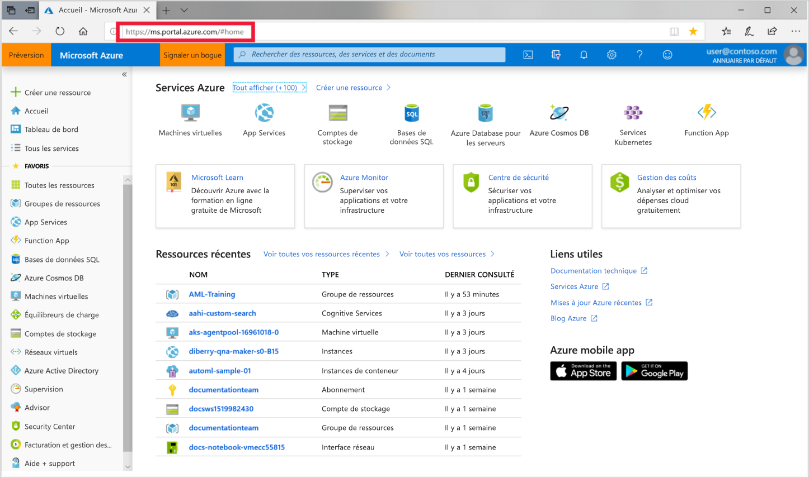
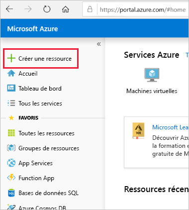
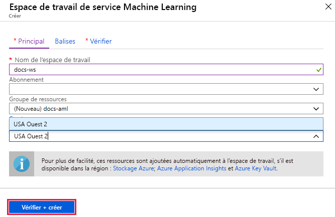

1. Connectez-vous au [portail Azure](https://portal.azure.com/) avec les informations d’identification de l’abonnement Azure que vous utilisez. 

   

1. Dans l’angle supérieur gauche du portail, sélectionnez **Créer une ressource**.

   

1. Dans la barre de recherche, entrez **Machine Learning**. Sélectionnez le résultat de la recherche **Espace de travail du service Machine Learning**.

   

1. Dans le volet **Espace de travail du service Machine Learning**, sélectionnez **Créer** pour commencer.

    

1. Dans le volet **Espace de travail ML**, configurez votre espace de travail.

   Champ|Description
   ---|---
   Nom de l’espace de travail |Entrez un nom unique qui identifie votre espace de travail. Dans cet exemple, nous allons utiliser **docs-ws**. Dans le groupe de ressources, les noms doivent être uniques. Utilisez un nom dont il est facile de se rappeler et que vous pouvez facilement différencier des autres espaces de travail.  
   Subscription |Sélectionnez l’abonnement Azure que vous souhaitez utiliser.
   Resource group | Utilisez un groupe de ressources existant dans votre abonnement, ou entrez un nom pour créer un groupe de ressources. Un groupe de ressources contient les ressources associées d’une solution Azure. Dans cet exemple, nous allons utiliser **docs-aml**. 
   Location | Sélectionnez l’emplacement le plus proche de vos utilisateurs et des ressources de données. C’est là que l’espace de travail est créé.

1. Pour démarrer le processus de création, sélectionnez **Vérifier + créer**.

    

1. Passez en revue la configuration de votre espace de travail. Si elle est correcte, sélectionnez **Créer**. La création de l’espace de travail peut prendre quelques instants.

1. Pour vérifier l’état du déploiement, sélectionnez l’icône Notifications, représentée par une **cloche**, dans la barre d’outils.

1. Une fois le processus terminé, un message indiquant la réussite du déploiement s’affiche. Ce message s’affiche également dans la section des notifications. Pour afficher le nouvel espace de travail, sélectionnez **Accéder à la ressource**.

   
